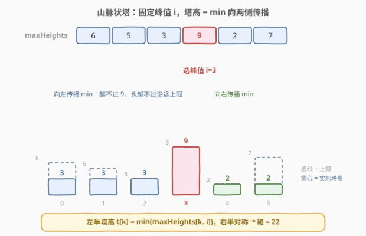
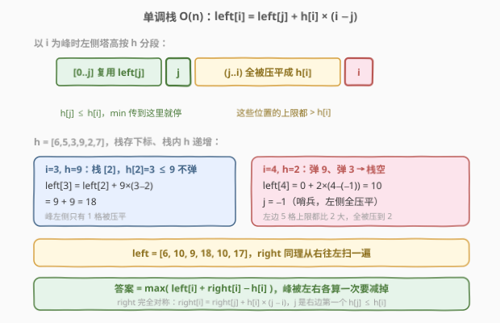
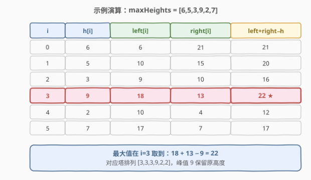

# 美丽塔I

- **题目名称**：美丽塔 I
- **链接**：[2865. 美丽塔 I](https://leetcode.cn/problems/beautiful-towers-i/)
- **难度**：中等
- **标签**：栈、数组、单调栈、动态规划

## 1. 题目概述

给定一个包含 $n$ 个整数的数组 `heights`，表示 $n$ 座**连续的塔**中砖块的数量。你的任务是**移除一些砖块**来形成一个**山脉状**的塔排列。在这种布置中，塔高度先是**非递减**，有一个或多个连续塔达到**最大峰值**，然后**非递增**排列。

返回满足山脉状塔排列的方案中，**高度和的最大值**。

**示例 1**：

```text
输入：maxHeights = [5,3,4,1,1]
输出：13
解释：我们移除一些砖块来形成 heights = [5,3,3,1,1]，峰值位于下标 0。
```

**示例 2**：

```text
输入：maxHeights = [6,5,3,9,2,7]
输出：22
解释：我们移除一些砖块来形成 heights = [3,3,3,9,2,2]，峰值位于下标 3。
```

**示例 3**：

```text
输入：maxHeights = [3,2,5,5,2,3]
输出：18
解释：我们移除一些砖块来形成 heights = [2,2,5,5,2,2]，峰值位于下标 2 或 3。
```

**约束条件**：

- $1 \le n = \text{heights.length} \le 10^3$
- $1 \le \text{heights[i]} \le 10^9$

> 💡 本题核心是「**枚举峰值 + 左右两侧独立求解**」。注意数组元素只是每座塔的**上限**——最终塔高可以只减不增（移除砖块），因此"移除"操作等价于把某些位置的高度**压低**到上限以下。答案规模可达 $10^3 \times 10^9 = 10^{12}$，必须用 `long long`。它是 [2866. 美丽塔 II](https://leetcode.cn/problems/beautiful-towers-ii/)（$n \le 10^5$）的数据范围缩小版，单调栈解法两题通用。

---

## 2. 解题思路

### 2.1 暴力思路：枚举峰值，向两侧传播 min

最终排列是山脉状，**峰值位置 $i$ 是唯一的自由度**——一旦峰确定，贪心策略也是确定的：每座塔在不超过上限的前提下**尽量高**，即

- 左半（$k < i$）：塔高 $t[k] = \min(\text{heights}[k],\ t[k+1])$，从峰向左逐格传播；
- 右半（$k > i$）：塔高 $t[k] = \min(\text{heights}[k],\ t[k-1])$，从峰向右逐格传播。

等价地写成**区间最小值**形式：$t[k] = \min(\text{heights}[k..i])$（左半），右半对称。这已经是峰值固定时的**最优解**——任何一座塔再压低只会让和更小，而"尽量高"恰好不违反非递减/非递增约束。

于是暴力做法：枚举每个 $i \in [0, n)$ 为峰，各花 $O(n)$ 向两侧传播求和，取最大。总时间 $O(n^2)$，$n \le 10^3$ 时约 $10^6$ 次运算，**可以通过**。

> ⚠️ 暴力法的硬伤：同一位置在不同峰值方案下被反复压低计算，$O(n^2)$ 在 $n = 10^5$ 的姊妹题 2866 上必然超时。观察"峰从 $i-1$ 移到 $i$ 时，左侧塔高的变化只发生在被压平的一段"——这正是单调栈可以 $O(n)$ 预处理的信号。

### 2.2 核心观察：固定峰值后左右独立 → 前后缀分解

关键观察：**峰左侧的形态只依赖 $[0..i]$，右侧只依赖 $[i..n-1]$，两侧互不影响**。定义：

- $\text{left}[i]$：以 $i$ 为峰时，区间 $[0..i]$ 的最大高度和；
- $\text{right}[i]$：以 $i$ 为峰时，区间 $[i..n-1]$ 的最大高度和。

则答案为

$$
\text{ans} = \max_{0 \le i < n}\ \big(\text{left}[i] + \text{right}[i] - \text{heights}[i]\big)
$$

（峰的高度被左右各算一次，需减去一份。）

以示例 2 `[6,5,3,9,2,7]`、峰取 $i=3$ 为例，塔高被确定为 `[3,3,3,9,2,2]`：



### 2.3 算法流程：单调栈 $O(n)$ 求 left / right

$\text{left}[i]$ 的递推是突破口。设 $j$ 为 $i$ **左侧第一个**满足 $\text{heights}[j] \le \text{heights}[i]$ 的下标（不存在则 $j = -1$ 哨兵），则：

- $(j,\ i]$ 内所有位置的上限都 $> \text{heights}[i]$，被峰传播压平成 $\text{heights}[i]$，贡献 $\text{heights}[i] \times (i - j)$；
- $k \le j$ 的位置，区间 $[k..i]$ 的最小值恒等于 $\min(\text{heights}[k..j])$（因为 $\text{heights}[j]$ 足够矮，截断了更右侧的影响），**与峰在 $j$ 时完全一致**，直接复用 $\text{left}[j]$。

$$
\text{left}[i] = \text{left}[j] + \text{heights}[i] \times (i - j)
$$

"左侧第一个 $\le$ 自己"正是**单调栈**（维护下标、栈内 heights 递增、弹栈条件 $>$）的经典工作。$\text{right}$ 完全对称，从右往左再扫一遍即可。



**完整步骤**：

1. **正向扫**：维护存下标的单调栈（栈内 heights 递增）。对每个 $i$：弹掉栈顶所有 $\text{heights} > \text{heights}[i]$ 的下标；记 $j$ 为弹完后的栈顶（栈空取 $-1$）；按递推式求 $\text{left}[i]$；$i$ 入栈。
2. **反向扫**：对称地求 $\text{right}[i]$（$j$ 取右侧第一个 $\le$ 的下标，栈空取 $n$）。
3. **合并**：$\text{ans} = \max(\text{left}[i] + \text{right}[i] - \text{heights}[i])$。

### 2.4 示例演算

以 `maxHeights = [6,5,3,9,2,7]` 为例，单调栈一次正扫 + 一次反扫：



几个值得细看的中间值：

| i | h[i] | 弹栈过程 | left[i] |
|---|------|----------|---------|
| 0 | 6 | 栈空，$j=-1$ | $6 \times 1 = 6$ |
| 1 | 5 | 弹 6（$6>5$），$j=-1$ | $5 \times 2 = 10$ |
| 2 | 3 | 弹 5，$j=-1$ | $3 \times 3 = 9$ |
| 3 | 9 | $3 \le 9$ 不弹，$j=2$ | $9 + 9 \times 1 = 18$ |
| 4 | 2 | 弹 9、弹 3，$j=-1$ | $2 \times 5 = 10$ |
| 5 | 7 | $2 \le 7$ 不弹，$j=4$ | $10 + 7 \times 1 = 17$ |

$\text{right} = [21, 15, 10, 13, 4, 7]$（对称求得）。逐行计算 $\text{left}[i] + \text{right}[i] - \text{heights}[i]$ 得 $[21, 20, 16, \mathbf{22}, 12, 17]$，最大值 $22$ 在 $i=3$ 取到，对应塔排列 `[3,3,3,9,2,2]`，与示例 2 一致。

> 💡 示例 3 `[3,2,5,5,2,3]` 的最优峰是一段**连续相等的峰值** `[2,2,5,5,2,2]`（下标 2 和 3 同为 5）。弹栈条件用严格大于 `>`（保留相等元素），$j$ 停在相等位置，递推依然正确——相等的连续峰天然满足"非递减 + 非递增"。

---

## 3. 参考代码

### C++（暴力 $O(n^2)$，$n \le 10^3$ 可过）

```cpp
class Solution {
public:
    long long maximumSumOfHeights(vector<int>& heights) {
        int n = heights.size();
        long long ans = 0;
        for (int i = 0; i < n; i++) {           // 枚举峰值
            long long sum = heights[i];
            int cur = heights[i];
            for (int j = i - 1; j >= 0; j--) {  // 向左传播 min
                cur = min(cur, heights[j]);
                sum += cur;
            }
            cur = heights[i];
            for (int j = i + 1; j < n; j++) {   // 向右传播 min
                cur = min(cur, heights[j]);
                sum += cur;
            }
            ans = max(ans, sum);
        }
        return ans;
    }
};
```

### C++（单调栈 $O(n)$，2866 通用）

```cpp
class Solution {
public:
    long long maximumSumOfHeights(vector<int>& heights) {
        int n = heights.size();
        vector<long long> left(n), right(n);
        vector<int> stk;                              // 存下标，栈内 heights 递增
        for (int i = 0; i < n; i++) {
            while (!stk.empty() && heights[stk.back()] > heights[i])
                stk.pop_back();
            int j = stk.empty() ? -1 : stk.back();    // 左侧第一个 <= h[i]
            left[i] = (j < 0 ? 0 : left[j]) + 1LL * heights[i] * (i - j);
            stk.push_back(i);
        }
        stk.clear();
        for (int i = n - 1; i >= 0; i--) {
            while (!stk.empty() && heights[stk.back()] > heights[i])
                stk.pop_back();
            int j = stk.empty() ? n : stk.back();     // 右侧第一个 <= h[i]
            right[i] = (j == n ? 0 : right[j]) + 1LL * heights[i] * (j - i);
            stk.push_back(i);
        }
        long long ans = 0;
        for (int i = 0; i < n; i++)
            ans = max(ans, left[i] + right[i] - heights[i]);  // 峰被算两次
        return ans;
    }
};
```

### Python

```python
class Solution:
    def maximumSumOfHeights(self, heights: List[int]) -> int:
        n = len(heights)
        left, right = [0] * n, [0] * n
        stk = []                                    # 存下标，栈内 heights 递增
        for i in range(n):
            while stk and heights[stk[-1]] > heights[i]:
                stk.pop()
            j = stk[-1] if stk else -1              # 左侧第一个 <= h[i]
            left[i] = (left[j] if j >= 0 else 0) + heights[i] * (i - j)
            stk.append(i)
        stk = []
        for i in range(n - 1, -1, -1):
            while stk and heights[stk[-1]] > heights[i]:
                stk.pop()
            j = stk[-1] if stk else n               # 右侧第一个 <= h[i]
            right[i] = (right[j] if j < n else 0) + heights[i] * (j - i)
            stk.append(i)
        return max(l + r - h for l, r, h in zip(left, right, heights))
```

> 💡 两版核心差异只在数据规模：暴力版结构直白（枚举峰 + 双向传播），适合快速拿分与对拍验证；单调栈版是"**前缀信息复用**"的典范——`left[i]` 不重算历史，只增量计算被压平的新段。Python 版利用 `zip` 一行完成合并，注意 C++ 里 `1LL *` 防止 `int` 溢出（$\text{heights}[i] \times n$ 可达 $10^{12}$）。

---

## 4. 复杂度分析

| 维度 | 复杂度 | 说明 |
|------|--------|------|
| **时间复杂度** | $O(n)$ | 每个下标最多入栈、出栈各一次，正反两遍扫描均为线性；暴力版 $O(n^2)$ |
| **空间复杂度** | $O(n)$ | `left` / `right` 数组与单调栈 |

> ⚠️ 答案上界约 $n \times \max(\text{heights}) \approx 10^3 \times 10^9 = 10^{12}$，超出 32 位整数范围，C++/Java 必须用 `long long` / `long`。Python 原生大整数无此顾虑。

---

## 5. 扩展：2866 美丽塔 II（$n \le 10^5$）

姊妹题 [2866. 美丽塔 II](https://leetcode.cn/problems/beautiful-towers-ii/) 题意完全相同，仅 $n$ 放大到 $10^5$：

- **暴力 $O(n^2)$ 必然超时**（$10^{10}$ 次运算），上文单调栈解法**原封不动直接提交即可通过**——这正是本题先练手的意义；
- 更大的 $n$ 也让"连续相等峰值"（如 `[5,5]`）、"单调不增输入"（整段被压到全局最小）等边界形态更容易出现，弹栈条件保持**严格大于** `>`（相等不弹）是正确性关键：相等位置作为 $j$ 时区间最小值不变，递推式照常成立。

> 💡 该套路可进一步推广：「枚举断点 + 左右两侧独立 + 单调栈预处理前缀/后缀最优」是一类通用框架，例如每个位置作为最小值/最大值时的区间和极值问题，与 [84. 柱状图中最大的矩形](https://leetcode.cn/problems/largest-rectangle-in-histogram/) 的"左右第一个更矮"单调栈同源。

---

## 6. 面试要点

1. **为什么"移除砖块"等价于"压低高度到上限以下"？**

   - 塔高只能减不能增，最终 $t[i] \le \text{heights}[i]$。给定峰值后贪心让每座塔尽量高（$t[k] = \min(\text{heights}[k..i])$）即最优：任何压得更低的方案和只会更小，且"尽量高"自动满足山脉约束。

2. **为什么答案要减去 $\text{heights}[i]$？**

   - $\text{left}[i]$ 与 $\text{right}[i]$ 都包含峰值位置 $i$ 本身的高度，相加时峰被计了两次，需减掉一份才是该峰值方案的真实和。

3. **单调栈里 $j$ 的含义是什么？为什么弹栈条件是严格大于？**

   - $j$ 是 $i$ 左侧（或右侧）第一个 $\text{heights}[j] \le \text{heights}[i]$ 的下标：$(j, i]$ 的塔全被压平到 $\text{heights}[i]$，$[0..j]$ 复用 $\text{left}[j]$。相等时不弹，保证 $j$ 停在最近的相等位置，连续相等峰值（`[5,5]`）也正确。

4. **本题与 2866 的关系？为什么必须单调栈？**

   - 2866 把 $n$ 放大到 $10^5$，暴力 $O(n^2)$ 达 $10^{10}$ 次运算必然超时。单调栈把"每次移峰重扫两侧"优化为"每个下标进出栈各一次"的线性预处理，是典型的用单调栈消除重复区间最小值计算。

5. **为什么必须用 64 位整数？**

   - 和的上界 $\approx n \cdot \max(\text{heights}) \approx 10^{12}$，超 `int32`。C++ 中 `heights[i] * (i - j)` 也要先转 `1LL` 再乘，否则中间结果就先溢出了。

> 💡 **一句话总结**：枚举峰值是唯一自由度，左右两侧独立 → 单调栈各扫一遍预处理 `left`/`right` 前后缀最优，合并时减去重复的峰值。$O(n)$ 时间、$O(n)$ 空间，直接通吃 2866。

---

## 7. 同类练习题

- [2866. 美丽塔 II](https://leetcode.cn/problems/beautiful-towers-ii/)：同题意、$n \le 10^5$，本题单调栈解法原样通过
- [84. 柱状图中最大的矩形](https://leetcode.cn/problems/largest-rectangle-in-histogram/)：单调栈找"左右第一个更矮"，同为区间最值结构
- [42. 接雨水](../0001-0100/42_接雨水.md)：按列思考的"两侧限制"直觉，单调栈/双指针姊妹题
- [901. 股票价格跨度](../0901-1000/901_股票价格跨度.md)：单调栈维护"上一个更大"，与本题"上一个更小"对称
- [1019. 链表中的下一个更大节点](https://leetcode.cn/problems/next-greater-node-in-linked-list/)：单调栈找"下一个更大"的入门练习
