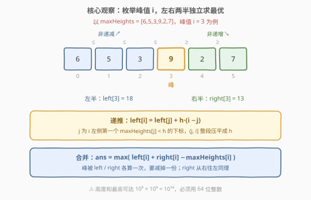
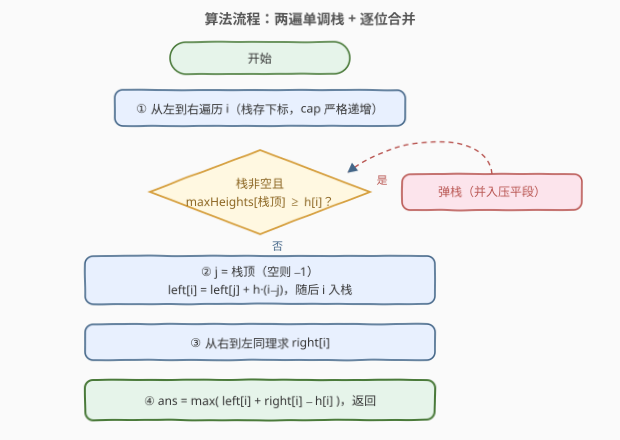
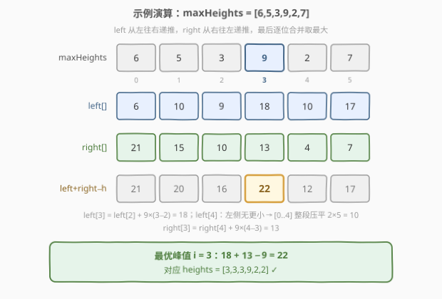

# 美丽塔II

- **题目名称**：美丽塔II
- **链接**：[2866. 美丽塔 II](https://leetcode.cn/problems/beautiful-towers-ii/)
- **难度**：中等
- **标签**：单调栈、栈、数组、动态规划

## 1. 题目概述

给你一个长度为 $n$ 下标从 **0** 开始的整数数组 `maxHeights`。

你的任务是在坐标轴上建 $n$ 座塔。第 $i$ 座塔的下标为 $i$，高度为 `heights[i]`。

如果以下条件满足，我们称这些塔是**美丽**的：

1. $1 \le heights[i] \le maxHeights[i]$
2. `heights` 是一个**山脉**数组。

如果存在下标 $i$ 满足以下条件，那么我们称数组 `heights` 是一个**山脉**数组：

- 对于所有 $0 \lt j \le i$，都有 $heights[j-1] \le heights[j]$
- 对于所有 $i \le k \lt n-1$，都有 $heights[k+1] \le heights[k]$

请你返回满足**美丽塔**要求的方案中，**高度和的最大值**。

**示例 1**：

```text
输入：maxHeights = [5,3,4,1,1]
输出：13
解释：heights = [5,3,3,1,1]，峰值在下标 0 处，1 ≤ heights[i] ≤ maxHeights[i] 均成立。
```

**示例 2**：

```text
输入：maxHeights = [6,5,3,9,2,7]
输出：22
解释：heights = [3,3,3,9,2,2]，峰值在下标 3 处。
```

**示例 3**：

```text
输入：maxHeights = [3,2,5,5,2,3]
输出：18
解释：heights = [2,2,5,5,2,2]，最大值在下标 2 处（下标 3 也是峰值）。
```

**约束条件**：

- $1 \le n = maxHeights.length \le 10^5$
- $1 \le maxHeights[i] \le 10^9$

> 💡 本题三步走：**枚举峰值**，把山脉拆成左右两半独立子问题；**贪心压平**，发现每半的最优解由「左侧/右侧第一个更小元素」分段决定；**单调栈**一把算出 `left` / `right` 两张表，$O(n)$ 收工。注意高度和最高可达 $10^5 \times 10^9 = 10^{14}$，必须用 64 位整数。

---

## 2. 解题思路

### 2.1 暴力思路：枚举峰值，逐格压平

关键的第一步是**枚举峰值位置 $i$**。峰值一旦固定，$heights[i] = maxHeights[i]$（取满上限必然最优），其余位置的最优值也随之唯一确定——

- 向左：$heights[j] = \min(maxHeights[j],\ heights[j+1])$
- 向右：$heights[k] = \min(maxHeights[k],\ heights[k-1])$

这是**逐元素的紧上界**：每个位置的高度被「自己的 cap」和「靠峰一侧邻居的高度」同时夹住，从峰向外逐格取 $\min$ 恰好同时取到所有上界，因此对固定峰值就是最优。

每个峰值 $O(n)$ 扫描，总共 $O(n^2)$——$n \le 10^5$ 时约 $10^{10}$ 次操作，**超时**。不过姐妹题 [2865. 美丽塔 I](https://leetcode.cn/problems/beautiful-towers-i/)（$n \le 10^3$）可以直接用这个暴力通过。

> 💡 换个视角看暴力：向左压平时，$heights[j]$ 会一路取 $\min$，直到遇到某个 $maxHeights[j'] \lt$ 当前高度才「止跌」。也就是说，**以 $i$ 为峰的左侧结构由「左侧第一个更小元素」决定分段**——这正是单调栈的切入口。

### 2.2 核心观察：前后缀分解 + 单调栈 DP

定义：

- $left[i]$：以 $i$ 为峰时**前缀** $[0..i]$ 的最大高度和（$heights[i] = maxHeights[i]$）
- $right[i]$：以 $i$ 为峰时**后缀** $[i..n-1]$ 的最大高度和

$$\text{ans} = \max_{0 \le i \lt n}\ \big(\,left[i] + right[i] - maxHeights[i]\,\big)$$

（峰被左右各算一次，减掉一份。）

**$left$ 的递推**：设 $j$ 为 $i$ 左侧第一个满足 $maxHeights[j] \lt maxHeights[i]$ 的下标，记 $h = maxHeights[i]$。则 $(j,\ i]$ 内所有位置的 cap 都 $\ge h$，最优解里它们**全部被压平成 $h$**：

$$left[i] = left[j] + h \times (i - j)$$

若 $j$ 不存在（左侧全是 $\ge h$ 的），则 $left[i] = h \times (i+1)$（整个前缀压平）。



$j$ 如何 $O(1)$ 摊还求出？**单调栈**维护一个 cap 严格递增的下标序列：处理 $i$ 时，把所有 $maxHeights[\text{栈顶}] \ge h$ 的下标弹出，剩下的栈顶就是 $j$。$right$ 同理，从右往左再扫一遍。

> ⚠️ 弹栈条件为什么敢用 $\ge$（连相等的也弹）？cap 恰等于 $h$ 的那些位置，压平后的高度正好是它们各自的**上限** $h$；而以它们为「子峰」的 $left$ 值里，该位置本就取 $h$。合并进压平段后贡献仍是 $h$，**不重不漏**。

### 2.3 算法流程图



**完整步骤**：

1. **第一遍（从左到右）**：单调栈求 $left[i]$——弹掉所有 cap $\ge h[i]$ 的栈顶，$j$ = 栈顶（空则 $-1$），$left[i] = left[j] + h \cdot (i-j)$，$i$ 入栈
2. **第二遍（从右到左）**：对称地求 $right[i]$——$j$ = 右侧第一个更小（空则 $n$），$right[i] = right[j] + h \cdot (j-i)$
3. **合并**：$ans = \max_i \big(left[i] + right[i] - maxHeights[i]\big)$

每个下标至多入栈、出栈一次，两遍扫描都是 $O(n)$。

### 2.4 示例演算

以示例 2 `maxHeights = [6,5,3,9,2,7]` 为例：



**第一遍求 `left`**（栈内下标的 cap 严格递增）：

| $i$ | $h$ | 弹栈动作 | $j$（左侧首个 cap $< h$） | $left[i]$ |
|-----|-----|----------|--------------------------|-----------|
| 0 | 6 | — | $-1$ | $6 \times 1 = 6$ |
| 1 | 5 | 弹 6 | $-1$ | $5 \times 2 = 10$ |
| 2 | 3 | 弹 5 | $-1$ | $3 \times 3 = 9$ |
| 3 | 9 | $3 \lt 9$ 不弹 | 2 | $9 + 9 \times 1 = 18$ |
| 4 | 2 | 弹 9、3 | $-1$ | $2 \times 5 = 10$ |
| 5 | 7 | $2 \lt 7$ 不弹 | 4 | $10 + 7 \times 1 = 17$ |

**第二遍求 `right`**（从右往左，$j$ 为右侧首个 cap $< h$ 的下标，空则 $n=6$）：

| $i$ | $h$ | $j$ | $right[i]$ |
|-----|-----|-----|------------|
| 5 | 7 | 6 | $7 \times 1 = 7$ |
| 4 | 2 | 6 | $2 \times 2 = 4$ |
| 3 | 9 | 4 | $4 + 9 \times 1 = 13$ |
| 2 | 3 | 4 | $4 + 3 \times 2 = 10$ |
| 1 | 5 | 2 | $10 + 5 \times 1 = 15$ |
| 0 | 6 | 1 | $15 + 6 \times 1 = 21$ |

**合并**（$left[i] + right[i] - h$）：

| $i$ | 0 | 1 | 2 | 3 | 4 | 5 |
|-----|---|---|---|---|---|---|
| 合并值 | 21 | 20 | 16 | **22** | 12 | 17 |

最大值 $22$ 出现在 $i = 3$，对应 `heights = [3,3,3,9,2,2]` ✓。

---

## 3. 参考代码

### C++

```cpp
class Solution {
public:
    long long maximumSumOfHeights(vector<int>& maxHeights) {
        int n = maxHeights.size();
        vector<long long> left(n), right(n);
        stack<int> st;                       // 存下标，cap 严格递增
        for (int i = 0; i < n; i++) {        // left[i]：以 i 为峰的前缀最大和
            while (!st.empty() && maxHeights[st.top()] >= maxHeights[i]) st.pop();
            long long j = st.empty() ? -1 : st.top();
            left[i] = (j < 0 ? 0 : left[j]) + (long long)maxHeights[i] * (i - j);
            st.push(i);
        }
        st = stack<int>();
        for (int i = n - 1; i >= 0; i--) {   // right[i]：以 i 为峰的后缀最大和
            while (!st.empty() && maxHeights[st.top()] >= maxHeights[i]) st.pop();
            long long j = st.empty() ? n : st.top();
            right[i] = (j == n ? 0 : right[j]) + (long long)maxHeights[i] * (j - i);
            st.push(i);
        }
        long long ans = 0;
        for (int i = 0; i < n; i++)          // 峰被左右各算一次，减去一份
            ans = max(ans, left[i] + right[i] - maxHeights[i]);
        return ans;
    }
};
```

### Python

```python
class Solution:
    def maximumSumOfHeights(self, maxHeights: List[int]) -> int:
        n = len(maxHeights)
        left, right = [0] * n, [0] * n
        st = []                                    # 存下标，cap 严格递增
        for i, h in enumerate(maxHeights):         # left[i]：以 i 为峰的前缀最大和
            while st and maxHeights[st[-1]] >= h:
                st.pop()
            j = st[-1] if st else -1
            left[i] = (left[j] if j >= 0 else 0) + h * (i - j)
            st.append(i)
        st = []
        for i in range(n - 1, -1, -1):             # right[i]：以 i 为峰的后缀最大和
            h = maxHeights[i]
            while st and maxHeights[st[-1]] >= h:
                st.pop()
            j = st[-1] if st else n
            right[i] = (right[j] if j < n else 0) + h * (j - i)
            st.append(i)
        return max(l + r - h for l, r, h in zip(left, right, maxHeights))
```

> 💡 两版逻辑完全一致：`j` 取不到时用 $-1$ / $n$ 哨兵，此时段长 $(i-j)$ / $(j-i)$ 恰好覆盖整个前缀/后缀，`left[j]` / `right[j]` 项自然为 0，递推无需特判分支。

---

## 4. 复杂度分析

| 维度 | 复杂度 | 说明 |
|------|--------|------|
| **时间复杂度** | $O(n)$ | 三个线性扫描；每个下标至多入栈、出栈一次，摊还 $O(1)$ |
| **空间复杂度** | $O(n)$ | `left` / `right` 两个数组 + 单调栈 |

> ⚠️ 最大和可达 $10^5 \times 10^9 = 10^{14}$，超出 32 位整数范围，C++ 必须用 `long long`（乘法前先转型）；Python 无需担心，但中间乘法同样按大整数运算。

---

## 5. 扩展：O(n²) 暴力与 2865 的关系

姐妹题 [2865. 美丽塔 I](https://leetcode.cn/problems/beautiful-towers-i/) 与本题**题面完全相同**，仅 $n \le 10^3$，因此 2.1 节的暴力即可通过：

```python
class Solution:
    def maximumSumOfHeights(self, maxHeights: List[int]) -> int:
        n = len(maxHeights)
        best = 0
        for i in range(n):                 # 枚举峰值
            hs = [0] * n
            hs[i] = maxHeights[i]
            for j in range(i - 1, -1, -1):          # 向左逐格压平
                hs[j] = min(maxHeights[j], hs[j + 1])
            for k in range(i + 1, n):               # 向右逐格压平
                hs[k] = min(maxHeights[k], hs[k - 1])
            best = max(best, sum(hs))
        return best
```

面试实战中推荐**先写这份暴力**（5 分钟、正确性显然），再用它对拍单调栈版本——本文的两份代码正是这样验证的（3000 组随机数据全部一致）。2866 把 $n$ 提到 $10^5$，就是逼你把「逐格压平」优化成「按最近更小元素分段压平」。

---

## 6. 面试要点

1. **固定峰值后，为什么「逐格取 min」就是最优？**

   - $heights[j]$ 的紧上界是 $\min(maxHeights[j],\ 靠峰一侧邻居的高度)$；从峰向外逐格取 $\min$ 恰好同时取到**每个位置**的上界。任何可行解的每个元素都不会超过这条上界，元素级最优 ⇒ 总和最优。

2. **单调栈在本题里到底求什么？**

   - 求每个 $i$ 左（右）侧**第一个 cap 严格更小**的下标 $j$，从而把 $(j,\ i]$ 整段「压平」成 $h \times (i-j)$ 一把算掉：$left[i] = left[j] + h(i-j)$。栈内下标的 cap 保持严格递增。

3. **弹栈条件为什么用 $\ge$？把相等元素弹掉不会算错吗？**

   - 不会。cap 恰等于 $h$ 的位置，压平后的高度正是它自己的上限 $h$；以它为子峰的 $left$ 里该位置本就取 $h$，合并进压平段后贡献仍恰为 $h$，不重不漏。用 $\gt$ 也能做对，但栈内会出现相等段，边界处理更啰嗦。

4. **最终合并为什么要减 $maxHeights[i]$？**

   - $left[i]$ 与 $right[i]$ 都包含峰值 $i$ 的高度 $h$，直接相加会**重复计一份**，减掉一次才等于以 $i$ 为峰的整座山之和。

5. **与接雨水（42）、柱状图最大矩形（84）的单调栈用法有何异同？**

   - 相同：都维护「最近更小/更大元素」，都靠「每个元素入栈出栈各一次」得到摊还 $O(n)$，都用了**前后缀分解**。不同：接雨水对每个位置问「两侧第一个更大」，取 $\min$(左右最大) 算水位；84 问「两侧第一个更小」定矩形宽度；本题把「最近更小」之间的**整段一次性压平计价**，本质是分段求和的 DP。

> 💡 **一句话总结**：枚举峰值把山脉拆成左右两个独立子问题；每侧的最优解由「最近更小元素」分段压平——单调栈两遍扫描求出 `left` / `right`，合并时 $\max\big(left[i]+right[i]-h\big)$ 收工，$O(n)$ 时间、$O(n)$ 空间。

---

## 7. 同类练习题

- [2865. 美丽塔 I](https://leetcode.cn/problems/beautiful-towers-i/)：同一题面的小数据版（$n \le 10^3$），$O(n^2)$ 枚举峰值直接可过，可作本题暴力的对拍基准
- [84. 柱状图中最大的矩形](../0001-0100/84_柱状图中最大的矩形.md)：单调栈求「左右最近更小元素」的招牌题，与本题栈的维护方式同源
- [901. 股票价格跨度](../0901-1000/901_股票价格跨度.md)：单调栈求「左侧最近更大」并维护跨度分段求和，与本题 `left` 递推的段压缩思想一致
- [1944. 队列中可以看到的人数](../1901-2000/1944_队列中可以看到的人数.md)：单调栈弹栈时批量结算贡献，与本题「弹掉 $\ge$ 的元素合并成一段」同套路
- [2104. 子数组范围和](https://leetcode.cn/problems/sum-of-subarray-ranges/)：单调栈求每个元素作为最大/最小的管辖范围，另一种「分段贡献」视角
