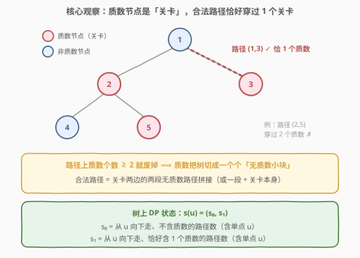
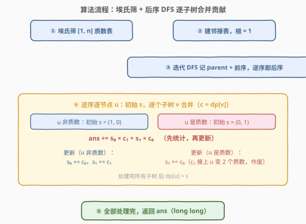
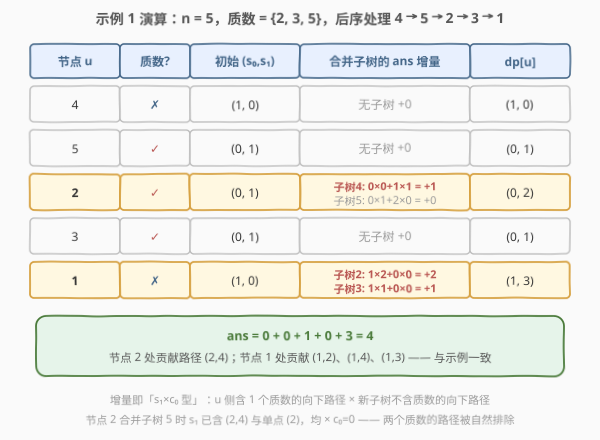

# 统计树中的合法路径数目

- **题目名称**：统计树中的合法路径数目
- **链接**：[2867. 统计树中的合法路径数目](https://leetcode.cn/problems/count-valid-paths-in-a-tree/)
- **难度**：困难
- **标签**：树、深度优先搜索、数论、动态规划、埃氏筛

## 1. 题目概述

给你一棵 $n$ 个节点的**无向树**，节点编号为 $1$ 到 $n$。给你一个整数 $n$ 和一个长度为 $n-1$ 的二维整数数组 `edges`，其中 `edges[i] = [u_i, v_i]` 表示节点 $u_i$ 和 $v_i$ 在树中有一条边。

请你返回树中的**合法路径数目**。

如果节点 $a$ 到节点 $b$ 之间**恰好有一个**节点的编号是质数，那么路径 $(a, b)$ 是**合法的**。

**注意**：

- 路径 $(a, b)$ 指的是一条从节点 $a$ 开始到节点 $b$ 结束的节点序列，序列中的节点**互不相同**，且相邻节点之间在树上有一条边。
- 路径 $(a, b)$ 和路径 $(b, a)$ 视为**同一条**路径，且只计入答案**一次**。

**示例 1**：

```text
输入：n = 5, edges = [[1,2],[1,3],[2,4],[2,5]]
输出：4
解释：恰好有一个质数编号的节点路径有：
- (1, 2) 因为路径 1 到 2 只包含一个质数 2。
- (1, 3) 因为路径 1 到 3 只包含一个质数 3。
- (1, 4) 因为路径 1 到 4 只包含一个质数 2。
- (2, 4) 因为路径 2 到 4 只包含一个质数 2。
只有 4 条合法路径。
```

**示例 2**：

```text
输入：n = 6, edges = [[1,2],[1,3],[2,4],[3,5],[3,6]]
输出：6
解释：恰好有一个质数编号的节点路径有：
- (1, 2)、(1, 3)、(1, 4)、(1, 6)、(2, 4)、(3, 6)。
只有 6 条合法路径。
```

**约束条件**：

- $1 \le n \le 10^5$
- `edges.length == n - 1`
- $1 \le u_i, v_i \le n$
- 输入保证 `edges` 形成一棵合法的树。

> ⚠️ 两个关键线索：其一，$n$ 最大 $10^5$，树的路径数可达 $\binom{n}{2} \approx 5 \times 10^9$，暴力枚举点对必然超时，且答案本身就**超出 `int` 范围**；其二，「恰好一个质数」是**可加的可分解计数**——整条路径的质数个数等于两半路径的质数个数之和，这正是树上 DP 的信号。

---

## 2. 解题思路

### 2.1 暴力思路：枚举所有点对

对每对节点 $(a, b)$ 求出树上路径（两次 DFS 找 LCA，或 BFS 记录父亲后回溯），数一数路径上的质数编号节点是否恰好一个。时间复杂度 $O(n^2)$ 起步，$n = 10^5$ 时约 $5 \times 10^9$ 对，必然超时。

> ⚠️ 暴力法的硬伤：把「路径上恰好一个质数」当成**整体性质**逐对检验。而质数计数是**沿边可加**的——把路径从中间任意一处切开，总质数数 = 左半 + 右半。一旦意识到这一点，统计就可以在树上「边合并边算」，不再需要显式枚举路径。

### 2.2 核心观察：质数节点是「关卡」，树上 DP 合并贡献



**观察一：质数节点是天然的「关卡」**。合法路径恰好穿过一个质数，意味着路径两端各自落在关卡两侧的**无质数区段**里（或一端就是关卡本身）。反过来，任取一个质数节点 $p$、以及 $p$ 两侧（不同子树方向）的两段无质数路径，拼起来必是合法路径。**计数对象从「路径」换成了「无质数路径段的两两组合」**。

**观察二：以路径的「最高点」为统计锚点，天然不重不漏**。把树根在节点 1，任意路径 $(a, b)$ 的两端中必有一处**最高点** $u$（即 $a, b$ 的 LCA）。规定：只在 $u$ 处统计这条路径。于是问题变为——对每个节点 $u$，数出「两端分别位于 $u$ 的两个**不同**子方向（其中一个方向可以是 $u$ 自己）」的合法路径数。这就是经典的**子树贡献合并**。

**状态设计**：对每个节点 $u$，定义

$$s(u) = (s_0, s_1)$$

- $s_0$ = 从 $u$ **向下**（远离根方向）走、**不含**质数的路径条数（含只走到 $u$ 自己的「单点路径」）
- $s_1$ = 从 $u$ 向下走、**恰好含一个**质数的路径条数（含单点路径）

> 💡 **为什么单点路径要计入**？路径 $(u, b)$ 的一端就是 $u$ 本身——它对应「$u$ 的单点路径」与「$b$ 所在子树的一段向下路径」的拼接。单点路径正是「一端是最高点」情形的载体。$a \ne b$ 由「两个方向必须不同」保证：单点路径只能和**别的子树**的路径配对，$u$ 不会和自己拼。

**转移（后序 DFS，逐个子树合并）**：设 $u$ 已合并部分（含单点）为 $(s_0, s_1)$，新来一个子节点 $v$ 携带 $c = (c_0, c_1) = s(v)$。合法路径的**总质数恰好为 1**，两半的质数个数只能是 $(0, 1)$ 或 $(1, 0)$：

$$\text{ans} \mathrel{+}= s_0 \times c_1 + s_1 \times c_0$$

然后**更新** $s$（把新子树的路径接上 $u$ 延长）：

- 若 $u$ **非质数**：接上 $u$ 不改变质数个数，$s_0 \mathrel{+}= c_0$，$s_1 \mathrel{+}= c_1$
- 若 $u$ **是质数**：$c_0$ 的路径接上 $u$ 变成「含一个质数」，$s_1 \mathrel{+}= c_0$；而 $c_1$ 的路径接上 $u$ 就有两个质数，**彻底作废**（永远不可能再变合法）；$s_0$ 恒为 $0$

初始值：$u$ 非质数时 $s = (1, 0)$（单点 $u$，0 个质数）；$u$ 是质数时 $s = (0, 1)$（单点 $u$，1 个质数）。

**不重不漏**：

- **不漏**：每条路径 $(a,b)$ 有唯一 LCA $u$；设 $a$ 在 $u$ 的子方向 $i$、$b$ 在子方向 $j$（$i \ne j$，允许某端就是 $u$）。合并到后处理的那个子方向时，「已合并部分」恰好覆盖 $u$ 自身与先处理的子方向，「新子树」恰好覆盖后处理的子方向，配对必被数到一次。
- **不重**：同一条路径只在它的 LCA 处统计；在其余节点处，两端要么同属一个子树（不会被拆开配对），要么路径不经过该节点。

> ⚠️ **质数节点是关键分水岭**：非质数节点是「透明中转站」，路径随便穿；质数节点是「关卡」，穿过即 +1，第二个关卡直接判死。转移里 $c_1$ 在质数父节点处的作废，正是这条性质在代码里的落点。

### 2.3 算法流程图



**完整步骤**：

1. **埃氏筛**预处理 $[1, n]$ 内的质数判定（见 [204. 计数质数](../0201-0300/204_计数质数.md)）。
2. **建邻接表**，以节点 1 为根。
3. **迭代 DFS**（栈实现）得到前序序列并记录 `parent`；**逆序遍历前序序列即为后序**——处理 $u$ 时其所有子节点必已就绪。
4. 逆序逐节点 $u$：按 2.2 的初始值与合并公式，**先统计再更新**，得到 $dp[u]$。
5. 返回 `ans`（注意用 64 位整数）。

> ⚠️ **为什么用迭代 DFS**：$n = 10^5$，树退化成链时递归深度 $10^5$，超过 C++ 默认栈空间（约 1 MB，每层递归开销几十字节起）会栈溢出；Python 则直接触发默认递归上限。显式栈 + 前序逆序是标准替代方案，一次遍历两用。

### 2.4 示例演算

以示例 1 `n = 5, edges = [[1,2],[1,3],[2,4],[2,5]]` 为例，质数为 $\{2, 3, 5\}$，后序处理顺序 $4 \to 5 \to 2 \to 3 \to 1$：



| 节点 | 质数? | 初始 $(s_0, s_1)$ | 合并子树的 ans 增量 | $dp[u]$ |
|------|-------|-------------------|---------------------|---------|
| 4 | ✗ | (1, 0) | 无子树，+0 | (1, 0) |
| 5 | ✓ | (0, 1) | 无子树，+0 | (0, 1) |
| 2 | ✓ | (0, 1) | 子树 4：$0 \times 0 + 1 \times 1 = +1$；子树 5：$0 \times 1 + 2 \times 0 = +0$ | (0, 2) |
| 3 | ✓ | (0, 1) | 无子树，+0 | (0, 1) |
| 1 | ✗ | (1, 0) | 子树 2：$1 \times 2 + 0 \times 0 = +2$；子树 3：$1 \times 1 + 0 \times 0 = +1$ | (1, 3) |

累计 $\text{ans} = 1 + 2 + 1 = 4$，与示例一致。逐步核对增量对应的路径：

- 节点 2 合并子树 4 时：$s_1 = 1$（单点路径 $\langle 2 \rangle$）$\times$ $c_0 = 1$（单点路径 $\langle 4 \rangle$）→ 路径 $(2, 4)$ ✓
- 节点 1 合并子树 2 时：$s_0 = 1$（单点 $\langle 1 \rangle$）$\times$ $c_1 = 2$（路径 $\langle 2 \rangle$、$\langle 2,4 \rangle$）→ 路径 $(1,2)$、$(1,4)$ ✓
- 节点 1 合并子树 3 时：$s_0 = 1$（单点 $\langle 1 \rangle$）$\times$ $c_1 = 1$（路径 $\langle 3 \rangle$）→ 路径 $(1,3)$ ✓

> 💡 注意节点 2 合并子树 5 时增量恰为 $0$：路径 $(2,5)$、$(4,5)$ 都要穿过两个质数，被「$u$ 是质数时 $s_0 = 0$」与「$c_1$ 作废」两道闸门自然挡在门外——**无需任何特判**。

---

## 3. 参考代码

### C++

```cpp
class Solution {
  public:
    long long countPaths(int n, vector<vector<int>>& edges) {
        // 埃氏筛：isComposite[x] = 1 表示 x 是合数
        vector<char> isComposite(n + 1, 0);
        for (int i = 2; (long long)i * i <= n; ++i)
            if (!isComposite[i])
                for (int j = i * i; j <= n; j += i) isComposite[j] = 1;

        vector<vector<int>> g(n + 1);
        for (const auto& e : edges) {
            g[e[0]].push_back(e[1]);
            g[e[1]].push_back(e[0]);
        }

        // 迭代 DFS：前序序列 + parent（防链形树递归爆栈）
        vector<int> parent(n + 1, 0), order;
        order.reserve(n);
        vector<int> stk = {1};
        while (!stk.empty()) {
            int u = stk.back();
            stk.pop_back();
            order.push_back(u);
            for (int v : g[u])
                if (v != parent[u]) {
                    parent[v] = u;
                    stk.push_back(v);
                }
        }

        long long ans = 0;
        vector<pair<long long, long long>> dp(n + 1);  // (s0, s1)
        // 逆序 = 后序：处理 u 时所有子节点已就绪
        for (int i = n - 1; i >= 0; --i) {
            int u = order[i];
            bool prime = u >= 2 && !isComposite[u];
            long long s0 = prime ? 0 : 1, s1 = prime ? 1 : 0;
            for (int v : g[u]) {
                if (v == parent[u]) continue;
                auto [c0, c1] = dp[v];
                ans += s0 * c1 + s1 * c0;      // 先统计：总质数 = 1 的两半组合
                if (prime) s1 += c0;           // u 是质数：c1 接上 u 变 2 个，作废
                else { s0 += c0; s1 += c1; }   // u 非质数：透明中转
            }
            dp[u] = {s0, s1};
        }
        return ans;
    }
};
```

### Python

```python
class Solution:
    def countPaths(self, n: int, edges: List[List[int]]) -> int:
        is_composite = [False] * (n + 1)
        i = 2
        while i * i <= n:                       # 埃氏筛
            if not is_composite[i]:
                for j in range(i * i, n + 1, i):
                    is_composite[j] = True
            i += 1

        g = [[] for _ in range(n + 1)]
        for u, v in edges:
            g[u].append(v)
            g[v].append(u)

        parent = [0] * (n + 1)                  # 迭代 DFS：前序 + parent
        order = []
        stack = [1]
        while stack:
            u = stack.pop()
            order.append(u)
            for v in g[u]:
                if v != parent[u]:
                    parent[v] = u
                    stack.append(v)

        ans = 0
        dp = [(0, 0)] * (n + 1)
        for u in reversed(order):               # 逆序 = 后序
            prime = u >= 2 and not is_composite[u]
            s0, s1 = (0, 1) if prime else (1, 0)
            for v in g[u]:
                if v == parent[u]:
                    continue
                c0, c1 = dp[v]
                ans += s0 * c1 + s1 * c0        # 先统计
                if prime:
                    s1 += c0                    # c1 作废
                else:
                    s0 += c0
                    s1 += c1
            dp[u] = (s0, s1)
        return ans
```

> 💡 两版逻辑一致。三个实现细节：**其一**，根的 `parent` 置 0——节点编号从 1 开始，0 不会出现在邻接表里，根的所有邻居都满足 `v != parent[1]`，无需额外哨兵；**其二**，`(long long)i * i` 防 `i * i` 在筛上界判断中溢出（本题 $n \le 10^5$ 实际不会溢，习惯性防御）；**其三**，`dp` 里存的是**向下**路径数，与官方提示的 `dp[i][0/1]` 定义完全一致，只是把「子树和」拆成了逐子树合并，以便在每个 LCA 处顺手把答案数出来。

---

## 4. 复杂度分析

| 维度 | 复杂度 | 说明 |
|------|--------|------|
| **时间复杂度** | $O(n \log \log n)$ | 埃氏筛 $O(n \log \log n)$；建图、DFS、逆序合并各 $O(n)$，每个节点的每条邻接边恰好被访问两次 |
| **空间复杂度** | $O(n)$ | 邻接表 $O(n)$、筛数组 $O(n)$、`parent` / `order` / `dp` 各 $O(n)$ |

---

## 5. 扩展：贡献合并 vs 换根，以及其他「路径恰好 k 个特殊点」变体

**为什么不用换根 DP？** 本题统计的路径**不定向**（$(a,b)$ 与 $(b,a)$ 同一条），以 LCA 为锚点的一次后序合并已经覆盖所有路径，换根（两次 DFS）是「求每个点为端点的量」时的工具，这里用不上。但若题目改成「对每个节点 $x$，求以 $x$ 为**端点**的合法路径数」，就需要在 $s(u)$ 之外再维护「向上走」的对称状态，做第二次 DFS 下推——状态设计与本题完全同构。

**「恰好一个」→「恰好 $k$ 个」**：把二元组 $(s_0, s_1)$ 扩成 $(k+1)$ 维向量 $s_0, \dots, s_k$（从 $u$ 向下、恰好含 $i$ 个质数的路径数），质数节点处维度右移一位（$s_i \mathrel{+}= c_{i-1}$，$s_0$ 清零），非质数节点处原样累加；统计答案时 $s_0 c_k + s_1 c_{k-1} + \dots + s_k c_0$。复杂度 $O(nk)$。「质数」也可以换成任意逐点布尔标记（元音字母、黑色节点等），套路不变——见 [1519. 子树中标签相同的节点数](https://leetcode.cn/problems/number-of-nodes-in-the-sub-tree-with-the-same-label/)。

**答案的量级**：$n = 10^5$ 的链形树，中间放一个质数、两侧各约 $5 \times 10^4$ 个非质数节点，合法路径约 $2.5 \times 10^9$ 条，**已超 `int` 上限**——这就是返回值必须是 `long long` / Python 大整数无感的原因。

---

## 6. 面试要点

1. **为什么不能枚举所有点对？怎么想到树上 DP？**

   - $O(n^2)$ 在 $n = 10^5$ 下不可行。突破口是「路径上质数个数」**沿路径可加**：在路径的最高点（LCA）处切开，总个数 = 两半之和。可加的量就能在树上自底向上合并——这是所有「树上路径计数」题的通用信号。

2. **$(s_0, s_1)$ 状态里为什么要包含「单点路径」？**

   - 单点路径承载「路径一端就是 LCA 本身」的情形：路径 $(u, b)$ = $\langle u \rangle$ 拼上 $b$ 方向的向下路径。若不含单点，这类路径会被漏掉（示例 1 中 $(1,2)$、$(1,3)$、$(2,4)$ 全是这种形状）。$a \ne b$ 不受影响：单点只能与**其他子方向**的路径配对。

3. **质数节点处的合并规则是什么？为什么 $c_1$ 直接作废？**

   - 统计时统一用 $\text{ans} \mathrel{+}= s_0 c_1 + s_1 c_0$；质数节点处 $s_0 = 0$，公式自动退化为 $s_1 c_0$。更新时非质数节点透明累加（$s_0 \mathrel{+}= c_0$，$s_1 \mathrel{+}= c_1$），质数节点只吸收 $c_0$（接上自己后变恰好一个质数）；$c_1$ 接上自己就是两个质数，而且往后无论怎么延长质数个数只增不减，永远不可能再合法，直接丢弃。

4. **为什么用迭代 DFS？前序逆序为什么等价于后序？**

   - $n = 10^5$ 的链形树递归深度 $10^5$，C++ 默认栈约 1 MB 会溢出，Python 触发递归上限。显式栈做前序遍历并记 `parent`；前序中子节点必然排在父节点之后，所以**逆序遍历时每个节点的子节点必先于它被处理**——正是后序的可用性质（我们只需要「孩子先于父亲」，不关心孩子之间的顺序）。

5. **不重不漏怎么论证？**

   - 不漏：每条路径 $(a,b)$ 有唯一 LCA $u$，两端分属 $u$ 的两个不同子方向（或一端是 $u$）；逐子树合并时，「已合并部分（含 $u$ 单点）× 新子树」恰好把每一对子方向组合数一次。不重：路径只在 LCA 处被统计，在其他节点处要么整体落在一个子树里（不会被拆开配对），要么根本不经过该节点。

> 💡 **一句话总结**：质数是关卡、非质数是透明站；后序 DFS 每个节点维护「向下 0/1 个质数的路径数」二元组，逐子树合并时 $s_0 c_1 + s_1 c_0$ 数出以自己为 LCA 的合法路径——埃氏筛打底，一次线性合并收工。

---

## 7. 同类练习题

- [204. 计数质数](https://leetcode.cn/problems/count-primes/)（[题解](../0201-0300/204_计数质数.md)）：埃氏筛母题，本题第一步的直接来源
- [437. 路径总和 III](https://leetcode.cn/problems/path-sum-iii/)（[题解](../0401-0500/437_路径总和III.md)）：同为「树上路径恰好满足一个可加条件」的计数，用前缀和替代子树合并
- [1519. 子树中标签相同的节点数](https://leetcode.cn/problems/number-of-nodes-in-the-sub-tree-with-the-same-label/)（[题解](../1501-1600/1519_带给定标签的二叉树中的节点数.md)）：后序 DFS 子树信息合并的入门版，无「关卡」分支
- [834. 树中距离之和](https://leetcode.cn/problems/sum-of-distances-in-tree/)（[题解](../0801-0900/834_树中距离之和.md)）：树上统计 + 换根 DP，体会「一次 DFS 合并」与「两次 DFS 换根」的分工
