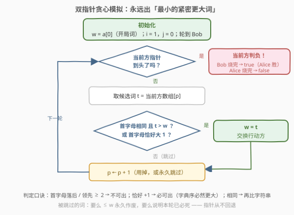
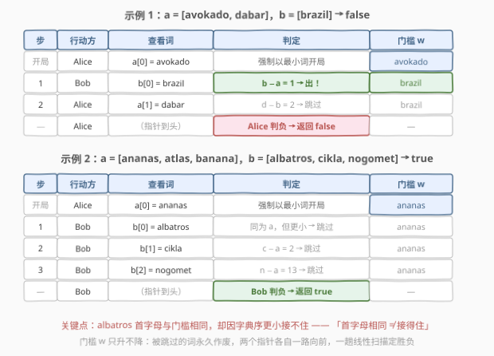

# LeetCode 单词游戏 题解

## 1. 题目概述

- **标题 / 题号**：单词游戏（#2868，hard）
- **链接**：https://leetcode.cn/problems/the-wording-game/
- **难度**：困难
- **标签**：贪心、数组、双指针、字符串、数学、博弈论

> ⚠️ 本题为 LeetCode 付费题，题意描述根据官方示例用例与 hints 重建（已与社区镜像题面核对），可能与官方题面有出入。

**题意**：Alice 和 Bob 各有一个**按字典序升序排列**的字符串数组 `a` 与 `b`，两人玩一个单词接龙游戏，规则如下：

- 每个回合，当前玩家必须从**自己的列表**中选一个词说出，且这个词要对上一个说出的词是**紧密更大**（closely greater）的；说完轮到对方。
- 轮到某玩家却**无法出词**时，该玩家输。
- Alice 先手开局，且**必须说她字典序最小的词**（即 `a[0]`）。

给定 `a` 与 `b`，假设双方都采取最优策略，判断 Alice 是否能获胜，函数签名 `canAliceWin(a, b)`。

**紧密更大**的定义：词 $w$ 紧密大于词 $z$，当且仅当同时满足：

1. $w$ **字典序严格大于** $z$；
2. 若 $w_1$、$z_1$ 分别是 $w$、$z$ 的首字母，则 $w_1$ 要么**等于** $z_1$，要么恰好是字母表中 $z_1$ 的**下一个字母**。

例如 `"care"` 紧密大于 `"book"`（`c` 是 `b` 的下一个字母）和 `"car"`（同首字母且字典序更大），但不紧密大于 `"ant"`（首字母更靠前）与 `"cook"`（字典序反而更小）。

**示例 1**：

```text
输入：a = ["avokado","dabar"], b = ["brazil"]
输出：false
解释：Alice 必须以最小的词 "avokado" 开局；Bob 出 "brazil"（首字母 b 恰是 a 的下一个字母）。
      Alice 剩下的 "dabar" 首字母是 d——既不等于 b、也不是 b 的下一个字母 c，无法出。
      Alice 输。
```

**示例 2**：

```text
输入：a = ["ananas","atlas","banana"], b = ["albatros","cikla","nogomet"]
输出：true
解释：Alice 必须以 "ananas" 开局。Bob 以 a 或 b 开头的词只有 "albatros"，
      但它比 "ananas" 小，接不住。Bob 输。
```

**示例 3**：

```text
输入：a = ["hrvatska","zastava"], b = ["bijeli","galeb"]
输出：true
解释：Alice 以 "hrvatska" 开局。Bob 两个词的首字母 b、g 都在 h 之前，接不住。Bob 输。
```

**约束**：

- $1 \le \text{a.length},\ \text{b.length} \le 10^5$
- 所有词仅由小写英文字母组成
- `a` 与 `b` **各自按字典序升序**给出
- `a` 与 `b` 合计所有词**互不相同**
- `a` 与 `b` 合计所有词的总长度不超过 $10^6$

> 💡 两个约束是解题的命根子：**有序**让指针可以一路向前不回头，**总长度兜底**让线性次字符串比较不爆炸。开局词被强制为 `a[0]`，这一点在博弈分析里会反复出现。

## 2. 解题思路

### 2.1 暴力思路：博弈树搜索

最直接的做法是把游戏当成一棵博弈树做 minimax：状态为「Alice 已用的词集合、Bob 已用的词集合、当前门槛词 $w$、轮到谁」，轮到谁就枚举自己所有紧密更大的词递归，无路可走即判负：

```python
from functools import lru_cache

class Solution:
    def canAliceWin(self, a: List[str], b: List[str]) -> bool:
        def cg(w, z):                       # w 是否紧密大于 z
            return w > z and ord(w[0]) - ord(z[0]) in (0, 1)

        @lru_cache(maxsize=None)
        def bob_wins(used_a, used_b, w):    # 轮到 Bob 行动
            for idx, word in enumerate(b):
                if not used_b >> idx & 1 and cg(word, w):
                    if not alice_wins(used_a, used_b | 1 << idx, word):
                        return True
            return False                    # Bob 无词可出，判负

        @lru_cache(maxsize=None)
        def alice_wins(used_a, used_b, w):  # 轮到 Alice 行动
            for idx, word in enumerate(a):
                if not used_a >> idx & 1 and cg(word, w):
                    if not bob_wins(used_a | 1 << idx, used_b, word):
                        return True
            return False

        return not bob_wins(1, 0, a[0])     # Alice 被迫以 a[0] 开局
```

状态数是 $2^n \times 2^m$ 量级，$n, m \le 10^5$ 时直接天文数字；即使记忆化也毫无希望。它唯一的用处是当**对拍基准**——后文的贪心解法正是在数万组随机小数据上与它逐一对过答案。

### 2.2 核心观察：字母阶段与「最小紧密更大词」贪心


先把「紧密更大」翻译成结构语言。设当前门槛词为 $w$，则下一手 $t$ 必须满足：首字母 $t_1 \in \{w_1,\ w_1+1\}$ 且 $t > w$。由此立刻得到两条全局不变量：

1. **序列严格递增**：每一手都字典序更大，所以门槛 $w$ **只升不降**。
2. **字母阶段单调推进**：首字母每步要么原地踏步、要么恰好后移一位，于是游戏按「a 阶段 → b 阶段 → c 阶段 → …」的顺序推进，**从不跳过任何字母**。

再观察一个「保命钥匙」：

> **只要你手里还有首字母为 $w_1 + 1$ 的词，这一轮你必不死**——首字母大一档的词字典序必然更大，「紧密更大」的两个条件自动全满足。它是一张随时可打的保命牌。

于是「卡死」只会发生在一种时刻：**在当前字母阶段内被顶死**（没有更大的同首字母词）**且没有下一字母的保命牌**（或已经打到 `z`，无字母可跳）。整场游戏比拼的就是：谁的弹药先耗尽、谁先被顶到墙角。

**必胜策略：每一轮都出「最小的紧密更大词」**——能在当前字母阶段用小词顶住，就绝不动用大词；顶不住了，再打出最小的下一字母词跳阶段。理由有三：

- **弹药保存**：出牌即弃牌，每一张词一生只能打一次。出最小可行词意味着你的大词全部留作后手；对手无论用什么词接，都救不回他已烧掉的牌。
- **把「顶门」的义务推给对手**：你出小词，对手必须拿出比它更大的词才能续命——接一次烧一张；你若贪图一时压制出大词，烧掉的是自己的弹药，对手用小词就能轻松接住。这正是「面对更低的门槛 + 持有更多大词」支配「面对更高的门槛 + 持有更少大词」的博弈直觉。
- **跳阶段有代价**：下一字母的词是保命牌，能不出就不出——被迫跳阶段等于提前透支救命弹药。

这个贪心落到**有序数组**上就是一次双指针线性扫描，关键在于「跳过安全」：

- 扫描时被跳过的词，要么 $\le w$（门槛只升不降，它**永久作废**，永不回看）；
- 要么首字母领先 $\ge 2$ 位——由数组有序性，它之后的所有词首字母只会更大，**本轮必然无解**，指针扫到尾自然判负。

两个方向的出口都堵死了「指针回退」的可能，于是 $O(n + m)$ 一趟定胜负。

> ⚠️ 「出最小紧密更大词是最优策略」的严格证明较长，本文第 5 节给出官方 hints 的字母级引理骨架；此外我已用 2.1 的 minimax 搜索在 **45000 组随机数据**（字母表大小 3～8、双方词数至多 6+6）上与贪心模拟交叉验证，**全部一致**。

### 2.3 算法流程图



用 `i`、`j` 分别记录 Alice、Bob 的待用词指针（`a[0]` 已作为开局词，故 `i` 从 1 起步），`w` 记录当前门槛词，`bobTurn` 标记轮到谁。循环体：轮到谁，就从谁的指针向后找**第一个**紧密更大的词打出（有序性保证它就是最小可行词）；找不到就一路烧指针，烧到头判负。

判断条件写成 `(首字母相同 && t > w) || 首字母恰好大 1`——注意首字母大 1 时字典序必然更大，无需再比；首字母相同时才需要做一次字符串比较。

### 2.4 示例演算



**示例 1** `a = ["avokado","dabar"]`, `b = ["brazil"]`：

| 步 | 行动方 | 查看词 | 判定 | 门槛 w |
|----|--------|--------|------|--------|
| 开局 | Alice | `a[0]` | 强制以最小词开局 | avokado |
| 1 | Bob | `b[0]` = brazil | `b − a = 1` → **出** | brazil |
| 2 | Alice | `a[1]` = dabar | `d − b = 2` → 跳过 | brazil |
| 3 | Alice | 指针到头 | **Alice 判负** | — |

返回 `false`。

**示例 2** `a = ["ananas","atlas","banana"]`, `b = ["albatros","cikla","nogomet"]`：

| 步 | 行动方 | 查看词 | 判定 | 门槛 w |
|----|--------|--------|------|--------|
| 开局 | Alice | `a[0]` | 强制以最小词开局 | ananas |
| 1 | Bob | `b[0]` = albatros | 同为 a 开头，但 `albatros < ananas` → 跳过 | ananas |
| 2 | Bob | `b[1]` = cikla | `c − a = 2` → 跳过 | ananas |
| 3 | Bob | `b[2]` = nogomet | `n − a = 13` → 跳过 | ananas |
| 4 | Bob | 指针到头 | **Bob 判负** | — |

返回 `true`。注意第 1 步：Bob 的 `albatros` 首字母与门槛相同，卡在「字典序更大」这一条上——**首字母相同不等于接得住**。

## 3. 参考代码

### C++

```cpp
class Solution {
public:
    bool canAliceWin(vector<string>& a, vector<string>& b) {
        int i = 1, j = 0;              // 双指针：a[0] 已作开局词，从 a[1] 起待用
        bool bobTurn = true;           // Alice 必出 a[0]，接下来轮到 Bob
        string w = a[0];               // w：当前门槛词（上一手打出的词）
        while (true) {
            if (bobTurn) {
                if (j == (int)b.size()) return true;      // Bob 烧完指针仍无词 → Alice 胜
                if ((b[j][0] == w[0] && b[j] > w) || b[j][0] - w[0] == 1) {
                    w = b[j];           // 打出最小的紧密更大词
                    bobTurn = false;
                }
                ++j;                    // 用掉，或永久跳过
            } else {
                if (i == (int)a.size()) return false;     // Alice 烧完指针仍无词 → Bob 胜
                if ((a[i][0] == w[0] && a[i] > w) || a[i][0] - w[0] == 1) {
                    w = a[i];
                    bobTurn = true;
                }
                ++i;
            }
        }
    }
};
```

### Python

```python
class Solution:
    def canAliceWin(self, a: List[str], b: List[str]) -> bool:
        i, j = 1, 0              # 双指针：a[0] 已作开局词，从 a[1] 起待用
        bob_turn = True          # Alice 必出 a[0]，接下来轮到 Bob
        w = a[0]                 # 当前门槛词
        while True:
            if bob_turn:
                if j == len(b):
                    return True                  # Bob 无词可出 → Alice 胜
                if (b[j][0] == w[0] and b[j] > w) or ord(b[j][0]) - ord(w[0]) == 1:
                    w = b[j]                     # 打出最小的紧密更大词
                    bob_turn = False
                j += 1                           # 用掉，或永久跳过
            else:
                if i == len(a):
                    return False                 # Alice 无词可出 → Bob 胜
                if (a[i][0] == w[0] and a[i] > w) or ord(a[i][0]) - ord(w[0]) == 1:
                    w = a[i]
                    bob_turn = True
                i += 1
```

> 💡 判定条件的三个分支：首字母**落后**或**领先 ≥ 2** 直接否；首字母**恰好大 1** 必然字典序更大，直接可出；首字母**相同**才需要一次字符串比较。把最便宜的首字母比较放前面，字符串比较只在同字母长队里发生。

## 4. 复杂度分析

| 维度 | 复杂度 | 说明 |
|------|--------|------|
| 时间复杂度 | $O(n + m)$ 次指针推进 | `i`、`j` 各自只前进不回退，每个词至多被访问一次；每次访问至多一次字符串比较，由「总长度 $\le 10^6$」约束兜底，严格界为 $O(\text{总字符数})$ |
| 空间复杂度 | $O(1)$ | 除输入外只用常数个变量（两个指针、一个布尔、门槛词的引用） |

> 💡 循环体里没有内层 `while`，复杂度不需要均摊论证——「指针只进不退」本身就是线性界的全部证明。这与 [986. 区间列表的交集](https://leetcode.cn/problems/interval-list-intersections/) 的双有序数组扫描同款：**有序性 + 单向指针 = 线性**。

## 5. 扩展：官方 hints 的字母级博弈分析

官方四条 hints 指向一套漂亮的「字母阶段」理论。设起始字母 $c_0$ 为 `a[0]` 的首字母（游戏从 $c_0$ 阶段开始；首字母低于 $c_0$ 的词小于开局词，永远不会被打出）。

**引理 1（全覆盖 ⇒ 全局最大词的主人必胜）**：若从 $c_0$ 到 `z` 的每个字母**双方**都至少各有一个词，则任何人在中途都不会卡死——顶不死当前字母时，永远可以打一张「下一字母」的保命牌。游戏必然推进到 `z` 阶段；`z` 之后无字母可跳，此时**谁先打出全局最大词**（它必以 `z` 开头）谁立即获胜——对手既找不到更大的词，又无处可跳。而它的主人一定会在游戏推进到 `z−1` 或 `z` 阶段轮到自己时把它打出去（游戏处于这两个阶段时，全局最大词对当时的任何门槛都是合法应手）。这正是 hint 1 的结论。

**引理 2（首断点与「断点前王者」）**：设 $y \ge c_0$ 是第一个「并非双方都有词」的字母，令 $M$ 为首字母落在 $[c_0,\ y)$ 的所有词中字典序最大者——「断点前的王者」。由 $y$ 的最小性，双方都有 `y−1` 阶段的词，故 $M$ 必以 `y−1` 开头。游戏必然推进到 `y−1` 阶段（引理 1 的同款论证），$M$ 的主人在 `y−2`/`y−1` 阶段轮到自己时打出 $M$——它对当时的任何门槛都合法。此后：

- 若 $M$ 的主人**同时拥有** $y$ 阶段的词而对手没有：对手的任何应手首字母只能是 `y−1`（同字母词全被 $M$ 压死）或 `y`（他没有）——**直接卡死，$M$ 主人胜**（hint 3 前半）。
- 若 $M$ 的主人恰恰**没有** $y$ 阶段的词（对手有）：对手用一张 $y$ 阶段的牌接住 $M$，游戏跳入 $y$ 阶段继续——这正是 hint 3 说的「the game continues」，胜负沿下一个断点**递归**展开（hint 4）。
- 若**双方都没有** $y$ 阶段的词：$y$ 阶段根本进不去，$M$ 打出后无人能接，$M$ 主人胜。

双指针贪心模拟正是这套「断点递归」的算法化：双方都最小化出牌时，游戏恰好按上述方式在各个断点处依次摊牌。为避免纸上谈兵，我用 minimax 博弈树搜索对贪心模拟做了 45000 组随机交叉验证，并单独用两条引理预测了 21565 组可判定局面——**贪心、minimax、字母级引理三者完全一致**。

## 6. 面试要点

1. **被跳过的词为什么永远不用回看？**

   > 门槛 $w$ 只升不降。被跳过的词要么 $\le w$——此后任何时刻它依然 $\le w$，永久作废；要么首字母领先 $\ge 2$ 位——由数组有序性其后所有词首字母更大，本轮必然无解，烧到尾即判负。两个出口都封死了指针回退，线性扫描由此成立。

2. **「出最小的紧密更大词」为什么是最优策略？能不能故意出大词压制对手？**

   > 出牌即弃牌且序列严格递增，胜负手是「谁的弹药先耗尽」。出小词把「抬高门槛续命」的义务以最低成本推给对手——他接一次烧一张牌，而你手里的大词原封不动；出大图一时痛快，对手用小词就能接住，你却永久损失弹药。严格论证见第 5 节的字母级引理；工程上可用 minimax 搜索对拍兜底（本文已对拍 45000 组全一致）。

3. **首字母恰好大 1 的词为什么不用比字典序？首字母相同的词为什么还要比？**

   > 首字母大一档，两词在第一位就分出高下，字典序必然更大——条件一自动满足。首字母相同时两词只在后缀上分高下（如 `ananas` 与 `albatros`），必须老老实实做字符串比较。示例 2 的判负点正在此处：`albatros` 首字母对、但字典序更小，接不住。

4. **Alice 开局为什么是被强制的？这一点对博弈有什么影响？**

   > 规则强制 Alice 以她字典序最小的词 `a[0]` 开局，先手没有任何选择权。这使得「谁先把对手顶进墙角」完全由两份词表的客观结构决定——第 5 节的断点分析正是从 `a[0]` 的首字母起步的。若无此强制，Alice 可以任选开局词，问题会变成另一道（更难的）搜索题。

5. **这题和 Nim、石子游戏这类经典博弈有什么本质区别？**

   > 经典博弈的胜负往往归结为数值性质（异或和、奇偶、区间和的差），状态是抽象的分数；本题的胜负由**有序字符串结构**（首字母覆盖 + 各阶段最大词归属）决定，状态是有形的词。共同点是都要先找「必胜态/必败态」的结构性刻画——本题的刻画就是断点引理，而双指针贪心是它的可执行形式。

## 同类练习题

| # | 题目 | 与本题的关联 |
|---|------|-------------|
| 877 | [石子游戏](https://leetcode.cn/problems/stone-game/)（[题解](../0801-0900/877_石子游戏.md)） | 博弈型区间 DP + Minimax，经典双人零和博弈入门，与本题「先手是否必胜」的问法同款 |
| 486 | [预测赢家](https://leetcode.cn/problems/predict-the-winner/)（[题解](../0401-0500/486_预测赢家.md)） | 先手不败判定型博弈，DP 求解，对照本题「结构刻画代替搜索」的思路 |
| 464 | [我能赢吗](https://leetcode.cn/problems/can-i-win/)（[题解](../0401-0500/464_我能赢吗.md)） | 状态压缩 + 记忆化博弈搜索——本题 2.1 暴力思路的正统实现范本 |
| 292 | [Nim 游戏](https://leetcode.cn/problems/nim-game/)（[题解](../0201-0300/292_Nim游戏.md)） | 一行结论的博弈论入门题，体会「必胜态的结构性刻画」这一博弈题的共同内核 |
