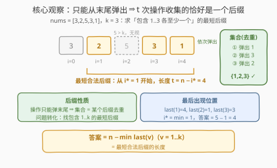
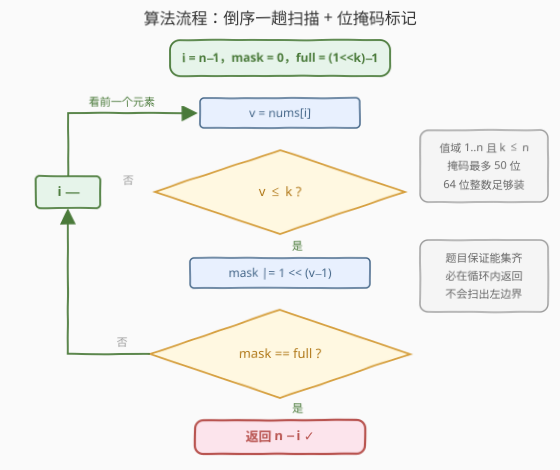
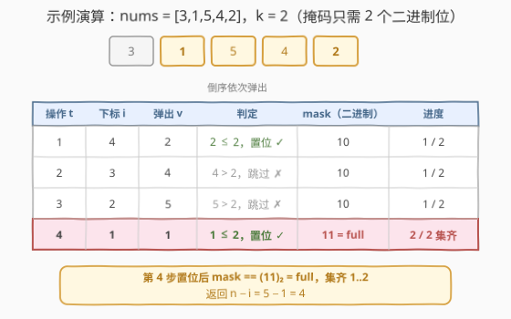

# 收集元素的最少操作次数

- **题目名称**：收集元素的最少操作次数
- **链接**：[2869. 收集元素的最少操作次数](https://leetcode.cn/problems/minimum-operations-to-collect-elements/)
- **难度**：简单
- **标签**：位运算、数组、哈希表

## 1. 题目概述

给你一个**正整数数组** `nums` 和一个整数 `k`。

一次操作中，你可以将数组的**最后一个元素删除**，并将该元素添加到一个**集合**中。

请你返回收集元素 $1, 2, \cdots, k$ 需要的**最少操作次数**。

**示例 1**：

```text
输入：nums = [3,1,5,4,2], k = 2
输出：4
解释：4 次操作后，集合中的元素依次添加了 2 ，4 ，5 和 1 。此时集合中包含元素 1 和 2 ，所以答案为 4 。
```

**示例 2**：

```text
输入：nums = [3,1,5,4,2], k = 5
输出：5
解释：5 次操作后，集合中的元素依次添加了 2 ，4 ，5 ，1 和 3 。此时集合中包含元素 1 到 5 ，所以答案为 5 。
```

**示例 3**：

```text
输入：nums = [3,2,5,3,1], k = 3
输出：4
解释：4 次操作后，集合中的元素依次添加了 1 ，3 ，5 和 2 。此时集合中包含元素 1 到 3 ，所以答案为 4 。
```

**约束条件**：

- $1 \le nums.length \le 50$
- $1 \le nums[i] \le nums.length$
- $1 \le k \le nums.length$
- 输入保证你可以收集到元素 $1, 2, \cdots, k$

> 💡 读题关键：操作方向是**被钉死的**——只能从末尾弹出，不能自由挑选元素。所以「最少操作次数」问的其实是：**从右往左删多远，才能把 $1, 2, \cdots, k$ 全部扫进集合？** 换句话说，这是一个「后缀覆盖」问题，而不是「挑选」问题。

---

## 2. 解题思路

### 2.1 暴力思路

最朴素的模拟：维护一个哈希集合，反复执行「弹出末尾元素 → 加入集合」，每做一步就检查集合是否包含 $1, 2, \cdots, k$，第一次满足时返回步数。每步检查 $O(k)$，整体 $O(nk)$，在本题 $n \le 50$ 的规模下轻松通过。

另一个方向的暴力是**正向扫描**：先扫一遍数组记录每个值 $v \in [1, k]$ 的**最后出现位置** $\text{last}(v)$，取它们的最小值 $i^*$，答案即 $n - i^*$。这是两趟扫描，思路正确但绕了个弯——「最后出现」在正向视角里需要额外记表回看。

两种暴力都能过，但都多做了功：本题的结构其实允许**一趟倒序扫描 + 常数空间**直接出解。

### 2.2 核心观察：后缀视角——倒序一趟扫描 + 位掩码



**观察 1（操作 ⇔ 后缀）**：每次操作弹出的是**当前末尾**元素，且弹出的顺序固定从右往左。因此做 $t$ 次操作后，集合的内容**恰好**是后缀 $nums[n-t:]$ 去重后的结果。答案 = **包含 $1..k$ 各至少一个的最短后缀的长度**。

**观察 2（最短后缀 ⇔ 最后出现位置）**：后缀 $nums[i:]$ 包含值 $v$，当且仅当 $i \le \text{last}(v)$。于是最靠右的合法起点为

$$i^* = \min_{1 \le v \le k} \text{last}(v), \qquad \text{答案} = n - i^*$$

**观察 3（倒序一趟）**：$\text{last}(v)$ 恰好等于「**倒序扫描时 $v$ 的首次出现**」。于是不需要预先建表——从右往左扫，遇到 $[1, k]$ 内的新值就标记，**集齐那一刻**所在的下标就是 $i^*$，直接返回 $n - i$。

**观察 4（位掩码当哈希）**：值域 $1..n$ 且 $k \le n \le 50$，$k$ 个存在性标记可以压缩进**一个 64 位整数**：

$$mask \mathrel{|}= 1 \ll (v-1), \qquad \text{判满：} mask = (1 \ll k) - 1$$

> 💡 本质上这是一道「**识别出问题结构**」的签到题：一旦看出「操作 ⇔ 后缀」，剩下的只是从右往左盖戳、盖满即停。位掩码在这里既是哈希表（去重 + 存在性），又是进度表（一次比较判满）。

### 2.3 算法流程图



流程只有一条主干：

1. 初始化 $i = n-1$，$mask = 0$，$full = (1 \ll k) - 1$；
2. 取 $v = nums[i]$：若 $v > k$，**连判满都省掉**——$mask$ 没变，上一步不满这一步也不会满，直接 $i{-}{-}$；
3. 否则置位 $mask \mathrel{|}= 1 \ll (v-1)$，若 $mask = full$ 则**返回 $n - i$**；
4. 未满则 $i{-}{-}$，看前一个元素。

两个细节：重复出现的值是**幂等**的（重复置位不改变 $mask$，天然去重）；题目保证能集齐，循环内必然返回。

### 2.4 示例演算



以示例 1（$nums = [3,1,5,4,2]$，$k = 2$，掩码只需 2 个二进制位）为例：

| 操作 $t$ | 下标 $i$ | 弹出 $v$ | 判定 | mask | 进度 |
|------|------|------|------|------|------|
| 1 | 4 | 2 | $2 \le 2$，置位 ✓ | `10` | 1 / 2 |
| 2 | 3 | 4 | $4 > 2$，跳过 ✗ | `10` | 1 / 2 |
| 3 | 2 | 5 | $5 > 2$，跳过 ✗ | `10` | 1 / 2 |
| 4 | 1 | 1 | $1 \le 2$，置位 ✓ | `11` = full | 2 / 2 集齐 |

第 4 步置位后 $mask = (11)_2 = full$，返回 $n - i = 5 - 1 = 4$。

- **示例 2**（$k = 5$）：整个数组都是答案后缀，扫到 $i = 0$（值 3）才集齐，返回 $5 - 0 = 5$；
- **示例 3**（$nums = [3,2,5,3,1]$，$k = 3$）：倒序弹 $1, 3, 5, 2$，$5 > k$ 被无视，在 $i = 1$ 集齐，返回 $5 - 1 = 4$。

---

## 3. 参考代码

### C++

```cpp
class Solution {
public:
    int minOperations(vector<int>& nums, int k) {
        int n = nums.size();
        long long mask = 0, full = (1LL << k) - 1;   // k ≤ 50，必须用 64 位
        for (int i = n - 1; i >= 0; i--) {
            int v = nums[i];
            if (v <= k) {
                mask |= 1LL << (v - 1);
                if (mask == full) return n - i;      // 集齐 1..k，恰好操作了 n-i 次
            }
        }
        return -1;  // 题目保证能集齐，走不到这里
    }
};
```

### Python

```python
class Solution:
    def minOperations(self, nums: List[int], k: int) -> int:
        n = len(nums)
        mask, full = 0, (1 << k) - 1
        for i in range(n - 1, -1, -1):
            v = nums[i]
            if v <= k:
                mask |= 1 << (v - 1)
                if mask == full:
                    return n - i
        return -1  # 题目保证能集齐，走不到这里
```

> ⚠️ C++ 的坑：$k$ 最大 50，超过 32 位 `int` 的移位上限，`1 << k` 属于**未定义行为**，务必写 `1LL << k`；Python 整数无宽度限制，天然安全。

---

## 4. 复杂度分析

| 维度 | 复杂度 | 说明 |
|------|--------|------|
| 时间复杂度 | $O(n)$ | 倒序一趟扫描，每步置位 / 判满均为 $O(1)$ |
| 空间复杂度 | $O(1)$ | 一个 64 位掩码 + 常数个变量（哈希表 / 布尔数组版本为 $O(k)$） |

---

## 5. 扩展：哈希集合写法与「最早截止时间」视角

**哈希集合版**（对应标签里的 Hash Table，语义最直白）：

```python
class Solution:
    def minOperations(self, nums: List[int], k: int) -> int:
        seen = set()
        for i in range(len(nums) - 1, -1, -1):
            if nums[i] <= k:
                seen.add(nums[i])
                if len(seen) == k:
                    return len(nums) - i
        return -1
```

`set` 自动去重，`len(seen) == k` 即集齐；注意仍要过滤 $v > k$，否则无关值会污染计数。

**「最早截止时间」视角**：把每个值 $v$ 的 $\text{last}(v)$ 看作它的**截止位置**——后缀必须从 $\text{last}(v)$ 及其左边开始才能覆盖 $v$。于是 $i^* = \min_v \text{last}(v)$ 就是「最紧的截止」，答案 $n - i^*$。这与贪心调度里「取最早截止时间」的思想同构，也解释了为什么倒序一趟天然最优：**倒序扫描时每个值首次被遇到的位置，正是它的截止位置**。

---

## 6. 面试要点

1. **为什么答案恰好是 $n - i$？**

   > 从末尾删到下标 $i$（含）共删 $n - i$ 个元素，即 $t$ 次操作 ⇔ 长度为 $t$ 的后缀。倒序扫描首次集齐时的下标就是最靠右的合法起点 $i^*$，故操作数 $= n - i^*$。

2. **$v > k$ 的元素为什么可以直接无视？连判满检查一并省掉，对吗？**

   > 集合只关心 $1..k$。$v > k$ 时 $mask$ 不变；若此前 $mask \ne full$，跳过后依然 $\ne full$（若相等早就返回了）。所以把判满放进 `if (v <= k)` 内部是安全的等价写法，还省了一次比较。

3. **C++ 里 `1 << k` 有什么坑？**

   > 本题 $k \le 50 > 31$，对 32 位 `int` 左移超出宽度是未定义行为。必须用 `1LL << k` 或 `uint64_t`。这是位运算题的高频扣分点。

4. **为什么不正向扫描？**

   > 正向遇到同一值多次出现时，只有**最后一次出现**决定后缀边界，需要先建 $\text{last}$ 表再回看，两趟扫描；倒序视角下「最后出现」恰是「首次遇到」，一趟直接出解。方向选对了，问题就少一半。

5. **位掩码和哈希表如何取舍？**

   > 值域小且稠密（这里是 $1..k$ 连续区间）时掩码最优：置位、判满都是 $O(1)$ 且常数极小，天然去重，`mask == full` 一次比较顶替 popcount 或计数器；值域稀疏或超大（如 $10^9$）时只能用哈希表 / 平衡树。

---

## 7. 同类练习题

- [2859. 计算 K 置位下标对应元素的和](https://leetcode.cn/problems/sum-of-values-at-indices-with-k-set-bits/)：位掩码入门签到题，熟悉按位计数与 `(1<<k)-1` 型构造
- [448. 找到所有数组中消失的数字](https://leetcode.cn/problems/find-all-numbers-disappeared-in-an-array/)：同为值域 $1..n$ 的存在性标记，本题「收集 1..k」的镜像问题（找缺失 vs 找集齐）
- [231. 2 的幂](https://leetcode.cn/problems/power-of-two/)：单比特判定 `n & (n-1)`，与 `(1<<k)-1` 满掩码构造同源
- [187. 重复的 DNA 序列](https://leetcode.cn/problems/repeated-dna-sequences/)：把存在性信息压进一个整数的滚动位掩码，「掩码当哈希用」的进阶
- [41. 缺失的第一个正数](https://leetcode.cn/problems/first-missing-positive/)：值域收集问题的 $O(1)$ 空间极致版（原地哈希）
