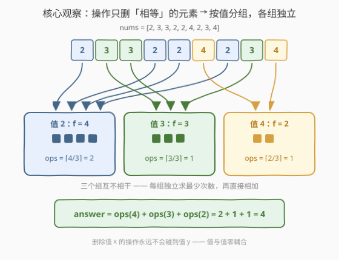
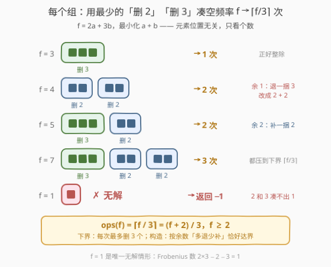
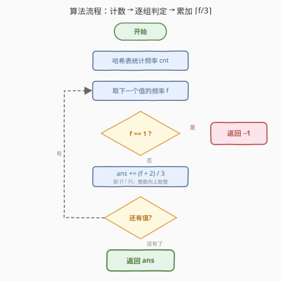

# 使数组为空的最少操作次数

- **题目名称**：使数组为空的最少操作次数
- **链接**：[2870. 使数组为空的最少操作次数](https://leetcode.cn/problems/minimum-number-of-operations-to-make-array-empty/)
- **难度**：中等
- **标签**：贪心、数组、哈希表、计数

## 1. 题目概述

给你一个下标从 0 开始、由正整数组成的数组 `nums`。你可以对数组执行以下操作**任意次**：

- 选择**两个相等**的元素，把它们从数组中删除；
- 选择**三个相等**的元素，把它们从数组中删除。

被选中的元素只需**值相等**，不要求相邻。返回使数组**完全为空**的最少操作次数；如果无法做到，返回 `-1`。

**示例 1**：

```text
输入：nums = [2,3,3,2,2,4,2,3,4]
输出：4
解释：2 出现 4 次 → 拆成 2 + 2，删两次；
     3 出现 3 次 → 一次删 3 个；
     4 出现 2 次 → 一次删 2 个。
     总计 2 + 1 + 1 = 4 次操作。
```

**示例 2**：

```text
输入：nums = [2,1,2,2,3,3]
输出：-1
解释：2（3 个）和 3（2 个）都能删干净，
     但 1 只出现 1 次——既凑不齐 2 个也凑不齐 3 个，永远留在数组里。
```

**约束条件**：

- $2 \le \text{nums.length} \le 10^5$
- $1 \le \text{nums}[i] \le 10^6$

> ⚠️ 两个关键线索：其一，操作只作用于**相等**的元素——不同数值之间永远无法互相抵消，这是「按值分组」的强信号；其二，每次操作删 2 个或 3 个，每个组的问题退化为纯算术：**用最少个数的 2 和 3 之和凑出频率 $f$**。

---

## 2. 解题思路

### 2.1 暴力思路：模拟每一步的搜索

把整个数组当作状态，每一步枚举「删哪两个相等元素 / 删哪三个相等元素」，DFS/BFS 搜索到空数组的最短路径。状态空间指数级——同一组 $f$ 个相等元素就有 $\binom{f}{2} + \binom{f}{3}$ 种删法，且大量状态殊途同归，$n = 10^5$ 下完全不可行。

退一步的「半暴力」：按值分组后，对每组频率 $f$ 做 DP 递推

$$dp[i] = \min(dp[i-2],\ dp[i-3]) + 1,\qquad dp[0] = 0,\ dp[1] = \infty$$

由于所有组的频率之和恰为 $n$，总复杂度 $O(n)$，已经能过。但这仍未抓住本质——$dp$ 的结果存在**闭式**，可以一步算出。

### 2.2 核心观察：按值分组独立求解，每组 $\lceil f/3 \rceil$ 次



**观察一：不同数值完全独立**。操作要求被删元素**相等**，所以值 $x$ 的任何一次删除操作都不会碰到值 $y$ 的元素。整个问题按值拆成若干互不干扰的子问题，整体最优 = 各组最优之和：

$$\text{answer} = \sum_{v} \text{ops}(\text{freq}(v))$$

**观察二：每组就是「用最少个数的 2 和 3 凑出 $f$」**。元素的顺序、位置全部无关紧要，唯一重要的是把 $f = 2a + 3b$ 中的 $a + b$ 最小化。



用**双向夹逼**证明 $\text{ops}(f) = \lceil f/3 \rceil$（$f \ge 2$）：

- **下界**：每次操作最多删 3 个元素，$f$ 个元素至少需要 $\lceil f/3 \rceil$ 次；
- **构造**：按 $f \bmod 3$ 分三种情况，恰好压到下界——
  - $f \equiv 0 \pmod 3$：全用「删 3」，共 $f/3$ 次；
  - $f \equiv 2 \pmod 3$：$\lfloor f/3 \rfloor$ 次删 3 + 1 次删 2，共 $\lceil f/3 \rceil$ 次；
  - $f \equiv 1 \pmod 3$（此时 $f \ge 4$）：**退一捆「删 3」换成两次「删 2」**，即 $(f-4)/3$ 次删 3 + 2 次删 2，共 $\lceil f/3 \rceil$ 次。

于是

$$\text{ops}(f) = \left\lceil \frac{f}{3} \right\rceil = \left\lfloor \frac{f+2}{3} \right\rfloor,\qquad f \ge 2$$

**唯一无解的情形**：$f = 1$。$1$ 无法写成 2 与 3 的非负组合；事实上 2 与 3 的最大不可表示数恰为 $2 \times 3 - 2 - 3 = 1$（Frobenius 数），所以凡 $f \ge 2$ 必有解，凡 $f = 1$ 必无解——遇到即返回 `-1`。

> 💡 **为什么「尽量删 3」的直觉贪心不会错**：唯一的坑是余 1（如 $f = 4$ 先删 3 就剩 1 卡死），补救方法是把一捆 3 拆成 2 + 2。这等价于直接按余数分类「多退少补」，三种情况最终都等于下界 $\lceil f/3 \rceil$。

### 2.3 算法流程图



**完整步骤**：

1. 用哈希表统计每个值的出现频率 $f$；
2. 遍历所有频率：若某个 $f = 1$，直接返回 `-1`；
3. 否则累加 $\lfloor (f+2)/3 \rfloor$；
4. 返回总和。

### 2.4 示例演算

以示例 1 `nums = [2,3,3,2,2,4,2,3,4]` 为例：

| 值 $v$ | 频率 $f$ | 最优拆分 | 操作次数 $\lceil f/3 \rceil$ |
|--------|----------|----------|------------------------------|
| 2 | 4 | $2 + 2$（余 1 情形，退 3 改 2+2） | 2 |
| 3 | 3 | $3$ | 1 |
| 4 | 2 | $2$ | 1 |

总计 $2 + 1 + 1 = 4$，与示例一致。示例 2 中值 $1$ 的频率为 $1$，触发无解判定，返回 `-1`。

---

## 3. 参考代码

### C++

```cpp
class Solution {
  public:
    int minOperations(vector<int>& nums) {
        unordered_map<int, int> cnt;
        for (int x : nums) ++cnt[x];

        int ans = 0;
        for (const auto& [v, f] : cnt) {
            if (f == 1) return -1;      // 1 无法由 2/3 凑出
            ans += (f + 2) / 3;         // ceil(f / 3)
        }
        return ans;
    }
};
```

### Python

```python
class Solution:
    def minOperations(self, nums: List[int]) -> int:
        cnt = Counter(nums)
        ans = 0
        for f in cnt.values():
            if f == 1:                  # 1 无法由 2/3 凑出
                return -1
            ans += (f + 2) // 3         # ceil(f / 3)
        return ans
```

> 💡 $(f + 2) / 3$ 是整数实现向上取整的标准写法，避免浮点 `ceil` 的精度隐患。答案上界：每次操作至少删 2 个元素，故 $\text{ans} \le n / 2 \le 5 \times 10^4$，`int` 足够。

---

## 4. 复杂度分析

| 维度 | 复杂度 | 说明 |
|------|--------|------|
| **时间复杂度** | $O(n)$ | 一次遍历计数 $O(n)$；再遍历哈希表，每组 $O(1)$ 求闭式 |
| **空间复杂度** | $O(n)$ | 哈希表最多存 $n$ 个不同的值 |

---

## 5. 扩展：删除个数集合任意化时，贪心失效、背包兜底

若允许删除的个数集合不是 $\{2, 3\}$ 而是任意集合 $S$（例如 $\{2, 5\}$），闭式就不存在了：$f = 6$ 时贪心「先删 5」剩 1 卡死，正确拆法是 $2 + 2 + 2$ 共 3 次，与 $\lceil f / \max S \rceil$ 毫无关系。一般做法是**完全背包**：

$$dp[i] = \min_{s \in S,\ s \le i} \bigl(dp[i - s] + 1\bigr),\qquad dp[0] = 0$$

单组 $O(f \cdot |S|)$。进一步地，若问「哪些 $f$ 无解」，答案是所有落在 $S$ 的非负整系数线性组合张成的半群之外的数；$S = \{a, b\}$ 且 $\gcd(a, b) = 1$ 时，不可表示数恰有 $(a-1)(b-1)/2$ 个，最大者为 $ab - a - b$（**Frobenius 数**）。本题 $\{2, 3\}$ 的 Frobenius 数恰为 $1$——这正是「只有 $f = 1$ 无解」的数论根源。

---

## 6. 面试要点

1. **为什么可以按值分组独立处理？**

   - 操作只删**相等**的元素，任何一次操作都不可能同时涉及两个不同的值，值与值之间零耦合。整体最优 = 各组最优之和，这是「计数 + 分而治之」最干净的信号。

2. **$\lceil f/3 \rceil$ 怎么证明，而不是拍脑袋？**

   - 双向夹逼。下界：每次操作最多删 3 个，至少 $\lceil f/3 \rceil$ 次。上界：按 $f \bmod 3$ 给出构造（余 0 全删 3；余 2 补一次删 2；余 1 退一捆 3 改成两次删 2）。构造与下界重合，即为最优。

3. **什么时候返回 -1？只有 f = 1 吗？**

   - $f = 1$ 是唯一无解情形：2 与 3 互质，任何 $f \ge 2$ 都可写成 $2a + 3b$（归纳：$2, 3$ 成立，$f \ge 4$ 时 $f - 2 \ge 2$ 仍可表示）。或直接引用 Frobenius 数 $2 \times 3 - 2 - 3 = 1$。

4. **为什么写 $(f+2)/3$ 而不是 `ceil(f/3)`？**

   - 纯整数运算，无浮点误差；$(f + k - 1) / k$ 是 $k$ 除向上取整的通用整数写法，面试中主动写出是加分项。

5. **如果操作还允许「一次删 4 个」，答案变成 $\lceil f/4 \rceil$ 吗？集合换成 $\{2,5\}$ 呢？**

   - $\{2,3,4\}$ 时结论恰为 $\lceil f/4 \rceil$（$f \le 7$ 逐一验证，$f \ge 8$ 时 $f - 4 \ge 4$ 归纳可达下界）。但 $\{2,5\}$ 立刻失效：$f = 6$ 只能 $2+2+2$ 三次，$\lceil 6/5 \rceil = 2$ 不可达。删除集合任意化后，稳妥的通用工具是完全背包（见第 5 节）。

> 💡 **一句话总结**：值不相干 → 按值计数；每值是「2/3 凑和」→ 双向夹逼得 $\lceil f/3 \rceil$；$f = 1$ 是唯一例外，返回 -1。

---

## 7. 同类练习题

- [2244. 完成所有任务需要的最少轮数](https://leetcode.cn/problems/minimum-rounds-to-complete-all-tasks/)：完全同构——按任务难度计数，每轮完成 2 或 3 个同难度任务，$f=1$ 同样返回 -1
- [2856. 删除数对后的最小数组长度](2856_删除数对后的最小数组长度.md)：同为频率计数求最优操作，但删的是「不相等」的数对，需讨论最大频率是否过半——对照本题体会「操作约束决定分组独立性」
- [2206. 将数组划分成相等数对](https://leetcode.cn/problems/divide-array-into-equal-pairs/)：频率奇偶判定能否两两配对，本题 $f \bmod 2$ 维度的姐妹题
- [1647. 字符频次唯一的最小删除次数](https://leetcode.cn/problems/minimum-deletions-to-make-character-frequencies-unique/)：字符串版按频率贪心，每次删 1 个，体会「操作粒度」变化对策略的影响
