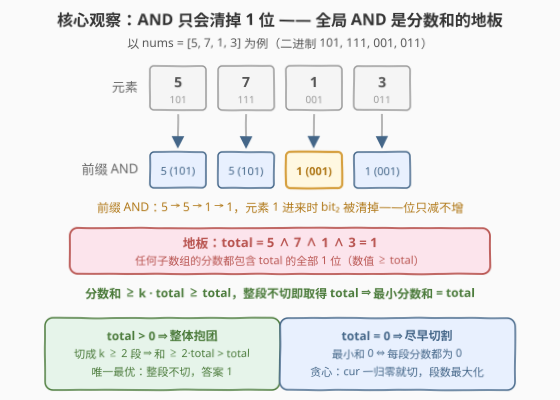
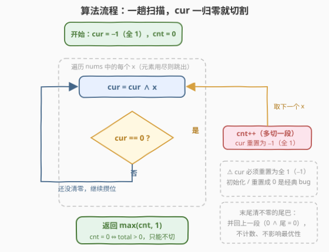
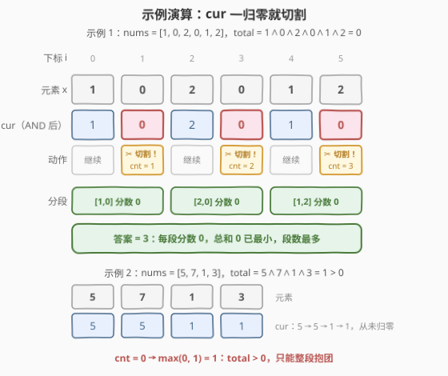

# LeetCode 将数组分割成最多数目的子数组 题解

## 1. 题目概述

- **标题 / 题号**：将数组分割成最多数目的子数组（#2871，medium）
- **链接**：https://leetcode.cn/problems/split-array-into-maximum-number-of-subarrays/
- **难度**：中等
- **标签**：贪心、位运算、数组

**题意**：给你一个只包含**非负**整数的数组 `nums`。

定义子数组 `nums[l..r]` 的**分数**为 `nums[l] AND nums[l+1] AND ... AND nums[r]`，其中 `AND` 是按位与运算。

请你将数组分割成**一个或者更多**子数组，满足：

- 每个元素都**只属于一个**子数组；
- 所有子数组的**分数之和尽可能小**。

在满足以上要求的条件下，返回**最多**可以得到多少个子数组。

**示例 1**：

```text
输入：nums = [1,0,2,0,1,2]
输出：3
解释：分割为 [1,0]、[2,0]、[1,2]，分数分别为 0、0、0，总和 0 已是最小；
     在总和为 0 的前提下最多分成 3 段，返回 3。
```

**示例 2**：

```text
输入：nums = [5,7,1,3]
输出：1
解释：分割为 [5,7,1,3]，分数为 5∧7∧1∧3 = 1，这是能得到的最小总分；
     在总和为 1 的前提下只能分成 1 段，返回 1。
```

**约束**：

- $1 \le nums.length \le 10^5$
- $0 \le nums[i] \le 10^6$

> 💡 读题关键：这是「**先定最优值、再数方案**」的双层目标题——第一层求**最小分数和**（优化），第二层在该前提下数**最多段数**（计数）。两问的答案都由 AND 运算「位只被清掉、不会凭空产生」的单调性一锤定音。

## 2. 解题思路

### 2.1 暴力思路

最朴素的想法是**枚举所有分割方案**：$n-1$ 个间隙，每个间隙「切 / 不切」，共 $2^{n-1}$ 种方案，对每种方案逐段求 AND 再求和。$n = 10^5$ 时方案数是天文数字，直接爆炸。

稍作收敛可以想到 **DP**：令 $f[i]$ 为前 $i$ 个元素的最小分数和，转移 $f[i] = \min_{j<i}\ f[j] + \text{AND}(j{+}1..i)$，时间 $O(n^2)$ 仍会超时；而且第二问（最多段数）还需要额外携带维度，状态设计更复杂。

直觉上的纠结点在于：**切得越碎段数越多，但每段的 AND 可能变大**，两个目标互相拉扯，看似必须权衡。突破口是先回答一个更基本的问题——**最小分数和到底是多少？** 一旦知道它的值，「最多段数」就不再有权衡空间了。

### 2.2 核心观察：全局 AND 是分数和的地板



**观察 1（AND 只减不增）**：向子数组里多 AND 一个数，已有的 `1` 只会被清成 `0`，绝不可能凭空多出 `1`。所以**子数组越长，分数在位集合意义下单调不增**。

**观察 2（下界）**：记 $\text{total} = \text{nums}[0] \wedge \text{nums}[1] \wedge \cdots \wedge \text{nums}[n-1]$（**全局 AND**）。任何子数组参与 AND 的元素都比全集少，被清掉的位只会更少，所以**任何子数组的分数都是 total 的位超集**——包含 total 的所有 `1` 位，数值上 $\text{score}_i \ge \text{total}$。于是对任意切成 $k$ 段的方案：

$$\sum_{i=1}^{k} \text{score}_i \ \ge\ k \cdot \text{total} \ \ge\ \text{total}$$

而「**整段不切**」这个方案恰好取得分数和 $= \text{total}$。所以**最小分数和就是 total**，下界永远可达，第一层优化问题解决。

**观察 3（按 total 是否为 0 二分天下）**：

- **total > 0**：若切成 $k \ge 2$ 段，则和 $\ge 2 \cdot \text{total} > \text{total}$，不再最优。唯一的最优方案就是**不切**，答案为 `1`。直觉：total 的这些 `1` 位是**所有元素共有的**，拆开谁也甩不掉，切开只会让每段都背一遍——只能整体抱团。
- **total = 0**：最小和为 $0$，而分数非负，**和为 0 当且仅当每一段的分数都为 0**。问题退化为：**最多切成多少段，使每段的 AND 恰好为 0**。

**观察 4（total = 0 时贪心「一清零就切」最优）**：从左到右维护当前段的累积 AND 前缀 `cur`，`cur` 一旦变成 0 **立刻在此切割**，并把 `cur` 重置为全 1。正确性用**交换论证**：设任意最优方案的第一段为 $P_1$（其 AND 为 0），由单调性，`cur` 在扫到 $P_1$ 终点之前必然已经变成 0，故贪心的第一个切点 $g_1 \le P_1$ 的终点；把 $P_1$ 被贪心多切走的剩余尾巴**并回第二段**，第二段的 AND 只会再清位（$0 \wedge \text{任何数} = 0$），合法性不变、段数不减。对后续各段归纳，贪心段数 $\ge$ 任何方案。

> 💡 一句话：**AND 是「清位」运算，全局 AND 就是一切分割方案分数和的地板**。total > 0 时地板为正、逼你整体抱团；total = 0 时地板贴地、每段各自清零、越早切越省——两问都在一趟扫描里顺手解决。

### 2.3 算法流程图



整个算法只有「一趟扫描 + 一次兜底」：

1. `cur = -1`（全 1，AND 的单位元），`cnt = 0`；
2. 从左到右扫描每个元素 $x$：先 `cur &= x`；若 `cur == 0`，则 `cnt++` 并把 `cur` 重置为 `-1`（开新段）；
3. 返回 `max(cnt, 1)`：
   - `cnt == 0` ⇔ 全程 `cur` 从未归零 ⇔ $\text{total} > 0$，只能整段不切，返回 1；
   - `cnt >= 1` ⇔ $\text{total} = 0$。若末尾还剩一段「清不干净」的尾巴（`cur` 非 0），它并回上一段后上一段分数仍是 $0 \wedge \text{尾巴} = 0$，**不影响段数也不影响最优性**，直接返回 `cnt`。

注意**无需先显式算出 total 再分类**——`cnt` 是否为 0 本身就是 total 是否为 0 的判据，一趟搞定。

### 2.4 示例演算



**示例 1**：`nums = [1,0,2,0,1,2]`，total $= 1 \wedge 0 \wedge 2 \wedge 0 \wedge 1 \wedge 2 = 0$。

| $i$ | $x$ | `cur`（AND 之后） | 动作 |
|-----|-----|------------------|------|
| 0 | 1 | $-1 \wedge 1 = 1$ | 继续 |
| 1 | 0 | $1 \wedge 0 = 0$ | ✂ **切割**，cnt = 1，cur 重置 $-1$ |
| 2 | 2 | $-1 \wedge 2 = 2$ | 继续 |
| 3 | 0 | $2 \wedge 0 = 0$ | ✂ **切割**，cnt = 2，cur 重置 $-1$ |
| 4 | 1 | $-1 \wedge 1 = 1$ | 继续 |
| 5 | 2 | $1 \wedge 2 = 0$ | ✂ **切割**，cnt = 3，cur 重置 $-1$ |

扫描结束无尾巴，三段为 $[1,0]$、$[2,0]$、$[1,2]$，每段分数 0，答案 **3**。

**示例 2**：`nums = [5,7,1,3]`。前缀 AND 依次为 $5 \to 5 \to 1 \to 1$，全程从未归零（total $= 1 > 0$），`cnt = 0`，返回 $\max(0, 1) = $ **1**。

**尾巴情形**：如 `nums = [1,2,3]`，扫到 $1 \wedge 2 = 0$ 时切割（cnt = 1），末尾尾巴 `[3]` 清不干净——并回上一段得 $[1,2,3]$，分数 $0 \wedge 3 = 0$ 仍最优，答案 1。这就是「尾巴免费并回」的含义。

## 3. 参考代码

### C++

```cpp
class Solution {
public:
    int maxSubarrays(vector<int>& nums) {
        int cnt = 0;
        int cur = -1;                 // 全 1：AND 的单位元
        for (int x : nums) {
            cur &= x;
            if (cur == 0) {           // 当前段已清零，立刻切割
                cnt++;
                cur = -1;             // 重置，开新段
            }
        }
        return max(cnt, 1);           // cnt==0 ⇔ total>0，只能整段不切
    }
};
```

### Python

```python
class Solution:
    def maxSubarrays(self, nums: List[int]) -> int:
        cnt = 0
        cur = -1                       # 全 1：AND 的单位元
        for x in nums:
            cur &= x
            if cur == 0:               # 当前段已清零，立刻切割
                cnt += 1
                cur = -1               # 重置，开新段
        return max(cnt, 1)             # cnt==0 ⇔ total>0，只能整段不切
```

> 💡 两个易踩的坑：**`cur` 必须初始化为全 1**——C++/Python 中 `-1` 的补码恰好是全 1 位模式，$-1 \wedge x = x$；若手滑初始化成 0，则 `cur` 永远是 0、每个元素都触发切割，直接全错。**返回值必须 `max(cnt, 1)` 兜底**——它一举覆盖两类情形：total > 0 时（cnt = 0）返回 1；total = 0 且有脏尾巴时，尾巴并回上一段不计数，cnt 保持不变。

## 4. 复杂度分析

| 维度 | 复杂度 | 说明 |
|------|--------|------|
| 时间复杂度 | $O(n)$ | 一趟扫描，每个元素只做一次 AND 与一次比较 |
| 空间复杂度 | $O(1)$ | 仅维护 `cnt`、`cur` 两个变量 |

## 5. 扩展：两趟写法与「AND 取值只有 $O(\log U)$ 种」

**两趟写法**：也可以先显式求出 $\text{total} = \text{nums}[0] \wedge \cdots \wedge \text{nums}[n-1]$，若 total > 0 直接返回 1，否则再跑一趟贪心。逻辑与一趟写法等价，只是把「分类判据」从 `cnt == 0` 换成了显式的 total；面试中先讲两趟版更易暴露思考过程，再收拢成一趟版是不错的表达节奏。

**为什么 AND 家族问题这么爱单调性**：对固定右端点 $r$，左端点左移时子数组 AND 单调不增，且**每变化一次至少清掉一个 1 位**——值域 $U \le 10^6 < 2^{20}$，所以每个右端点对应的子数组 AND 至多只有约 21 种取值。这一性质是「子数组 AND/OR」系列题（如 1521、3171）能用 $O(n \log U)$ 滑窗求解的根基，本题的「前缀 AND 一路清位」正是它的最简形态。

## 6. 面试要点

1. **为什么最小分数和一定等于全局 AND total？**

   > 任何子数组参与 AND 的元素是全集的子集，被清掉的位只会更少，所以每段分数都是 total 的**位超集**，数值上 $\ge$ total；于是总和 $\ge k \cdot \text{total} \ge \text{total}$。而整段不切的方案恰好取得 total，下界可达，最小值就是 total。

2. **total > 0 时为什么答案一定是 1？**

   > 切成 $k \ge 2$ 段时总和 $\ge 2 \cdot \text{total} > \text{total}$，与最优矛盾。本质上 total 的 1 位是所有元素共有的，拆段只会让每段重复背上这些位，只有整体抱团才能只背一次。注意题目允许「一个子数组」，即不切也是合法方案。

3. **`cur` 为什么必须初始化为 -1？初始化成 0 会怎样？**

   > AND 的单位元是**全 1**，`-1` 的补码恰好是全 1，保证 $-1 \wedge x = x$，不污染第一段。初始化成 0 则 $0 \wedge x = 0$，`cur` 永远为 0，每个元素都触发切割，答案恒为 n——经典 bug。

4. **贪心「一清零就切」为什么是最优的？怎么证明？**

   > 交换论证：贪心的第一个切点不晚于任意最优方案第一段的终点（AND 单调不增，最优方案第一段末尾已清零，途中必先经过 0）；把多切走的尾巴并回下一段，下一段 AND 只会更小（$0 \wedge x = 0$），段数不减少。逐段归纳，贪心段数不劣于任何方案。

5. **末尾清不干净的尾巴为什么可以「免费并回」上一段？**

   > 上一段分数已是 0，并回尾巴后分数 $= 0 \wedge \text{尾巴的 AND} = 0$，最优性无损；而尾巴自身清不零、后面又没有元素可借力，单独成段只会推高总和。代码层面体现为「尾巴不计数」，配合 `max(cnt, 1)` 即完整覆盖。

## 同类练习题

| # | 题目 | 与本题的关联 |
|---|------|-------------|
| 2419 | [按位与最大的最长子数组](https://leetcode.cn/problems/longest-subarray-with-maximum-bitwise-and/) | 求连续子数组 AND 的最大值，「AND 只减不增」单调性最直接的应用 |
| 2275 | [按位与结果大于零的最长组合](https://leetcode.cn/problems/largest-combination-with-bitwise-and-greater-than-zero/) | AND > 0 ⇔ 存在公共 1 位，按位分组计数，与本题「每段 AND = 0」互为正反视角 |
| 1521 | [找到最接近目标值的函数值](https://leetcode.cn/problems/find-a-value-of-a-mysterious-function-closest-to-target/) | 子数组 AND 与 target 最小差，AND 单调性 + 滑窗的经典进阶 |
| 898 | [子数组按位或操作](https://leetcode.cn/problems/bitwise-ors-of-subarrays/) | 对偶运算 OR 的版本——OR 只增不减，统计子数组 OR 值的集合大小 |
| 3171 | [找到按位或最接近 K 的子数组](https://leetcode.cn/problems/find-subarray-with-bitwise-or-closest-to-k/) | OR 最接近 K，与 1521 镜像对称，单调性 + 滑窗套题 |
