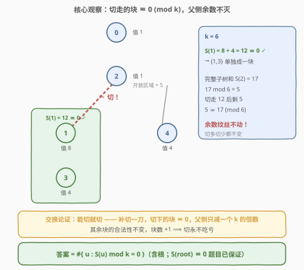
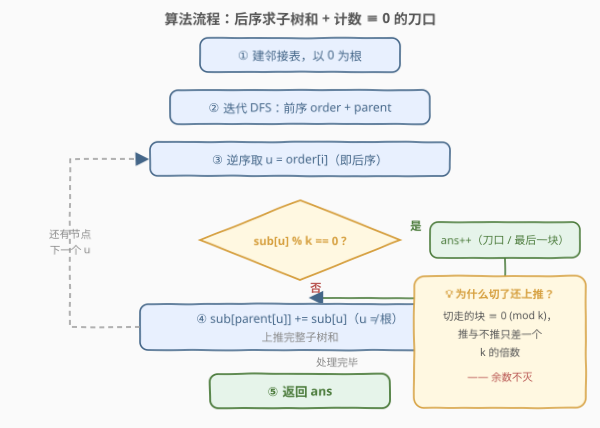
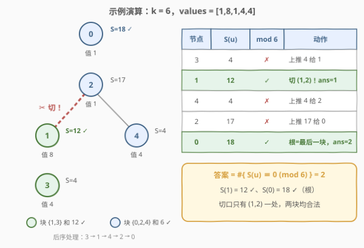

# 可以被 K 整除连通块的最大数目

- **题目名称**：可以被 K 整除连通块的最大数目
- **链接**：[2872. 可以被 K 整除连通块的最大数目](https://leetcode.cn/problems/maximum-number-of-k-divisible-components/)
- **难度**：困难
- **标签**：树、深度优先搜索、贪心、数学

## 1. 题目概述

给你一棵 $n$ 个节点的**无向树**，节点编号为 $0$ 到 $n-1$，`edges[i] = [a_i, b_i]` 表示节点 $a_i$ 和 $b_i$ 之间有一条边。每个节点 $i$ 有一个**值** `values[i]`，再给你一个整数 $k$。

你可以从树中**删除一些边**（也可以一条不删），得到若干**连通块**。一个**连通块的值**定义为块中所有节点值之和。如果所有连通块的值都能被 $k$ 整除，则称之为一个**合法分割**。

请返回所有合法分割中，**连通块数目的最大值**。

**示例 1**：

```text
输入：n = 5, edges = [[0,2],[1,2],[1,3],[2,4]], values = [1,8,1,4,4], k = 6
输出：2
解释：删除节点 1 和 2 之间的边。这是一个合法分割，因为：
- 节点 1 和 3 所在连通块的值为 values[1] + values[3] = 12。
- 节点 0、2 和 4 所在连通块的值为 values[0] + values[2] + values[4] = 6。
最多可以得到 2 个连通块的合法分割。
```

**示例 2**：

```text
输入：n = 7, edges = [[0,1],[0,2],[1,3],[1,4],[2,5],[2,6]], values = [3,0,6,1,5,2,1], k = 3
输出：3
解释：删除节点 0 和 2、节点 0 和 1 之间的两条边。这是一个合法分割，因为：
- 节点 0 的连通块的值为 values[0] = 3。
- 节点 2、5、6 所在连通块的值为 values[2] + values[5] + values[6] = 9。
- 节点 1、3、4 的连通块的值为 values[1] + values[3] + values[4] = 6。
最多可以得到 3 个连通块的合法分割。
```

**约束条件**：

- $1 \le n \le 3 \times 10^4$
- `edges.length == n - 1`
- $0 \le values[i] \le 10^9$
- $1 \le k \le 10^9$
- `values` 之和可以被 $k$ 整除
- 输入保证 `edges` 是一棵无向树

> ⚠️ 两个关键线索：其一，「每块和 $\equiv 0 \pmod k$」是**模意义下**的条件，而子树和沿树结构天然可分解——这是「自底向上处理」的信号；其二，直觉上切割会互相影响（这里切一刀，父节点那块的和就变了），但在 mod $k$ 意义下影响**恰好消失**。看穿这一点，本题就从 Hard 变成一遍后序扫描。

---

## 2. 解题思路

### 2.1 暴力思路：枚举删边子集

树有 $n-1$ 条边，每种删边方案对应一个子集，共 $2^{n-1}$ 种；每种方案再花 $O(n)$ 用 DFS/BFS 求出各块之和并验证整除性。$n = 3\times 10^4$ 时是天文数字，即使 $n = 30$ 也有 $2^{29} \approx 5$ 亿种方案。

> ⚠️ 暴力的硬伤：把「合法分割」当成**整体**逐个验证。而合法性是逐块独立的——每一块只要自己 $\equiv 0$ 就行，块与块之间唯一的耦合是「和的守恒」。把视线收窄到一条边：在 $v$ 与 $parent(v)$ 之间切或不切，本质上只取决于 $v$ 这一侧的累积和 mod $k$。一旦局部化，贪心就浮现了。

### 2.2 核心观察：mod k 不变量——「能切就切」



以节点 $0$ 为根，把无向树转成有根树。对每个节点 $u$，记 $S(u)$ = $u$ 的**整棵子树**的节点值之和；记 $acc(u)$ = 自底向上处理时，$u$ 内部已经切完之后**剩下的、与 $u$ 相连的开放区域**之和。

**观察一（交换论证：能切就切）**。若 $acc(v) \equiv 0 \pmod k$，那么在边 $(v, parent(v))$ 上补切一刀：

- 切下来的块和为 $acc(v) \equiv 0$，它自己合法 ✓
- 父亲那一侧的块和**减少** $acc(v) \equiv 0 \pmod k$，可整除性不变 ✓

所以对任何不切 $v$ 的合法方案，补上这一刀后仍是合法方案，且块数 $+1$——**切永不吃亏**。反之若 $acc(v) \not\equiv 0$，$v$ 这块绝不能被单独切出（它自己就不合法），只能并入父亲。于是每个节点的决策是**局部且被迫的**，一遍后序扫描即可完成。

**观察二（余数不灭：切割不改变余数）**。$v$ 内部每切走的块都 $\equiv 0$，所以恒有

$$acc(v) \equiv S(v) \pmod k$$

——**无论内部怎么切，父节点看到的 $v$ 侧余数恒等于 $S(v) \bmod k$**。「切割互相影响」只是表象，mod $k$ 意义下各刀口完全独立。代码层面这带来一个漂亮的简化：即使判定 $v$ 处可切，也无妨把完整子树和 $S(v)$ 原封不动上推给父亲——推与不推只差一个 $k$ 的倍数。于是算法退化为「求所有子树和 + 数一数有多少个 $\equiv 0$」。

**观察三（上界与最终公式）**。任何合法分割中，取每个连通块的**最高点**（块中离根最近的节点）$w$：进出 $subtree(w)$ 的路径必经 $w$，而 $w$ 已属于本块，所以与本块相交的其他连通块必然整个落在 $subtree(w)$ 内——即 $subtree(w)$ 恰好被若干完整连通块铺满，每块 $\equiv 0$，于是 $S(w) \equiv 0 \pmod k$。不同连通块的最高点互不相同，因此

$$\text{连通块数} \le \#\{\,u : S(u) \equiv 0 \pmod k\,\}$$

而「能切就切」恰好在每个 $S(u) \equiv 0$ 的非根节点上方切一刀（由观察二，$acc(u) \equiv S(u) \equiv 0 \iff$ 该切），再加上根所在的最后一块（$S(root) \equiv 0$ 由题目保证），块数正好达到上界。综合可得：

$$\boxed{\text{答案} = \#\{\,u : S(u) \bmod k = 0\,\}}$$

用示例 1 验证：$S(3)=4$、$S(1)=12$ ✓、$S(4)=4$、$S(2)=17$、$S(0)=18$ ✓——共 $2$ 个，与答案一致。

> 💡 一句话：**所有 $S(u) \equiv 0$ 的位置都是潜在的「刀口」，且这些刀口互不冲突**——每切一刀，切走的都是 $k$ 的倍数，树上其余部分的余数纹丝不动。

### 2.3 算法流程图



**完整步骤**：

1. 建邻接表，以节点 $0$ 为根；
2. **迭代 DFS**（显式栈）求前序序列 `order` 与 `parent`；
3. **逆序遍历 order**（即后序）处理每个节点 $u$：此时 $u$ 的所有子节点已就绪，`sub[u]` 即完整子树和 $S(u)$；
4. 若 `sub[u] % k == 0`，`ans++`（非根节点 = 一处刀口；根 = 最后一大块）；再把 `sub[u]` 累加到 `sub[parent[u]]`（$u \ne$ 根）；
5. 返回 `ans`。

> ⚠️ 为什么用迭代 DFS：$n \le 3\times 10^4$，链形树递归深度 $3\times 10^4$，Python 直接触发默认递归上限，C++ 也逼近默认栈空间。显式栈求前序、**逆序遍历即后序**——前序中孩子必排在父亲之后，逆序时「孩子先于父亲就绪」，正是后序所需的性质（与 2867 同款手法）。

### 2.4 示例演算



以示例 1（$k = 6$，`values = [1,8,1,4,4]`）为例，后序处理顺序 $3 \to 1 \to 4 \to 2 \to 0$：

| 节点 | sub[u]（子树和） | mod 6 | 动作 |
|------|------------------|-------|------|
| 3 | 4 | ✗ | 上推 4 给 1 |
| 1 | 8 + 4 = 12 | ✓ | 切边 (1,2)，ans = 1；上推 12 给 2 |
| 4 | 4 | ✗ | 上推 4 给 2 |
| 2 | 1 + 12 + 4 = 17 | ✗ | 上推 17 给 0 |
| 0 | 1 + 17 = 18 | ✓ | 根 = 最后一大块，ans = 2 |

最终切口只有 $(1,2)$ 一处，得到两块：$\{1,3\}$ 和 $12$、$\{0,2,4\}$ 和 $6$，均 $\equiv 0 \pmod 6$。

示例 2（$k = 3$）快速核对：$S(3)=1$、$S(4)=5$、$S(1)=6$ ✓、$S(5)=2$、$S(6)=1$、$S(2)=9$ ✓、$S(0)=18$ ✓——共 $3$ 个 $\equiv 0$，答案 $3$ ✓。

> 💡 注意节点 2：完整子树和 $S(2)=17 \not\equiv 0 \pmod 6$。虽然它内部切走了一块 $12$（$\equiv 0$），剩余开放区域 $5$ 依然 $\equiv 17 \pmod 6$——这正是「余数不灭」的现场演示：**切多切少，父节点看到的余数不变**。

---

## 3. 参考代码

### C++

```cpp
class Solution {
  public:
    int maxKDivisibleComponents(int n, vector<vector<int>>& edges,
                                vector<int>& values, int k) {
        vector<vector<int>> g(n);
        for (const auto& e : edges) {
            g[e[0]].push_back(e[1]);
            g[e[1]].push_back(e[0]);
        }

        // 迭代 DFS：前序序列 + parent（防链形树递归爆栈）
        vector<int> parent(n, -1), order;
        order.reserve(n);
        vector<int> stk = {0};
        while (!stk.empty()) {
            int u = stk.back();
            stk.pop_back();
            order.push_back(u);
            for (int v : g[u])
                if (v != parent[u]) {
                    parent[v] = u;
                    stk.push_back(v);
                }
        }

        // 逆序 = 后序：处理 u 时所有子节点已就绪，sub[u] 即完整子树和 S(u)
        vector<long long> sub(values.begin(), values.end());
        int ans = 0;
        for (int i = n - 1; i >= 0; --i) {
            int u = order[i];
            if (sub[u] % k == 0) ans++;               // 刀口（根则为最后一大块）
            if (parent[u] != -1) sub[parent[u]] += sub[u];  // 上推完整子树和
        }
        return ans;
    }
};
```

### Python

```python
class Solution:
    def maxKDivisibleComponents(self, n: int, edges: List[List[int]],
                                 values: List[int], k: int) -> int:
        g = [[] for _ in range(n)]
        for u, v in edges:
            g[u].append(v)
            g[v].append(u)

        parent = [-1] * n                     # 迭代 DFS：前序 + parent
        order = []
        stack = [0]
        while stack:
            u = stack.pop()
            order.append(u)
            for v in g[u]:
                if v != parent[u]:
                    parent[v] = u
                    stack.append(v)

        sub = list(values)
        ans = 0
        for u in reversed(order):             # 逆序 = 后序
            if sub[u] % k == 0:
                ans += 1                      # 刀口（根则为最后一大块）
            if parent[u] != -1:
                sub[parent[u]] += sub[u]      # 上推完整子树和
        return ans
```

> 💡 两个实现细节：**其一**，`sub` 必须用 64 位——`values[i] ≤ 10^9`、`n ≤ 3\times 10^4`，子树和最大 $3\times 10^{13}$，`int` 必然溢出；**其二**，判定可切之后**照旧上推完整子树和**而非清零——被切走的块 $\equiv 0 \pmod k$，两种推法对父亲侧的余数毫无区别（余数不灭），无条件上推让代码退化成「求子树和 + 计数」，极难写错。

---

## 4. 复杂度分析

| 维度 | 复杂度 | 说明 |
|------|--------|------|
| **时间复杂度** | $O(n)$ | 建图、DFS、逆序上推各 $O(n)$，每条无向边恰被访问两次 |
| **空间复杂度** | $O(n)$ | 邻接表、`parent`、`order`、`sub` 各 $O(n)$ |

---

## 5. 扩展：三种等价实现与一个必要条件

**模拟切割版**：把「上推」改成条件式——`sub[u] % k != 0` 时才累加给父亲（可切时视为切走、贡献清零），循环里只给**非根**节点计刀口，最后返回「刀口数 + 1」。这是官方提示「叶子剥离」的直接翻译：叶子的余数 $\equiv 0$ 就单独成块，否则并入父亲。与本文主代码一字之差，答案相同。

**拓扑剥离版（310 风格）**：维护每个节点的度数，把度数为 1 的节点入队，逐个出队并把自己的累积值「上报」给唯一邻居、度数减一——与 [310. 最小高度树](../0301-0400/310_最小高度树.md) 的剥洋葱同款骨架。三种实现殊途同归，都是 $O(n)$。

**为什么题目要保证「总和可被 k 整除」**：所有块都 $\equiv 0$ 蕴含总和 $\equiv 0$；反之若总和 $\not\equiv 0$，**合法分割根本不存在**（连一条边不删都不合法）。这个保证正是「答案至少为 1」的存在性前提，也让根节点必然贡献最后一块。

**答案的两极**：最坏可到 $n$——例如 `values` 全为 0，每个节点自成一块；最好就是 1——例如一条处处非零余数的链（仅根的 $S \equiv 0$）。

**变体思考**：若改要求「每块和 $\equiv r \pmod k$，$r \ne 0$」呢？块数 $m$ 受全局约束 $m \cdot r \equiv \text{总和} \pmod k$ 限制，且单块的切口条件变为 $\equiv r$，局部「能切就切」失效，需要按余数做更精细的树上 DP——可作为面试追问的深水区。

---

## 6. 面试要点

1. **为什么「能切就切」不会出错？**

   - 交换论证：对任何不切 $v$ 的合法方案，在 $(v, parent(v))$ 补切一刀后，切下的块 $acc(v) \equiv 0$ 自己合法，父侧块的和只减少一个 $k$ 的倍数、可整除性不变——块数还多 1。所以切永不吃亏；$acc(v) \not\equiv 0$ 时想切也切不了。局部决策直接全局最优。

2. **「切了一刀会影响父节点那块的和」，为什么说没有影响？**

   - 关键是 mod $k$ 不变量：$acc(v) \equiv S(v) \pmod k$ 恒成立，因为内部每切走的块都 $\equiv 0$。父节点看到的余数与 $v$ 内部切法完全无关，所以各刀口互不干扰、处理顺序也无关紧要。

3. **怎么证明答案是 $\#\{u : S(u) \equiv 0\}$ 而不可能更多？**

   - 上界：每个连通块的最高点 $w$，其子树被若干完整连通块铺满（进出必经 $w$），故 $S(w) \equiv 0$；最高点两两不同，块数 ≤ 计数。构造：「能切就切」在每个非根零余数点切一刀，加根的一块，恰好取等。

4. **实现上有哪些坑？**

   - 三连：递归爆栈（$n = 3\times10^4$ 的链）→ 迭代 DFS + 前序逆序当后序；子树和最大 $3\times10^{13}$ 溢出 `int` → `long long`；别忘了根节点自身也是一块（等价理解：$S(root) \equiv 0$ 同样计数）。

5. **n = 1（没有边）时返回什么？**

   - 返回 1：题目保证 `values[0] ≡ 0 (mod k)`，唯一的一块合法。代码里 `order = [0]`、`sub[0] % k == 0` 自然计数，无需特判。

> 💡 **一句话总结**：以 0 为根求出所有子树和，**数一数有多少个 $S(u) \equiv 0 \pmod k$ 就是答案**——「余数不灭」保证刀口互不冲突，「最高点」论证给出上界，贪心恰好取等。

---

## 7. 同类练习题

- [310. 最小高度树](https://leetcode.cn/problems/minimum-height-trees/)（[题解](../0301-0400/310_最小高度树.md)）：同款「剥叶子」拓扑骨架，逐层消元求树的中心
- [2477. 到达首都的最少油耗](https://leetcode.cn/problems/minimum-fuel-cost-to-report-to-the-capital/)（[题解](../2401-2500/2477_到达首都的最少油耗.md)）：后序 DFS 自底向上聚合子树规模，同为迭代防爆栈写法
- [207. 课程表](https://leetcode.cn/problems/course-schedule/)（[题解](../0201-0300/207_课程表.md)）：拓扑排序的一般图版本，树上的叶子剥离是其特例
- [1519. 子树中标签相同的节点数](https://leetcode.cn/problems/number-of-nodes-in-the-sub-tree-with-the-same-label/)（[题解](../1501-1600/1519_带给定标签的二叉树中的节点数.md)）：后序子树信息合并入门，无模约束版
- [834. 树中距离之和](https://leetcode.cn/problems/sum-of-distances-in-tree/)（[题解](../0801-0900/834_树中距离之和.md)）：树上全局信息聚合 + 换根 DP，对比本题的一遍后序收工
