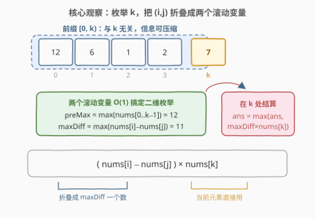
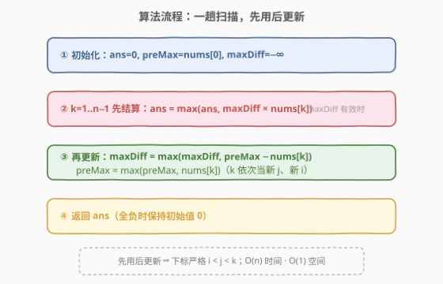
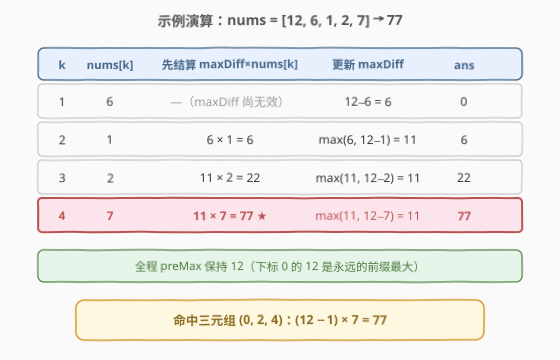

# 有序三元组中的最大值I

- **题目名称**：有序三元组中的最大值 I
- **链接**：[2873. 有序三元组中的最大值 I](https://leetcode.cn/problems/maximum-value-of-an-ordered-triplet-i/)
- **难度**：简单
- **标签**：数组

## 1. 题目概述

给你一个下标从 **0** 开始的整数数组 `nums`。请你从所有满足 $i < j < k$ 的下标三元组 $(i, j, k)$ 中，找出并返回下标三元组的最大值。如果所有满足条件的三元组的值都是负数，则返回 `0`。

**下标三元组** $(i, j, k)$ 的值等于 $(\text{nums}[i] - \text{nums}[j]) \times \text{nums}[k]$。

**示例 1**：

```text
输入：nums = [12,6,1,2,7]
输出：77
解释：下标三元组 (0, 2, 4) 的值是 (nums[0] - nums[2]) * nums[4] = 77。
可以证明不存在值大于 77 的有序下标三元组。
```

**示例 2**：

```text
输入：nums = [1,10,3,4,19]
输出：133
解释：下标三元组 (1, 2, 4) 的值是 (nums[1] - nums[2]) * nums[4] = 133。
可以证明不存在值大于 133 的有序下标三元组。
```

**示例 3**：

```text
输入：nums = [1,2,3]
输出：0
解释：唯一的下标三元组 (0, 1, 2) 的值是一个负数，(nums[0] - nums[1]) * nums[2] = -3。因此，答案是 0。
```

**约束条件**：

- $3 \le \text{nums.length} \le 100$
- $1 \le \text{nums[i]} \le 10^6$

> 💡 本题核心是「**拆解乘积 + 前缀最值滚动维护**」。把 $(\text{nums}[i] - \text{nums}[j]) \times \text{nums}[k]$ 拆成「前缀部分 $\text{nums}[i] - \text{nums}[j]$」与「当前位置 $\text{nums}[k]$」两块独立优化：固定 $k$ 时，前缀差的最大值与 $k$ 无关，可用两个滚动变量 $O(1)$ 维护。这一「枚举一个位置、折叠其余位置为前缀最值」的范式，承接 [2016. 增量元素之间的最大差值](../2001-2100/2016_增量元素之间的最大差值.md) 的前缀最小值维护与 [121. 买卖股票的最佳时机](https://leetcode.cn/problems/best-time-to-buy-and-sell-stock/) 的一趟扫描。

---

## 2. 解题思路

### 2.1 暴力思路：三重循环枚举所有三元组

按定义枚举所有 $i < j < k$，直接计算 $(\text{nums}[i] - \text{nums}[j]) \times \text{nums}[k]$ 取最大值：

```cpp
long long ans = 0;
int n = nums.size();
for (int i = 0; i < n; i++)
    for (int j = i + 1; j < n; j++)
        for (int k = j + 1; k < n; k++)
            ans = max(ans, (long long)(nums[i] - nums[j]) * nums[k]);
```

$n \le 100$ 时约 $10^6$ 次运算，能过。时间 $O(n^3)$，空间 $O(1)$。

> ⚠️ 两个硬伤：① $O(n^3)$ 在姊妹题 [2874. 有序三元组中的最大值 II](https://leetcode.cn/problems/maximum-value-of-an-ordered-triplet-ii/)（$n \le 10^5$）下直接超时；② **必须用 `long long`**——差最大约 $10^6 - 1$，乘上 $10^6$ 后约 $10^{12}$，远超 `int` 上界（约 $2.1 \times 10^9$）。

### 2.2 核心观察：枚举 k，把 (i, j) 折叠成两个滚动变量

关键观察：**固定 $k$ 时，$\text{nums}[i] - \text{nums}[j]$ 的最大值只依赖前缀 $\text{nums}[0..k-1]$，与 $k$ 本身无关**。因此整个三维枚举可以按 $k$ 从左到右一趟扫描，同时维护两个量：

- $\text{preMax} = \max(\text{nums}[0..k-1])$：前缀最大值，即 $i$ 的最优候选；
- $\text{maxDiff} = \max_{i < j < k}(\text{nums}[i] - \text{nums}[j])$：前缀中「前大后小」对子的最大差。

扫描到位置 $k$ 时：

1. **先用**：若 $\text{maxDiff}$ 已有效（前面至少有两个元素），用 $\text{ans} = \max(\text{ans},\ \text{maxDiff} \times \text{nums}[k])$ 结算；
2. **后更新**：让新元素 $\text{nums}[k]$ 入戏——它可以当新的 $j$（配上前缀最大值 $i$），即 $\text{maxDiff} = \max(\text{maxDiff},\ \text{preMax} - \text{nums}[k])$；它也可以当新的 $i$，即 $\text{preMax} = \max(\text{preMax},\ \text{nums}[k])$。

「先用后更新」的顺序天然保证下标严格递增 $i < j < k$。



> 💡 **为什么 $j$ 一定配前缀最大值？** 差 $\text{nums}[i] - \text{nums}[j]$ 要尽量大，$i$ 取前缀最大、$j$ 取当前元素即可覆盖「以 $k$ 为第二个下标」的所有情形——这正是 [2016. 增量元素之间的最大差值](../2001-2100/2016_增量元素之间的最大差值.md) 里「前缀最小值 + 当前元素」的镜像（那题维护 $\min$ 求后减前，本题维护 $\max$ 求前减后）。

### 2.3 算法流程图



**完整步骤**：

1. **初始化**：`ans = 0`（全负时返回 0），`preMax = nums[0]`，`maxDiff = -∞`（尚无合法 (i, j) 对）
2. **遍历** `k = 1 .. n-1`：
   - 若 `maxDiff` 有效：`ans = max(ans, maxDiff * nums[k])`
   - `maxDiff = max(maxDiff, preMax - nums[k])`（k 当新 j）
   - `preMax = max(preMax, nums[k])`（k 当新 i）
3. **返回** `ans`

### 2.4 示例演算

以 `nums = [12,6,1,2,7]` 为例（`maxDiff` 先用于结算，再被更新）：



| k | nums[k] | 先结算 maxDiff×nums[k] | 更新 maxDiff | 更新 preMax | ans |
|---|---------|------------------------|--------------|-------------|-----|
| 1 | 6 | —（maxDiff 尚无效） | $12-6=6$ | 12 | 0 |
| 2 | 1 | $6 \times 1 = 6$ | $\max(6,\ 12-1)=11$ | 12 | 6 |
| 3 | 2 | $11 \times 2 = 22$ | $\max(11,\ 12-2)=11$ | 12 | 22 |
| 4 | 7 | $11 \times 7 = \mathbf{77}$ | $\max(11,\ 12-7)=11$ | 12 | **77** |

最终返回 `77`，对应三元组 $(0, 2, 4)$：$(12 - 1) \times 7 = 77$，与示例 1 一致。

> 💡 示例 3 `[1,2,3]`：$k=1$ 时 $\text{maxDiff} = 1-2 = -1$，$k=2$ 时结算 $-1 \times 3 = -3 < 0$，`ans` 始终为初始值 0——**ans 初始化为 0 且只取 max**，天然满足「全负返回 0」。

---

## 3. 参考代码

### C++

```cpp
class Solution {
public:
    long long maximumTripletValue(vector<int>& nums) {
        long long ans = 0;
        int preMax = nums[0];          // max(nums[0..k-1])，i 的最优候选
        int maxDiff = INT_MIN;         // max(nums[i]-nums[j])，i<j<k
        for (int k = 1; k < (int)nums.size(); k++) {
            if (maxDiff != INT_MIN) {  // 已有合法 (i,j) 对，先结算
                ans = max(ans, (long long)maxDiff * nums[k]);
            }
            maxDiff = max(maxDiff, preMax - nums[k]);  // k 当新 j
            preMax = max(preMax, nums[k]);             // k 当新 i
        }
        return ans;
    }
};
```

### Python

```python
class Solution:
    def maximumTripletValue(self, nums: List[int]) -> int:
        ans = 0
        pre_max, max_diff = nums[0], float('-inf')
        for k in range(1, len(nums)):
            if max_diff != float('-inf'):        # 已有合法 (i,j) 对，先结算
                ans = max(ans, max_diff * nums[k])
            max_diff = max(max_diff, pre_max - nums[k])  # k 当新 j
            pre_max = max(pre_max, nums[k])               # k 当新 i
        return ans
```

> 💡 两版逻辑一致：**一趟扫描 + 两个滚动变量**。C++ 中乘法必须转 `(long long)`（`int × int` 先按 32 位相乘会溢出，转型必须发生在乘法之前）；Python 无溢出问题。`maxDiff` 初始为 $-\infty$ 起两个作用：标记「尚无合法 $(i,j)$ 对」避免提前结算，也让后续 `max` 更新自然生效。

---

## 4. 复杂度分析

| 维度 | 复杂度 | 说明 |
|------|--------|------|
| **时间复杂度** | $O(n)$ | 一趟扫描，每个位置常数次比较与乘法 |
| **空间复杂度** | $O(1)$ | 仅 `ans` / `preMax` / `maxDiff` 三个变量 |

> ⚠️ 对比：暴力 $O(n^3)$ 在本题 $n \le 100$ 能过，但在 $n \le 10^5$ 的 [2874](https://leetcode.cn/problems/maximum-value-of-an-ordered-triplet-ii/) 上约 $10^{15}$ 次运算必然超时；本解法两题通吃。

---

## 5. 扩展：姊妹题 2874 与 O(n²) 中间形态

[2874. 有序三元组中的最大值 II](https://leetcode.cn/problems/maximum-value-of-an-ordered-triplet-ii/) 与本题题面完全相同，仅 $n \le 10^5$，倒逼放弃 $O(n^3)$。介于暴力与 $O(n)$ 之间还有一个常用中间形态——**枚举 (i, j) + 预处理后缀最大值**：

```cpp
class Solution {
public:
    long long maximumTripletValue(vector<int>& nums) {
        int n = nums.size();
        vector<int> sufMax(n + 1, 0);          // sufMax[j] = max(nums[j..n-1])
        for (int j = n - 1; j >= 0; j--) sufMax[j] = max(sufMax[j + 1], nums[j]);
        long long ans = 0;
        int preMax = nums[0];
        for (int j = 1; j < n - 1; j++) {      // 枚举中间的 j
            ans = max(ans, (long long)(preMax - nums[j]) * sufMax[j + 1]);
            preMax = max(preMax, nums[j]);
        }
        return ans;
    }
};
```

- 时间 $O(n)$、空间 $O(n)$（换来了「枚举 j 而非 k」的另一种视角：$i$ 用前缀最大、$k$ 用后缀最大，中间夹 $j$）；
- 该形态与 [1014. 最佳观光组合](https://leetcode.cn/problems/best-sightseeing-pair/) 的拆贡献思路同构：把「与下标有关的和/差」拆成前缀项与当前项分别取最值。

---

## 6. 面试要点

1. **为什么固定 $k$ 时只需维护 $\text{maxDiff}$，不用真的枚举 $(i, j)$？**

   - $\text{nums}[i] - \text{nums}[j]$ 的最大值只由前缀 $\text{nums}[0..k-1]$ 决定，与 $k$ 无关；把它折叠成一个标量 $\text{maxDiff}$ 后，三维问题降为「扫描 $k$ × 常数转移」。这是**无后效性**的体现：前缀信息可完全压缩。

2. **更新顺序为什么必须「先结算、再更新」？**

   - 先更新会让 $\text{nums}[k]$ 同时扮演 $j$ 和 $k$ 两个角色，违反 $i < j < k$ 的严格递增约束。先结算保证了参与乘法的 $\text{maxDiff}$ 只含下标 $< k$ 的元素。

3. **为什么必须用 `long long`？**

   - $\text{nums[i]} \le 10^6$，差上界约 $10^6$，乘积上界约 $10^{12}$，超出 32 位整数范围。C++ 中 `(long long)maxDiff * nums[k]` 的转型要放在乘法**之前**，否则先按 `int` 溢出再转型已经晚了。

4. **`maxDiff` 初始化为 $-\infty$ 而不是 0，有什么讲究？**

   - 一是语义：初始时不存在合法 $(i, j)$ 对，用 $-\infty$ 标记「无效」，避免在 $k=1$ 时错误结算；二是若数组含递增段，真实的最大差可能为负（如示例 3 的 $-1$），初始化为 0 会把这个负信息丢掉，导致 `0 × nums[k]` 的**假结算**抢答成 0——虽然本题恰好返回 0 侥幸不错，但在「值可正可负」的变体里就是 bug。

5. **本题与 121/2016/1014 这一族的共同套路是什么？**

   - 「**一趟扫描 + 前缀最值变量**」：121 维护历史最小买入价、2016 维护前缀最小值求最大差、1014 把得分拆成 $(a_i + i) + (a_j - j)$ 两项分别取最值、本题维护前缀最大差。遇到「固定一个位置、其余位置取最值」的乘积/求和结构，优先想到这种降维折叠。

> 💡 **一句话总结**：2873 是「前缀最值折叠」的入门题——枚举 $k$，用 $\text{preMax}$ 与 $\text{maxDiff}$ 两个滚动变量把 $(i, j)$ 的二维枚举压成 $O(1)$ 转移，一趟扫描 $O(n)$ 时间、$O(1)$ 空间求出最大三元组值。

---

## 7. 同类练习题

- [2874. 有序三元组中的最大值 II](../2801-2900/2874_有序三元组中的最大值II.md)：同题面、$n \le 10^5$ 的姊妹题，暴力必然超时，本题 $O(n)$ 解法直接平移
- [2016. 增量元素之间的最大差值](../2001-2100/2016_增量元素之间的最大差值.md)：前缀最小值 + 当前元素维护最大差，本题「preMax−nums[k]」的二维版基石
- [1014. 最佳观光组合](https://leetcode.cn/problems/best-sightseeing-pair/)：把与下标耦合的得分拆成前缀项 + 当前项分别取最值，拆贡献思想同源
- [121. 买卖股票的最佳时机](https://leetcode.cn/problems/best-time-to-buy-and-sell-stock/)：一趟扫描维护历史最值的开山题，本题维护的是「最大差」而非「最大价」
