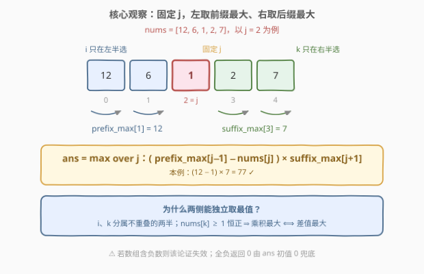
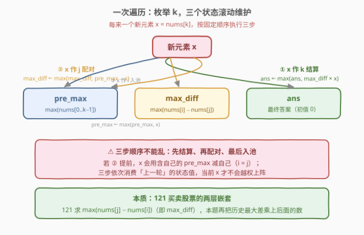
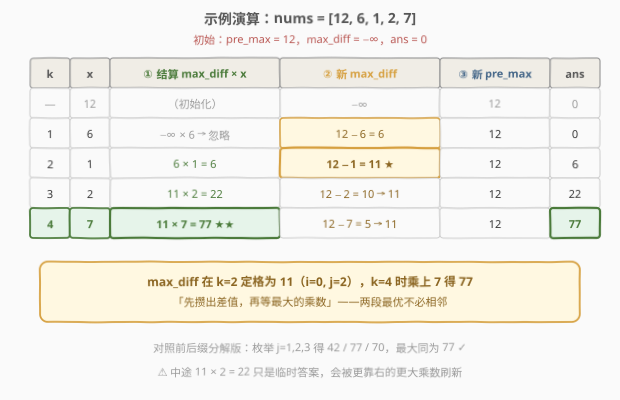

# LeetCode 有序三元组中的最大值 II 题解

## 1. 题目概述

- **标题 / 题号**：有序三元组中的最大值 II（#2874，medium）
- **链接**：https://leetcode.cn/problems/maximum-value-of-an-ordered-triplet-ii/
- **难度**：中等
- **标签**：数组、前后缀分解、一次遍历

**题意**：给你一个下标从 **0** 开始的整数数组 `nums`。

请你从所有满足 $i \lt j \lt k$ 的下标三元组 $(i, j, k)$ 中，找出并返回下标三元组的**最大值**。如果所有满足条件的三元组的值都是负数，则返回 $0$。

**下标三元组** $(i, j, k)$ 的值等于 $(nums[i] - nums[j]) \times nums[k]$。

**示例 1**：

```text
输入：nums = [12,6,1,2,7]
输出：77
解释：下标三元组 (0, 2, 4) 的值是 (nums[0] - nums[2]) * nums[4] = (12 - 1) * 7 = 77。
可以证明不存在值大于 77 的有序下标三元组。
```

**示例 2**：

```text
输入：nums = [1,10,3,4,19]
输出：133
解释：下标三元组 (1, 2, 4) 的值是 (nums[1] - nums[2]) * nums[4] = (10 - 3) * 19 = 133。
```

**示例 3**：

```text
输入：nums = [1,2,3]
输出：0
解释：唯一的三元组 (0, 1, 2) 的值是 (1 - 2) * 3 = -3，为负数，因此返回 0。
```

**约束**：

- $3 \le nums.length \le 10^5$
- $1 \le nums[i] \le 10^6$

> 💡 本题两步走：**固定中间的 $j$**，利用约束 $i \lt j \lt k$ 把三个自由度切成互不干扰的左右两半——左侧取**前缀最大**、右侧取**后缀最大**，$O(n)$ 收工；再把前缀也滚动维护掉，得到 $O(n)$ 时间、$O(1)$ 空间的「嵌套版 121 买卖股票」。⚠️ 乘积最大约 $(10^6-1) \times 10^6 \approx 10^{12}$，必须用 64 位整数。

## 2. 解题思路

### 2.1 暴力思路：三重循环枚举

最直接的做法是枚举全部 $i \lt j \lt k$：

```python
best = 0
for i in range(n):
    for j in range(i + 1, n):
        for k in range(j + 1, n):
            best = max(best, (nums[i] - nums[j]) * nums[k])
```

三重循环 $O(n^3)$：$n = 10^5$ 时约 $1.7 \times 10^{14}$ 次操作，**严重超时**。姐妹题 [2873. 有序三元组中的最大值 I](https://leetcode.cn/problems/maximum-value-of-an-ordered-triplet-i/)（$n \le 100$）可以直接用这个暴力通过，本题把 $n$ 提到 $10^5$，就是逼你降到 $O(n)$。

> ⚠️ 注意「全负返回 0」的语义：`best` 要初始化为 $0$ 而不是 $-\infty$——等价于把「不选任何三元组」视为一个值为 $0$ 的合法选项。

### 2.2 核心观察：固定 j，两侧独立取最值

三元组的值拆成两个因子的乘积：

$$(nums[i] - nums[j]) \times nums[k]$$

**关键**：固定中间的下标 $j$ 后，$i$ 只出现在第一个因子里，$k$ 只出现在第二个因子里，约束 $i \lt j \lt k$ 恰好被劈成互不重叠的两半。又因为 $nums[k] \ge 1$ **恒为正数**，第二个因子非负，所以乘积最大化等价于**两个因子各自最大化**：

$$\text{ans} = \max_{1 \le j \le n-2}\ \big(\,pre\_max[j-1] - nums[j]\,\big) \times suf\_max[j+1]$$

其中 $pre\_max[j-1] = \max(nums[0..j-1])$，$suf\_max[j+1] = \max(nums[j+1..n-1])$。



这就是**前后缀分解**：预处理两张最值表各 $O(n)$，再枚举 $j$ 一遍 $O(n)$ 合并，总时间 $O(n)$、空间 $O(n)$。若第一个因子为负（比如递增数组），乘积必为负，被初值 $0$ 压住，无需特判。

> ⚠️ 「两侧独立取最值」的正确性依赖 $nums[k] \ge 1$ 恒正。若题目允许负数（例如数组含 $-5$），乘负数时要找**最小的** $nums[k]$，「各自取最大」就不再成立——面试中值得主动指出这个隐含前提。

### 2.3 算法流程图：滚动维护，一次遍历 O(1) 空间

换个枚举顺序——按 $k$ 从左到右扫描，把 $i$、$j$ 的信息全部**滚动维护**进两个变量：

- $pre\_max$：目前见过的最大值 $\max(nums[0..k-1])$（候选的 $i$）
- $max\_diff$：目前所有合法对的最大差 $\max_{i \lt j \lt k}(nums[i] - nums[j])$（候选的 $i, j$）

每来一个新元素 $x = nums[k]$，**按固定顺序**执行三步：



1. **结算**：$ans \leftarrow \max(ans,\ max\_diff \times x)$ —— $x$ 充当 $k$
2. **入池做 $j$**：$max\_diff \leftarrow \max(max\_diff,\ pre\_max - x)$ —— $x$ 与历史最大值配对成新的 $(i, j)$
3. **入池做 $i$**：$pre\_max \leftarrow \max(pre\_max,\ x)$ —— $x$ 等待与未来的 $j$ 配对

> ⚠️ 顺序绝对不能乱：必须**先结算、再入池**。若把第 ② 步提前，$x$ 会用「包含自己的 $pre\_max$」去减自己（相当于 $i = j$）；若把第 ③ 步提前，同理会让 $x$ 自己和自己配对。三步依次依赖的是**上一轮**的状态值。

这一结构本质是 [121. 买卖股票的最佳时机](https://leetcode.cn/problems/best-time-to-buy-and-sell-stock/) 的**两层嵌套**：121 一次遍历求出 $\max(nums[j] - nums[i])$（对应 $max\_diff$），本题再把「历史最大差」乘上后面的一个数（第二步 121）。

### 2.4 示例演算

以示例 1 `nums = [12, 6, 1, 2, 7]` 为例，初始 $pre\_max = 12$、$max\_diff = -\infty$、$ans = 0$：



**读表要点**：$max\_diff$ 在 $k=2$ 处定格为 $12 - 1 = 11$（对应 $i=0, j=2$），之后在 $k=4$ 处乘上 $7$ 得到 $77$。中途 $k=3$ 时 $11 \times 2 = 22$ 只是临时答案——**「先攒出差值，再等最大的乘数」**，两段最优不必相邻。

示例 2 `[1,10,3,4,19]` 同理：$max\_diff$ 在 $k=2$ 处变为 $10-3=7$，最终 $7 \times 19 = 133$ ✓。示例 3 `[1,2,3]$ 递增，$max\_diff = 1-2 = -1$ 恒负，任何乘积都上不去，返回初值 $0$ ✓。

## 3. 参考代码

### C++

```cpp
class Solution {
public:
    long long maximumTripletValue(vector<int>& nums) {
        long long ans = 0;
        long long maxDiff = INT_MIN;   // max(nums[i] - nums[j])，i < j < k，可能为负
        int preMax = nums[0];          // max(nums[0..k-1])
        for (int k = 1; k < (int)nums.size(); k++) {
            int x = nums[k];
            ans = max(ans, maxDiff * x);                      // ① x 作 k：先结算
            maxDiff = max(maxDiff, (long long)preMax - x);    // ② x 作 j：配对入池
            preMax = max(preMax, x);                          // ③ x 作 i：最后入池
        }
        return ans;
    }
};
```

### Python

```python
class Solution:
    def maximumTripletValue(self, nums: List[int]) -> int:
        ans = 0
        max_diff = float('-inf')      # max(nums[i] - nums[j])，i < j < k，可能为负
        pre_max = nums[0]             # max(nums[0..k-1])
        for x in nums[1:]:
            ans = max(ans, max_diff * x)          # ① x 作 k：先结算
            max_diff = max(max_diff, pre_max - x)  # ② x 作 j：配对入池
            pre_max = max(pre_max, x)              # ③ x 作 i：最后入池
        return ans
```

> 💡 $max\_diff$ 的初始值必须是「足够小的负数」：C++ 用 `INT_MIN`（约 $-2.1 \times 10^9$，乘 $10^6$ 后约 $-2.1 \times 10^{15}$，仍在 `long long` 范围内）；**千万不要用 `LLONG_MIN`**——它乘上任何 $x \ge 1$ 都会直接溢出 64 位，属于隐形炸弹。Python 的 `float('-inf')` 参与整数乘法得到 $-\infty$，`max` 时自然被淘汰，无此烦恼。

## 4. 复杂度分析

| 维度 | 复杂度 | 说明 |
|------|--------|------|
| **时间复杂度** | $O(n)$ | 单次线性扫描，每个元素常数次比较与乘法 |
| **空间复杂度** | $O(1)$ | 只维护 $pre\_max$、$max\_diff$、$ans$ 三个滚动变量 |

> ⚠️ 乘积上界 $(10^6 - 1) \times 10^6 \approx 10^{12}$，远超 32 位 `int` 的约 $2.1 \times 10^9$，C++ 返回值与中间乘法都必须用 `long long`。

## 5. 扩展：前后缀分解版与暴力对拍

### 5.1 前后缀分解版（O(n) 时间 / O(n) 空间）

直接落实 2.2 节的观察——后缀最值预建数组，前缀最值滚动维护（这也是官方 hints 给出的路线）：

```python
class Solution:
    def maximumTripletValue(self, nums: List[int]) -> int:
        n = len(nums)
        suf_max = [0] * (n + 1)                 # suf_max[n] 作 0 哨兵
        for k in range(n - 1, -1, -1):
            suf_max[k] = max(suf_max[k + 1], nums[k])
        ans = 0
        pre_max = nums[0]
        for j in range(1, n - 1):               # j 需左右两侧都有元素
            ans = max(ans, (pre_max - nums[j]) * suf_max[j + 1])
            pre_max = max(pre_max, nums[j])
        return ans
```

### 5.2 暴力对拍基准（可直接过 2873）

```python
class Solution:
    def maximumTripletValue(self, nums: List[int]) -> int:
        n, best = len(nums), 0
        for i in range(n):
            for j in range(i + 1, n):
                for k in range(j + 1, n):
                    best = max(best, (nums[i] - nums[j]) * nums[k])
        return best
```

面试实战推荐**先写这份暴力**（正确性显然），再用它对拍 $O(n)$ 版本——本文两份代码正是这样验证的（数千组随机数据全部一致）。2874 相对 2873 只是把 $n$ 从 $100$ 提到 $10^5$，逼你完成「三重循环 → 前后缀分解 → 滚动一次遍历」的两级优化。

## 6. 面试要点

1. **为什么固定 $j$ 后两侧可以各自取最大值？**

   - $i$ 只影响因子一、$k$ 只影响因子二，约束 $i \lt j \lt k$ 恰好把候选集劈成不重叠的前缀与后缀；又因 $nums[k] \ge 1$ 恒正，乘积最大化等价于两个因子分别最大化。若数组含负数，此论证失效（负乘数时因子二要取最小），需分类讨论。

2. **$O(1)$ 版本中三步更新的顺序为什么不能交换？**

   - 三步依次消费「上一轮」的状态：先 $ans$（$x$ 作 $k$ 结算），再 $max\_diff$（$x$ 作 $j$，配对的是不含 $x$ 的 $pre\_max$），最后 $pre\_max$（$x$ 作 $i$ 入池）。任何交换都会让 $x$ 与自己配对，等于放宽了 $i \lt j \lt k$ 的约束。

3. **`maxDiff` 初始化为什么不能用 `LLONG_MIN`？**

   - 第一轮结算会计算 $max\_diff \times x$，`LLONG_MIN`（约 $-9.2 \times 10^{18}$）乘任何 $x \ge 1$ 都溢出 `long long`，属于未定义行为。用 `INT_MIN` 则乘积约 $-2.1 \times 10^{15}$，安全且必然被 `max` 淘汰。

4. **「全负返回 0」在代码里如何体现？**

   - `ans` 初始化为 $0$ 且只增不减：任何负的候选值都赢不过初值。语义上等价于允许「不选任何三元组」，其值视为 $0$。

5. **与 121 买卖股票的最佳时机是什么关系？**

   - 121 一次遍历维护「历史最低买入价」求 $\max(nums[j] - nums[i])$，正是本题 $max\_diff$ 的单层版；本题再让「历史最大差」乘上后续元素，相当于 121 套 121 的两层嵌套。42 接雨水则是前后缀最值分解的另一经典应用（两侧最值取 min 算水位）。

> 💡 **一句话总结**：固定 $j$ 把三元组劈成左右两半，两侧独立取最值得 $O(n)$ 前后缀分解；再把前缀信息滚动进 $pre\_max$ / $max\_diff$ 两个变量，先结算、再入池，一次遍历 $O(1)$ 空间收工——本质是嵌了两层的 121。

## 同类练习题

| # | 题目 | 与本题的关联 |
|---|------|-------------|
| 2873 | [有序三元组中的最大值 I](https://leetcode.cn/problems/maximum-value-of-an-ordered-triplet-i/) | 同一题面的小数据版（$n \le 100$），$O(n^3)$ 暴力可过，可作本题的对拍基准 |
| 121 | [买卖股票的最佳时机](../0101-0200/121_买卖股票的最佳时机.md) | 一次遍历维护历史最值求最大差，正是本题 `max_diff` 的单层版 |
| 1014 | [最佳观光组合](https://leetcode.cn/problems/best-sightseeing-pair/) | 拆式子 $values[i] + i + values[j] - j$ 后滚动维护 $values[i]+i$ 历史最大，与本题「枚举右端、滚动维护左侧最优」同套路 |
| 2016 | [增量元素之间的最大差值](https://leetcode.cn/problems/maximum-difference-between-increasing-elements/) | 维护前缀最小值最大化 $nums[j] - nums[i]$，掌握后本题只是再多乘一个后缀最大值 |
| 42 | [接雨水](../0001-0100/42_接雨水.md) | 前后缀最值分解的招牌应用，与 2.2 节的拆分思想同源 |
