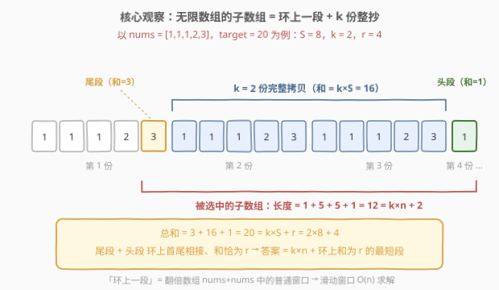
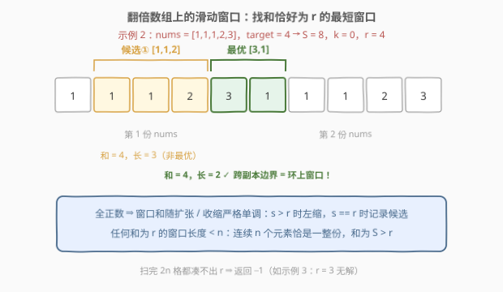
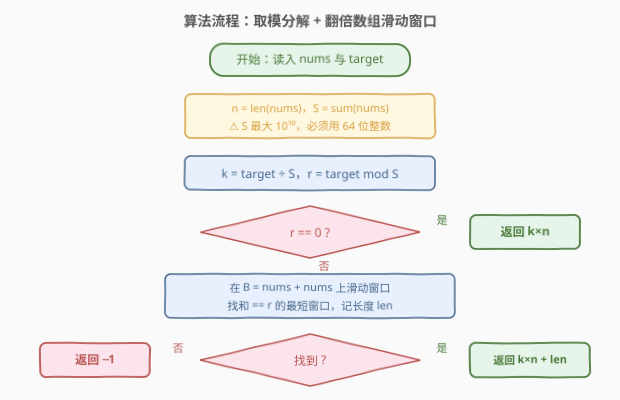

# 无限数组的最短子数组

- **题目名称**：无限数组的最短子数组
- **链接**：[2875. 无限数组的最短子数组](https://leetcode.cn/problems/minimum-size-subarray-in-infinite-array/)
- **难度**：中等
- **标签**：数组、前缀和、滑动窗口、哈希表

## 1. 题目概述

给你一个下标从 **0** 开始的数组 `nums` 和一个整数 `target`。

下标从 **0** 开始的数组 `infinite_nums` 是通过无限地将 `nums` 的元素追加到自己之后生成的。

请你从 `infinite_nums` 中找出满足**元素和**等于 `target` 的**最短**子数组，并返回该子数组的长度。如果不存在满足条件的子数组，返回 `-1`。

**示例 1**：

```text
输入：nums = [1,2,3], target = 5
输出：2
解释：infinite_nums = [1,2,3,1,2,3,1,2,...]，区间 [1,2] 内的子数组元素和等于 5，长度 2 最短。
```

**示例 2**：

```text
输入：nums = [1,1,1,2,3], target = 4
输出：2
解释：infinite_nums = [1,1,1,2,3,1,1,...]，区间 [4,5]（即元素 3,1）元素和等于 4，长度 2 最短。
```

**示例 3**：

```text
输入：nums = [2,4,6,8], target = 3
输出：-1
解释：不存在元素和等于 3 的子数组。
```

**约束条件**：

- $1 \le \text{nums.length} \le 10^5$
- $1 \le \text{nums}[i] \le 10^5$
- $1 \le \text{target} \le 10^9$

> 💡 本题核心是「**周期分解 + 环形滑动窗口**」。关键词「无限数组」「元素和恰好等于 target」「最短」——无限数组无限长没法直接枚举，但它是**周期为 $n$** 的循环结构，元素又**全是正数**。突破口：把 $target$ 按「一份总和 $S$」做带余除法，将无限问题压缩回长度 $2n$ 的有限数组，再用滑动窗口收尾。

---

## 2. 解题思路

### 2.1 暴力思路：直接在无限数组上滑窗

所有元素 $\ge 1$，窗口和随长度严格递增——最直接的想法是在 `infinite_nums` 上跑经典滑动窗口：右端点不断右移，和超过 `target` 就收缩左端点。

> ⚠️ 问题在于右端点要走多远：极端情况 `nums` 全为 1、$n = 10^5$、$\text{target} = 10^9$ 时，凑够和 $10^9$ 需要窗口吞下 $10^9$ 个元素，右端点要前进 $10^9$ 步，直接超时。**无限数组不能硬扫，必须先做数学分解。**

但这个思路揭示了两条关键性质，后面全部要用：

1. **正数性** ⇒ 窗口和关于左右端点严格单调（滑动窗口的命根子）；
2. 子数组和只与「吞下的元素」有关，而无限数组以 $n$ 为周期——**周期性才是压缩规模的钥匙**。

### 2.2 核心观察：target = k·S + r 分解 → 环上最短窗口

记 $n = \text{len(nums)}$，$S = \sum \text{nums}[i]$（一份的周期和）。对 `target` 做带余除法：

$$\text{target} = k \cdot S + r,\qquad k = \lfloor \text{target} / S \rfloor,\ r = \text{target} \bmod S$$

**引理 1（结构分解）**：`infinite_nums` 的任意子数组 $A$ 都可以写成

$$A = \underbrace{\text{某份的尾段}}_{\text{和} = a} + \underbrace{m \text{ 份完整拷贝}}_{\text{和} = m \cdot S} + \underbrace{\text{某份的头段}}_{\text{和} = b}$$

其中尾段、头段各自**不满一份**（长度 $< n$）。尾段和头段首尾相接，恰好构成**环 `nums` 上的一段**。

**引理 2（整份数只能是 $k$ 或 $k-1$）**：由 $\text{sum}(A) = \text{target}$ 得 $a + b = \text{target} - mS$。而 $a < S,\ b < S$（各自不满一份）⇒ $a + b < 2S$，于是 $m \ge k - 1$；又 $a + b \ge 0$ ⇒ $m \le k$。两种取值：

| 情形 | 环上段和 | 子数组长度 | 与最优解比较 |
|------|----------|------------|--------------|
| $m = k$ | $a + b = r$ | $k \cdot n + \text{环段长}$ | **最优形态**：最小化环段长即可 |
| $m = k - 1$ | $a + b = S + r > S$ | 环上段必然覆盖超过一整圈，等价于「多绕一整圈（$n$ 个元素）+ 一段和为 $r$ 的环段」$= k \cdot n + \text{环段长}$ | 不会更短 |

于是得到**答案公式**：

$$\text{ans} = k \cdot n + \underbrace{\minlen(r)}_{\text{环上和恰为 } r \text{ 的最短段}}\qquad (r > 0)$$

$r = 0$ 时答案就是 $k \cdot n$（恰好整份拼接，环上段为空）。



**引理 3（环 → 翻倍数组）**：环上一段怎么求？和为 $r < S$ 的环段长度必 $< n$（任意连续 $n$ 个元素恰是一整份，和为 $S > r$）。把 `nums` 拼成**翻倍数组** $B = \text{nums} + \text{nums}$（长 $2n$），则「环上一段」与「$B$ 中长度 $< n$ 的普通窗口」一一对应——不跨边界的环段是 $B$ 前半的普通子数组，跨边界的环段（尾段 + 头段）恰好横跨 $B$ 的正中间。

最后，因为元素**全为正**，$B$ 上的窗口和具有单调性，「和恰好等于 $r$ 的最短窗口」用一次标准滑动窗口即可：$s > r$ 时收缩左端点，$s == r$ 时记录候选。固定右端点时和为 $r$ 的窗口唯一，收缩停在「和 $\le r$ 的最长窗口」处，不会漏解。



> 💡 一句话：**无限数组的任何子数组 = 环上一段 + 若干整份；最优解恰好含 $k$ 份整抄 + 一段和为 $r$ 的环段；环段去翻倍数组上滑窗找。** 三个"无限"陷阱（起点无限、长度无限、环绕跨边界）分别被「环上段」「$k$ 份整抄」「翻倍数组」化解。

### 2.3 算法流程图



**完整步骤**：

1. **计算** $n = \text{len(nums)}$、$S = \sum \text{nums}[i]$（$S$ 最大 $10^{10}$，64 位整数）
2. **分解** $k = \lfloor \text{target} / S \rfloor$，$r = \text{target} \bmod S$
3. **判断**：若 $r = 0$，直接返回 $k \cdot n$
4. **滑窗**：在翻倍数组上（用 `i % n` 环形索引，免得真开 $2n$ 空间）扫 $2n$ 格，维护和 $s$；$s > r$ 左缩，$s == r$ 记录最短窗口长 $\text{len}$
5. **返回**：找到则 $k \cdot n + \text{len}$，否则 $-1$

### 2.4 示例演算

以示例 2 `nums = [1,1,1,2,3]`，`target = 4` 为例：$S = 8$，$k = 0$，$r = 4$，翻倍数组 $B = [1,1,1,2,3,1,1,1,2,3]$：

| right | 入窗 $B[r]$ | 收缩动作 | 收缩后窗口 | 窗口和 $s$ | 命中 $r = 4$？ |
|-------|-------------|----------|------------|-----------|----------------|
| 0 | 1 | — | $[1]$ | 1 | |
| 1 | 1 | — | $[1,1]$ | 2 | |
| 2 | 1 | — | $[1,1,1]$ | 3 | |
| 3 | 2 | 弹出 1 | $[1,1,2]$ | 4 | ✓ 长 3 |
| 4 | 3 | 弹出 1,1,2 | $[3]$ | 3 | |
| 5 | 1 | — | $[3,1]$ | 4 | ✓ **长 2 ★** |
| 6 | 1 | 弹出 3 | $[1,1]$ | 2 | |
| 7 | 1 | — | $[1,1,1]$ | 3 | |
| 8 | 2 | 弹出 1 | $[1,1,2]$ | 4 | ✓ 长 3 |
| 9 | 3 | 弹出 1,1,2 | $[3]$ | 3 | |

最短窗口长 $2$，答案 $= k \cdot n + 2 = 0 + 2 = 2$ ✓。注意最优窗口 $[3,1]$ **恰好跨在两份的边界上**（第一份的尾巴 3 + 第二份的开头 1）——这正是「环上一段」的体现，也是必须扫翻倍数组、只在一份里找会错失的原因。

再用其余示例复核：

- 示例 1：`nums = [1,2,3]`，`target = 5` → $k = 0$，$r = 5$，$B$ 中窗口 $[2,3]$ 长 2 → 答案 2 ✓
- 示例 3：`nums = [2,4,6,8]`，`target = 3` → $r = 3 < 2$（最小元素），全扫无窗口 → $-1$ ✓
- $k > 0$ 的例子：`nums = [1,2,3]`，`target = 17` → $S = 6$，$k = 2$，$r = 5$ → 答案 $= 2 \times 3 + 2 = 8$，即 $[1,2,3,1,2,3,2,3]$（$6 + 6 + 5 = 17$）✓

---

## 3. 参考代码

### C++

```cpp
class Solution {
public:
    int minSizeSubarray(vector<int>& nums, int target) {
        int n = nums.size();
        long long total = accumulate(nums.begin(), nums.end(), 0LL); // S ≤ 1e10，64 位
        long long k = target / total, r = target % total;
        if (r == 0) return (int)(k * n);        // 恰好整份拼接

        long long ans = LLONG_MAX, left = 0, s = 0;
        for (int right = 0; right < 2 * n; right++) {  // 环形索引扫“翻倍数组”
            s += nums[right % n];
            while (s > r) {                     // 全正数：收缩必能停
                s -= nums[left % n];
                left++;
            }
            if (s == r)                         // 以 right 结尾的唯一候选
                ans = min(ans, (long long)right - left + 1);
        }
        return ans == LLONG_MAX ? -1 : (int)(k * n + ans);
    }
};
```

### Python

```python
class Solution:
    def minSizeSubarray(self, nums: List[int], target: int) -> int:
        n = len(nums)
        total = sum(nums)
        k, r = divmod(target, total)
        if r == 0:                          # 恰好整份拼接
            return k * n

        ans, left, s = float('inf'), 0, 0
        for right in range(2 * n):          # 环形索引扫“翻倍数组”
            s += nums[right % n]
            while s > r:                    # 全正数：收缩必能停
                s -= nums[left % n]
                left += 1
            if s == r:                      # 以 right 结尾的唯一候选
                ans = min(ans, right - left + 1)
        return -1 if ans == float('inf') else k * n + ans
```

> 💡 两版逻辑完全一致。两个实现细节：① 不真正构造 $2n$ 长的翻倍数组，用 `i % n` 环形索引，空间 $O(1)$；② `while (s > r)` 在 $r \ge 1$、元素全正时收缩必终止（窗口弹空则 $s = 0 < r$），不会越界弹出不存在的元素。

---

## 4. 复杂度分析

| 维度 | 复杂度 | 说明 |
|------|--------|------|
| **时间复杂度** | $O(n)$ | 右端点扫 $2n$ 格；`left` 全程只前进，均摊每格 $O(1)$，总计 $O(n)$；取模分解 $O(1)$ |
| **空间复杂度** | $O(1)$ | 环形索引代替显式翻倍数组，只用常数个变量 |

> ⚠️ 对比 2.1 的暴力滑窗：元素全 1、$\text{target} = 10^9$ 时要走 $10^9$ 步；取模分解后无论 `target` 多大，都只扫 $2n \le 2 \times 10^5$ 格——这就是「把无限问题压缩回周期结构」的价值。

---

## 5. 扩展：前缀和 + 哈希表版

官方 hints 给出的另一条路：「和恰好等于 $r$ 的最短子数组」也可以用**前缀和 + 哈希表**求：子数组 $(i, j]$ 的和为 $r \iff \text{pre}[j] - \text{pre}[i] = r$。对每个 $j$，想让窗口最短，就要找**最大的** $i$ 满足 $\text{pre}[i] = \text{pre}[j] - r$——哈希表存每个前缀和**最后出现**的下标即可。

```cpp
class Solution {
public:
    int minSizeSubarray(vector<int>& nums, int target) {
        int n = nums.size();
        long long total = accumulate(nums.begin(), nums.end(), 0LL);
        long long k = target / total, r = target % total;
        if (r == 0) return (int)(k * n);

        unordered_map<long long, int> last;   // 前缀和 → 最后出现的下标
        last[0] = -1;
        long long ans = LLONG_MAX, s = 0;
        for (int j = 0; j < 2 * n; j++) {
            s += nums[j % n];
            auto it = last.find(s - r);
            if (it != last.end()) ans = min(ans, (long long)j - it->second);
            last[s] = j;                      // 覆盖为最新下标 → 窗口最短
        }
        return ans == LLONG_MAX ? -1 : (int)(k * n + ans);
    }
};
```

```python
class Solution:
    def minSizeSubarray(self, nums: List[int], target: int) -> int:
        n = len(nums)
        total = sum(nums)
        k, r = divmod(target, total)
        if r == 0:
            return k * n

        last = {0: -1}                    # 前缀和 → 最后出现的下标
        ans, s = float('inf'), 0
        for j in range(2 * n):
            s += nums[j % n]
            if s - r in last:
                ans = min(ans, j - last[s - r])
            last[s] = j                   # 覆盖为最新下标 → 窗口最短
        return -1 if ans == float('inf') else k * n + ans
```

时间 $O(n)$、空间 $O(n)$。它与滑动窗口版的分工：**滑动窗口**依赖全正数带来的单调性，$O(1)$ 空间；**前缀和 + 哈希**不依赖元素符号（含零、负数也能找「和恰好等于 $r$」的窗口），代价是 $O(n)$ 空间。这组对偶在 [560. 和为K的子数组](https://leetcode.cn/problems/subarray-sum-equals-k/)（计数版）与 [209. 长度最小的子数组](https://leetcode.cn/problems/minimum-size-subarray-sum/)（$\ge$ 目标版）中同样成立。

---

## 6. 面试要点

1. **为什么最优解恰好包含 $k$ 份完整拷贝？**

   - 设子数组含 $m$ 份整抄、环上段和为 $a + b$。由 $a, b < S$ 知 $a + b < 2S$，代入 $\text{sum} = \text{target}$ 得 $m \in \{k-1, k\}$。$m = k$ 时环上段和恰为 $r$，长度 $k \cdot n + \text{环段长}$；$m = k-1$ 时环上段和为 $S + r$，必然覆盖超过一整圈，等价于「一整圈（$n$ 个元素）+ 一段和为 $r$ 的环段」，长度仍 $\ge k \cdot n + \minlen(r)$，不会更优。故两者归一，取环段最短即可。

2. **为什么翻倍数组（$2n$ 个元素）就够，不用三份？**

   - 和为 $r < S$ 的环段长度必 $< n$（连续 $n$ 个元素恰是一整份，和为 $S > r$）。长度 $< n$ 的环段无论是「不跨边界」还是「尾段 + 头段跨边界」，都能在 `nums + nums` 中找到一个不越界的普通窗口表示；反过来 $B$ 中任意窗口也是无限数组的合法子数组。一一对应，两份足矣。

3. **$r = 0$ 时为什么直接返回 $k \cdot n$，会不会有更短的？**

   - 和为 $k \cdot S$ 的子数组若含 $m$ 份整抄，环上段和为 $(k - m)S$。$m = k$ 时空段，长度 $k \cdot n$；$m = k - 1$ 时环上段恰覆盖一整圈、长度 $n$，总长仍为 $k \cdot n$；$m \le k - 2$ 时要求 $a + b \ge 2S$，与 $a + b < 2S$ 矛盾。所以 $k \cdot n$ 既是下界又可达。

4. **溢出怎么防？**

   - $S \le 10^5 \times 10^5 = 10^{10}$，超出 `int` 范围，C++ 必须 `long long` 存 $S$ 及中间量。最终答案 $k \cdot n \le \text{target} \le 10^9$（因为每个元素 $\ge 1$ ⇒ $S \ge n$ ⇒ $k \le \text{target}/n$），返回 `int` 安全，但中间乘法仍建议在 64 位里做。

5. **滑动窗口为什么不会漏掉任何「和恰好为 $r$」的窗口？**

   - 全正数下，固定右端点时窗口和随左端点左移严格增大，所以和为 $r$ 的窗口（若存在）对固定右端点**唯一**。收缩循环停在「和 $\le r$ 的最长窗口」处；若存在和恰为 $r$ 的窗口，它就是该最长窗口，必被 `s == r` 捕获。

> 💡 **一句话总结**：带余除法 $\text{target} = k \cdot S + r$ 把无限数组压回有限——$k$ 份整抄贡献 $k \cdot n$ 的长度底座，剩余 $r$ 去翻倍数组 `nums + nums` 上滑动窗口找「和恰好等于 $r$」的最短段；找不到就 $-1$。全程 $O(n)$ 时间、$O(1)$ 空间。

---

## 7. 同类练习题

- [209. 长度最小的子数组](../0201-0300/209_长度最小的子数组.md)：同款正数滑动窗口，条件从「和 $\ge$ target」换成「和恰好 $= r$」，单调性都是正确性命根子
- [560. 和为K的子数组](../0501-0600/560_和为K的子数组.md)：前缀和 + 哈希数「和恰为 k」的子数组个数，第 5 节哈希写法即它的最短窗口版
- [862. 和至少为K的最短子数组](../0801-0900/862_和至少为K的最短子数组.md)：元素可负 → 窗口单调性失效，滑窗升级为前缀和 + 单调队列，对照理解单调性的价值
- [918. 环形子数组的最大和](../0901-1000/918_最大环形子数组和.md)：同把环形问题拉直到翻倍/拆解数组处理，与本题「环上一段」的映射手法同源
- [974. 和可被K整除的子数组](../0901-1000/974_和可被K整除的子数组.md)：前缀和按模分组的思想，与本题 $\text{target} \bmod S$ 的周期分解同源
