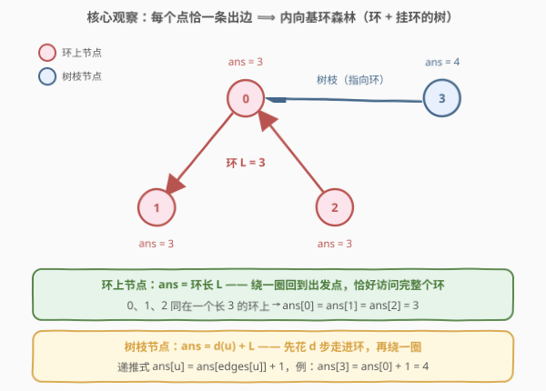
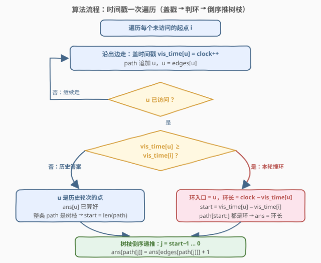
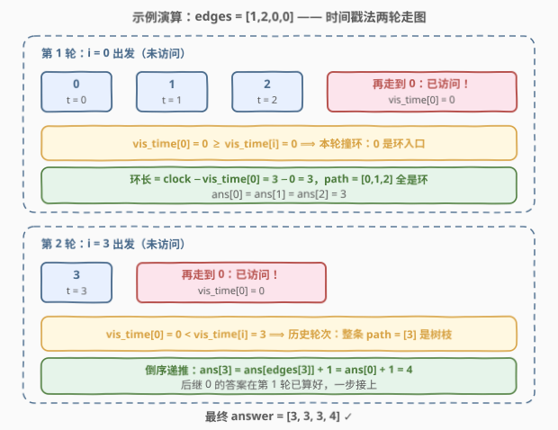

# LeetCode 有向图访问计数 题解

## 1. 题目概述

- **标题 / 题号**：有向图访问计数（#2876，hard）
- **链接**：https://leetcode.cn/problems/count-visited-nodes-in-a-directed-graph/
- **难度**：困难
- **标签**：图、深度优先搜索、拓扑排序、记忆化搜索、动态规划

**题意**：现有 $n$ 个节点的有向图，节点编号 $0$ 到 $n-1$，图中恰好包含 $n$ 条有向边。给定下标从 **0** 开始的数组 `edges`，`edges[i]` 表示存在一条从节点 $i$ 到节点 `edges[i]` 的边。

想象在图上发生以下过程：你从节点 $x$ 开始，通过边访问其他节点，直到你在**此过程中**再次访问到之前已经访问过的节点。

返回数组 `answer` 作为答案，其中 `answer[i]` 表示如果从节点 $i$ 开始执行该过程，可以访问到的**不同**节点数。

**示例 1**：

```text
输入：edges = [1,2,0,0]
输出：[3,3,3,4]
解释：
- 从节点 0 开始，访问节点 0 -> 1 -> 2 -> 0。访问的不同节点数是 3。
- 从节点 1 开始，访问节点 1 -> 2 -> 0 -> 1。访问的不同节点数是 3。
- 从节点 2 开始，访问节点 2 -> 0 -> 1 -> 2。访问的不同节点数是 3。
- 从节点 3 开始，访问节点 3 -> 0 -> 1 -> 2 -> 0。访问的不同节点数是 4。
```

**示例 2**：

```text
输入：edges = [1,2,3,4,0]
输出：[5,5,5,5,5]
解释：无论从哪个节点开始，都可以访问到图中的每一个节点。
```

**约束**：

- $n = \text{edges.length}$
- $2 \le n \le 10^5$
- $0 \le \text{edges}[i] \le n-1$
- $\text{edges}[i] \ne i$（保证无自环）

> ⚠️ 两条关键线索：其一，$n$ 个节点配 $n$ 条边，且**每个节点的出度恰好为 1**——这不是一般的图，是「函数图」（functional graph），即**内向基环森林**；其二，$n$ 最大 $10^5$，从每个点独立模拟一遍是 $O(n^2)$，必然超时。结构（基环）+ 规模（线性要求）指向同一条路：**先认清基环结构，再让答案沿结构流动**。

## 2. 解题思路

### 2.1 暴力思路：每个点各自模拟

对每个起点 $i$，老老实实沿 `edges` 走，用集合记录访问过的节点，撞到重复节点为止，集合大小即 `answer[i]`。单次最坏走 $O(n)$ 步，总计 $O(n^2)$，$n = 10^5$ 时约 $10^{10}$ 次操作，超时。

> ⚠️ 暴力法的硬伤：**同一个连通分量里，不同起点的路径高度重叠**——从树枝上的点出发，就是「从环上某点出发的路径」前面拼一小段。每个点都独立重走一遍，做了海量重复功。破解之道是让已算出的答案**被后来的起点复用**：一旦认清图的形状，答案根本不需要「走」出来，可以直接**推**出来。

### 2.2 核心观察：内向基环森林——环上是环长，树枝是「距离 + 环长」



**观察一：每个连通分量恰有一个环，其余节点挂在环上指向环**。每个节点出度恰为 1，从任意节点沿出边走，由鸽巢原理 $n+1$ 步内必重访某个节点，首次重访的节点集构成一个环；不在环上的节点最终都汇入环。图整体构成若干棵「**内向基环树**」（环 + 指向环的树枝）的森林。`edges[i] != i` 只排除了长度 1 的自环，环长至少为 2。

**观察二：答案由「环」和「到环的距离」完全决定**。从任何节点出发，都会沿出边走到所在分量的环上，然后绕环一圈回到出发点后停止。于是：

$$\text{answer}(u) = \begin{cases} L & u \text{ 在环上（环长 } L\text{）} \\ d(u) + L & u \text{ 在树枝上（} d(u) \text{ = 沿出边走到环的步数）} \end{cases}$$

环上任意点出发都是绕完整个环回到自己，访问的正是全部 $L$ 个环节点；树枝上的点先花 $d(u)$ 步「进环」，之后与环上起点无异。示例 1 中环 $\{0,1,2\}$ 长 3，节点 3 距环 1 步，故 `answer = [3,3,3,4]`。

**观察三：答案可以沿出边一步递推**。树枝节点 $u$ 走一步到 `edges[u]`，之后的旅程与从 `edges[u]` 出发完全相同，只多看一个节点 $u$ 自己：

$$\text{ans}[u] = \text{ans}[\text{edges}[u]] + 1$$

**前提是后继的答案已经算好**。环上节点的答案不依赖分量外任何点（整环一起算出 $L$）；树枝节点的答案依赖更靠近环的后继。这给出了处理顺序：**先定环，再从环向外倒序推树枝**。

> 💡 注意一个易错直觉：答案**不等于**所在连通分量的大小。示例 1 的分量大小是 4，但节点 0 的答案是 3——绕环一圈回到自己即停止，树枝上的节点（如 3）根本不会被访问到。能被访问到的恰好是「自己进环路径 + 整个环」。

### 2.3 算法流程图：时间戳一次遍历



如何在一次扫描里既找出环、又把树枝答案倒序推好？——**时间戳法**：

- 维护全局时钟 `clock`（只增不减），`vis_time[u]` 记录节点 $u$ **首次**被盖戳的时刻；
- 从任一未访问节点 $i$ 出发沿出边走，边走边盖戳、把节点追加进本轮路径 `path`，直到撞上**已盖戳**的节点 $u$；
- **关键判定**：比较 `vis_time[u]` 与本轮起点的时间戳 `vis_time[i]`——
  - 若 `vis_time[u] ≥ vis_time[i]`：$u$ 是**本轮**盖的戳 ⟹ 本轮路径绕回了自己，$u$ 就是**环入口**。环长 $= \text{clock} - \text{vis\_time}[u]$，`path` 中从下标 $\text{vis\_time}[u] - \text{vis\_time}[i]$（即 $u$ 在 `path` 中的位置）到末尾的整段都是环，直接赋环长；
  - 否则：$u$ 是**历史轮次**的戳 ⟹ 本轮整条 `path` 都是树枝，$u$ 的答案早已算好；
- 最后把 `path` 的**树枝部分倒序**递推：`ans[path[j]] = ans[edges[path[j]]] + 1`。

> ⚠️ **两个正确性要点**：其一，`clock` 全局单调递增，本轮从 $i$ 出发、$i$ 是本轮第一个盖戳的点，故本轮所有戳 $\ge \text{vis\_time}[i]$、历史轮次的戳严格更小——一个整数比较就能区分「撞环」与「撞历史」，这是该法最精妙处；其二，倒序递推时每个点的后继要么在环上（已赋值）、要么是**更靠近环**的树枝点（倒序保证先被处理），一步接一步永不断链。

### 2.4 示例演算

以示例 1 `edges = [1,2,0,0]` 为例，两轮走图：



**第 1 轮（$i=0$）**：走 $0 \to 1 \to 2$，依次盖戳 $t=0,1,2$，`path = [0,1,2]`；再走一步回到 $0$，已访问且 $\text{vis\_time}[0] = 0 \ge \text{vis\_time}[0] = 0$ ⟹ 本轮撞环，$0$ 是环入口。环长 $= 3 - 0 = 3$，环入口在 `path` 的下标 $0 - 0 = 0$，整条 `path` 都是环 ⟹ `ans[0]=ans[1]=ans[2]=3`，无树枝可推。

**第 2 轮（$i=3$）**：走 $3$ 盖戳 $t=3$，`path = [3]`；再走一步到 $0$，已访问且 $\text{vis\_time}[0] = 0 < \text{vis\_time}[3] = 3$ ⟹ 历史轮次，整条 `path` 是树枝。倒序递推：$\text{ans}[3] = \text{ans}[\text{edges}[3]] + 1 = \text{ans}[0] + 1 = 4$。

最终 `answer = [3,3,3,4]` ✓。

> 💡 换个视角看第 2 轮：它就是「暴力法重走一遍」的极简版——只走了 1 步就撞上算好的答案，剩余旅程被 $O(1)$ 的递推整体买断。整张图上每个节点只被盖一次戳、至多参与一次递推， $O(n)$ 收工。

## 3. 参考代码

### C++

```cpp
class Solution {
  public:
    vector<int> countVisitedNodes(vector<int>& edges) {
        int n = edges.size();
        vector<int> ans(n), visTime(n, -1);   // visTime: 首次访问的全局时间戳
        int clock = 0;
        for (int i = 0; i < n; ++i) {
            if (visTime[i] != -1) continue;   // 已被之前轮次处理过
            vector<int> path;
            int u = i;
            while (visTime[u] == -1) {        // 沿出边走，边走边盖戳
                visTime[u] = clock++;
                path.push_back(u);
                u = edges[u];
            }
            int start;
            if (visTime[u] >= visTime[i]) {   // u 是本轮盖的戳 → 环入口
                int cycleLen = clock - visTime[u];
                start = visTime[u] - visTime[i];      // u 在 path 中的下标
                for (int j = start; j < (int)path.size(); ++j)
                    ans[path[j]] = cycleLen;  // 尾段是环，直接赋环长
            } else {
                start = path.size();          // 历史轮次 → 整条 path 是树枝
            }
            for (int j = start - 1; j >= 0; --j)          // 树枝倒序递推
                ans[path[j]] = ans[edges[path[j]]] + 1;   // 后继必已就绪
        }
        return ans;
    }
};
```

### Python

```python
class Solution:
    def countVisitedNodes(self, edges: List[int]) -> List[int]:
        n = len(edges)
        ans = [0] * n
        vis_time = [-1] * n                    # 首次访问的全局时间戳
        clock = 0
        for i in range(n):
            if vis_time[i] != -1:              # 已被之前轮次处理过
                continue
            path = []
            u = i
            while vis_time[u] == -1:           # 沿出边走，边走边盖戳
                vis_time[u] = clock
                clock += 1
                path.append(u)
                u = edges[u]
            if vis_time[u] >= vis_time[i]:     # u 是本轮盖的戳 → 环入口
                cycle_len = clock - vis_time[u]
                start = vis_time[u] - vis_time[i]   # u 在 path 中的下标
                for v in path[start:]:         # 尾段是环，直接赋环长
                    ans[v] = cycle_len
            else:                              # 历史轮次 → 整条 path 是树枝
                start = len(path)
            for j in range(start - 1, -1, -1):     # 树枝倒序递推
                ans[path[j]] = ans[edges[path[j]]] + 1  # 后继必已就绪
        return ans
```

> 💡 两版逻辑一致。三个实现细节：**其一**，环入口下标 $=$ `vis_time[u] − vis_time[i]`，因为本轮第 $j$ 个盖戳的点时间戳恰为 `vis_time[i] + j`；**其二**，`path` 是单轮局部变量，各轮路径互不相交（起点只挑未盖戳的），无需清空复用；**其三**，全程没有递归、没有显式建图（出边就是 `edges[u]` 本身），链形树枝再长也不怕爆栈。

## 4. 复杂度分析

| 维度 | 复杂度 | 说明 |
|------|--------|------|
| **时间复杂度** | $O(n)$ | 每个节点恰好被盖戳一次；各轮 `path` 互不相交，倒序递推总次数 $\le n$ |
| **空间复杂度** | $O(n)$ | `vis_time`、`ans` 各 $O(n)$，单轮 `path` 最坏 $O(n)$ |

## 5. 扩展：拓扑排序「剥叶子」写法，与记忆化 DFS 的坑

**拓扑排序剥叶子**是另一条等价路线：环上节点「人人有入边」，树枝外端「无人指向」。统计**入度**，把入度为 0 的节点当「叶子」不断剥离（剥掉后其后继入度减一），剥不动的节点全体就是**所有环**；对每个环沿边走一圈取环长；最后按**剥离的逆序**递推 `ans[u] = ans[edges[u]] + 1`：

```python
class Solution:
    def countVisitedNodes(self, edges: List[int]) -> List[int]:
        from collections import deque
        n = len(edges)
        indeg = [0] * n
        for v in edges:
            indeg[v] += 1
        q = deque(i for i in range(n) if indeg[i] == 0)
        order = []
        while q:                          # 剥掉所有树枝（入度归零才入队）
            u = q.popleft()
            order.append(u)
            indeg[edges[u]] -= 1
            if indeg[edges[u]] == 0:
                q.append(edges[u])
        ans = [0] * n
        for i in range(n):                # 剩余入度 > 0 的都在环上
            if indeg[i] and ans[i] == 0:
                u, cycle = i, []
                while True:
                    cycle.append(u)
                    u = edges[u]
                    if u == i:
                        break
                for v in cycle:
                    ans[v] = len(cycle)
        for u in reversed(order):         # 剥离逆序 = 从环向外
            ans[u] = ans[edges[u]] + 1
        return ans
```

剥离逆序为何正确：节点 $u$ 被剥时其后继 `edges[u]` 必然**尚未被剥**（要么在环上永不被剥，要么因可能还有其他入边而排在 $u$ 之后），逆序处理到 $u$ 时后继答案已就绪。此法与 802 题「反向拓扑剥出安全节点」互为镜像。

**为什么不能朴素记忆化 DFS**：递推式 `ans[u] = ans[edges[u]] + 1` 沿出边递归，环上节点互相依赖、没有递归出口，直接无限递归；必须**先破环**（先算出整环答案）再谈递推。此外 $n = 10^5$ 的链形树枝递归深度同样会压垮 C++ 默认栈（约 1 MB）与 Python 默认递归上限（1000 层）——本题两版参考代码均为迭代写法，一次 `while` 走完路径，天然免疫。

## 6. 面试要点

1. **为什么图一定是「环 + 挂环的树」？**

   - 每个节点出度恰为 1，沿出边走 $n+1$ 步访问 $n+1$ 个节点，由鸽巢原理必有重复，首次重复的节点即入环；所有不在环上的节点沿出边最终都汇入该环。故每个连通分量恰有一个环，整图是内向基环森林。

2. **时间戳判定 `vis_time[u] ≥ vis_time[i]` 为什么正确？**

   - `clock` 全局单调递增。本轮从 $i$ 出发，$i$ 是本轮第一个盖戳的点，本轮所有戳都 $\ge \text{vis\_time}[i]$；历史轮次的戳严格小于它。一个比较即可区分「绕回本轮路径（环入口）」与「接上历史答案（纯树枝）」。

3. **为什么树枝必须倒序递推？**

   - `path` 的尾段（环或历史点）答案已就绪，前段是树枝且越靠前离环越远。倒序从紧邻就绪段的点开始，每步的后继都已算好；正序则后继答案未定，一步错步步错。

4. **朴素记忆化 DFS 行不行？**

   - 不行：环上节点循环依赖，递归无出口会死循环，必须先整环定值（时间戳法在一轮内先判环再推树枝，天然满足该顺序）。且 $n = 10^5$ 的链形结构递归深度会爆栈，迭代写法是更稳的选择。

5. **每个节点会被处理几次？**

   - 恰好一次盖戳 + 至多一次作为树枝被倒序赋值。各轮 `path` 互不相交（外层只挑未盖戳的起点），总工作量严格线性 $O(n)$。

> 💡 **一句话总结**：每点一条出边 ⟹ 内向基环森林；环上答案是环长、树枝答案是「到环距离 + 环长」；全局时间戳一次遍历，撞本轮戳即环入口，撞历史戳即纯树枝，倒序一步递推收工。

## 同类练习题

| # | 题目 | 与本题的关联 |
|---|------|-------------|
| 2360 | [图中的最长环](https://leetcode.cn/problems/longest-cycle-in-a-graph/) | 同一张每点一出边的图，时间戳法求最长环，本题「撞本轮戳定环长」的直接复用 |
| 2359 | [找到离给定两个节点最近的节点](https://leetcode.cn/problems/find-closest-node-to-given-two-nodes/) | 同样的 `edges` 单向图，从两个点出发各自走到环上再比较距离，基环结构的小应用 |
| 802 | [找到最终的安全状态](https://leetcode.cn/problems/find-eventual-safe-states/)（[题解](../0801-0900/802_找到最终的安全状态.md)） | 反向拓扑排序剥出「走不到环」的节点，与本文扩展节的剥叶子法互为镜像 |
| 2127 | [参加会议的最多员工数](https://leetcode.cn/problems/maximum-employees-to-be-invited-to-a-meeting/)（[题解](../2101-2200/2127_参加会议的最多员工数.md)） | 内向基环森林的经典最值题，环长与挂环链的组合取最大 |
