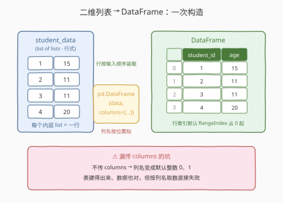
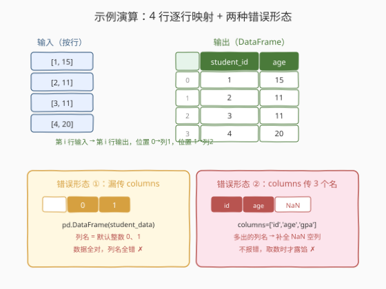

# LeetCode 从表中创建 DataFrame 题解

## 1. 题目概述

- **标题 / 题号**：从表中创建 DataFrame（#2877，easy）
- **链接**：https://leetcode.cn/problems/create-a-dataframe-from-list/
- **难度**：简单
- **标签**：Pandas、DataFrame 构造

**题意**：编写一个解决方案，基于名为 `student_data` 的**二维列表**创建一个 DataFrame。这个二维列表包含一些学生的 ID 和年龄信息。

DataFrame 应该有两列，`student_id` 和 `age`，并且**与原始二维列表的顺序相同**。

**示例 1**：

```text
输入：
student_data:
[
  [1, 15],
  [2, 11],
  [3, 11],
  [4, 20]
]
输出：
+------------+-----+
| student_id | age |
+------------+-----+
| 1          | 15  |
| 2          | 11  |
| 3          | 11  |
| 4          | 20  |
+------------+-----+
解释：
基于 student_data 创建了一个 DataFrame，包含 student_id 和 age 两列。
```

**约束**：

- `student_data` 为二维整数列表，每行长度为 2，形如 `[student_id, age]`
- 数据规模在 $10^3$ 量级（纯构造题，规模不构成瓶颈）

> 💡 本题是 LeetCode「Pandas 入门」系列的**第一题**，仅提供 Python（Pandas）提交入口。它考察的不是算法，而是对 `pd.DataFrame` 构造器的第一手熟悉度——二维列表（行式数据）怎么进来、列名怎么贴上去、顺序如何保持。

## 2. 解题思路

### 2.1 暴力思路：手工拆列再拼装

最直白的做法：把二维列表按列拆开，攒成「列名 → 列值列表」的字典，再交给构造器：

```python
def createDataframe(student_data: List[List[int]]) -> pd.DataFrame:
    ids = [row[0] for row in student_data]
    ages = [row[1] for row in student_data]
    return pd.DataFrame({'student_id': ids, 'age': ages})
```

- **正确性**：没问题——dict 的键变成列名，值列表按位置对齐成行，顺序保持。
- **啰嗦**：我们手工完成了 pandas 构造器**原生支持**的事情。行数一多，每多一列就要多写一行列表推导；列名与下标 `row[0]`、`row[1]` 的对应关系全靠人肉维护，极易错位。

> ⚠️ 瓶颈不在性能而在**表达力**：二维列表本身已经是「按行组织」的标准数据形态，pandas 对这种形态有一等公民支持，不需要先拆成列式。

### 2.2 核心观察：行式数据 + `columns` 参数，一步成表



`pd.DataFrame` 的第一个参数接受**多种数据形态**，其中最常用的两种：

| 输入形态 | 组织方式 | 列名来源 |
|----------|----------|----------|
| **list of lists**（本题） | 每个内层列表是**一行** | 无默认列名 → **必须**用 `columns` 指定 |
| dict / list of dicts | 键（或键的并集）是**一列** | 自动取键名 |

本题的 `student_data` 是前者——**行式数据**。构造器把每个内层列表原样装载为一行，**行的顺序 = 输入顺序**（不做任何排序）；`columns=['student_id', 'age']` 则把两个名字**按位置**贴到两列上：

```python
pd.DataFrame(student_data, columns=['student_id', 'age'])
```

**顺序保证**从哪来？构造器按输入序列的迭代顺序逐行写入，行索引默认是 `RangeIndex(0, n)`——第 $i$ 行输入就是输出表的第 $i$ 行，列名按 `columns` 列表的位置一一对应。题面「与原始二维列表的顺序相同」由此天然满足。

> ⚠️ **最大的坑**：不传 `columns` 时，list of lists 形态的列名是**默认整数** `0`、`1`（不是 `None`，也不是报错）。表能建出来、数据也对，但列名错了——本题评测按列名取数，直接判错。这种「静默错列名」比报错更隐蔽。

### 2.3 算法流程图


| 步骤 | 操作 | 说明 |
|------|------|------|
| ① 输入 | `student_data: List[List[int]]` | 行式二维列表，每行 `[student_id, age]` |
| ② 装载 | `pd.DataFrame(student_data, ...)` | 内层列表逐行写入，顺序保持，dtype 自动推断为 `int64` |
| ③ 贴名 | `columns=['student_id', 'age']` | 按位置对应第 0 / 1 列，个数必须与列数一致 |
| ④ 输出 | 返回 DataFrame | 行索引默认 `RangeIndex` 从 0 起 |

### 2.4 示例演算



以示例 1 逐行走查：

| 输入行 | 装载后行索引 | student_id | age | 对应关系 |
|--------|--------------|------------|-----|----------|
| `[1, 15]` | 0 | 1 | 15 | 位置 0 → 第 1 列，位置 1 → 第 2 列 |
| `[2, 11]` | 1 | 2 | 11 | 同上 |
| `[3, 11]` | 2 | 3 | 11 | 同上 |
| `[4, 20]` | 3 | 4 | 20 | 同上 |

对照两种典型错误形态：

- **漏传 `columns`**：得到列名 `0`、`1` 的表——数据全对，列名全错，评测失败；
- **`columns` 个数不符**：如传 3 个名字，pandas 会补出**全 `NaN` 的空列**（不报错）——列多了也不炸，只会在取数时露馅。

> 💡 一句话：**数据按行进、名字按列贴**——`columns` 的长度必须等于每行的元素个数，名字按位置对应。

## 3. 参考代码

### Python（pandas 一行版，推荐）

```python
import pandas as pd
from typing import List


def createDataframe(student_data: List[List[int]]) -> pd.DataFrame:
    return pd.DataFrame(student_data, columns=['student_id', 'age'])
```

> 💡 **写法要点**：
> - 构造器第一个参数直接收 `student_data`，无需任何预处理；
> - `columns` 用**列表**按位置给出两个列名，与每行的两个元素一一对应；
> - 返回即可，行顺序、行索引（`RangeIndex` 0 起）都由构造器按输入顺序自动保证。

### Python（手工构建版，理解原理）

```python
import pandas as pd
from typing import List


def createDataframe(student_data: List[List[int]]) -> pd.DataFrame:
    return pd.DataFrame({
        'student_id': [row[0] for row in student_data],
        'age': [row[1] for row in student_data],
    })
```

> 💡 **对照说明**：这是「列式字典」构造路径——先把行式数据手工转置成列式，再交给构造器。结果与推荐写法完全一致，但每多一列就多一行推导式，列名与下标的对应靠人肉维护。它存在的意义是让你看清楚：**pandas 推荐写法里「按行装载」与「按位置贴名」这两件事，构造器已经替你做了**。

## 4. 复杂度分析

| 维度 | 复杂度 | 说明 |
|------|--------|------|
| **时间复杂度** | $O(n)$ | $n$ 为行数：构造器单趟遍历输入，逐行拷贝进内部数据块 |
| **空间复杂度** | $O(n)$ | 输出 DataFrame 物化 $n \times 2$ 个元素（构造时会拷贝，不引用原列表） |

> - 手工构建版同样是 $O(n) / O(n)$——差别只在常数与代码量，不在量级。
> - $10^3$ 量级下任何写法都瞬时完成，本题的区分度在** API 正确性**而非性能。

## 5. 扩展：DataFrame 构造器的常用输入姿势

`pd.DataFrame(data, ...)` 的 `data` 支持多种形态，本题只考了第一种：

| 形态 | 示例 | 列名行为 | 适用场景 |
|------|------|----------|----------|
| list of lists | `pd.DataFrame([[1,15],[2,11]], columns=['student_id','age'])` | 默认整数 `0..m`，**建议显式传** | 行式原始数据（本题） |
| dict of lists | `pd.DataFrame({'student_id':[1,2], 'age':[15,11]})` | 键即列名，按键出现顺序 | 列式数据、各列独立构造 |
| list of dicts | `pd.DataFrame([{'student_id':1,'age':15}, ...])` | 键的并集自动成列 | 半结构化记录（JSON 行） |
| 另一个 DataFrame / ndarray | `pd.DataFrame(arr, columns=...)` | ndarray 默认整数列名 | 数据源迁移、数组落表 |

**三个值得记住的细节**：

1. **`from_records` 是 list of lists 的语义化别名**：`pd.DataFrame.from_records(student_data, columns=['student_id', 'age'])` 与推荐写法等价——名字直白地提醒你「按记录（行）装载」；
2. **`index` 参数控制行标签**：本题不传即得默认 `RangeIndex`；传 `index=['a','b',...]` 可自定义行标签（长度必须等于行数）；
3. **dtype 自动推断**：全整数列推断为 `int64`，混合类型会退化为 `object`——若行内混入字符串，整列 dtype 就不再是数值，后续数值运算会集体失效。

## 6. 面试要点

**Q1：不传 `columns` 会发生什么？为什么说这是本题最大的坑？**

> 列名变成默认整数 `0`、`1`，构造**不会报错**，数据也完整——错误被静默推迟到按列名取数时才暴露。这类「表建出来了但 schema 不对」的问题比异常更难排查，写构造语句时应把 `columns` 当成 list of lists 形态的必填项。

**Q2：`pd.DataFrame` 如何区分「行式」与「列式」输入？**

> 看第一层容器的元素类型：元素是 **list/序列** → 每个元素是一行（行式）；是 **dict**（或元素为 dict 的列表）→ 每个键是一列（列式）。同一个二维结构，组织方式不同，传参姿势完全不同——`columns` 只对行式形态是「贴名字」，对列式形态传 `columns` 则是**按名筛选列**（多余的列名补 `NaN` 列），语义截然不同。

**Q3：输出的行顺序为什么一定与输入列表一致？**

> 构造器按输入序列的迭代顺序逐行写入内部数据块，不排序、不去重、不稳定操作一概没有；行索引默认 `RangeIndex(0, n)` 与写入顺序对齐。题面「与原始二维列表的顺序相同」是构造器的天然契约，无需任何显式保证代码。

**Q4：`columns` 传了 3 个名字（数据只有 2 列）会怎样？**

> 不报错——pandas 补出一个**全 `NaN` 的空列**。反过来传 1 个名字则只保留第 1 列、其余列被丢弃。构造器对 `columns` 与数据列数的失配采取「默默补齐/裁剪」策略，靠返回结果的形状（`.shape`、`.columns`）自查最稳妥。

**Q5：本题的 DataFrame 会被 pandas 拷贝还是引用原列表？**

> 拷贝。`pd.DataFrame(list_of_lists)` 会把数据复制进内部的连续数据块（本题推断为 `int64` 块），构造完成后修改 DataFrame 不会影响外层的 Python 列表。这一点与传 ndarray 时的视图/拷贝语义不同（ndarray 默认不拷贝）。

> 💡 **一句话总结**：2877 是 **Pandas 入门第一课**——行式二维列表交给 `pd.DataFrame(data, columns=[...])` 一步成表：**数据按行进、名字按列贴、顺序天然保持**。最大的坑不是不会构造，而是漏传 `columns` 后静默得到的整数列名。

## 同类练习题

| # | 题目 | 与本题的关联 |
|---|------|-------------|
| 2878 | [获取 DataFrame 的大小](https://leetcode.cn/problems/get-the-size-of-a-dataframe/) | `df.shape` 取行列数，构造之后的第一个「读属性」动作 |
| 2879 | [显示前三行](https://leetcode.cn/problems/display-the-first-three-rows/) | `df.head(3)` 取前几行，与本题「保持前缀顺序」的约定衔接 |
| 2880 | [数据选取](https://leetcode.cn/problems/select-data/) | 按列名与布尔掩码选子表，练习本题「列名必须贴对」之后的取数环节 |
| 2881 | [创建新列](https://leetcode.cn/problems/create-a-new-column/) | `df['new'] = ...` 增列，构造 → 变形的下一步 |
| 2885 | [重命名列](https://leetcode.cn/problems/rename-columns/) | `df.rename` 改列名——若本题漏传 `columns`，这就是事后补救的正道 |
