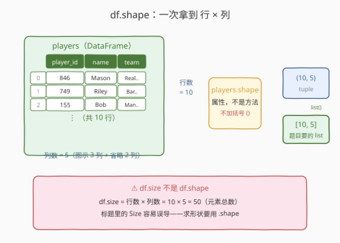
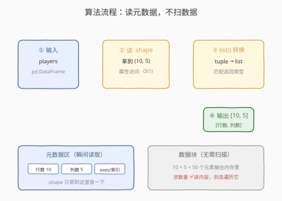
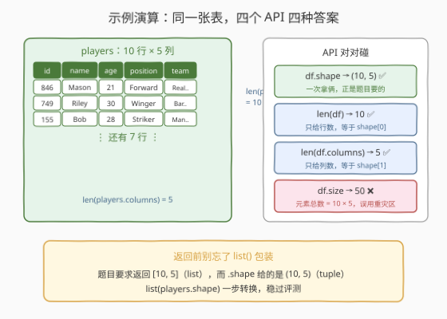

# LeetCode 获取 DataFrame 的大小 题解

## 1. 题目概述

- **标题 / 题号**：获取 DataFrame 的大小（#2878，easy）
- **链接**：https://leetcode.cn/problems/get-the-size-of-a-dataframe/
- **难度**：简单
- **标签**：Pandas、DataFrame 属性

**题意**：编写一个解决方案，计算并显示 `players` 的**行数和列数**，将结果作为一个**数组**返回：`[number of rows, number of columns]`。

DataFrame `players` 的部分结构如下（列数不固定，`...` 表示还有更多列）：

```text
+-------------+--------+
| Column Name | Type   |
+-------------+--------+
| player_id   | int    |
| name        | object |
| age         | int    |
| position    | object |
| ...         | ...    |
+-------------+--------+
```

**示例 1**：

```text
输入：
+-----------+----------+-----+-------------+--------------------+
| player_id | name     | age | position    | team               |
+-----------+----------+-----+-------------+--------------------+
| 846       | Mason    | 21  | Forward     | RealMadrid         |
| 749       | Riley    | 30  | Winger      | Barcelona          |
| 155       | Bob      | 28  | Striker     | ManchesterUnited   |
| 583       | Isabella | 32  | Goalkeeper  | Liverpool          |
| 388       | Zachary  | 24  | Midfielder  | BayernMunich       |
| 883       | Ava      | 23  | Defender    | Chelsea            |
| 355       | Violet   | 18  | Striker     | Juventus           |
| 247       | Thomas   | 27  | Striker     | ParisSaint-Germain |
| 761       | Jack     | 33  | Midfielder  | ManchesterCity     |
| 642       | Charlie  | 36  | Center-back | Arsenal            |
+-----------+----------+-----+-------------+--------------------+
输出：
[10, 5]
解释：
这个 DataFrame 包含 10 行和 5 列。
```

**约束**：

- `players` 为 `pd.DataFrame`，行数与列数均不定（结构中的 `...` 列可能存在）
- 返回类型为 `List[int]`，即 `[行数, 列数]`

> 💡 本题是「Pandas 入门」系列的**第二题**（上一题 2877 学构造，本题学**读形状**）。它同样不考算法，考的是对 `df.shape` 这一最常用属性的直觉——顺便避开幕后两个经典坑：把 `df.size` 当形状、把 `.shape` 当方法调用。

## 2. 解题思路

### 2.1 暴力思路：行数、列数分开数

最直白的做法：行数用 `len(df)`，列数用 `len(df.columns)`，再手工拼成列表：

```python
def getDataframeSize(players: pd.DataFrame) -> List[int]:
    return [len(players), len(players.columns)]
```

- **正确性**：没问题——`len(df)` 返回行数，`len(df.columns)` 返回列名列表的长度即列数。
- **啰嗦**：两次属性访问 + 手工拼装。更笨的写法还有 `sum(1 for _ in players.index)` 数行、`players.count().max()` 绕道计数——都只是在绕开 pandas **原生打包好**的形状属性。

> ⚠️ 瓶颈不在性能而在**表达力**：行数和列数在 DataFrame 内部本来就是**一体的元数据**，pandas 提供了一次性取出二者的属性，不需要拆成两次访问再自己组装。

### 2.2 核心观察：`.shape` 属性，一次拿 行 × 列



DataFrame 的内部结构可以粗略分为**数据块**（真正存 10×5 个元素的地方）与**元数据区**（行索引、列索引，以及由它们派生的形状信息）。`shape` 属性就是从元数据区**直接读出** `(行数, 列数)` 这个元组——**不触碰、不扫描任何数据**：

```python
players.shape        # (10, 5)
list(players.shape)  # [10, 5] ← 题目要的返回形态
```

三个必须记住的细节：

| 细节 | 说明 |
|------|------|
| **`shape` 是属性不是方法** | 写 `players.shape()` 会抛 `TypeError: 'tuple' object is not callable`——它后面**没有括号** |
| **返回 tuple 而非 list** | 题目要求返回 `[10, 5]`，`shape` 给的是 `(10, 5)`，用 `list()` 包一层最稳妥 |
| **`size` ≠ `shape`** | 本题标题是 "Size"，但 `df.size` = 行数 × 列数 = **元素总数**（示例里是 50），用了必错 |

**顺序保证**从哪来？`shape` 的定义就是 `(len(index), len(columns))`——第 0 位永远是行数、第 1 位永远是列数，与题目 `[number of rows, number of columns]` 的顺序天然一致。

> ⚠️ **最大的坑**：标题里的 "Size" 是语义上的「大小」，不是 API `df.size`。这是 Pandas 入门阶段最典型的「名词撞车」——题意要形状，API 里偏偏有个同名的元素计数属性。记住一句话：**问形状用 shape，size 是乘积**。

### 2.3 算法流程图



| 步骤 | 操作 | 说明 |
|------|------|------|
| ① 输入 | `players: pd.DataFrame` | 行列数不定，结构中的 `...` 列可能存在 |
| ② 读属性 | `players.shape` | 元数据访问得 `(n_rows, n_cols)`，$O(1)$，无括号 |
| ③ 转换 | `list(...)` | tuple → list，匹配 `List[int]` 返回类型 |
| ④ 输出 | `[10, 5]` | 第 0 位行数、第 1 位列数，顺序天然正确 |

### 2.4 示例演算



以示例 1（10 行 × 5 列）逐一对照四个形状类 API：

| 调用 | 返回 | 评价 |
|------|------|------|
| `players.shape` | `(10, 5)` | ✅ 一次拿俩，`list()` 包装后即答案 |
| `len(players)` | `10` | ✅ 但只给行数，等价于 `shape[0]` |
| `len(players.columns)` | `5` | ✅ 但只给列数，等价于 `shape[1]` |
| `players.size` | `50` | ❌ 元素总数 $10 \times 5$，本题的「伪答案」 |

> 💡 一句话：**形状问 shape、行数问 len、列数问 columns、size 是乘积**——四个 API 各就各位，本题只需要第一个。

## 3. 参考代码

### Python（pandas 一行版，推荐）

```python
import pandas as pd
from typing import List


def getDataframeSize(players: pd.DataFrame) -> List[int]:
    return list(players.shape)
```

> 💡 **写法要点**：
> - `.shape` 是**属性**，后面不带括号；
> - 返回值是 tuple，用 `list()` 转成题目要求的 `List[int]`；
> - 全程只读元数据，无论表多大都是 $O(1)$。

### Python（len 组合版，理解原理）

```python
import pandas as pd
from typing import List


def getDataframeSize(players: pd.DataFrame) -> List[int]:
    return [len(players), len(players.columns)]
```

> 💡 **对照说明**：`len(df)` 数的是**行**（沿 `axis=0` 的长度），`len(df.columns)` 数的是列——它印证了 `shape` 的内部定义 `(len(index), len(columns))`。两处属性访问合起来与推荐写法完全等价，但「形状」本是元数据里的一体信息，`.shape` 一次取出更贴合语义。

## 4. 复杂度分析

| 维度 | 复杂度 | 说明 |
|------|--------|------|
| **时间复杂度** | $O(1)$ | 只读内部元数据（行数、列数常量级可查），不遍历数据块 |
| **空间复杂度** | $O(1)$ | 仅构造长度为 2 的列表，与表规模无关 |

> - `len(df)` 组合版同样是 $O(1) + O(1)$——差别只在两次属性访问与代码量，不在量级。
> - 本题的区分度在 **API 语义正确性**（shape / size / tuple / list），而非性能。

## 5. 扩展：形状类 API 一张表

围绕「这张表有多大」，pandas 提供了一族易混的 API，借本题一次理清：

| API / 属性 | 返回 | 示例（10 行 5 列） | 记忆点 |
|------------|------|-------------------|--------|
| `df.shape` | `tuple(rows, cols)` | `(10, 5)` | **形状二元组**，属性无括号 |
| `df.size` | `int` | `50` | 元素总数 = $\prod$ shape |
| `df.ndim` | `int` | `2` | 维度数，DataFrame 恒为 2 |
| `len(df)` | `int` | `10` | 行数，等价 `shape[0]` |
| `len(df.columns)` | `int` | `5` | 列数，等价 `shape[1]` |
| `df.count()` | `Series` | 每列非 NaN 计数 | **方法**；逐列忽略缺失值，与形状无关 |

**两个值得记住的细节**：

1. **`count()` 不是形状 API**：它逐列统计**非缺失**条目，遇到含 `NaN` 的表返回值会小于行数——求形状时误用它是最隐蔽的错法；
2. **`shape` 可按位索引**：`df.shape[0]` / `df.shape[1]` 分别取行、列数，在只关心一维的场合比 `len(...)` 更紧凑（如 `range(df.shape[1])` 遍历列下标）。

## 6. 面试要点

**Q1：`df.shape` 和 `df.size` 的区别是什么？本题为什么不能用后者？**

> `shape` 返回 `(行数, 列数)` 二元组，`size` 返回**元素总数** = 行数 × 列数。示例中 `shape` 是 `(10, 5)`、`size` 是 `50`。本题标题虽叫 "Size"，但要求返回 `[行数, 列数]`，用 `df.size` 直接得到 50，必错——这是「题面名词」与「API 名词」撞车的经典陷阱。

**Q2：为什么说本题解法是 $O(1)$？**

> 行数与列数在 DataFrame 内部是**现成的元数据**（行索引与列索引的长度），`shape` 属性只做一次元数据读取，不触碰、不扫描存放 50 个元素的数据块。「求数量」不必「读内容」——这也是它与遍历计数的本质区别。

**Q3：`players.shape` 写成 `players.shape()` 会怎样？**

> 抛 `TypeError: 'tuple' object is not callable`。`shape` 是**属性**，访问时**不带括号**；这一括号之差是初学者最常见的拼写错误（对照：`count()` 是方法，必须带括号）。属性 vs 方法的分辨技巧：IDE 里属性着色不同，或记住 shape/size/ndim/columns/index 都是属性。

**Q4：直接 `return players.shape` 可以吗？**

> 风险做法。`shape` 返回 tuple `(10, 5)`，题目签名要求 `List[int]`。部分评测对 tuple / list 宽松，但严格比对类型或序列化格式（`repr` 不同）时会判错。`list(players.shape)` 一步转换，零成本消除歧义——**让返回类型对齐签名**是提交类题目的基本纪律。

**Q5：`len(df)` 数的是行还是列？为什么？**

> 数**行**。Python 的 `len()` 协议调用容器的长度，DataFrame 沿用「一行 = 一条记录」的主轴（`axis=0`）语义，`len(df)` 等价于 `len(df.index)` 即 `df.shape[0]`。要数列必须显式 `len(df.columns)`——把 `len(df)` 当列数是第二常见笔误。

> 💡 **一句话总结**：2878 是 Pandas 入门的「读形状」一课——`list(df.shape)` 一步返回 `[行数, 列数]`：**属性无括号、tuple 转 list、size 是乘积**，三个细节就是本题的全部考点。

## 同类练习题

| # | 题目 | 与本题的关联 |
|---|------|-------------|
| 2877 | [从表中创建 DataFrame](https://leetcode.cn/problems/create-a-dataframe-from-list/) | 上一题的 `pd.DataFrame(data, columns=...)` 构造，构造完用本题的 `.shape` 自查形状最稳妥 |
| 2879 | [显示前三行](https://leetcode.cn/problems/display-the-first-three-rows/) | `df.head(3)` 按行截取，继续熟悉「行是主轴」的约定（`len(df)` 数行的原因） |
| 2880 | [数据选取](https://leetcode.cn/problems/select-data/) | 按列名选子表，操作前后用 `.shape` 对比即可直观看到列数变化 |
| 2885 | [重命名列](https://leetcode.cn/problems/rename-columns/) | 修改 `columns` 元数据而不动数据块——形状不变，正好印证 `shape` 读的是元数据 |
| 2888 | [重塑数据：级联](https://leetcode.cn/problems/reshape-data-concatenate/) | 两张表级联后行数相加，用 `.shape` 验证级联结果是天然的调试手段 |
