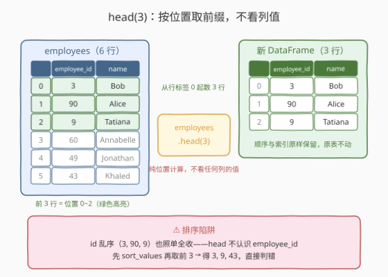
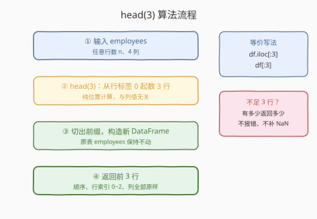
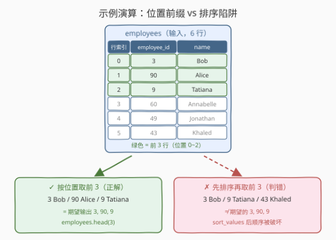

# LeetCode 显示前三行 题解

## 1. 题目概述

- **标题 / 题号**：显示前三行（#2879，easy）
- **链接**：https://leetcode.cn/problems/display-the-first-three-rows/
- **难度**：简单
- **标签**：Pandas、数据选取（head / 切片）

**题意**：给定一个名为 `employees` 的 DataFrame，编写解决方案，显示它的**前 3 行**。

表结构如下：

```text
DataFrame: employees
+-------------+--------+
| Column Name | Type   |
+-------------+--------+
| employee_id | int    |
| name        | object |
| department  | object |
| salary      | int    |
+-------------+--------+
```

**示例 1**：

```text
输入：
DataFrame employees
+-------------+-----------+-----------------------+--------+
| employee_id | name      | department            | salary |
+-------------+-----------+-----------------------+--------+
| 3           | Bob       | Operations            | 48675  |
| 90          | Alice     | Sales                 | 11096  |
| 9           | Tatiana   | Engineering           | 33805  |
| 60          | Annabelle | InformationTechnology | 37678  |
| 49          | Jonathan  | HumanResources        | 23793  |
| 43          | Khaled    | Administration        | 40454  |
+-------------+-----------+-----------------------+--------+
输出：
+-------------+---------+-------------+--------+
| employee_id | name    | department  | salary |
+-------------+---------+-------------+--------+
| 3           | Bob     | Operations  | 48675  |
| 90          | Alice   | Sales       | 11096  |
| 9           | Tatiana | Engineering | 33805  |
+-------------+---------+-------------+--------+
解释：
只有前 3 行被显示。
```

**约束**：

- 行、列规模均为入门级（个位数量级），性能不构成任何瓶颈
- `employee_id`、`salary` 为整数列，`name`、`department` 为字符串列

> 💡 本题是「Pandas 入门」系列的**取数第一课**，仅提供 Python（Pandas）提交入口。它考察的是 `df.head(n)`——Pandas 里日常使用频率最高的 API 之一。注意示例里 `employee_id` 是**乱序**的（`3, 90, 9, ...`），而期望输出保持了输入顺序——这是题面埋下的第一个信号：**「前」是位置概念，不是值概念**。

## 2. 解题思路

### 2.1 暴力思路：手工逐行拼装 / 画蛇添足地排序

最笨的做法是手工循环取行再拼回 DataFrame：

```python
def selectFirstRows(employees: pd.DataFrame) -> pd.DataFrame:
    rows = [employees.iloc[i] for i in range(3)]
    return pd.DataFrame(rows)
```

- **能用但绕**：逐行取出的是 Series（转置成一行的 Series），拼回去 dtype 与列顺序都可能出幺蛾子，代码量还是正经解法的数倍；
- **更危险的变体**：有人看到 `employee_id` 乱序，下意识先 `sort_values('employee_id')` 再取前 3——**直接掉坑**。排序后前 3 行变成 `3, 9, 43`，而期望是 `3, 90, 9`，答案整个错位。

> ⚠️ 瓶颈不在性能而在**语义理解**：「前 3 行」说的是**从头数 3 行**，与任何列的值无关。任何「先整理数据再取」的额外动作都是画蛇添足，甚至是致命错误。

### 2.2 核心观察：`head(n)` = 位置前缀切片



`DataFrame.head(n=5)` 的语义只有一句话：**从行标签 `0` 开始（即表的当前顺序），原样返回前 $n$ 行**。

| 特性 | 说明 |
|------|------|
| **位置语义** | 只看行在表中的当前位置，不看任何列的值 |
| **顺序保持** | 输入顺序 = 输出顺序，不排序、不去重、不过滤 |
| **越界安全** | $n$ 超过行数时返回现有全部行，**不报错**、不补 `NaN` |
| **不动原表** | 返回一个新 DataFrame（前缀切片），`employees` 本身原样保留 |
| **默认参数** | `head()` 不传参默认返回前 **5** 行——本题必须显式传 `3` |

与它等价的写法还有 `employees.iloc[:3]`（按位置的整数切片，左闭右开）。`head(3)` 之所以是首选，是因为它**把意图写在脸上**：读代码的人一眼就知道「取前几行看看」。

> ⚠️ **最大的坑**：把「前 3 行」理解成「`employee_id` 最小的 3 行」。示例的 `employee_id` 故意排成乱序（`3, 90, 9, ...`）就是在钓这条鱼——一排序，答案就错。

### 2.3 算法流程图



| 步骤 | 操作 | 说明 |
|------|------|------|
| ① 输入 | `employees: pd.DataFrame` | 任意行数、任意列数的表（本题 4 列） |
| ② 定位 | `head(3)` 从行标签 0 起数 3 行 | 纯位置计算，与列值、行数无关 |
| ③ 切片 | 取出前缀构造新 DataFrame | 原表不动，新表行索引仍为 `0, 1, 2` |
| ④ 输出 | 返回新 DataFrame | 不足 3 行时有多少返回多少，不报错 |

### 2.4 示例演算：位置前缀 vs 排序陷阱



以示例 1 逐行走查（只看 `employee_id` 与 `name` 两列即可）：

| 行索引 | employee_id | name | 是否入选 |
|--------|-------------|------|----------|
| 0 | 3 | Bob | ✅ 第 1 行 |
| 1 | 90 | Alice | ✅ 第 2 行 |
| 2 | 9 | Tatiana | ✅ 第 3 行 |
| 3 | 60 | Annabelle | ❌ 超出前缀 |
| 4 | 49 | Jonathan | ❌ 超出前缀 |
| 5 | 43 | Khaled | ❌ 超出前缀 |

对照两种做法的结局：

- **按位置取前 3**：`3, 90, 9` → 与期望输出一致 ✅
- **先排序再取前 3**：排序后序列为 `3, 9, 43, 49, 60, 90`，取前 3 得 `3, 9, 43` → 与期望的 `3, 90, 9` 对不上 ❌

> 💡 一句话：**「前 n 行」= 从头数 n 行**——head 不认识 `employee_id`，它只认行在表里的位置。

## 3. 参考代码

### Python（pandas 一行版，推荐）

```python
import pandas as pd


def selectFirstRows(employees: pd.DataFrame) -> pd.DataFrame:
    return employees.head(3)
```

> 💡 **写法要点**：
> - `head(3)` 显式传 `n=3`——别依赖默认值，默认是 5 行；
> - 返回即可，顺序、行索引（`0, 1, 2`）由切片语义天然保证；
> - 不足 3 行的边界（本题约束下不会触发，但面试会问）由 pandas 自动兜底。

### Python（iloc 切片版，理解原理）

```python
import pandas as pd


def selectFirstRows(employees: pd.DataFrame) -> pd.DataFrame:
    return employees.iloc[:3]
```

> 💡 **对照说明**：`iloc[:3]` 与 `head(3)` 结果完全一致——`iloc` 按整数**位置**索引，切片左闭右开，正好是前 3 行。`head` 是它的高层封装，语义更直白；`iloc` 是底层通法，还能写 `iloc[1:4]`（第 2~4 行）这类任意区间。

## 4. 复杂度分析

| 维度 | 复杂度 | 说明 |
|------|--------|------|
| **时间复杂度** | $O(m)$ | $m$ 为列数：只定位并拷贝固定 3 行，与总行数 $n$ 无关 |
| **空间复杂度** | $O(m)$ | 新 DataFrame 物化 $3 \times m$ 个元素（前缀切片会拷贝，不引用整表） |

> - 本题规模下任何写法都瞬时完成，区分度在**语义正确性**（不排序）而非性能。
> - 若把 $n=3$ 视为常数，时间与空间都相当于 $O(1)$ 级别的行开销，瓶颈仅在列宽。

## 5. 扩展：`head` 家族与切片姿势大全

| 写法 | 语义 | 备注 |
|------|------|------|
| `df.head(3)` | 前 3 行（位置） | 本题正解，意图最直白 |
| `df.head()` | 前 **5** 行 | 默认参数是 5 不是 3，别想当然 |
| `df.tail(3)` | 后 3 行（位置） | head 的镜像，`tail()` 同样默认 5 |
| `df.head(-3)` | **丢掉**最后 3 行，返回其余全部 | 负数 = 反向切除，冷门但好用 |
| `df.iloc[:3]` | 前 3 行 | 位置切片，左闭右开，越界自动截断 |
| `df[:3]` | 前 3 行 | 行切片语法糖，能用但可读性差，不推荐 |
| `df.loc[:2]` | 行标签 $\le 2$ 的行 | **标签切片是闭区间**：仅当行标签恰为 `0,1,2,...` 时才等价于前 3 行 |

三个值得记住的细节：

1. **`iloc` 与 `loc` 的区间开闭不同**：`iloc[:3]` 是 Python 惯例的左闭右开（取 0、1、2）；`loc[:2]` 是**含端点标签**的闭区间。行标签恰好是默认 `RangeIndex` 时二者殊途同归，标签一乱（比如自定义字符串索引）结果立刻分叉。
2. **切片越界 vs 单点越界**：`iloc[:100]` 对 6 行的表安全返回 6 行（切片自动截断），但 `iloc[100]` 单点索引会抛 `IndexError`。前缀类操作天然皮实。
3. **别把 `head` 的返回值当可写目标**：它是前缀切片得到的新对象，底层可能与原表共享数据块，对其原地赋值会触发 `SettingWithCopyWarning`——要改就先显式 `.copy()`。

## 6. 面试要点

**Q1：`head(3)` 的「前」到底是按什么排的？**

> 按表的**当前行顺序**（即行标签顺序），是纯位置语义。不看任何列的值、不比较大小、不做任何隐式排序——输入什么顺序，输出就是什么顺序的前缀。

**Q2：为什么不能先按 `employee_id` 排序再取前 3？**

> 「前三行」是位置概念。示例里 `employee_id` 本来就是乱序（`3, 90, 9, ...`），期望输出保持 `3, 90, 9`；一旦排序，前 3 变成 `3, 9, 43`，答案直接判错。题面把示例数据排成乱序，就是在考察这一点。

**Q3：`head(3)` 会修改原 DataFrame 吗？返回的是视图还是拷贝？**

> 不修改原表，返回一个新 DataFrame 对象。其底层数据块可能与原表共享（切片的实现细节），对它做原地赋值会触发 `SettingWithCopyWarning`，所以实践中应把 `head` 的结果当**只读**视图使用；确需修改就先 `.copy()`。

**Q4：如果表不足 3 行，`head(3)` 会怎样？**

> 安全返回现有全部行，不报错也不补 `NaN`。`iloc[:3]` 同样安全——Python 切片越界自动截断。这也是切片比单点索引（`iloc[3]` 越界抛 `IndexError`）皮实的地方。

**Q5：`head(3)`、`iloc[:3]`、`df[:3]`、`loc[:2]` 四者有何区别？**

> 前三者结果一致，都是位置前缀（`df[:3]` 只是可读性差的语法糖）；`loc[:2]` 是**标签**切片且**闭区间**，只有行标签恰为 `0,1,2,...` 连续整数时才与前三者等价，标签非默认 `RangeIndex` 时语义完全不同。面试答出「iloc 位置开区间、loc 标签闭区间」这组对偶即可加分。

> 💡 **一句话总结**：2879 是 **Pandas 取数第一课**——`df.head(3)` 按位置原样返回前 3 行：**不排序、不越界、不动原表**。最大的坑是把「前 3 行」脑补成「id 最小的 3 行」。

## 同类练习题

| # | 题目 | 与本题的关联 |
|---|------|-------------|
| 2877 | [从表中创建 DataFrame](https://leetcode.cn/problems/create-a-dataframe-from-list/) | 构造整张表，与本题「从表里取前缀」首尾衔接 |
| 2878 | [获取 DataFrame 的大小](https://leetcode.cn/problems/get-the-size-of-a-dataframe/) | `df.shape` 读行列数，与 `head` 同属最常用的表级属性/方法 |
| 2880 | [数据选取](https://leetcode.cn/problems/select-data/) | 按列名与布尔掩码选子表——位置切片之后的「按条件选取」下一课 |
| 2881 | [创建新列](https://leetcode.cn/problems/create-a-new-column/) | `df['new'] = ...` 增列，选取之后再学变形 |
| 2885 | [重命名列](https://leetcode.cn/problems/rename-columns/) | `df.rename` 改列名，schema 层面的善后工具 |
