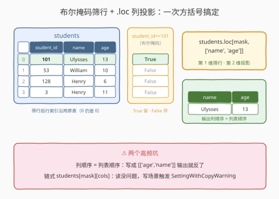
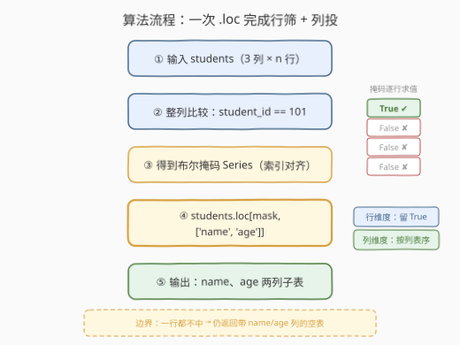
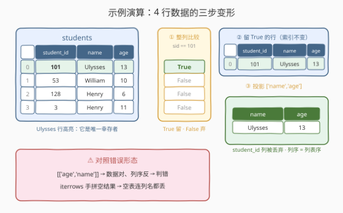

# 数据选取

- **题目名称**：数据选取
- **链接**：[2880. 数据选取](https://leetcode.cn/problems/select-data/)
- **难度**：简单
- **标签**：Pandas、布尔索引、`.loc` 行列联合选取

## 1. 题目概述

给定一个 `students` 表：

```text
DataFrame students
+-------------+--------+
| Column Name | Type   |
+-------------+--------+
| student_id  | int    |
| name        | object |
| age         | int    |
+-------------+--------+
```

编写一个解决方案，选择 **`student_id = 101`** 的学生的 `name` 和 `age` 并输出。

**示例 1**：

```text
输入：
+------------+---------+-----+
| student_id | name    | age |
+------------+---------+-----+
| 101        | Ulysses | 13  |
| 53         | William | 10  |
| 128        | Henry   | 6   |
| 3          | Henry   | 11  |
+------------+---------+-----+
输出：
+---------+-----+
| name    | age |
+---------+-----+
| Ulysses | 13  |
+---------+-----+
解释：
学生 Ulysses 的 student_id = 101，所以我们输出了他的 name 和 age。
```

**约束条件**：

- `students` 表包含 `student_id`（int）、`name`（object）、`age`（int）三列
- Pandas 入门系列题，数据规模在 $10^3$ 量级（纯 API 题，规模不构成瓶颈）
- 输出表只含 `name`、`age` 两列，且**列顺序必须**是 `name` 在前、`age` 在后

> 💡 本题是 LeetCode「Pandas 入门」系列的**取数第一课**。它考察的不是算法，而是 DataFrame 最核心的两类选取动作——**行筛选**（哪些行留下）与**列投影**（哪些列留下）——以及如何用一次 `.loc` 把两件事同时做完。官方 hint 也直说了：「Consider applying both row and column filtering」。

---

## 2. 解题思路

### 2.1 暴力思路：逐行 if 判断

最直白的做法：用 `iterrows()` 逐行扫，命中 `student_id == 101` 就手工攒一条记录，最后拼回 DataFrame：

```python
def selectData(students: pd.DataFrame) -> pd.DataFrame:
    rows = []
    for _, row in students.iterrows():
        if row['student_id'] == 101:
            rows.append({'name': row['name'], 'age': row['age']})
    return pd.DataFrame(rows, columns=['name', 'age'])
```

- **正确性**：勉强没问题——但注意末尾**必须**补 `columns=['name', 'age']`：一旦没有学生满足条件，`rows` 为空，`pd.DataFrame([])` 会返回一张**连列名都没有**的空表，评测直接判错。这是暴力版最隐蔽的坑。
- **低效**：`iterrows()` 每次迭代都要把一行打包成一个临时 `Series` 对象，纯 Python 循环的常数比 pandas 的向量化路径高出一到两个数量级。
- **啰嗦**：筛选条件、取哪些列、输出列名，全靠人肉维护在循环体里。

> ⚠️ 瓶颈不在复杂度量级（都是 $O(n)$）而在**姿势**：逐行 if 判断把 pandas 当成了带列名的 Python 字典列表，完全放弃了它「按列向量化操作」的核心能力。

### 2.2 核心观察：布尔掩码 + `.loc`，一步完成「行筛选 + 列投影」



pandas 的**向量化比较**可以对整列一次性求值：

```python
mask = students['student_id'] == 101   # 一个布尔 Series，与原表行索引对齐
```

对示例的 4 行数据，`mask` 逐行求值为 `True / False / False / False`——这一步**替代了暴力版整个循环 + if**。

随后 `.loc` 的**两个维度**分别接住「行」与「列」：

```python
students.loc[mask, ['name', 'age']]
```

| `.loc` 维度 | 本题传入 | 语义 |
|-------------|----------|------|
| 第 1 维（行） | 布尔掩码 `mask` | 保留 `True` 对应的行，丢弃 `False` 的行 |
| 第 2 维（列） | `['name', 'age']` | 只投影这两列，**且输出顺序 = 列表顺序** |

于是**方括号里一次写完两个维度**，行筛选与列投影一步到位。

> ⚠️ **两个高频坑**：
> 1. **列顺序**：`[['age', 'name']]` 与 `[['name', 'age']]` 是两张不同的表——`.loc` 的列列表顺序就是输出列顺序，本题必须 `name` 在前；
> 2. **链式索引**：`students[mask][['name', 'age']]` 读操作也能 AC，但它是**两次独立的 `__getitem__`**（先整表筛行、再对中间结果筛列），中间物整份物化一遍；更危险的是把这种链式习惯带进**写**场景会触发 `SettingWithCopyWarning`。统一用 `.loc[mask, cols]` 是最稳的肌肉记忆。

### 2.3 算法流程图



| 步骤 | 操作 | 说明 |
|------|------|------|
| ① 输入 | `students: pd.DataFrame` | 三列 `student_id` / `name` / `age` |
| ② 整列比较 | `students['student_id'] == 101` | 向量化求值，得到与行索引对齐的布尔 Series |
| ③ 行筛选 | `.loc[mask, ...]` 第 1 维 | 保留掩码为 `True` 的行；一个都没有则返回**带列名的空表** |
| ④ 列投影 | `..., ['name', 'age']` 第 2 维 | 丢掉 `student_id` 列，按列表顺序输出 `name`、`age` |
| ⑤ 输出 | 返回 DataFrame | 行索引沿用原表中被保留行的标签 |

### 2.4 示例演算



以示例 1 的 4 行数据逐步走查：

| 原表行 | student_id | 掩码值 | 行筛选后 | 列投影后 |
|--------|------------|--------|----------|----------|
| 0 | 101 | `True` | ✅ 保留 | `Ulysses, 13` |
| 1 | 53 | `False` | ❌ 丢弃 | — |
| 2 | 128 | `False` | ❌ 丢弃 | — |
| 3 | 3 | `False` | ❌ 丢弃 | — |

- **掩码**：`101 == 101` → `True`；`53 / 128 / 3` 均不等于 `101` → `False`；
- **行筛**：只剩第 0 行（`Ulysses, 13`），注意其行索引仍是 `0`——布尔筛选**不会重排行索引**（需要重排可用 `.reset_index(drop=True)`，本题不做要求）；
- **列投**：`student_id` 列被丢弃，输出 `name`、`age` 两列。

对照两种典型错误形态：

- **列顺序写反**：`[['age', 'name']]` 输出 `age` 在前——数据全对、顺序错了，评测判错；
- **投影漏写列**：只写 `['name']` 忘了 `age`——单列会被降级成 `Series` 且缺列，双双判错。

> 💡 一句话：**整列比较产掩码，`.loc` 一对方括号定去留**——第 1 维管「哪些行」，第 2 维管「哪些列、什么顺序」。

---

## 3. 参考代码

### Python（`.loc` 一步版，推荐）

```python
import pandas as pd


def selectData(students: pd.DataFrame) -> pd.DataFrame:
    return students.loc[students['student_id'] == 101, ['name', 'age']]
```

> 💡 **写法要点**：
> - 一行完成行筛选 + 列投影，只发生一次方括号取数；
> - 列列表 `['name', 'age']` 的顺序即输出列顺序；
> - 若无任何学生满足条件，返回带 `name` / `age` 列结构的空表，schema 天然正确。

### Python（链式索引版，对照）

```python
import pandas as pd


def selectData(students: pd.DataFrame) -> pd.DataFrame:
    return students[students['student_id'] == 101][['name', 'age']]
```

> 💡 **对照说明**：结果与推荐写法完全一致，本题（纯读）也能 AC。但两次 `[]` 各做一次筛选，中间产生一份整表子拷贝；这种链式习惯迁移到写场景（如 `df[mask]['age'] = 0`）就会踩 `SettingWithCopyWarning`。写法上应统一收敛到 `.loc`。

### Python（`query` 版，扩展）

```python
import pandas as pd


def selectData(students: pd.DataFrame) -> pd.DataFrame:
    return students.query('student_id == 101')[['name', 'age']]
```

> 💡 **对照说明**：`query` 用**字符串表达式**描述行条件，大数据量下可走 `numexpr` 引擎减少中间临时数组；本系列规模下与布尔索引无异。注意它只管行，列投影仍需再选一次。

---

## 4. 复杂度分析

| 维度 | 复杂度 | 说明 |
|------|--------|------|
| **时间复杂度** | $O(n)$ | $n$ 为行数：一次整列比较 + 一次布尔取行，均为单趟向量化操作 |
| **空间复杂度** | $O(n)$ | 布尔掩码占 $O(n)$；输出表最多 $n \times 2$ 个元素 |

> - `iterrows` 暴力版同为 $O(n) / O(n)$，但每行构造临时 `Series`，常数大一到两个数量级，$10^3$ 行已能感知差距；
> - 链式索引版与 `.loc` 版同为 $O(n)$，差别在中间是否物化一份「筛行后仍带全列」的临时表（本题只 3 列，差距不大；列多时 `.loc` 一步到位的优势明显）。

---

## 5. 扩展：布尔索引的进阶姿势

行筛选是 pandas 使用频率最高的动作，值得把相关变体一次理清：

| 变体 | 写法 | 适用场景 |
|------|------|----------|
| 多条件与/或/非 | `df[(df.a > 1) & (df.b < 5)]`、`~mask` | 组合谓词，**每个子条件必须加括号** |
| 成员判定 | `df['student_id'].isin([101, 53])` | 一次匹配一集合（SQL `IN`） |
| 区间判定 | `df['age'].between(10, 15)` | 闭区间（SQL `BETWEEN`） |
| 表达式引擎 | `df.query('student_id == 101')` | 条件复杂/数据量大时更省中间内存 |
| 缺失值判定 | `df['name'].notna()` | 过滤空值行 |

**三个值得记住的细节**：

1. **为什么是 `&` 不是 `and`**：`and` 是 Python 关键字，要求对整个对象求真值，而 Series 的真值未定义（直接抛 `ValueError`）；`&` / `|` / `~` 是被 pandas 重载的**位运算符**，逐元素求值。又因为位运算符优先级**高于**比较运算符，`a == 1 & b == 2` 会被解析成 `a == (1 & b) == 2`——所以每个子条件必须用括号包住。
2. **掩码与索引对齐**：布尔 Series 是按**行索引**而非位置去筛行的。若掩码来自另一张索引不同的表，会得到意料之外的匹配结果（未对齐位置变 `NaN` → 掩码非法）。用 `.to_numpy()` 转成纯数组可强制按位置对齐。
3. **`.loc` vs `.iloc`**：`.loc` 按**标签**取（列给名字、行掩码对齐索引），`.iloc` 按**位置**取（只认整数下标，不接受布尔掩码以外的标签）。投影列用名字时必须 `.loc`。

---

## 6. 面试要点

**Q1：`students[mask][['name', 'age']]` 与 `students.loc[mask, ['name', 'age']]` 有何区别？**

> 前者是链式索引：两次 `__getitem__`，先物化一份「筛行后仍带全部列」的中间表，再对它投影；后者一次调用同时完成行筛选与列投影，无中间全列表。读结果一致，但链式习惯带进写场景（`df[mask]['col'] = x`）会触发 `SettingWithCopyWarning`——pandas 无法判断你改的是副本还是原表。工程实践统一收敛到 `.loc`。

**Q2：`.loc` 的两个维度分别能接受什么类型的参数？**

> 行维度：单个标签、标签列表/切片、**布尔掩码**（与索引对齐）、返回前述之一的可调用对象；列维度：单个列标签或列标签列表。行列可混搭，如 `df.loc[mask, 'name']` 返回命中行的 `name` Series。

**Q3：如果没有任何 `student_id = 101` 的学生会怎样？**

> `.loc` 返回一张**空但带 `name` / `age` 列结构**的 DataFrame，schema 保持完整。这正是暴力 `iterrows` 版的坑：手工拼 `pd.DataFrame([])` 得到的空表连列名都没有，必须显式补 `columns`——「空结果的 schema」是取数类问题容易被忽略的边界。

**Q4：多条件布尔筛选为什么必须写 `&` 且加括号，用 `and` 行不行？**

> 不行。`and` 要求左右操作数有整体真值，Series 的真值未定义，直接抛 `ValueError: The truth value of a Series is ambiguous`。`&` 是逐元素与，但它的优先级高于 `==`，不加括号时 `a == 1 & b == 2` 会先算 `1 & b`，语义完全错乱。口诀：**括号包住每个条件，`&` 连接**。

**Q5：输出表的行索引是什么？需要重排吗？**

> 沿用原表中被保留行的标签（示例中 `Ulysses` 那行的索引仍是 `0`）。本题评测只看列与值，不重排即可；若下游要求连续索引，追加 `.reset_index(drop=True)`——注意 `drop=True`，否则旧索引会被升格成一列新数据。

> 💡 **一句话总结**：2880 是 Pandas 取数第一课——**整列比较产掩码，`.loc[mask, ['name', 'age']]` 一对方括号同时定「哪些行」和「哪些列、什么顺序」**。坑不在算法在姿势：列顺序写反、链式索引、空结果丢列，全是 API 细节账。

---

## 7. 同类练习题

- [2879. 显示前三行](https://leetcode.cn/problems/display-the-first-three-rows/)：`head(3)` 行切片，与本题「按条件筛行」互为行选取的两条路径
- [2881. 创建新列](https://leetcode.cn/problems/create-a-new-column/)：`df['new'] = ...` 增列，选取之后的下一个变形动作
- [2882. 删除重复的行](https://leetcode.cn/problems/drop-duplicate-rows/)：`drop_duplicates` 行级去重，另一族「筛行」API
- [2885. 重命名列](https://leetcode.cn/problems/rename-columns/)：`df.rename` 改列名——若投影时把列名/顺序搞错，这就是事后补救的正道
- [2891. 方法链](https://leetcode.cn/problems/method-chaining/)：把筛选、投影、排序串成一条链式调用，是本题两个动作的组合进阶
