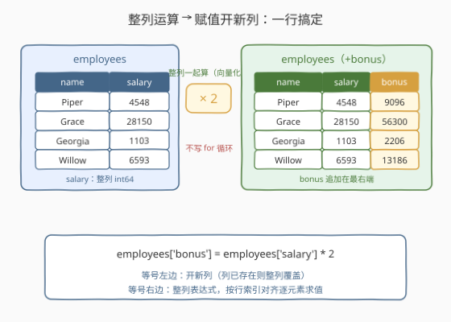
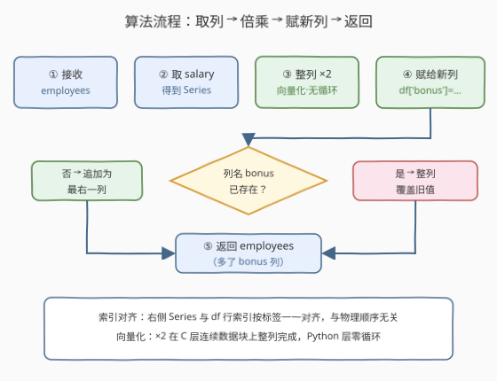
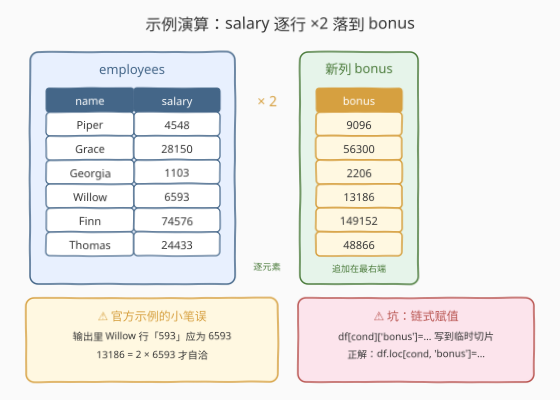

# 创建新列

- **题目名称**：创建新列
- **链接**：[2881. 创建新列](https://leetcode.cn/problems/create-a-new-column/)
- **难度**：简单
- **标签**：Pandas、DataFrame 变形、向量化运算

## 1. 题目概述

一家公司计划为员工提供奖金。编写一个解决方案，创建一个名为 `bonus` 的新列，其中包含 `salary` 值的**两倍**，并返回结果 DataFrame。

表结构：

```text
DataFrame employees
+-------------+--------+
| Column Name | Type   |
+-------------+--------+
| name        | object |
| salary      | int    |
+-------------+--------+
```

**示例 1**：

```text
输入：
DataFrame employees
+---------+--------+
| name    | salary |
+---------+--------+
| Piper   | 4548   |
| Grace   | 28150  |
| Georgia | 1103   |
| Willow  | 6593   |
| Finn    | 74576  |
| Thomas  | 24433  |
+---------+--------+
输出：
+---------+--------+--------+
| name    | salary | bonus  |
+---------+--------+--------+
| Piper   | 4548   | 9096   |
| Grace   | 28150  | 56300  |
| Georgia | 1103   | 2206   |
| Willow  | 593    | 13186  |
| Finn    | 74576  | 149152 |
| Thomas  | 24433  | 48866  |
+---------+--------+--------+
解释：通过将 salary 列中的值加倍创建了一个新的 bonus 列。
```

> ⚠️ 官方示例输出里 Willow 行的 `593` 是笔误，应为 `6593`——`13186 = 2 × 6593` 才自洽（`593 × 2 = 1186`，对不上）。做题时以「`bonus = 2 × salary`」的语义为准。

**约束条件**：

- 表结构固定为 `name`（object）与 `salary`（int64）两列
- LeetCode Pandas 题数据规模在 $10^3$ 量级，性能不构成瓶颈

> 💡 本题是「Pandas 入门」系列第一次让你**修改** DataFrame：2877 构造、2878 读形状、2879 取前几行、2880 选数据都是只读操作，本题开始进入**变形（transform）**——往表上写一个新列。核心语法只有一行：`df['新列名'] = <整列表达式>`。

---

## 2. 解题思路

### 2.1 暴力思路：逐行取出、逐行写回

把 DataFrame 当成「行的容器」，用 `iterrows()` 逐行处理：

```python
def createBonusColumn(employees: pd.DataFrame) -> pd.DataFrame:
    for i, row in employees.iterrows():
        employees.loc[i, 'bonus'] = row['salary'] * 2
    return employees
```

- **正确性**：数值上能算对，但处处是反模式：
  - `iterrows()` 每次把一行**物化成一个临时 Series**（行式数据要做转置拷贝），Python 层逐行循环；
  - `employees.loc[i, 'bonus'] = ...` 是**单点写入**：新列第一次被写时以全 `NaN`（float64）形态诞生，再逐格填值——最终 `bonus` 列的 dtype 是 `float64` 而非 `int64`；
  - 每次单点写入都携带 `.loc` 的定位开销，行数一大，常数被放大成百上千倍。

> ⚠️ 瓶颈不在算法量级（仍是 $O(n)$），而在**用行思维操作列式数据**：pandas 的底层是按列组织的连续数据块，逐行读写等于跟它的存储结构对着干。

### 2.2 核心观察：列是一等公民，`df['bonus'] = df['salary'] * 2`



三个关键认识：

1. **Series 的算术是整列（element-wise）运算**：`employees['salary'] * 2` 一次作用于整个列，循环发生在 C 层的连续 `int64` 数据块上，Python 层零循环；
2. **`df[新列名] = Series` 是「开列/覆列」赋值**：列名不存在 → **追加为最右一列**；已存在 → **整列覆盖**。本题 `bonus` 原本不存在，自然是追加；
3. **索引对齐**：右边的 Series 与 df 共享同一套行索引，赋值按**标签**一一对齐写入，与行的物理顺序无关。本题两者一致看不出差别；一旦右值来自「被 shuffle 过 / 被筛选过的表」，按标签对齐就是保命符。

于是整题就是一行：

```python
employees['bonus'] = employees['salary'] * 2
```

dtype 也顺带保住了：`int64 * 2 → int64`。注意若写的是除法 `salary / 2`，结果会升级为 float——乘法无此问题。

### 2.3 算法流程图



| 步骤 | 操作 | 说明 |
|------|------|------|
| ① 接收 | `employees: pd.DataFrame` | 含 `name`、`salary` 两列 |
| ② 取列 | `employees['salary']` | 得到一个 int64 的 Series |
| ③ 倍乘 | `... * 2` | 向量化：整列一次算完，无 Python 循环 |
| ④ 赋值 | `employees['bonus'] = ...` | 列名不存在 → 追加为最右列；已存在 → 整列覆盖 |
| ⑤ 返回 | `return employees` | 原表就地多了一列 |

### 2.4 示例演算



逐行走查（只看数值映射）：

| name | salary | bonus（= salary × 2） |
|------|--------|----------------------|
| Piper | 4548 | 9096 |
| Grace | 28150 | 56300 |
| Georgia | 1103 | 2206 |
| Willow | 6593 | 13186 |
| Finn | 74576 | 149152 |
| Thomas | 24433 | 48866 |

再对照一个高频坑——**链式赋值**：

```python
employees[employees['salary'] > 1000]['bonus'] = 0   # ❌ 不生效
```

方括号从左到右求值：先 `employees[...]` 切出一张**临时子表**，再对临时子表赋 `bonus`——原表纹丝不动，还会触发 `SettingWithCopyWarning`。正解是用 `.loc` 一次性完成「定位 + 赋值」：

```python
employees.loc[employees['salary'] > 1000, 'bonus'] = 0  # ✅
```

> 💡 一句话：**右边整列算，左边整列写**——把「循环」留给 pandas 的 C 层，把「一行代码」留给自己。

---

## 3. 参考代码

### Python（列赋值版，推荐）

```python
import pandas as pd


def createBonusColumn(employees: pd.DataFrame) -> pd.DataFrame:
    employees['bonus'] = employees['salary'] * 2
    return employees
```

> 💡 **写法要点**：
> - 一行完成「取列 → 倍乘 → 开新列」，就地修改并返回原表；
> - `bonus` 追加在**最右端**，`name`、`salary` 原样保留；
> - dtype 保持 `int64`，无浮点污染。

### Python（assign 非修改版）

```python
import pandas as pd


def createBonusColumn(employees: pd.DataFrame) -> pd.DataFrame:
    return employees.assign(bonus=employees['salary'] * 2)
```

> 💡 **对照说明**：`assign` **不动原表**，返回一张带新列的新表（内部拷贝）。它天然支持链式调用与 lambda 依赖：
>
> ```python
> employees.assign(bonus=lambda d: d['salary'] * 2).query('bonus > 10000')
> ```
>
> 本题评测不检查原表是否被修改，两种写法都能通过；函数式风格、怕副作用时选 `assign`，简单直接时选 `[]=`。

---

## 4. 复杂度分析

| 维度 | 复杂度 | 说明 |
|------|--------|------|
| **时间复杂度** | $O(n)$ | $n$ 为行数：整列 ×2 是对连续 int64 块的一次线性扫描 |
| **空间复杂度** | $O(n)$ | 物化长度为 $n$ 的新列（assign 版还会额外拷贝整表） |

> - 暴力 `iterrows()` 版量级同样是 $O(n) / O(n)$，但常数差出百倍量级——本题虽小，写法习惯值得较真。
> - $10^3$ 量级下任何写法都瞬时完成，本题的区分度在 **pandas 习惯**而非性能。

---

## 5. 扩展：增列的四种姿势

| 姿势 | 语句 | 是否修改原表 | 新列位置 | 列名已存在时 |
|------|------|--------------|----------|--------------|
| 下标赋值 | `df['bonus'] = s` | 是（原地） | 最右 | 整列覆盖 |
| `assign` | `df.assign(bonus=s)` | 否（返回新表） | 最右 | 新表中覆盖 |
| `insert` | `df.insert(0, 'bonus', s)` | 是（原地） | 任意位置 | **抛错** |
| `eval` | `df['bonus'] = df.eval('salary * 2')` | 是（原地） | 最右 | 整列覆盖 |

三个值得记住的细节：

1. **`insert` 管「位置」**：想把 `bonus` 插到 `name` 旁边而不是最右端，用 `df.insert(1, 'bonus', df['salary'] * 2)`；但列名重复时它不像 `[]=` 那样静默覆盖，而是直接抛 `ValueError`——需要「防覆盖」语义时反而是优点；
2. **`assign` 的 lambda 是链式的生命线**：`df.assign(bonus=lambda d: d['salary'] * 2).assign(total=lambda d: d['bonus'] + 1)` 中第二个 lambda 拿到的**已经是带 bonus 的新表**，可以逐级引用；
3. **`eval` 适合长表达式**：`df.eval('bonus = salary * 2', inplace=True)` 等价于下标赋值，表达式越长越省打字，免去重复的 `df['...']` 前缀。

---

## 6. 面试要点

**Q1：`employees['salary'] * 2` 为什么不用写循环？**

> Series 的算术运算符是**向量化**的：`*` 被派发到 C 层，对连续 int64 数据块整列求值，Python 层只发生一次 `__mul__` 调度。手写 for 循环等于把这个整块操作拆成 $n$ 次 Python 字节码加对象装箱。

**Q2：`iterrows()` 到底慢在哪？**

> 三重开销：每行物化一个临时 Series（行→列的转置拷贝）；Python 层逐行循环；配合 `.loc` 单点写入时，新列以全 NaN（float64）起步逐格填充，dtype 还会从 int64 退化为 float64。行数上万时与向量化写法差出两个数量级。

**Q3：新列会出现在哪？想指定位置或改列名怎么办？**

> `df['col'] = ...` 恒定追加为**最右一列**；要指定位置用 `df.insert(loc, name, value)`（列名已存在则抛错）；要改列名用 `df.rename(columns=...)`——增列（本题 2881）、插列、改名（2885）是三个不同的变形动词。

**Q4：`df['bonus']=` 与 `assign` 怎么选？**

> 一个**就地修改**原表、一个**返回新表**不动原表。需要链式调用、避免副作用、或在函数式管道里组合时用 `assign`（代价是整表拷贝）；日常脚本、内存敏感、单步变形用 `[]=`。

**Q5：`df[df.salary > 1000]['bonus'] = 0` 为什么不生效？**

> 链式索引从左到右求值：第一个 `[]` 先切出临时子表，第二个 `[]` 的赋值落在临时对象上，原表不受影响，且会触发 `SettingWithCopyWarning`。正解是 `df.loc[df.salary > 1000, 'bonus'] = 0`——`.loc[行条件, 列名]` 一次完成定位与赋值。

> 💡 **一句话总结**：2881 是 Pandas 的「Hello, Transform」——**`df['新列'] = 整列表达式`**：右边向量化算完，左边按列名开列（或覆盖），新列天然落在最右端。记住别用行循环、别用链式赋值，剩下的都是这一行的变奏。

---

## 7. 同类练习题

- [2877. 从表中创建 DataFrame](https://leetcode.cn/problems/create-a-dataframe-from-list/)：`pd.DataFrame(data, columns=...)` 从零建表——本题是在既有表上增列的前一站
- [2878. 获取 DataFrame 的大小](https://leetcode.cn/problems/get-the-size-of-a-dataframe/)：`df.shape` 读行列数——增列前后各查一次，正好观察 $n \times 2 \to n \times 3$
- [2879. 显示前三行](https://leetcode.cn/problems/display-the-first-three-rows/)：`df.head(3)` 快速目检新列是否贴对
- [2880. 数据选取](https://leetcode.cn/problems/select-data/)：按列名与布尔掩码选子表——与本题互为「读列 / 写列」两面
- [2885. 重命名列](https://leetcode.cn/problems/rename-columns/)：`df.rename` 改列名——增列之后的下一个变形动词
