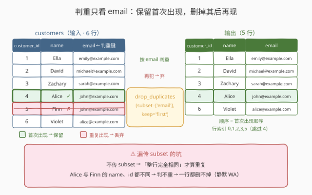
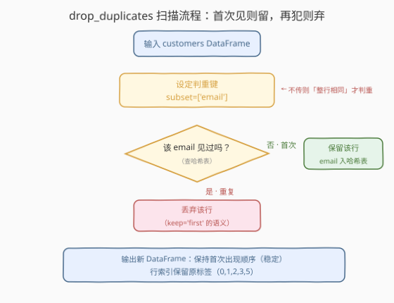
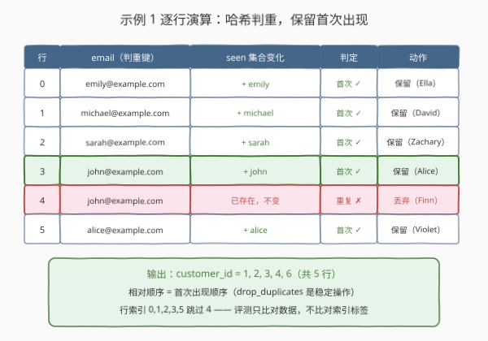

# LeetCode 删去重复的行 题解

## 1. 题目概述

- **标题 / 题号**：删去重复的行（#2882，easy）
- **链接**：https://leetcode.cn/problems/drop-duplicate-rows/
- **难度**：简单
- **标签**：Pandas、DataFrame 去重

**题意**：给定一个 DataFrame `customers`，结构如下：

```text
+-------------+--------+
| Column Name | Type   |
+-------------+--------+
| customer_id | int    |
| name        | object |
| email       | object |
+-------------+--------+
```

在 DataFrame 中基于 `email` 列存在一些**重复行**。编写一个解决方案，删除这些重复行，**仅保留第一次出现的行**。

**示例 1**：

```text
输入：
+-------------+---------+---------------------+
| customer_id | name    | email               |
+-------------+---------+---------------------+
| 1           | Ella    | emily@example.com   |
| 2           | David   | michael@example.com |
| 3           | Zachary | sarah@example.com   |
| 4           | Alice   | john@example.com    |
| 5           | Finn    | john@example.com    |
| 6           | Violet  | alice@example.com   |
+-------------+---------+---------------------+
输出：
+-------------+---------+---------------------+
| customer_id | name    | email               |
+-------------+---------+---------------------+
| 1           | Ella    | emily@example.com   |
| 2           | David   | michael@example.com |
| 3           | Zachary | sarah@example.com   |
| 4           | Alice   | john@example.com    |
| 6           | Violet  | alice@example.com   |
+-------------+---------+---------------------+
解释：
Alice (customer_id = 4) 和 Finn (customer_id = 5) 都使用 john@example.com，
因此只保留该邮箱地址的第一次出现。
```

**约束**：

- `customers` 的三列 schema 如上，判重键是 `email` 列（其余列**不参与**判重）
- 评测用例规模小（纯 API 题），性能不构成瓶颈

> 💡 本题是 LeetCode「Pandas 入门」系列的**去重课**，仅提供 Python（Pandas）提交入口。它与 SQL 题 [196. 删除重复的电子邮箱](https://leetcode.cn/problems/delete-duplicate-emails/) 是同一张 `customers` 表的孪生题——SQL 版要写自连接 `DELETE`，pandas 版一行 `drop_duplicates` 搞定。

## 2. 解题思路

### 2.1 暴力思路：Python 集合手工判重

最直白的做法：遍历 `email` 列，用 Python `set` 记录见过的邮箱，首次出现标 `True`、重复出现标 `False`，再用布尔掩码筛行：

```python
def dropDuplicateEmails(customers: pd.DataFrame) -> pd.DataFrame:
    seen, mask = set(), []
    for email in customers['email']:
        if email in seen:
            mask.append(False)
        else:
            seen.add(email)
            mask.append(True)
    return customers[mask]
```

- **正确性**：没问题——哈希判重 + 掩码筛选，且天然「保留首次出现」（首次见才标 `True`）。
- **啰嗦**：判重是 pandas 的一等公民操作（`drop_duplicates` / `duplicated`），逐行 Python 循环把向量化优势丢了个精光；掩码列表与 `set` 的维护也全靠人肉。

> ⚠️ 瓶颈不在性能而在**表达力**：这十几行代码做的事，pandas 原生 API 一个方法名就覆盖了。

### 2.2 核心观察：`drop_duplicates(subset, keep)`



`drop_duplicates` 只需记住两个参数：

| 参数 | 本题取值 | 语义 |
|------|----------|------|
| **`subset`** | `['email']` | 判重键：**只有该列的值相同**才算重复行 |
| **`keep`** | `'first'`（默认） | 每组重复中**保留第一次出现**的那行 |

一行成题：

```python
customers.drop_duplicates(subset=['email'], keep='first')
```

`keep='first'` 是默认值，题面「仅保留第一次出现的行」就是这个参数的直译——显式写出只是为了对齐题意。

> ⚠️ **最大的坑：漏传 `subset`**。不传时判重键退化成「**整行完全相同**才算重复」。本题 Alice（`id=4, john@…`）与 Finn（`id=5, john@…`）只是 `email` 相同，`name` 与 `customer_id` 都不同，整行并不相同——于是一行都删不掉，原表原样返回，**静默 WA**。这种「能跑通但语义错了」比报错更隐蔽。

顺带记住掩码形态：`customers[~customers.duplicated(subset='email')]`——`duplicated` 把每组重复中**后续再现的行**标 `True`，取反即「保留首次出现」，与 `drop_duplicates(keep='first')` 完全等价。

### 2.3 算法流程图



| 步骤 | 操作 | 说明 |
|------|------|------|
| ① 输入 | `customers: pd.DataFrame` | 6 行数据，`email` 列存在重复 |
| ② 定键 | `subset=['email']` | 判重只看 `email`；漏传则退化为整行判重 |
| ③ 扫描 | 哈希表逐行查 `email` | 首次出现 → 保留并入哈希表；重复出现 → 丢弃该行 |
| ④ 输出 | 返回新 DataFrame | 保持首次出现顺序；行索引**保留原标签**（有跳号） |

### 2.4 示例演算



以示例 1 逐行走查（`seen` 为判重哈希集合）：

| 行 | email（判重键） | seen 变化 | 首次？ | 动作 |
|----|-----------------|-----------|--------|------|
| 0 | emily@example.com | + emily | ✓ | 保留（Ella） |
| 1 | michael@example.com | + michael | ✓ | 保留（David） |
| 2 | sarah@example.com | + sarah | ✓ | 保留（Zachary） |
| 3 | john@example.com | + john | ✓ | **保留（Alice，首次出现）** |
| 4 | john@example.com | 已存在，不变 | ✗ | **丢弃（Finn，重复出现）** |
| 5 | alice@example.com | + alice | ✓ | 保留（Violet） |

输出 5 行（`customer_id` = 1, 2, 3, 4, 6），相对顺序与输入一致——`drop_duplicates` 是**稳定操作**，保留的行不重排；行索引为 `0, 1, 2, 3, 5`（跳过 4），LeetCode 评测只比对数据、不比对索引标签。

> 💡 一句话：**判重看 `email` 一列、去重留首次一行**——`subset` 定「看哪列」，`keep` 定「留哪行」。

## 3. 参考代码

### Python（pandas 一行版，推荐）

```python
import pandas as pd


def dropDuplicateEmails(customers: pd.DataFrame) -> pd.DataFrame:
    return customers.drop_duplicates(subset=['email'], keep='first')
```

> 💡 **写法要点**：
> - `keep='first'` 是默认值，省略亦可通过；显式写出只为表达题意「保留第一次出现」；
> - 返回的是**新 DataFrame**（拷贝语义），原 `customers` 不被修改；
> - 去重后行索引保留原标签（`0,1,2,3,5`），评测不受影响；需要连续索引可加 `ignore_index=True`。

### Python（duplicated 掩码版，理解原理）

```python
import pandas as pd


def dropDuplicateEmails(customers: pd.DataFrame) -> pd.DataFrame:
    return customers[~customers.duplicated(subset='email')]
```

> 💡 **对照说明**：`duplicated(subset='email')` 返回布尔 Series——每组重复中**首次出现的行标 `False`**、其后再现的行标 `True`；取反做掩码即「保留首次出现」。它就是 `drop_duplicates(keep='first')` 的掩码形态，适合调试时先看清「哪些行会被判为重复」。2.1 的手工版不过是把这个布尔序列用 Python 循环人肉生成了一遍。

## 4. 复杂度分析

| 维度 | 复杂度 | 说明 |
|------|--------|------|
| **时间复杂度** | $O(n)$ | $n$ 为行数：哈希判重每行 $O(1)$，单趟扫描 |
| **空间复杂度** | $O(n)$ | 判重哈希集合最多存 $n$ 个键；输出为数据拷贝 $O(n)$ |

> - 一行版与掩码版同为 $O(n) / O(n)$；本题的区分度在 **API 正确性**（`subset` 别漏传）而非性能。

## 5. 扩展：参数矩阵与「按优先级去重」套路

`drop_duplicates` 的完整参数矩阵：

| 参数 | 取值 | 语义 | 本题 |
|------|------|------|------|
| `subset` | 单标签 / 标签列表 / 不传 | 判重键；不传 = 整行完全相同才判重 | `['email']` |
| `keep` | `'first'`（默认）/ `'last'` / `False` | 保留首次 / 最后 / 重复组整组删除 | `'first'` |
| `ignore_index` | bool（默认 `False`） | `True` 时输出重置为 `RangeIndex` | 不需要 |
| `inplace` | bool（默认 `False`） | `True` 时原地修改并**返回 `None`** | 永远别在题解里用 |

`keep` 变体的效果对照（以示例 1 为例）：

- `keep='last'`：每组保留**最后**一次出现——Finn 留下、Alice 被删；
- `keep=False`：重复过的行**整组删除**——Alice 和 Finn 一起消失，只剩从未重复的 4 行。

**按任意优先级去重的通用套路**：孪生 SQL 题 196 要求保留 `id` 最小的那行（SQL 得写自连接 `DELETE`）。pandas 若要「保留 `id` 最小」而 `id` 与出现顺序不一致，**先排序再去重**：

```python
customers.sort_values('customer_id').drop_duplicates(subset='email')
```

> 💡 `sort → drop_duplicates` 是「按任意优先级去重」的万能模板：让想保留的行排在每组最前面，`keep='first'` 自然选中它。本题示例中 `id` 顺序恰好与出现顺序一致，所以不需要这一步。

## 6. 面试要点

**Q1：漏传 `subset` 会发生什么？为什么说这是本题最大的坑？**

> 判重键退化成「整行完全相同才算重复」。Alice 与 Finn 的行只是 `email` 相同、`name`/`customer_id` 不同，整行并不相同——一行都删不掉，原表原样返回，**静默 WA**。这类「能跑通但语义错了」的问题比抛异常更难排查，写去重语句时应把 `subset` 当成必填项审视。

**Q2：`keep` 的三个取值分别保留什么？**

> `'first'`：每组保留首次出现（默认，稳定、保持原相对顺序）；`'last'`：每组保留最后一次出现；`False`：重复组整组删除——只留下从未重复过的行。「想看重复的是谁」则配合 `duplicated(subset, keep=…)` 掩码筛选。

**Q3：`drop_duplicates` 返回的是视图还是新对象？`inplace=True` 好用吗？**

> 返回**新对象**（默认 `inplace=False`，拷贝语义），原表不动。`inplace=True` 原地修改但返回 `None`，链式调用直接断掉，且对未来 pandas 版本是候选移除项——工程上几乎总是用返回值写法。

**Q4：去重后行索引跳号（`0,1,2,3,5`），有影响吗？怎么处理？**

> 按位置取数、多数布尔/标签操作不受影响（LeetCode 评测也只比对数据不比对索引标签）。需要连续标签时加 `ignore_index=True`，或事后 `reset_index(drop=True)`；注意裸 `reset_index()` 会把旧索引升格成一列，别写漏 `drop=True`。

**Q5：`drop_duplicates` 与 `duplicated` 是什么关系？**

> 同一判重内核的两种输出形态：前者**直接删行**返回新表；后者返回**布尔掩码**（重复位标 `True`），交给你自己筛选。调试期用 `duplicated` 看清楚谁会被删，确认后换 `drop_duplicates` 落地，是最稳的工作流。

> 💡 **一句话总结**：2882 是 **`drop_duplicates` 的 `subset`/`keep` 第一课**——判重键只看 `email`、保留每组首次出现；最大的坑不是不会去重，而是漏传 `subset` 后整行判重导致一行都删不掉。

## 同类练习题

| # | 题目 | 与本题的关联 |
|---|------|-------------|
| 196 | [删除重复的电子邮箱](https://leetcode.cn/problems/delete-duplicate-emails/) | 本题的 SQL 孪生题——同一张 `customers` 表保留最小 `id`，对照 SQL 自连接 `DELETE` 与 pandas 一行去重 |
| 2883 | [删除丢失的数据](https://leetcode.cn/problems/drop-missing-data/) | `dropna`——与 `drop_duplicates` 同族的「行级清洗」动作 |
| 2884 | [修改列](https://leetcode.cn/problems/modify-columns/) | 列级变换练习，与本题的行级清洗形成行/列两个维度 |
| 2891 | [方法链](https://leetcode.cn/problems/method-chaining/) | 把选取、增列、排序、去重等动作串成链式调用的综合练习 |
