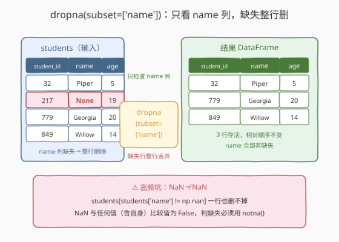
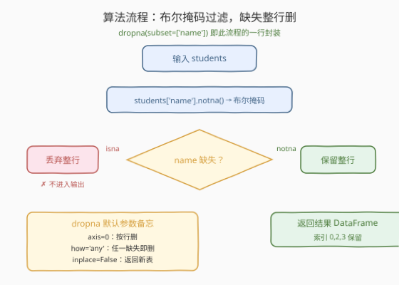
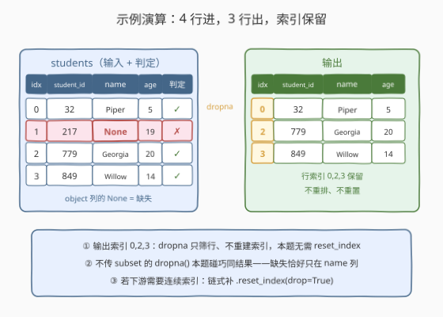

# LeetCode 删去丢失的数据 题解

## 1. 题目概述

- **标题 / 题号**：删去丢失的数据（#2883，easy）
- **链接**：https://leetcode.cn/problems/drop-missing-data/
- **难度**：简单
- **标签**：Pandas、缺失值处理、dropna

**题意**：给定一个 DataFrame `students`，其结构如下：

```text
DataFrame students
+-------------+--------+
| Column Name | Type   |
+-------------+--------+
| student_id  | int    |
| name        | object |
| age         | int    |
+-------------+--------+
```

在 `name` 列里有一些具有**缺失值**的行。编写一个解决方案，**删除具有缺失值的行**。

**示例 1**：

```text
输入：
+------------+---------+-----+
| student_id | name    | age |
+------------+---------+-----+
| 32         | Piper   | 5   |
| 217        | None    | 19  |
| 779        | Georgia | 20  |
| 849        | Willow  | 14  |
+------------+---------+-----+
输出：
+------------+---------+-----+
| student_id | name    | age |
+------------+---------+-----+
| 32         | Piper   | 5   |
| 779        | Georgia | 20  |
| 849        | Willow  | 14  |
+------------+---------+-----+
解释：
学号为 217 的学生所在行在 name 列中有空值，因此这一行将被删除。
```

**约束**：

- `students` 共 3 列：`student_id`（int）、`name`（object）、`age`（int）
- 缺失值只出现在 `name` 列（object 列中以 `None` 表示）
- 数据规模在 $10^3$ 量级（纯 API 题，规模不构成瓶颈）

> 💡 本题属于 LeetCode「Pandas 入门」系列，仅提供 Python（Pandas）提交入口。它考察的不是算法，而是 pandas **缺失值语义**的第一手熟悉度：`None`/`NaN` 如何统一识别、`dropna` 的 `subset` 参数怎么把检查范围钉死在指定列、以及为什么判缺失永远不能走 `!=`。

## 2. 解题思路

### 2.1 暴力思路：手工逐行扫描，与一个直觉陷阱

最直白的做法：逐行遍历，手工判断 `name` 是否缺失，攒下要保留的行索引再取子表：

```python
def dropMissingData(students: pd.DataFrame) -> pd.DataFrame:
    keep = []
    for i, row in students.iterrows():
        if pd.notna(row['name']):
            keep.append(i)
    return students.loc[keep]
```

- **正确性**：没问题——`pd.notna` 能同时识别 `None` 与 `NaN`。
- **啰嗦且慢**：`iterrows` 每行都要临时构造一个 `Series`，$n$ 行就是 $n$ 次对象开销；而「判缺失 → 攒索引 → 再取行」这三步，pandas 有原生的一等公民 API 一站式完成。

更值得警惕的是**直觉写法**的陷阱：

```python
students[students['name'] != np.nan]   # ❌ 一行也删不掉！
```

> ⚠️ **NaN 不等于任何值，包括它自己**。IEEE 754 规定 `NaN == x` 对一切 $x$（含 `NaN` 自身）都返回 `False`，取反后 `!=` 恒为 `True`——缺失行同样被判定为「不等于 NaN」而全部保留，过滤完全失效且**不报任何错**。object 列里的 `None` 与 `np.nan` 之间也不相等。**缺失值判断永远不要走 `==`/`!=`，必须走 `isna()`/`notna()`**。

### 2.2 核心观察：`dropna(subset=[...])` —— 判缺失走 API，检查范围用 subset 钉死



pandas 对「缺失」有一套**统一语义**：`None`（object 列）、`NaN`（float 列）、`NaT`（时间列）、`pd.NA`（可空 dtype）统统被 `isna()`/`notna()` 识别。而 `dropna` 本质上就是「布尔掩码过滤」的官方封装：

```python
students.dropna(subset=['name'])
# 语义等价于
students[students['name'].notna()]
```

两个关键点：

| 关键点 | 说明 |
|--------|------|
| **subset 参数** | 把「检查范围」限定为 `name` 列——只有 `name` 缺失才删行；不传则检查**所有列**，任何列缺都删 |
| **整行删除** | 命中缺失删的是**行**（默认 `axis=0`），`student_id`、`age` 再完整也一并丢弃 |

> ⚠️ 本题缺失恰好只出现在 `name` 列，所以不传 `subset` 的 `dropna()` 结果碰巧相同。但这是**数据巧合，不是语义等价**——一旦 `age` 列将来混入 `NaN`，不传 `subset` 的行为立刻偏离题意。把隐式约束写显式，是 `subset` 的真正价值。

### 2.3 算法流程图



| 步骤 | 操作 | 说明 |
|------|------|------|
| ① 输入 | `students: pd.DataFrame` | 3 列，`name` 列可能含 `None` |
| ② 选列 | `subset=['name']` | 只把 `name` 列纳入判缺范围 |
| ③ 判缺 | `notna()` 生成布尔掩码 | `None`/`NaN` 统一识别，掩码长度 = 行数 |
| ④ 过滤 | 掩码为 `True` 的行保留 | 缺失行**整行**丢弃（`axis=0`、`how='any'` 均为默认） |
| ⑤ 输出 | 返回**新** DataFrame | 原表不动；行索引保留原值不重置 |

### 2.4 示例演算



以示例 1 逐行走查：

| 行索引 | student_id | name | name 判缺 | 结果 |
|--------|------------|---------|-----------|------|
| 0 | 32 | Piper | 非缺失 | 保留 |
| 1 | 217 | None | **缺失** | **删除** |
| 2 | 779 | Georgia | 非缺失 | 保留 |
| 3 | 849 | Willow | 非缺失 | 保留 |

注意输出表的行索引是 **0, 2, 3**——`dropna` 只按掩码筛行，**不重排、不重置索引**。本题评测只比对数据行，索引不参与比对，无需处理；若下游需要连续索引，链式补一个 `.reset_index(drop=True)` 即可。

## 3. 参考代码

### Python（pandas 一行版，推荐）

```python
import pandas as pd


def dropMissingData(students: pd.DataFrame) -> pd.DataFrame:
    return students.dropna(subset=['name'])
```

> 💡 **写法要点**：
> - `subset=['name']` 显式钉死检查范围——即使其他列将来出现缺失，行为也不漂移；
> - 默认 `axis=0`（按行删）、`how='any'`（任一缺失即删）、`inplace=False`（返回新表），本题全部用默认值；
> - 返回即可：行内容、行索引、列顺序全部保持。

### Python（布尔掩码版，理解原理）

```python
import pandas as pd


def dropMissingData(students: pd.DataFrame) -> pd.DataFrame:
    return students[students['name'].notna()]
```

> 💡 **对照说明**：`dropna(subset=['name'])` 展开就是这一行——`notna()` 对 `name` 列生成等长布尔掩码，方括号取行时掩码为 `True` 的行整体保留。它存在的意义是让你看清楚：**dropna 没有魔法，只是把「判缺失 + 掩码过滤」打包成了官方 API**。工程里优先写 `dropna`（意图更直白），需要复杂组合条件时再退回掩码写法。

## 4. 复杂度分析

| 维度 | 复杂度 | 说明 |
|------|--------|------|
| **时间复杂度** | $O(n)$ | $n$ 为行数：对 `name` 列单趟扫描生成掩码 + 按掩码筛选行 |
| **空间复杂度** | $O(n)$ | 布尔掩码 $O(n)$；返回的新 DataFrame 物化全部保留行（默认拷贝） |

> - 布尔掩码版同样是 $O(n)/O(n)$——两者只是 API 封装层级不同，量级完全一致。
> - $10^3$ 量级下任何写法都瞬时完成，本题的区分度在**缺失值语义的正确性**而非性能。

## 5. 扩展：`dropna` 的完整参数面板与「删 vs 补」

`dropna` 是数据清洗出场率最高的 API 之一，本题只用了 `subset`。完整签名：`dropna(axis=0, how='any', thresh=None, subset=None, inplace=False)`。

| 参数 | 默认 | 作用 | 记忆点 |
|------|------|------|--------|
| `axis` | `0` | `0`/`'index'` 删**行**；`1`/`'columns'` 删**列** | 删行是常态；删列慎用（整列特征没了） |
| `how` | `'any'` | `'any'` 任一缺失即删；`'all'` 全缺失才删 | 与 SQL 的 `ANY`/`ALL` 语义一致 |
| `thresh` | `None` | 保留**至少有 thresh 个非缺失值**的行 | 是「留下多少个非缺失」，不是「允许多少缺失」 |
| `subset` | `None` | 限定检查的列集合（本题关键） | 隐式约束写显式 |
| `inplace` | `False` | `True` 时原地修改并返回 `None` | 永远不要 `return df.dropna(..., inplace=True)` |

**删 vs 补的抉择**：缺失值处理的另一条路是**填充**（2887 的 `fillna`）。删行会丢样本、改变行数；补值保住行数但引入「假数据」。工程上按缺失比例与业务含义选：缺失少且随机 → 删；缺失有语义（如「未填写」）→ 补占位值；数值列低缺失率 → 补均值/中位数。

## 6. 面试要点

**Q1：为什么 `students[students['name'] != np.nan]` 一行也删不掉？**

> IEEE 754 规定 `NaN` 与任何值（包括它自己）做 `==` 比较都是 `False`，取反后 `!=` 对**所有行**（含缺失行）恒为 `True`，于是什么也过滤不掉，且全程不报错。object 列里的 `None` 与 `np.nan` 互不相等，同理失效。缺失值判断必须走 `isna()`/`notna()` 这类专用 API——这是 pandas 的铁律。

**Q2：不传 `subset` 直接 `dropna()` 在本题能过吗？为什么仍推荐带上？**

> 能过——本题缺失只出现在 `name` 列，两种写法结果恰好相同。但语义不同：不传 `subset` 时**任何列**出现缺失都会删行，正确性依赖「数据恰好长什么样」；`subset=['name']` 把检查范围钉死在题目指定的列上，把数据巧合升级为显式代码契约。数据一变，前者悄悄错，后者稳如磐石。

**Q3：`dropna` 之后行索引会重置吗？什么时候需要 `reset_index`？**

> 不会重置——`dropna` 按布尔掩码筛行，保留原索引（本题输出索引为 0, 2, 3）。是否重置看下游：本题评测只比对数据行，不需要；若后续要做 `loc` 连续切片或与其他表按位置对齐，用 `.reset_index(drop=True)` 换连续索引，`drop=True` 防止旧索引被塞进数据列变成新列。

**Q4：`NaN` 和 `None` 有什么区别？pandas 如何统一处理？**

> `None` 是 Python 单例对象，只能住 `object` 列，参与数值运算会报错或拖慢向量化；`NaN` 是 IEEE 754 浮点值，是数值列的缺失占位（出现即让整数列退化成 `float64`）。pandas 的 `isna()`/`notna()` 把两者（外加 `NaT`、`pd.NA`）统一识别为缺失——这正是「判缺失必须走 API」的根本原因：缺失值的表示形态不唯一，`==` 比较根本覆盖不了。

**Q5：`dropna` 会修改原 DataFrame 吗？`inplace=True` 有什么坑？**

> 默认 `inplace=False`：返回过滤后的**新** DataFrame，原表不动，链式调用安全。`inplace=True` 则原地修改并返回 `None`——写成 `return students.dropna(subset=['name'], inplace=True)` 会把 `None` 返回给调用方，属于「表对了、返回值错了」的静默失败。新代码建议永远用返回值写法。

> 💡 **一句话总结**：2883 是 **Pandas 缺失值处理第一课**——`dropna(subset=['name'])` 一行删净：**判缺失走 `notna` 不走 `!=`、检查范围用 `subset` 钉死、命中整行删且行索引保留**。

## 同类练习题

| # | 题目 | 与本题的关联 |
|---|------|-------------|
| 2887 | [填充缺失值](https://leetcode.cn/problems/fill-missing-data/) | `fillna`——缺失值处理的另一条路「补」，与本题的「删」对照着练 |
| 2886 | [改变数据类型](https://leetcode.cn/problems/change-data-type/) | `astype` 转换列类型——缺失值会让整数列退化成 `float64`，与本题 `NaN` 语义直接相关 |
| 2881 | [创建新列](https://leetcode.cn/problems/create-a-new-column/) | `df['new'] = ...` 增列，Pandas 入门系列同组题，练习行/列操作的正交性 |
| 2885 | [重命名列](https://leetcode.cn/problems/rename-columns/) | `rename` 改 schema——与本题同为「一行 API」型入门题 |
| 2884 | [修改列](https://leetcode.cn/problems/modify-columns/) | 整列就地改写，承接 2881 的列操作主题 |
