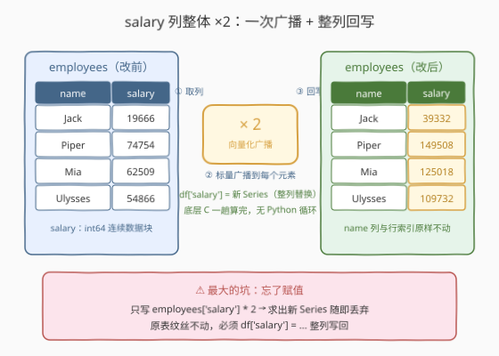
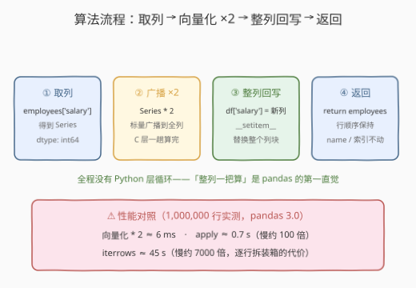
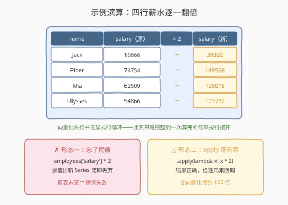

# 修改列

- **题目名称**：修改列
- **链接**：[2884. 修改列](https://leetcode.cn/problems/modify-columns/)
- **难度**：简单
- **标签**：Pandas、向量化、列操作

## 1. 题目概述

一家公司决定给员工涨薪（翻倍）。编写一个解决方案，**将每个员工的薪水乘以 2** 来**修改** `salary` 列，返回修改后的结果。

DataFrame `employees`：

```text
+-------------+--------+
| Column Name | Type   |
+-------------+--------+
| name        | object |
| salary      | int    |
+-------------+--------+
```

**示例 1**：

```text
输入：
DataFrame employees
+---------+--------+
| name    | salary |
+---------+--------+
| Jack    | 19666  |
| Piper   | 74754  |
| Mia     | 62509  |
| Ulysses | 54866  |
+---------+--------+
输出：
+---------+--------+
| name    | salary |
+---------+--------+
| Jack    | 39332  |
| Piper   | 149508 |
| Mia     | 125018 |
| Ulysses | 109732 |
+---------+--------+
解释：
每个人的薪水都被加倍。
```

**约束条件**：

- `employees` 仅含 `name`（object）与 `salary`（int）两列
- `salary` 为整数列，乘 2 后仍在 `int64` 表示范围内（规模不构成瓶颈）
- 官方 hint：只需一次简单赋值，**计算按列进行**（column-wise）

> 💡 本题是 LeetCode「Pandas 入门」系列的**修改列**一课，仅提供 Python（Pandas）提交入口。它考察的不是算法，而是两个最常用的 pandas 动作：**列级（向量化）算术运算**与 **`df['col'] = ...` 整列赋值**。这组动作是日后所有特征工程「改列」的原子操作。

---

## 2. 解题思路

### 2.1 暴力思路：逐行循环改值

最直白的做法：把表当成「行的集合」，用 Python 循环逐行读出、乘 2、写回：

```python
for i in range(len(employees)):
    employees.loc[i, 'salary'] *= 2
```

- **正确性**：能过。但这是「披着 pandas 的皮写原生 Python」——每一行都要从 pandas 内部数据块中拆箱成 Python 对象，算完再装回去，连续内存的优势荡然无存。
- **性能**：百万行实测（pandas 3.0）：向量化 `* 2` 约 **6ms**，`apply` 逐元素约 **0.7s**（慢约 100 倍），`iterrows` 逐行约 **45s**（慢约 7000 倍）。

> ⚠️ 瓶颈不在正确性而在**姿势**：pandas 的第一直觉永远是「整列一把算」，而不是「逐个元素算」。

### 2.2 核心观察：标量广播 ×2 + 整列赋值回写



两步合成一句：

```python
employees['salary'] = employees['salary'] * 2
```

拆开看这条语句的三个语义：

| 片段 | 动作 | 语义 |
|------|------|------|
| `employees['salary']` | **取列** | 拿到 `salary` 这一列的 Series（`int64` 连续数据块） |
| `* 2` | **广播运算** | 标量 2 被「广播」到每个元素，整列一次算完（底层 C 循环） |
| `employees['salary'] =` | **整列替换** | 把新数组整列写回 DataFrame，替换旧的 `salary` 块 |

**广播（broadcasting）** 是关键：`Series * 标量` 不是循环调用，而是把标量扩展到列长度后做一次**向量化乘法**——这正是 pandas/numpy 为数据列设计的快路径。而 `df['col'] = ...` 走的是 `__setitem__`，它**整列替换**数据块：`name` 列、行索引、行顺序都原封不动，dtype 保持 `int64`。

> ⚠️ **两个高频坑**：
> 1. **忘了赋值**：只写 `employees['salary'] * 2` 只是求出一个新 Series 然后丢弃，原表纹丝不动——必须 `employees['salary'] = ...` 写回；
> 2. **属性赋值**：`employees.salary = ...` 对已有列目前碰巧可用，但官方不鼓励、且**无法创建新列**（会退化成普通 Python 属性）。养成习惯：**列操作一律用方括号**。

### 2.3 算法流程图



| 步骤 | 操作 | 说明 |
|------|------|------|
| ① 取列 | `employees['salary']` | 得到 Series，dtype 为 `int64` |
| ② 广播 | `* 2` | 标量广播到全列，一次向量化乘法，产出新 Series |
| ③ 回写 | `employees['salary'] = ...` | `__setitem__` 整列替换，`name`/行索引不动 |
| ④ 返回 | `return employees` | 表结构与行顺序保持，仅 `salary` 值翻倍 |

### 2.4 示例演算



以示例 1 逐行走查（注意：向量化执行时并没有显式的行循环，下表只是把整列一次算完的结果按行摆开）：

| name | salary（原） | 运算 | salary（新） |
|------|--------------|------|--------------|
| Jack | 19666 | $19666 \times 2$ | 39332 |
| Piper | 74754 | $74754 \times 2$ | 149508 |
| Mia | 62509 | $62509 \times 2$ | 125018 |
| Ulysses | 54866 | $54866 \times 2$ | 109732 |

对照两种典型形态：

- **忘赋值**：`employees['salary'] * 2` 求值即丢，返回的表薪水未变——评测失败；
- **apply 版**：`apply(lambda x: x * 2)` 结果正确，但逐元素回调比向量化慢约两个量级，属于「能用但不专业」。

> 💡 一句话：**取出列、整列乘、整列写回**——三个动作合成一行，就是 pandas 改列的全部。

---

## 3. 参考代码

### Python（向量化就地修改，推荐）

```python
import pandas as pd


def modifySalaryColumn(employees: pd.DataFrame) -> pd.DataFrame:
    employees['salary'] = employees['salary'] * 2
    return employees
```

> 💡 **写法要点**：
> - `* 2` 作用在整列上（广播），没有 Python 层循环；
> - 赋值目标用方括号列名，避开属性赋值的坑；
> - 就地修改后返回同一对象，行顺序、`name` 列、行索引均保持。

### Python（assign 函数式版本，不改原表）

```python
import pandas as pd


def modifySalaryColumn(employees: pd.DataFrame) -> pd.DataFrame:
    return employees.assign(salary=employees['salary'] * 2)
```

> 💡 **对照说明**：`assign` 返回**新的 DataFrame**，原表不被改动（实测原列保持旧值）。这是函数式/链式风格——适合把一串变换串成管道的写法。本题只改一列，两种写法评测都通过。

### Python（apply 逐元素版，不推荐）

```python
import pandas as pd


def modifySalaryColumn(employees: pd.DataFrame) -> pd.DataFrame:
    employees['salary'] = employees['salary'].apply(lambda x: x * 2)
    return employees
```

> ⚠️ **性能对照**（1,000,000 行实测，pandas 3.0）：向量化 ≈ 6ms，apply ≈ 0.7s——**慢约 100 倍**。`apply` 的回调是 Python 函数，每个元素都要进出一次解释器；只有当运算无法向量化（复杂分支逻辑）时才退而求其次。

---

## 4. 复杂度分析

| 维度 | 复杂度 | 说明 |
|------|--------|------|
| **时间复杂度** | $O(n)$ | $n$ 为行数：向量化乘法对整列做一趟连续内存运算 |
| **空间复杂度** | $O(n)$ | `* 2` 物化一个新数组，回写时整列替换旧块（旧块随后释放） |

> - 三种写法都是 $O(n)/O(n)$——差异在**常数**：向量化在 C 层一趟完成，apply/iterrows 每个元素都跨一次 Python 边界，常数差出两到四个数量级。
> - 本题数据规模极小，任何写法都能过；区分度在**姿势正确性**（赋值写回、方括号取列）而非性能。

---

## 5. 扩展：改列的四种姿势与 Copy-on-Write

修改（已存在）列的常用写法一网打尽：

| 写法 | 就地/新建 | 说明 |
|------|-----------|------|
| `df['col'] = df['col'] * 2` | 就地 | 本题推荐：直白、最快 |
| `df['col'] *= 2` | 就地 | 增强赋值，与上行完全等价 |
| `df['col'] = df['col'].mul(2)` | 就地 | 方法形式，方便链式与传参（如 `mul(other, fill_value=...)`） |
| `df = df.assign(col=df['col'] * 2)` | 新建 | 函数式，不改原表，适合管道串联 |

**三个值得记住的细节**：

1. **Copy-on-Write（CoW）**：pandas 2.x 可开关、3.0 起默认启用。CoW 下「就地赋值」`df['col'] = ...` 依旧安全合法，被宣判死刑的是**链式赋值** `df[df.name == 'Jack']['salary'] = 0`——它改的从来都是临时副本（实测原表不变并触发 `ChainedAssignmentError` 警告）。正确写法是单次定位：`df.loc[df.name == 'Jack', 'salary'] = 0`；
2. **dtype 稳定性**：`int64` 列乘整型标量仍是 `int64`（不溢出的前提下）；但若列中混入 `NaN`，整列会退化为 `float64`——做精确整数比对或展示前要留意；
3. **改已有列 vs 建新列**：`df['salary'] = ...` 若列名已存在是**替换**，不存在则是**新增**——同一个动作的两副面孔（新列的专门练习见 2881）。

---

## 6. 面试要点

**Q1：向量化 `df['col'] * 2` 为什么比 `apply` 快两个量级？**

> `Series * 标量` 在底层对连续 `int64` 块做一次 C 级批量乘法，标量广播不产生任何 Python 调用；`apply` 要为每个元素回调一次 Python 函数，每次调用都有解释器出入开销。百万行实测：约 6ms vs 0.7s。

**Q2：只写 `employees['salary'] * 2`，原表变了吗？**

> 没变。乘法只是**求值**出一个新的 Series，没有写回；不赋值给任何名字，结果即被丢弃。必须 `employees['salary'] = ...`（`__setitem__`）触发整列替换——这是「表达式」与「语句」的区别。

**Q3：就地修改（`df['col'] = ...`）与返回新表（`assign`）怎么选？**

> 就地版省内存、代码短，但会**改动调用方传入的表**——若外层还会复用原表就有副作用；`assign` 不动原表、可链式串联多步变换，是函数式风格。小脚本就地无妨，库代码/管道里倾向 `assign` 或显式 `copy()`。

**Q4：链式赋值 `df[mask]['salary'] = 0` 为什么不生效？CoW 时代怎么写？**

> `df[mask]` 先物化一个**临时子表**，随后的赋值落在临时表上，原表毫发无损——这正是 Copy-on-Write 机制下被彻底禁止的模式。正确姿势是单次定位：`df.loc[mask, 'salary'] = 0`。

**Q5：乘 2 之后 `salary` 的 dtype 还是 `int64` 吗？什么时候会悄悄变？**

> 正常是——整型列乘整型标量保持 `int64`。两种例外：值溢出 `int64` 上限（本题规模不可能）；或列中存在 `NaN`（整列退化为 `float64`）。做精确整数比对前应检查 `df['salary'].dtype`。

> 💡 **一句话总结**：2884 是 **Pandas 改列第一课**——`employees['salary'] = employees['salary'] * 2`：**取列、整列乘、整列写回**。记住「向量化优先、赋值别忘、方括号万岁」，就掌握了日后所有特征工程改列的原子动作。

---

## 7. 同类练习题

- [2877. 从表中创建 DataFrame](https://leetcode.cn/problems/create-a-dataframe-from-list/)：先有表才能改列——构造是本题的前置动作
- [2881. 创建新列](https://leetcode.cn/problems/create-a-new-column/)：同一个 `df['col'] = ...`，列名不存在时是新增、存在时是替换——与本题互为两副面孔
- [2885. 重命名列](https://leetcode.cn/problems/rename-columns/)：`rename` 改的是列**名字**，本题改的是列**值**
- [2880. 数据选取](https://leetcode.cn/problems/select-data/)：按列名/布尔掩码选取子表——列家族操作的「读取」方向
