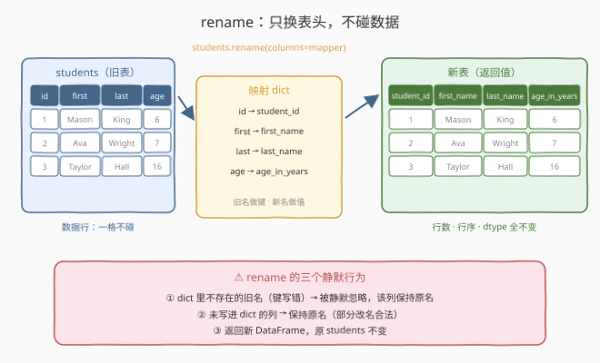
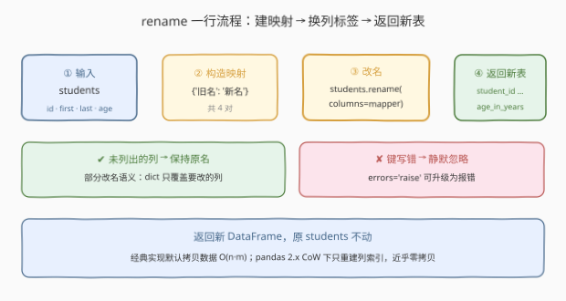
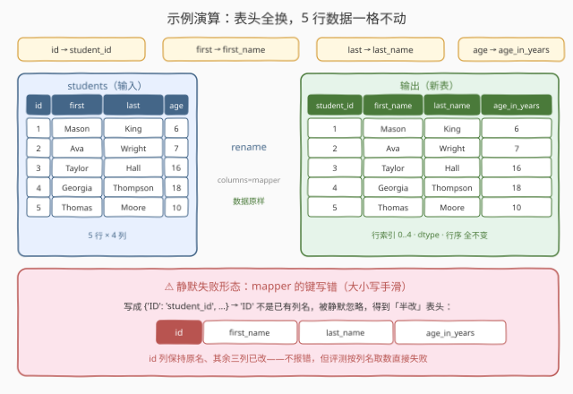

# 重命名列

- **题目名称**：重命名列
- **链接**：[2885. 重命名列](https://leetcode.cn/problems/rename-columns/)
- **难度**：简单
- **标签**：Pandas、DataFrame 列操作

## 1. 题目概述

编写一个解决方案，将 DataFrame `students` 的列按下述映射**重命名**：

| 原列名 | 新列名 |
|--------|--------|
| `id` | `student_id` |
| `first` | `first_name` |
| `last` | `last_name` |
| `age` | `age_in_years` |

**示例 1**：

```text
输入：
+----+---------+----------+-----+
| id | first   | last     | age |
+----+---------+----------+-----+
| 1  | Mason   | King     | 6   |
| 2  | Ava     | Wright   | 7   |
| 3  | Taylor  | Hall     | 16  |
| 4  | Georgia | Thompson | 18  |
| 5  | Thomas  | Moore    | 10  |
+----+---------+----------+-----+
输出：
+------------+------------+-----------+--------------+
| student_id | first_name | last_name | age_in_years |
+------------+------------+-----------+--------------+
| 1          | Mason      | King      | 6            |
| 2          | Ava        | Wright    | 7            |
| 3          | Taylor     | Hall      | 16           |
| 4          | Georgia    | Thompson  | 18           |
| 5          | Thomas     | Moore     | 10           |
+------------+------------+-----------+--------------+
解释：
列名已相应更换。
```

**约束条件**：

- 表结构固定为 `id`（int）、`first`（object）、`last`（object）、`age`（int）四列
- Pandas 系列题：仅提供 Python（Pandas）提交入口，无 C++ 等语言
- 数据规模不构成瓶颈（考察 API 语义而非算法）

> 💡 本题是 LeetCode「Pandas 入门」系列的**改名题**，官方 hint 直接点名"用 pandas 内置函数 + 字典"。它考察的是 `rename` 的字典映射语义——注意改的是**表头（schema 元信息）**，一格数据都不碰。承接 2877（构造时贴列名）→ 2881（加列）→ 2884（改列值）之后的「改列名」环节。

---

## 2. 解题思路

### 2.1 暴力思路：重建整表 / 直接改 columns 属性

两种"绕开 `rename`"的写法。

**写法 A——按新名重新拼一张表**：

```python
def renameColumns(students: pd.DataFrame) -> pd.DataFrame:
    return pd.DataFrame({
        'student_id': students['id'],
        'first_name': students['first'],
        'last_name': students['last'],
        'age_in_years': students['age'],
    })
```

- **正确性**没问题，但每个列名要写两遍（取一遍、贴一遍），列一多就是体力活；
- 语义上是"重造"而不是"改名"——数据被整体搬运，行索引、dtype 靠构造器重新推断。

**写法 B——直接给 `columns` 属性赋值**：

```python
def renameColumns(students: pd.DataFrame) -> pd.DataFrame:
    students.columns = ['student_id', 'first_name', 'last_name', 'age_in_years']
    return students
```

- 能过本题，但它是**按位置**贴名：不看旧名、全量替换。列序一旦与预期不符（比如上游加了一列、调了两列顺序），新名就会整体错位，且无声；
- 原地修改了入参 `students`，带副作用。

> ⚠️ 瓶颈不在性能而在**语义**："改列名"是 schema 层的操作，pandas 有专门的 API 一等公民支持——`rename`。它按**旧名**查、按**新名**贴，天然免疫列序变化。

### 2.2 核心观察：`rename` + 字典映射——只换表头，不碰数据



`df.rename(columns=mapper)` 的语义一句话概括：**用一张「旧名 → 新名」的对照表，替换列索引（`df.columns`）里的标签，数据块一格不动**。

三个关键行为：

1. **按名映射，不依赖列序**：dict 的键是旧列名、值是新列名。列的物理顺序、行数、dtype、行索引都不受影响——天然免疫写法 B 的错位风险。
2. **部分改名合法**：没有出现在 dict 里的列**保持原名**。`rename` 不要求映射覆盖全表（本题恰好全覆盖）。
3. **返回新表**：`rename` 默认返回一个**新的 DataFrame**，原 `students` 不被修改。LeetCode 评测的是返回值，直接 `return` 即可，不需要也不建议 `inplace=True`。

> ⚠️ **最大的坑**：dict 里写了一个**不存在的旧名**（比如手滑把 `'id'` 写成 `'ID'`），`rename` **不报错、静默忽略**（`errors` 参数默认 `'ignore'`）——该列保持原名，其余列照常改。表能返回、不抛异常，但列名是错的，评测按列名取数直接失败。这种"半改"状态比报错难排查得多。

### 2.3 算法流程图



| 步骤 | 操作 | 说明 |
|------|------|------|
| ① 输入 | `students` | 四列旧名 `id / first / last / age` |
| ② 建映射 | `{'id': 'student_id', ...}` | 旧名做**键**、新名做**值**，共 4 对 |
| ③ 改名 | `students.rename(columns=mapper)` | 替换列索引标签，数据块不动 |
| ④ 输出 | `return` 新表 | 原 `students` 不变；未列出的列保持原名 |

### 2.4 示例演算



以示例 1 逐列走查：

| 原列名 | → 新列名 | 列数据变化 |
|--------|----------|------------|
| `id` | `student_id` | 无（1..5 原样） |
| `first` | `first_name` | 无（Mason/Ava/... 原样） |
| `last` | `last_name` | 无（King/Wright/... 原样） |
| `age` | `age_in_years` | 无（6/7/16/18/10 原样） |

对照失败形态：mapper 键写成 `'ID'`（大小写手滑）→ `'ID'` 不是已有列名被静默忽略 → 输出表头变成 `id | first_name | last_name | age_in_years`——**只有 `id` 没改**，不报错但评测失败。

> 💡 一句话：**数据一格不动，只换表头**。改名后拿 `list(df.columns)` 与预期比对一遍，是防"半改"最便宜的自检。

---

## 3. 参考代码

### Python（rename 字典映射版，推荐）

```python
import pandas as pd


def renameColumns(students: pd.DataFrame) -> pd.DataFrame:
    return students.rename(columns={
        'id': 'student_id',
        'first': 'first_name',
        'last': 'last_name',
        'age': 'age_in_years',
    })
```

> 💡 **写法要点**：
> - 旧名做**键**、新名做**值**，方向别写反（反了等于拿新名当旧名去查，四对全部静默忽略，一个列名都改不了）；
> - 直接 `return`：`rename` 返回新 DataFrame，原表不动；
> - 列名是字符串，别漏引号。

### Python（columns 位置赋值版，对照）

```python
import pandas as pd


def renameColumns(students: pd.DataFrame) -> pd.DataFrame:
    students.columns = ['student_id', 'first_name', 'last_name', 'age_in_years']
    return students
```

> ⚠️ **对照说明**：按**位置**全量替换列标签，能过本题，但有两个隐患——①不看旧名，列序一旦变化整体错位；②原地修改入参（副作用）。仅作理解对照，实战优先 `rename`。

---

## 4. 复杂度分析

| 维度 | 复杂度 | 说明 |
|------|--------|------|
| **时间复杂度** | $O(n \times m)$（经典实现） | 经典 `rename` 默认拷贝底层数据（$n$ 行 $m$ 列）；pandas 2.x 开启 Copy-on-Write 后只重建 $m$ 个列标签，近乎 $O(m)$ |
| **空间复杂度** | $O(n \times m)$（经典实现） | 同上：新表物化的成本；CoW 下数据零拷贝，仅 $O(m)$ 新列索引 |

> - 本题固定 4 列、行数 $10^3$ 量级，任何写法都瞬时完成，区分度在 **API 语义正确性**而非性能。
> - `columns` 直接赋值版无论如何都只重建列索引（$O(m)$），量级上反而是三种写法里最便宜的——选它与否的取舍在语义安全性，不在复杂度。

---

## 5. 扩展：列名变更的三种姿势

| 方式 | 依据 | 返回 | 部分改名 | 典型风险 |
|------|------|------|----------|----------|
| `df.rename(columns=dict)` | **按旧名** | 新表 | ✅ 支持 | 键写错被**静默忽略** |
| `df.columns = [...]` | 按位置 | 原地修改 | ❌ 全量 | 列序漂移错位、副作用 |
| `df.set_axis([...], axis=1)` | 按位置 | 新表 | ❌ 全量 | 同样依赖列序 |

`rename` 的 mapper 不止 dict：

- **函数映射**：`df.rename(columns=str.title)`（列名批量首字母大写）、`df.rename(columns=lambda c: c.strip())`（去首尾空白）——mapper 是函数时作用于**每一个**列名，取返回值作新名。dict 适合"个别改名"，函数适合"批量规则化"；
- **行索引也能改**：`df.rename(index={0: 'row0'})`（或 `axis=0`）；MultiIndex 用 `level` 指定层级；
- **开启键校验**：`df.rename(columns=mapper, errors='raise')` 把"键不存在"从静默忽略升级为 `KeyError`，是治"半改"顽疾的官方姿势；
- **批量规范列名**的另一思路：`df.columns = [c.lower() for c in df.columns]`——本质还是位置赋值，胜在直白。

---

## 6. 面试要点

**Q1：`rename` 会修改原 DataFrame 吗？返回值是什么？**

> 不会。`rename` 默认返回一个**新的 DataFrame**，原表的列名、数据都保持不变。pandas 2.x 在 Copy-on-Write 语境下推荐 `df = df.rename(...)` 的显式重新绑定写法；LeetCode 判定返回值，直接 `return` 即可。

**Q2：映射字典的键写错了（如 `'id'` 写成 `'ID'`）会发生什么？**

> **静默忽略**——`rename` 的 `errors` 参数默认 `'ignore'`：dict 中找不到的旧名直接跳过，不报错。结果是"半改"状态：其余列正常换名，写错键的列保持原名。排查时可显式传 `errors='raise'`，或断言 `list(df.columns) == ['student_id', 'first_name', 'last_name', 'age_in_years']`。

**Q3：没写进字典的列会丢失吗？**

> 不会。`rename` 是**部分改名**语义：只替换字典覆盖到的列，其余列**保持原名**照常出现在返回表里。这也是它与 `df.columns = [...]`（全量替换）的重要区别。

**Q4：`rename` 与直接赋值 `df.columns` 的本质区别是什么？**

> 三个维度：**依据**（按旧名 vs 按位置）、**副作用**（返回新表 vs 原地修改）、**覆盖语义**（部分 vs 全量）。按名映射天然免疫列序变化，是"改名"这件事最精确的语义表达；按位置赋值则把正确性押在"列序永远不变"这个假设上。

**Q5：`rename` 的 mapper 可以是函数吗？什么时候有用？**

> 可以。传函数时它作用于**每个列名**并取返回值作为新名，如 `columns=str.lower` 统一小写、`columns=lambda c: c.replace(' ', '_')` 规范化列名。适合清洗来源不规范的宽表（数据库导出、Excel 读取）的场景。

> 💡 **一句话总结**：2885 是 **Pandas 改名一课**——`students.rename(columns={'旧名': '新名', ...})`：**按名映射、只换表头、返回新表**。最大的坑不是不会 rename，而是键写错后的静默"半改"。

---

## 7. 同类练习题

- [2877. 从表中创建 DataFrame](https://leetcode.cn/problems/create-a-dataframe-from-list/)：`pd.DataFrame(data, columns=[...])` 在构造时贴列名——构造时命名 vs 事后改名，同一条 schema 主线的两端
- [2881. 创建新列](https://leetcode.cn/problems/create-a-new-column/)：`df['new'] = ...` 增列，与改名同属"列集合/列名"层面的元操作
- [2884. 修改列](https://leetcode.cn/problems/modify-columns/)：改的是列**值**（数据层），对照本题改列**名**（schema 层）——一字之差两个层面
- [2886. 改变数据类型](https://leetcode.cn/problems/change-data-type/)：`astype` 改列 dtype，schema 元操作的又一成员
- [2880. 数据选取](https://leetcode.cn/problems/select-data/)：按列名取子表——列名没贴对（本题坑点）时最先暴露的地方
