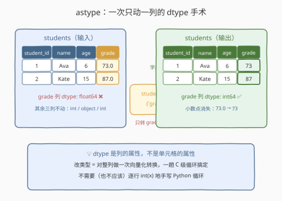
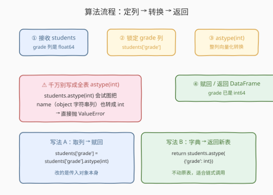
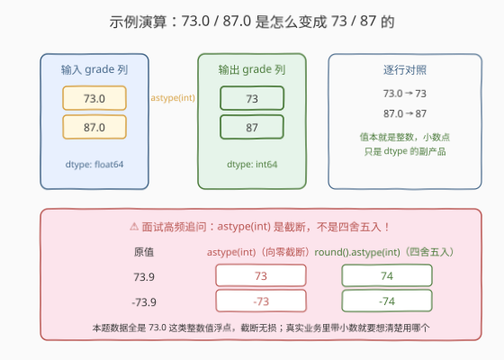

# LeetCode 改变数据类型 题解

## 1. 题目概述

- **标题 / 题号**：改变数据类型（#2886，easy）
- **链接**：https://leetcode.cn/problems/change-data-type/
- **难度**：简单
- **标签**：Pandas、dtype 类型转换

**题意**：DataFrame `students` 包含学生的 `student_id`（int）、`name`（object）、`age`（int）、`grade`（float）四列。其中 **`grade` 列被错误地存储为浮点数**（如 `73.0`），编写一个解决方案把它**转换为整数**，返回修正后的 DataFrame。

**示例 1**：

```text
输入：
DataFrame students:
+------------+------+-----+-------+
| student_id | name | age | grade |
+------------+------+-----+-------+
| 1          | Ava  | 6   | 73.0  |
| 2          | Kate | 15  | 87.0  |
+------------+------+-----+-------+
输出：
+------------+------+-----+-------+
| student_id | name | age | grade |
+------------+------+-----+-------+
| 1          | Ava  | 6   | 73    |
| 2          | Kate | 15  | 87    |
+------------+------+-----+-------+
解释：
grade 列的数据类型已转换为整数。
```

**约束**：

- 数据规模在 $10^3$ 量级（Pandas 入门系列惯例，规模不构成瓶颈）
- `grade` 列的值均为整数值的浮点数（形如 $73.0$），转换无损

> 💡 本题是 LeetCode「Pandas 入门」系列的 dtype 操作题，仅提供 Python（Pandas）提交入口。它考察的是 DataFrame 最核心的元数据概念——**dtype 是列级属性**，以及类型转换的第一入口 `astype`。

## 2. 解题思路

### 2.1 暴力思路：逐行 int() 重建列

最直白的做法：把 `grade` 列抽出来，逐个用 Python 内置 `int()` 转换，再塞回去：

```python
def changeDatatype(students: pd.DataFrame) -> pd.DataFrame:
    students['grade'] = [int(x) for x in students['grade']]
    return students
```

- **正确性**：能通过——`int(73.0)` 就是 $73$，列赋值时 pandas 会把 Python 整数列表推断回 `int64`。
- **低效且不地道**：这是一条**元素级 Python 循环**，每个值都要经历「numpy 标量 → Python 对象 → int() → 再装箱回 numpy 标量」的往返；而 `astype` 在底层按列一次性调用 C 级转换，二者差一个量级的常数。

> ⚠️ 瓶颈不在算法复杂度（都是 $O(n)$），而在**执行层级**：手写循环把向量化操作降级成了解释器逐条执行。pandas 的存在意义就是让你别这么写。

### 2.2 核心观察：dtype 是列的属性，astype 是列级手术



DataFrame 里**每一列恰好有一个 dtype**（不存在「同一列里这个格子是 int、那个格子是 float」的混合状态，混了就整体退化为 `object`）。因此「改一列的类型」天然是一次**列级向量化操作**：

```python
students['grade'] = students['grade'].astype(int)
```

`astype(int)` 对整列 $n$ 个值一次性完成 `float64 → int64` 转换，`73.0` 变 `73`、`87.0` 变 `87`，其余三列完全不碰。

更优雅的等价写法是用**字典形式**，一步返回新表：

```python
return students.astype({'grade': int})
```

> ⚠️ **最大的坑**：写成全表转换 `students.astype(int)` 会把 `name`（object 字符串列）也试图转成整数，直接抛 `ValueError: invalid literal for int() with base 10: 'Ava'`。**必须用字典显式指定只转 `grade`**——「按列动刀」既是性能要求，也是正确性要求。

### 2.3 算法流程图



| 步骤 | 操作 | 说明 |
|------|------|------|
| ① 接收 | `students: pd.DataFrame` | `grade` 列 dtype 为 `float64` |
| ② 锁定 | `students['grade']` | Series 视图，其它列不动 |
| ③ 转换 | `.astype(int)` | 整列向量化转换，得到 `int64` 的新 Series |
| ④ 赋回 | `students['grade'] = ...` 或 `return students.astype({'grade': int})` | 前者改原对象，后者返回新表 |

### 2.4 示例演算



以示例 1 逐行走查：

| 输入值（float64） | 转换动作 | 输出值（int64） |
|-------------------|----------|-----------------|
| $73.0$ | 向零截断 | $73$ |
| $87.0$ | 向零截断 | $87$ |

**一个必须搞清的语义细节**：`astype(int)` 对 float 执行的是**向零截断**（truncation），不是四舍五入——$73.9 \to 73$、$-73.9 \to -73$。本题数据都是整数值浮点（$73.0$），截断无损；若业务数据带真实小数且需要四舍五入，应写 `.round(0).astype(int)`。

> 💡 一句话：**dtype 是列的，改类型就是改一列**——`astype({'grade': int})` 一个字典说清「转哪列、转成啥」，向量化一趟完成。

## 3. 参考代码

### Python（pandas 取列赋回版，推荐）

```python
import pandas as pd


def changeDatatype(students: pd.DataFrame) -> pd.DataFrame:
    students['grade'] = students['grade'].astype(int)
    return students
```

> 💡 **写法要点**：
> - `students['grade']` 先取出 Series，`.astype(int)` 整列转换后**赋回原列**；
> - 只动 `grade` 一列，`student_id` / `name` / `age` 原样保留；
> - 题目签名就是原地改再返回，与评测契约一致。

### Python（pandas 字典整表版）

```python
import pandas as pd


def changeDatatype(students: pd.DataFrame) -> pd.DataFrame:
    return students.astype({'grade': int})
```

> 💡 **对照说明**：字典 `{'grade': int}` 精确声明「只把 grade 转成 int」，其余列 dtype 不变；`astype` 返回**新的 DataFrame**，不动传入对象。这种「返回新对象」的形态天然适合 2891 那类**方法链**写法：`students.astype({'grade': int}).head(3)`。

## 4. 复杂度分析

| 维度 | 复杂度 | 说明 |
|------|--------|------|
| **时间复杂度** | $O(n)$ | $n$ 为行数：一次向量化扫描完成整列 `float64 → int64` 转换 |
| **空间复杂度** | $O(n)$ | 转换产生长度为 $n$ 的整数列（赋回版替换原列，字典版多一份新表） |

> - 逐行 `int()` 版同样是 $O(n)/O(n)$，但常数大得多——元素级 Python 循环比 C 级向量化转换慢一个量级。
> - $10^3$ 量级下任何写法都瞬时完成，本题的区分度在 **API 语义正确性**（指定列、截断语义）而非性能。

## 5. 扩展：dtype 转换的「工具箱」

`astype` 只是入口，真实数据里的类型转换还有几个高频伙伴：

| 工具 | 适用场景 | 关键行为 |
|------|----------|----------|
| `astype({'col': dtype})` | 明确知道列、值干净 | 转不了直接抛异常（fail fast） |
| `pd.to_numeric(s, errors='coerce')` | object 列混有脏字符串 | 转不动的变 `NaN` 而非报错 |
| `.round(0).astype(int)` | float 带小数、需四舍五入 | 先舍入再转，避免截断偏差 |
| `astype('Int64')`（大写 I） | 列中有 `NaN` 但想要整数语义 | pandas 可空整数类型，`NaN → <NA>` |

**两个值得记住的细节**：

1. **`NaN` 是 `astype(int)` 的头号敌人**：默认 `int64` 不支持缺失值，float 列里只要有一个 `NaN`，`astype(int)` 就抛 `ValueError: Cannot convert non-finite values`。出路是先 `fillna` 补值，或改用可空的 `'Int64'`。
2. **类型转换是「降级有损」的单行道**：`float → int` 丢小数、`int → str` 丢数值运算能力、`datetime → str` 丢时间运算能力。转之前想清楚列的**下游用途**，转换本身没有「撤销键」。

## 6. 面试要点

**Q1：`astype(int)` 和 `round()` 有什么区别？什么场景必须用后者？**

> `astype(int)` 对 float 做**向零截断**：$73.9 \to 73$，$-73.9 \to -73$；`round()` 做四舍五入（ banker's rounding，半数取偶）。数据保证整数值浮点（如本题 $73.0$）时两者等价；数据带真实小数且需要「最接近的整数」语义时，必须 `.round().astype(int)`，直接 `astype` 会系统性偏小。

**Q2：为什么不能直接写 `students.astype(int)`？**

> 全表 `astype(int)` 会对**每一列**执行转换，`name` 列是 object（字符串），`int('Ava')` 直接抛 `ValueError`。dtype 是列级属性，类型转换就必须**按列指定**——要么取列单独转，要么用字典 `astype({'grade': int})`。

**Q3：两种写法（赋回原列 vs 返回 `astype` 新表）有什么差别？**

> 赋回版 `students['grade'] = ...` **修改传入的 DataFrame 本身**然后返回它；字典版 `return students.astype({'grade': int})` 返回**新对象**，原表不动。函数式风格（不改入参、返回新值）更安全，也更契合方法链；本题评测只看返回值，两种都对。

**Q4：`grade` 列里混了 `NaN` 怎么办？**

> 默认 `int64` 不支持缺失值，`astype(int)` 会抛 `ValueError: Cannot convert non-finite values (NA or inf) to integer`。三条路：先 `fillna(0)` 之类补默认值再转；或转成 pandas 可空整数 `astype('Int64')`（大写 I，`NaN` 变 `<NA>`）；或干脆保持 float——统计场景里 NaN 往往本身就是信息。

**Q5：怎么验证转换确实生效了？**

> 看 `students.dtypes`（整表各列 dtype）或 `students['grade'].dtype`（单列），期望输出 `dtype('int64')`。只打印表肉眼看不出 dtype——`73` 和 `73.0` 在表格渲染里几乎一样，**dtype 是元数据，必须用属性读，不能靠眼睛看**。

> 💡 **一句话总结**：2886 是 Pandas dtype 操作第一课——**dtype 是列的属性，改类型就是一次列级向量化手术**。`astype({'grade': int})` 用字典锁定目标列，避开「全表转换炸 object 列」和「截断 vs 四舍五入」两个坑，就是满分答案。

## 同类练习题

| # | 题目 | 与本题的关联 |
|---|------|-------------|
| 2885 | [重命名列](https://leetcode.cn/problems/rename-columns/) | 同样是「列级元数据手术」——`rename` 改列名，本题 `astype` 改 dtype，一个字典参数定生死的套路一致 |
| 2881 | [创建新列](https://leetcode.cn/problems/create-a-new-column/) | `df['new'] = ...` 赋值动作，本题「取列赋回」写法正是它的变体 |
| 2887 | [补全缺失数据](https://leetcode.cn/problems/fill-missing-data/) | `fillna` 处理 NaN——NaN 正是 `astype(int)` 的头号敌人，先补全再转类型 |
| 2891 | [方法链](https://leetcode.cn/problems/method-chaining/) | `astype` 返回新 DataFrame 的特性使其天然适合链式调用，本题字典版就是链上的一环 |
| 2880 | [数据选取](https://leetcode.cn/problems/select-data/) | 按列名取子表，列级操作的前置基本功 |
