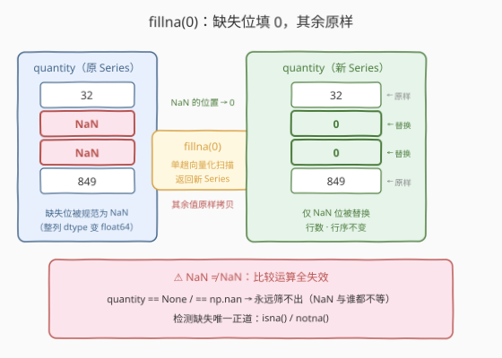
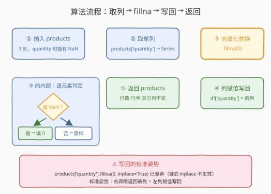
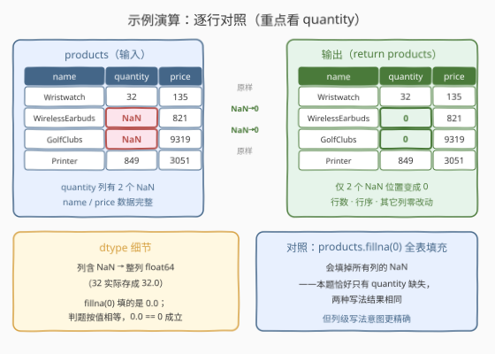

# LeetCode 填充缺失值 题解

## 1. 题目概述

- **标题 / 题号**：填充缺失值（#2887，easy）
- **链接**：https://leetcode.cn/problems/fill-missing-data/
- **难度**：简单
- **标签**：Pandas、缺失值处理

**题意**：编写一个解决方案，将 `products` 表中 `quantity` 列的**缺失值**填充为 **`0`**。

DataFrame `products`：

```text
+-------------+--------+
| Column Name | Type   |
+-------------+--------+
| name        | object |
| quantity    | int    |
| price       | int    |
+-------------+--------+
```

**示例 1**：

```text
输入：
+-----------------+----------+-------+
| name            | quantity | price |
+-----------------+----------+-------+
| Wristwatch      | 32       | 135   |
| WirelessEarbuds | None     | 821   |
| GolfClubs       | None     | 9319  |
| Printer         | 849      | 3051  |
+-----------------+----------+-------+
输出：
+-----------------+----------+-------+
| name            | quantity | price |
+-----------------+----------+-------+
| Wristwatch      | 32       | 135   |
| WirelessEarbuds | 0        | 821   |
| GolfClubs       | 0        | 9319  |
| Printer         | 849      | 3051  |
+-----------------+----------+-------+
解释：
WirelessEarbuds 和 GolfClubs 的数量被填充为 0。
```

**约束**：

- 仅 `quantity` 列可能存在缺失值，`name`、`price` 列数据完整
- 题面未给出显式规模约束（Pandas 入门系列惯例，数据量很小，不构成瓶颈）

> 💡 本题是 LeetCode「Pandas 入门」系列（2877–2890）的**缺失值处理**专题。它考察的不是算法，而是对 pandas **缺失值表示（`NaN`）** 与 **`fillna` 向量化替换**的第一手熟悉度。核心只有一行 `products['quantity'] = products['quantity'].fillna(0)`——但这一行背后藏着 `NaN ≠ NaN` 的比较语义、「列级改写」与「全表改写」的边界、以及 dtype 悄悄变 `float64` 的细节，都值得展开。

## 2. 解题思路

### 2.1 暴力思路：逐行扫描，手工判缺补零

最直白的做法：按行遍历，逐个检查 `quantity` 是否缺失，缺了就原地赋 0：

```python
import pandas as pd

def fillMissingValues(products: pd.DataFrame) -> pd.DataFrame:
    for i in range(len(products)):
        if pd.isna(products.loc[i, 'quantity']):
            products.loc[i, 'quantity'] = 0
    return products
```

- **正确性**：没问题——`pd.isna` 能同时识别 `None` 与 `NaN`，逐行改写也能到达终点；
- **慢**：每步 `products.loc[i, 'quantity']` 都要经历「标签索引解析 + 标量装箱」，纯 Python 循环无法向量化，行数一大常数开销急剧放大；
- **易错**：判断缺失**不能**写 `== None`（数值列里存的是 `NaN`，`NaN == None` 是 `False`），也**不能**写 `== np.nan`（`NaN` 与任何值都不等，包括它自己）——只有 `pd.isna()` / `.isna()` 是正解。

> ⚠️ 瓶颈不在性能而在**姿势**：pandas 的设计哲学是「列优先、向量化」——「把一列里的某些值换成另一个值」这种操作有原生一等公民 API，逐行循环是在用 list 的方式写 DataFrame。

### 2.2 核心观察：缺失值统一是 `NaN`，替换交给 `fillna`



三个值得先立住的事实：

| 事实 | 说明 |
|------|------|
| **① 缺失的统一表示是 `NaN`** | 数值列一旦混入缺失，pandas 会把整列提升为 `float64`，缺失位规范成浮点 `NaN`（只有 `object` 列里才保留 `None`）——对数值列而言，「缺失」就是 `NaN` |
| **② `NaN ≠ NaN`** | `NaN` 参与任何比较（`==`、`!=`、`>`、`<`）结果都是 `False`，所以 `== None` / `== np.nan` **永远筛不出**缺失值，检测只有 `isna()` 一条正路 |
| **③ `fillna` 是向量化替换** | `Series.fillna(value)` 对整列单趟扫描：是缺失值的位置填 `value`，其余位置原样拷贝，返回**新 Series**（默认不动原表） |

于是核心解法就是「**函数调用 + 列赋值**」两步：

```python
products['quantity'] = products['quantity'].fillna(0)
```

**为什么写成列级而不是全表？** `products.fillna(0)` 会把**所有列**的 `NaN` 都填成 0——本题恰好只有 `quantity` 会有缺失，两种写法结果相同；但题面要求的是「只填 `quantity` 列」，列级写法把「改哪列」明确写进代码，意图精确、对约束变化免疫，是更稳的肌肉记忆。

> ⚠️ **最大的坑**：不要写 `products['quantity'].fillna(0, inplace=True)`——对「取出的列」做链式 `inplace` 在新版 pandas（Copy-on-Write 语义）下已废弃甚至**静默不生效**。标准姿势永远是：右侧调用返回新列，左侧列赋值写回。

### 2.3 算法流程图



| 步骤 | 操作 | 说明 |
|------|------|------|
| ① 输入 | `products: pd.DataFrame` | 3 列，仅 `quantity` 可能有缺失（此时该列 dtype 为 `float64`） |
| ② 取列 | `products['quantity']` | 拿到 `Series`，缺失位是 `NaN` |
| ③ 替换 | `.fillna(0)` | 单趟向量化：`NaN → 0`，其余值原样，返回**新 Series** |
| ④ 写回 | `products['quantity'] = 新列` | 列赋值替换整列数据，行数与行序不变 |
| ⑤ 输出 | `return products` | `name`、`price` 列全程未被触碰 |

### 2.4 示例演算



以示例 1 逐行走查（只看 `quantity` 列）：

| 行 | name | quantity（前） | 是否缺失 | quantity（后） | 说明 |
|----|------|----------------|----------|----------------|------|
| 0 | Wristwatch | 32 | 否 | 32 | 非 NaN，原样拷贝 |
| 1 | WirelessEarbuds | NaN | 是 | **0** | NaN 位置替换为 0 |
| 2 | GolfClubs | NaN | 是 | **0** | 同上 |
| 3 | Printer | 849 | 否 | 849 | 非 NaN，原样拷贝 |

两个容易忽视的细节：

- **dtype 是 `float64` 不是 `int`**：列里只要有一个 `NaN`，整列就得用浮点存（`32` 实际存成 `32.0`），`fillna(0)` 填进去的是 `0.0`。判题按值比较，`0.0 == 0` 成立，无需 `astype(int)`；
- **行数、行序、其它列零改动**：`fillna` 只动值不动结构，`name` / `price` 原封不动。

> 💡 一句话：**缺失值是 `NaN`，填它用 `fillna`，写回用列赋值**——一行代码，三段语义。

## 3. 参考代码

### Python（列级 fillna，推荐）

```python
import pandas as pd


def fillMissingValues(products: pd.DataFrame) -> pd.DataFrame:
    products['quantity'] = products['quantity'].fillna(0)
    return products
```

> 💡 **写法要点**：
> - 右侧 `products['quantity'].fillna(0)` 返回填充后的**新列**；
> - 左侧列赋值把新列写回 `products`，原地更新这张表；
> - 只碰 `quantity` 一列，`name`、`price` 全程不动。

### Python（字典映射版，多列填充的通用姿势）

```python
import pandas as pd


def fillMissingValues(products: pd.DataFrame) -> pd.DataFrame:
    return products.fillna({'quantity': 0})
```

> 💡 **对照说明**：`fillna` 的参数也可以是 `{列名: 填充值}` 的字典——一次声明「哪列填什么」，其余列一律不碰。它返回**新的 DataFrame**（原表不动，所以直接 `return`）。当多列需要不同填充值时（如 `{'quantity': 0, 'name': 'unknown'}`），这个姿势比连续多次列赋值更整洁。

## 4. 复杂度分析

| 维度 | 复杂度 | 说明 |
|------|--------|------|
| **时间复杂度** | $O(n)$ | $n$ 为行数：`fillna` 对单列做单趟向量化扫描，每个位置 $O(1)$ 判定 |
| **空间复杂度** | $O(n)$ | 填充结果物化为一条新列（默认拷贝）；整表规模 $n \times 3$ |

> - 逐行循环版名义上也是 $O(n)$，但每步都走 Python 解释器 + 标签索引解析，常数差出数量级；
> - 入门系列的数据量下任何写法都瞬时完成，本题的区分度在 **API 姿势**而非性能。

## 5. 扩展：缺失值处理的策略菜单

`fillna(0)` 只是缺失值处理的**众多策略之一**。同样一列 `NaN`，在不同业务语义下有不同归宿：

| 策略 | 代码 | 语义假设 |
|------|------|----------|
| 填常数（本题） | `s.fillna(0)` | 缺失 = 「数量为零」（计数/库存语义下最合理） |
| 前/后值填充 | `s.ffill()` / `s.bfill()` | 缺失 = 「和相邻时刻一样」（时间序列常用） |
| 统计量填充 | `s.fillna(s.mean())` | 缺失 = 「取平均，尽量不扭曲分布」 |
| 插值 | `s.interpolate()` | 缺失 = 「按趋势平滑补齐」（连续量测） |
| 直接删除 | `df.dropna(subset=['quantity'])` | 缺失 = 「数据不可信，弃行」（对照 [2883. 删除丢失的数据](https://leetcode.cn/problems/drop-missing-data/)） |

**怎么选**？看「缺失」在业务上意味着什么：**没有**（none）→ 填 0；**未知**（unknown）→ 删除或插值；**同前**（carry forward）→ `ffill`。本题题面已经替你做了决定：数量缺失就当 0。

另外两个 `fillna` 相关的版本细节：

1. **`limit` 参数**：`s.fillna(0, limit=1)` 每列最多只填前 1 个缺失，其余保留 `NaN`——「连续缺失只补头」的场景；
2. **`method` 已退役**：老代码里的 `fillna(method='ffill')` 在新版 pandas 已废弃，直接写 `s.ffill()` / `s.bfill()` 方法名。

## 6. 面试要点

**Q1：为什么 `products['quantity'] == None` 筛不出缺失值？**

> 数值列的缺失被 pandas 规范成浮点 `NaN`（不是 `None`），而 `NaN` 参与任何比较都返回 `False`——包括 `NaN == NaN` 自己。所以 `== None`、`== np.nan` 全部失灵。检测缺失只有一条正路：`isna()` / `notna()`（`pd.isna` 能同时兼容 `None` 与 `NaN` 两种表示）。

**Q2：`products.fillna(0)` 和 `products['quantity'].fillna(0)` 有什么区别？**

> 作用域：前者是**全表**——任何列的 `NaN` 都会被填 0；后者是**单列**。本题约束下只有 `quantity` 有缺失，两者结果恰好相同，但题意是「只填 quantity」，列级写法意图精确、对约束变化免疫。多列填不同值时用字典形式 `products.fillna({'quantity': 0, ...})`。

**Q3：`fillna` 会修改原 DataFrame 吗？`inplace=True` 还能用吗？**

> 默认**不会**——`fillna` 返回新对象（新 Series / 新 DataFrame），原表不动，所以要么拿返回值、要么用列赋值写回。`products['quantity'].fillna(0, inplace=True)` 这种「链式 inplace」在 Copy-on-Write 语义下已废弃、可能静默不生效；即便全表 `inplace=True` 尚可用，也不推荐——「调用 + 赋值」的函数式写法才是标准姿势。

**Q4：填充后 `quantity` 列的 dtype 是什么？想变回整数怎么办？**

> `float64`。含 `NaN` 的列必然以浮点存储（`32` 存成 `32.0`），`fillna(0)` 填的是 `0.0`，dtype 不变。判题按值比较不受影响；若业务上要整数外观，显式写 `products['quantity'] = products['quantity'].fillna(0).astype(int)`——先填后转，`NaN` 没清干净就 `astype` 会直接抛异常。

**Q5：填 0 和 `dropna` 删行，什么时候选哪个？**

> 看「缺失」的业务语义：缺失 = **没有**（库存数量、计数）→ 填 0，信息无损；缺失 = **未知/坏数据**（传感器故障、录入错误）→ 删行（`dropna`）或插值（`interpolate`），硬填 0 会把均值、总和整体拉偏。本题题面明说「填 0」，属于前者。

> 💡 **一句话总结**：2887 是 **Pandas 缺失值处理第一课**——缺失值统一是 `NaN`，检测用 `isna()`（`NaN ≠ NaN`，比较运算全失效），填充用 `fillna`（列级向量化替换），写回用列赋值（链式 `inplace` 已死）。一行 `products['quantity'] = products['quantity'].fillna(0)` 背后是三段语义。

## 同类练习题

| # | 题目 | 与本题的关联 |
|---|------|-------------|
| 2883 | [删除丢失的数据](https://leetcode.cn/problems/drop-missing-data/) | `dropna` 删行——同一族缺失值问题的另一条路（填 vs 删），正对应 Q5 的语义取舍 |
| 2884 | [修改列](https://leetcode.cn/problems/modify-columns/) | 同一个「`df['col'] = ...` 列赋值」姿势的算术应用（整列乘 2） |
| 2886 | [改变数据类型](https://leetcode.cn/problems/change-data-type/) | `astype` 显式转 dtype——呼应本题「填完还是 float64」的细节 |
| 2888 | [重塑数据：连结](https://leetcode.cn/problems/reshape-data-concatenate/) | Pandas 入门系列的下一站，两张表垂直连结 |
