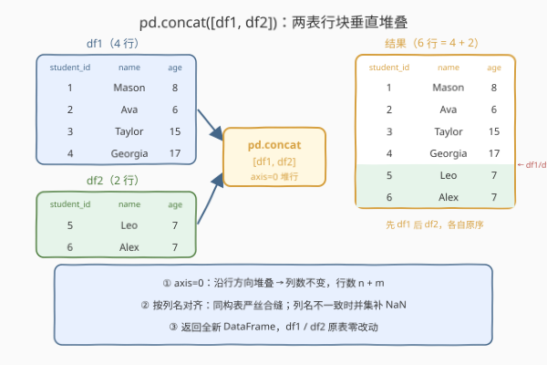
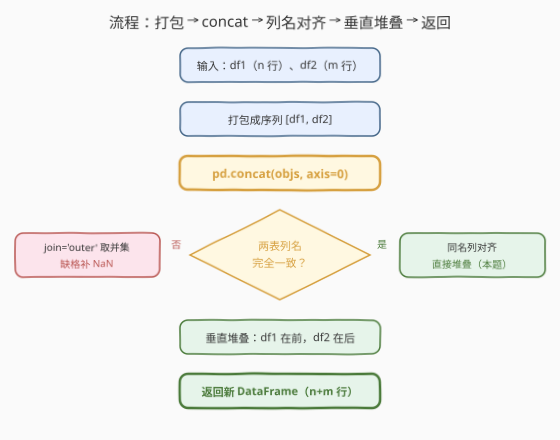
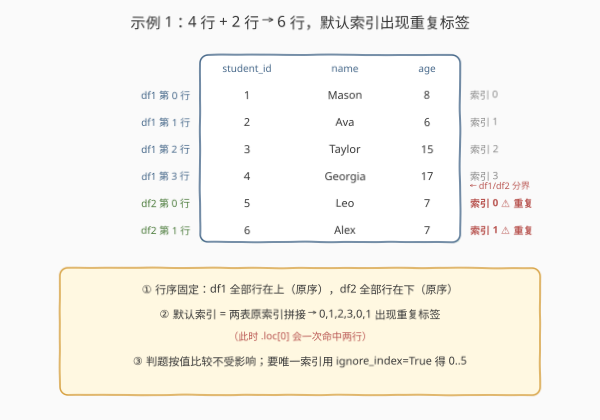

# LeetCode 重塑数据：连结 题解

## 1. 题目概述

- **标题 / 题号**：重塑数据：连结（#2888，easy）
- **链接**：https://leetcode.cn/problems/reshape-data-concatenate/
- **难度**：简单
- **标签**：Pandas、concat、数据重塑

**题意**：编写一个解决方案，将两个 DataFrames **垂直**连结成一个 DataFrame。

DataFrame `df1`：

```text
+-------------+--------+
| Column Name | Type   |
+-------------+--------+
| student_id  | int    |
| name        | object |
| age         | int    |
+-------------+--------+
```

DataFrame `df2`：与 `df1` **结构完全相同**（同列名、同类型）。

**示例 1**：

```text
输入：
df1
+------------+---------+-----+
| student_id | name    | age |
+------------+---------+-----+
| 1          | Mason   | 8   |
| 2          | Ava     | 6   |
| 3          | Taylor  | 15  |
| 4          | Georgia | 17  |
+------------+---------+-----+
df2
+------------+------+-----+
| student_id | name | age |
+------------+------+-----+
| 5          | Leo  | 7   |
| 6          | Alex | 7   |
+------------+------+-----+
输出：
+------------+---------+-----+
| student_id | name    | age |
+------------+---------+-----+
| 1          | Mason   | 8   |
| 2          | Ava     | 6   |
| 3          | Taylor  | 15  |
| 4          | Georgia | 17  |
| 5          | Leo     | 7   |
| 6          | Alex    | 7   |
+------------+---------+-----+
解释：
两个 DataFrame 被垂直堆叠，它们的行被合并。
```

**约束**：

- 两表列名与列序完全相同（同构表）
- 题面未给出显式规模约束（Pandas 入门系列惯例，数据量很小，不构成瓶颈）

> 💡 本题是 LeetCode「Pandas 入门」系列（2877–2890）**数据重塑三部曲（2888 连结 / 2889 透视 / 2890 融合）的第一课**。它考察的不是算法，而是对 `pd.concat` 的第一手熟悉度。核心只有一行 `pd.concat([df1, df2])`——但这一行背后藏着 axis 方向语义、列名对齐规则、索引重复三个值得展开的话题，也是面试里 Pandas 功底的照妖镜。

## 2. 解题思路

### 2.1 暴力思路：手工搬运行

最直白的做法：把两张表的行取出来拼成一个 Python 列表，再手工重建 DataFrame：

```python
import pandas as pd

def concatenateTables(df1: pd.DataFrame, df2: pd.DataFrame) -> pd.DataFrame:
    rows = df1.values.tolist() + df2.values.tolist()
    return pd.DataFrame(rows, columns=df1.columns)
```

- **正确性**：同构表下没问题——行拼上了，列名也传对了；
- **笨重**：`.values.tolist()` 把整表**降级成 Python list**，块级内存拷贝退化成逐元素装箱；重建 DataFrame 时列名靠手工传、dtype 靠重新猜——这些信息原表里本来就有，全被丢掉重造一遍；
- **更糟的变体**：逐行 `df.loc[len(df)] = row` 追加，每追加一行就把整表复制一次，$O((n+m)^2)$ 的经典反模式。

> ⚠️ 瓶颈不在性能而在**姿势**：DataFrame 的连结是「块级内存操作」，pandas 有原生一等公民 API（`concat`）。手工搬运行，是在用 Excel 逐行复制粘贴的方式写 pandas。

### 2.2 核心观察：`pd.concat` 一行搞定垂直堆叠



三个值得先立住的事实：

| 事实 | 说明 |
|------|------|
| **① concat 是「结构级」堆叠** | 不看键、不做行配对，纯粹把行块上下拼接——语义对应 SQL 的 `UNION ALL`，而不是 `JOIN` |
| **② `axis=0` 是默认方向** | 垂直连结 = 沿行方向堆叠：**列数不变、行数相加**（$n+m$）；`axis=1` 才是左右拼列 |
| **③ 对齐的是列名不是位置** | 垂直连结时两表列名取**并集**（默认 `join='outer'`），同名列上下对齐，对不上的格子填 `NaN`。本题为同构表，恰好严丝合缝 |

于是核心解法就是一行：

```python
return pd.concat([df1, df2])
```

**为什么参数是 list？** `pd.concat` 的第一个参数是「待连结对象序列」——两张表、三张表、一个表列表都一样传，`pd.concat([df1, df2, df3])` 天然泛化到多表连结，不需要任何改写。

> ⚠️ **老代码里的 `df1.append(df2)` 已经死了**：它在 pandas 1.4 起废弃、**2.0 起彻底移除**——本质是 concat 的单表糖衣，且逐表复制性能差。新代码一律 `pd.concat`。

### 2.3 算法流程图



| 步骤 | 操作 | 说明 |
|------|------|------|
| ① 输入 | `df1`（n 行）、`df2`（m 行） | 同构表：`student_id` / `name` / `age` |
| ② 打包 | `[df1, df2]` | 交给 concat 的对象序列 |
| ③ 对齐 | 按列名对齐 | 默认 `join='outer'` 列名并集；本题同列，直接对上 |
| ④ 堆叠 | `axis=0` 垂直堆叠 | `df1` 的行在上、`df2` 的行在下，各自内部顺序不变 |
| ⑤ 输出 | 新 DataFrame（n+m 行） | `df1`、`df2` 原表全程不被改动 |

### 2.4 示例演算



以示例 1 逐行走查：

| 来源 | student_id | name | age | 结果中的默认索引 |
|------|------------|---------|-----|------------------|
| df1 第 0 行 | 1 | Mason | 8 | 0 |
| df1 第 1 行 | 2 | Ava | 6 | 1 |
| df1 第 2 行 | 3 | Taylor | 15 | 2 |
| df1 第 3 行 | 4 | Georgia | 17 | 3 |
| df2 第 0 行 | 5 | Leo | 7 | **0**（重复标签） |
| df2 第 1 行 | 6 | Alex | 7 | **1**（重复标签） |

三个容易忽视的细节：

- **索引没有重排**：默认结果是两表**原索引直接拼接**（0,1,2,3,0,1），出现**重复标签**。判题按值比较不受影响；但若后续要 `.loc[0]`（会一次命中两行）或按索引做 merge，重复标签就是坑——需要唯一索引时加 `ignore_index=True`；
- **行序稳定**：`df1` 的行永远在 `df2` 的行前面，各自的内部顺序不变——连结结果是确定性的；
- **原表零改动**：`concat` 返回全新对象，`df1` / `df2` 原封不动。

> 💡 一句话：**两表垂直连结 = `pd.concat([df1, df2])`**——一行代码，方向（`axis=0` 堆行）、对齐（按列名）、顺序（先 df1 后 df2）三件事它全替你想好了。

## 3. 参考代码

### Python（pd.concat，推荐）

```python
import pandas as pd


def concatenateTables(df1: pd.DataFrame, df2: pd.DataFrame) -> pd.DataFrame:
    return pd.concat([df1, df2])
```

> 💡 **写法要点**：
> - 传入 `[df1, df2]` 列表，默认 `axis=0` 即垂直堆叠；
> - 返回**新的 DataFrame**，`df1`、`df2` 原表不动；
> - 多表连结直接扩列表：`pd.concat([df1, df2, df3])`，代码零改动。

### Python（ignore_index=True，干净索引版）

```python
import pandas as pd


def concatenateTables(df1: pd.DataFrame, df2: pd.DataFrame) -> pd.DataFrame:
    return pd.concat([df1, df2], ignore_index=True)
```

> 💡 **对照说明**：默认连结保留两表原索引（示例中拼成 0,1,2,3,0,1，出现重复标签）；`ignore_index=True` 丢弃原索引、重建 $0 \sim n{+}m{-}1$ 的 `RangeIndex`。判题按值比较两者皆可；工程上若结果还要做标签索引、`reset_index`、按索引 merge，带上它是更稳的肌肉记忆。

## 4. 复杂度分析

| 维度 | 复杂度 | 说明 |
|------|--------|------|
| **时间复杂度** | $O\big((n{+}m) \times k\big)$ | $n$、$m$ 为两表行数，$k$ 为列数：结果表每个格子恰好写一次（块级拷贝） |
| **空间复杂度** | $O\big((n{+}m) \times k\big)$ | 结果表全新物化一份；原表不被改动 |

> - 手工搬运行版名义上同阶，但逐元素装箱 + dtype 重推断的常数远大于一次块拷贝；
> - 入门系列的数据量下任何写法都瞬时完成，本题的区分度在 **API 姿势**而非性能。

## 5. 扩展：concat 的参数面板与 concat / merge 之分

`pd.concat` 的常用参数一张表看全：

| 参数 | 作用 | 示例语义 |
|------|------|----------|
| `axis` | `0` 垂直堆行（默认）/ `1` 水平拼列 | `pd.concat([df1, df2], axis=1)` 左右并排 |
| `ignore_index` | 连结后重建 `RangeIndex` | 消除重复索引标签（见 2.4） |
| `join` | `'outer'` 列名并集（默认）/ `'inner'` 列名交集 | 两表列名不一致时的取舍：留全补 `NaN`，或只留公共列 |
| `keys` | 给各来源表加一层外层索引 | 之后 `result.loc['df1']` 可整块取回来源数据 |

更要紧的是**分清 concat 和 merge**——这是 Pandas 面试的高频辨析题：

| 维度 | `pd.concat` | `pd.merge` |
|------|-------------|------------|
| 语义 | 结构堆叠（SQL `UNION ALL`） | 键配对（SQL `JOIN`） |
| 匹配依据 | 列名（垂直时）/ 索引（水平时） | `on` 指定的键列 |
| 行数变化 | 垂直时 $n+m$ | 取决于匹配方式（inner / outer / left / right） |

**怎么选**？看「拼什么」：纵向追加批次数据（多个日志文件、多期账单、多班级名单）→ `concat`；按 `student_id` 把成绩表和姓名表**拼宽** → `merge`。本题两张同构学生表摞行，是教科书级的 concat 场景。

顺带把「重塑三部曲」串起来：本题的**连结**（结构拼接）、2889 的**透视**（长表转宽表）、2890 的**融合**（宽表转长表），构成 pandas「结构重塑」工具箱三件套——三题连刷，`concat` / `pivot` / `melt` 一网打尽。

## 6. 面试要点

**Q1：`pd.concat` 和已废弃的 `df.append` 是什么关系？**

> `append` 是 concat 的单表糖衣（`df1.append(df2)` ≈ `pd.concat([df1, df2])`），因逐表复制是 $O(n^2)$ 且与 concat API 冗余，pandas 1.4 起废弃、2.0 起彻底移除。新代码一律写 `pd.concat`。

**Q2：连结结果的索引是什么样？有什么坑？**

> 默认是两表**原索引直接拼接**（示例中为 0,1,2,3,0,1），出现重复标签——`.loc[0]` 会同时命中两行。判题按值比较不受影响；需要唯一索引时 `ignore_index=True` 重建 `RangeIndex`，或事后 `result.reset_index(drop=True)`。

**Q3：如果两表列名不完全一致，concat 会怎么处理？**

> 默认 `join='outer'` 取**列名并集**，某表缺失的列整块填 `NaN`；`join='inner'` 取交集，只保留公共列。注意对齐依据是**列名不是列位置**——两表第 1 列名字不同就不会被对到一起。

**Q4：concat 会修改原 DataFrame 吗？**

> 不会。`concat` 总是返回**新对象**（copy 语义），原表零改动；代价是结果要完整物化一份——大表连结瞬时双倍内存，空间敏感的流式追加场景应考虑预分配或分块处理。

**Q5：concat、merge、join 三个 API 怎么选？**

> 看匹配依据：**结构堆叠**（行摞行 / 列并排，不看内容）用 `concat`；**按键配对**（SQL JOIN 语义）用 `merge`（`join` 是 merge 按索引配对的便捷糖衣）。一句话记忆：摞行用 concat，配对用 merge。

> 💡 **一句话总结**：2888 是 Pandas 数据重塑第一课——垂直连结就是 `pd.concat([df1, df2])`：`axis=0` 堆行、按列名对齐、先 df1 后 df2；索引默认重复（必要时 `ignore_index=True`），`append` 已死，键配对请走 `merge`。

## 同类练习题

| # | 题目 | 与本题的关联 |
|---|------|-------------|
| 2889 | [数据重塑：透视](https://leetcode.cn/problems/reshape-data-pivot/) | 重塑三部曲第二站，`pivot` 把长表转宽表（行转列） |
| 2890 | [重塑数据：融合](https://leetcode.cn/problems/reshape-data-melt/) | 重塑三部曲第三站，`melt` 把宽表转长表——正是 pivot 的逆操作 |
| 2878 | [获取 DataFrame 的大小](https://leetcode.cn/problems/get-the-size-of-a-dataframe/) | `.shape` 验证连结结果「行数 = n + m」，是天然的调试断言手段 |
| 2891 | [方法链](https://leetcode.cn/problems/method-chaining/) | 连结 + 条件筛选拼成一个表达式链式书写，巩固「一个表达式做完一件事」的 pandas 风格 |
