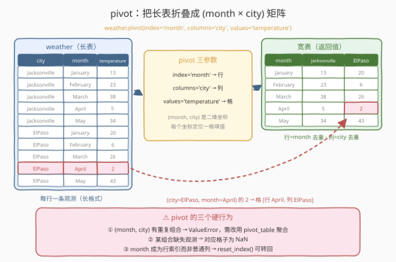
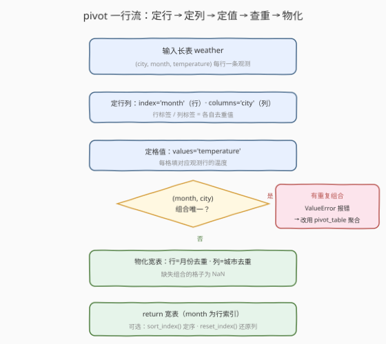
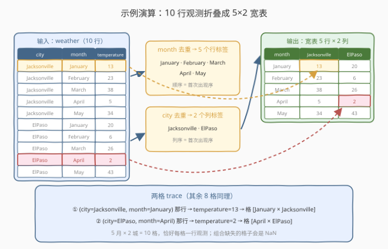

# 数据重塑：透视

- **题目名称**：数据重塑：透视
- **链接**：[2889. 数据重塑：透视](https://leetcode.cn/problems/reshape-data-pivot/)
- **难度**：简单
- **标签**：Pandas、DataFrame 重塑、透视（长表转宽表）

## 1. 题目概述

编写一个解决方案，将 DataFrame `weather` 的数据**旋转（pivot）**，使得**每一行代表特定月份的温度，而每个城市都是一个单独的列**。

表结构：

| 列名 | 类型 |
|------|------|
| `city` | object |
| `month` | object |
| `temperature` | int |

**示例 1**：

```text
输入：
+--------------+----------+-------------+
| city         | month    | temperature |
+--------------+----------+-------------+
| Jacksonville | January  | 13          |
| Jacksonville | February | 23          |
| Jacksonville | March    | 38          |
| Jacksonville | April    | 5           |
| Jacksonville | May      | 34          |
| ElPaso       | January  | 20          |
| ElPaso       | February | 6           |
| ElPaso       | March    | 26          |
| ElPaso       | April    | 2           |
| ElPaso       | May      | 43          |
+--------------+----------+-------------+
输出：
+----------+--------+--------------+
| month    | ElPaso | Jacksonville |
+----------+--------+--------------+
| April    | 2      | 5            |
| February | 6      | 23           |
| January  | 20     | 13           |
| March    | 26     | 38           |
| May      | 43     | 34           |
+----------+--------+--------------+
解释：
表格被旋转，每一列代表一个城市，每一行代表特定的月份。
```

**约束条件**：

- 表结构固定为 `city`（object）、`month`（object）、`temperature`（int）三列
- Pandas 系列题：仅提供 Python（Pandas）提交入口，无 C++ 等语言
- 数据规模不构成瓶颈（考察 reshape API 语义而非算法）

> 💡 本题是 LeetCode「Pandas 入门」系列的**长转宽**题，官方 hint 只有一句"考虑用 pandas 内置函数来变换数据"。`weather` 是典型的**长表**（每个 (城市, 月份) 组合占一行），目标是**宽表**（行列交叉成矩阵）——这正是 `pivot` 的本职工作。与 2888（连结）、2890（融合，逆操作）同属 reshape 三部曲。

---

## 2. 解题思路

### 2.1 暴力思路：手写双层循环填格子

把"透视"翻译成手工活：开一个嵌套 dict，逐行把温度塞进 `[month][city]` 的格子里，最后转正：

```python
def pivotTable(weather: pd.DataFrame) -> pd.DataFrame:
    table = {}
    for _, row in weather.iterrows():
        table.setdefault(row['month'], {})[row['city']] = row['temperature']
    return pd.DataFrame(table).T
```

- **正确性**没问题（本题数据无重复组合），但代价不小：
  - `iterrows` 逐行迭代，每行一次 Python 层开销，行数一大就慢一个量级；
  - 重复的 (month, city) 组合会被**静默覆盖**（后写的赢）——而正确的 pivot 语义应当**显式报错**，把数据问题暴露出来；
  - 行序、列序取决于 dict 插入序，还要靠 `.T` 转置补救，可读性差。

> ⚠️ 瓶颈不在性能而在**语义**：「长转宽」是数据分析最高频的操作之一，pandas 有专门的一等公民 API——`pivot`，一行代码、语义自明，重复组合还会主动报错替你把关。

### 2.2 核心观察：pivot —— 用 (month, city) 当坐标，重排 temperature



`weather` 是**长表（long format）**：每个 (城市, 月份) 组合占一行，温度是这一行的"观测值"。目标**宽表（wide format）**是一张矩阵：**行=月份、列=城市、格子=温度**。

`pivot` 的三个参数正好回答三个问题：

| 参数 | 本题取值 | 决定什么 |
|------|----------|----------|
| `index` | `'month'` | 新表的**行标签**（month 列去重） |
| `columns` | `'city'` | 新表的**列标签**（city 列去重） |
| `values` | `'temperature'` | 格子里填的**观测值** |

一句话：**原表每一行 (city, month, temperature) 变成新表中的一个格子——横坐标 month、纵坐标 city、格值 temperature**。数据一格不多、一格不少，只是从"清单"折叠成了"矩阵"。

三个关键行为：

1. **行列都去重**：5 个月份 × 2 个城市 → 5 行 2 列，与原表 10 行观测一一对应；
2. **(month, city) 重复 → 直接报错**：`pivot` 是"纯重排"，一个格子容不下两个候选值（`ValueError: Index contains duplicate entries, cannot reshape`）。需要聚合时改用 `pivot_table`；
3. **month 变成行索引**：输出里 `month` 不再是普通列而是 index，且 `columns.name` 为 `'city'`。LeetCode 评测按内容比对、不较真行列顺序，直接返回即可；工程里可用 `reset_index()` 转回普通列。

> ⚠️ **最大的坑**：把 `index` 和 `columns` 写反（`index='city', columns='month'`）**不报错**——得到的是"每行一个城市、每列一个月份"的**转置版**宽表，直到形状对不上评测才失败。三个参数落笔前默念一遍：**行是谁、列是谁、格子填谁**。

### 2.3 算法流程图



| 步骤 | 操作 | 说明 |
|------|------|------|
| ① 输入 | `weather` 长表 | (city, month, temperature) 三列 |
| ② 定行 | `index='month'` | 行标签 = month 去重值 |
| ③ 定列 | `columns='city'` | 列标签 = city 去重值 |
| ④ 定值 | `values='temperature'` | 每格填对应观测行的温度 |
| ⑤ 查重 | (month, city) 组合唯一？ | 重复 → `ValueError`，改用 `pivot_table` 聚合 |
| ⑥ 输出 | `return` 宽表 | month 为行索引；可选 `sort_index()` 定序、`reset_index()` 还原列 |

### 2.4 示例演算



以示例 1 走查：

| 阶段 | 结果 |
|------|------|
| 行标签 | month 去重 → January / February / March / April / May（5 个） |
| 列标签 | city 去重 → Jacksonville / ElPaso（2 个） |
| 格子回填 | (Jacksonville, January) 那行的 13 → 格 [January × Jacksonville]；(ElPaso, April) 那行的 2 → 格 [April × ElPaso]…… |
| 结果形状 | 5 行 × 2 列 = 10 格，与原表 10 行观测一一对应 |

两个细节：

- **行/列顺序**：`pivot` 按"首次出现序"排（January 在前），题面示例展示的是字典序（April 在前）——评测按内容比对、不较真顺序；工程里要固定顺序可加 `.sort_index()`（行）或 `.sort_index(axis=1)`（列）；
- **缺失组合**：若某 (month, city) 在原表没有观测行，对应格子是 `NaN`（本题 10 格恰好填满，无缺失）。

> 💡 一句话：**pivot 不发明任何新数据，只是把 10 行"清单"折叠成 5×2 的"矩阵"**——(month, city) 从"两列取值"升格为"一组二维坐标"。

---

## 3. 参考代码

### Python（pivot 一行版，推荐）

```python
import pandas as pd


def pivotTable(weather: pd.DataFrame) -> pd.DataFrame:
    return weather.pivot(index='month', columns='city', values='temperature')
```

> 💡 **写法要点**：
> - 三个参数按"**行 → 列 → 值**"顺序记忆，写反不报错但整表转置；
> - 返回新 DataFrame，原 `weather` 不动；
> - 输出的 `month` 是行索引、`columns.name` 是 `'city'`，均为 pivot 的预期形态，无需修正。

### Python（pivot_table 聚合版，对照）

```python
import pandas as pd


def pivotTable(weather: pd.DataFrame) -> pd.DataFrame:
    return weather.pivot_table(index='month', columns='city',
                               values='temperature', aggfunc='first')
```

> ⚠️ **对照说明**：`pivot_table` 自带聚合语义，遇到重复 (month, city) 组合不报错，而是按 `aggfunc` 归并（默认 `'mean'`，此处显式 `'first'` 取首个）。本题数据无重复，两版等价；但它默认会排序、丢弃全 NaN 的行列，暗坑更多——**无聚合需求时首选 `pivot`**。

### Python（groupby + unstack 版，对照）

```python
import pandas as pd


def pivotTable(weather: pd.DataFrame) -> pd.DataFrame:
    return (weather.groupby(['month', 'city'])['temperature']
                   .first()
                   .unstack())
```

> 💡 **对照说明**：`pivot` 的底层机制就是"分组 + 堆叠还原"——先按 (month, city) 分组取值得到带 MultiIndex 的 Series，再 `unstack` 把内层索引展开成列。三版结果等价，`pivot` 版最短最直白。

---

## 4. 复杂度分析

| 维度 | 复杂度 | 说明 |
|------|--------|------|
| **时间复杂度** | $O(n)$ | $n$ 为观测行数：一遍定位每个 (index, columns) 坐标，再物化 $r \times c$ 结果表（本题 $r \times c = n$） |
| **空间复杂度** | $O(r \times c)$ | 结果宽表本身；$r$ = 月份数、$c$ = 城市数，缺失组合占位 NaN 同样占格 |

> 本题固定 10 行观测，任何写法都瞬时完成，区分度在 **reshape API 语义正确性**而非性能。真正拉开差距的是知道 `pivot` 与 `pivot_table` 的分工：**纯重排 vs 聚合**。

---

## 5. 扩展：reshape 家族全景

| 方式 | 重复 (index, columns) | 聚合 | 行列顺序 | 典型用途 |
|------|----------------------|------|----------|----------|
| `pivot` | ❌ 报错 | 无 | 首次出现序 | 纯重排：长转宽，数据无重复 |
| `pivot_table` | ✅ 按 aggfunc 归并 | 有（默认 mean） | 默认字典序 | 交叉统计（类似 Excel 透视表） |
| `groupby` + `unstack` | ✅（先聚合） | 任意 | 分组键排序 | pivot 的底层机制，灵活度最高 |
| `melt`（2890） | — | — | — | 逆操作：宽转长 |

几个常用后处理：

- **把行索引变回普通列**：`.rename_axis(columns=None).reset_index()`——先抹掉 `columns.name='city'` 再把 month 提为列，得到完全"平面"的表；
- **固定顺序**：`.sort_index()`（行字典序）、`.sort_index(axis=1)`（列字典序）；
- **填补缺失格**：透视后接 `.fillna(...)`（呼应 2887）。

选型口诀：**无重复用 pivot，有聚合用 pivot_table，要灵活用 groupby + unstack，反向折叠用 melt**。

---

## 6. 面试要点

**Q1：`pivot` 的三个参数分别决定什么？**

> `index` 决定新表**行标签**（该列去重值），`columns` 决定**列标签**，`values` 决定格子里填的观测值。本题 `index='month', columns='city', values='temperature'`：每行一个月份、每列一个城市、每格一个温度。

**Q2：原表存在重复的 (month, city) 组合时 `pivot` 会怎样？**

> 直接抛 `ValueError: Index contains duplicate entries, cannot reshape`——pivot 是纯重排语义，一个格子容不下两个候选值。此时改用 `pivot_table(..., aggfunc='mean')` 让重复值先聚合再入格，或 `groupby + unstack`。

**Q3：`pivot` 之后 `month` 去哪了？怎么变回普通列？**

> `month` 成为返回表的**行索引**（且 `columns.name` 为 `'city'`），不再以普通列存在。要还原成普通列：`.rename_axis(columns=None).reset_index()`——reset 前先抹掉 columns 的名字，否则表头会多出一层 `city`。

**Q4：`pivot` 与 `pivot_table` 怎么选？**

> 三个维度：**重复处理**（pivot 报错 / pivot_table 聚合）、**默认行为**（pivot_table 默认 mean 聚合、默认排序、默认丢弃全 NaN 行列）、**语义**（纯重排 vs 交叉统计）。数据干净、只想换布局 → pivot；要按组做统计 → pivot_table。

**Q5：`pivot` 的逆操作是什么？**

> **宽转长**，即 `melt`（LeetCode 2890）：把 [month × city] 矩阵的每个格子拆回一行 (month, city, temperature)。长表利于存储与流水线处理，宽表利于人读与横向对比——两者互为镜像，合起来就是 reshape 家族的全部。

> 💡 **一句话总结**：2889 是 **Pandas 长转宽一课**——`weather.pivot(index='month', columns='city', values='temperature')`：**行=month、列=city、格=温度**。记住三件事：参数写反整表转置、重复组合直接报错、month 会变成行索引。

---

## 7. 同类练习题

- [2890. 重塑数据：融合](https://leetcode.cn/problems/reshape-data-melt/)：`melt` 宽转长，本题 `pivot` 的精确逆操作，reshape 三部曲收官
- [2888. 重塑数据：连结](https://leetcode.cn/problems/reshape-data-concatenate/)：`pd.concat` 纵向拼接多表，与 pivot 同属 reshape 家族的"布局变换"支线
- [2887. 填充缺失值](https://leetcode.cn/problems/fill-missing-data/)：`fillna` 补缺失——pivot 之后缺失组合恰好是 NaN 格，两题天然衔接
- [2854. 滚动平均步数](https://leetcode.cn/problems/rolling-average-steps/)：`groupby + transform` 分组派生列，对照本题"分组后 unstack 重排"的另一种分组用法
