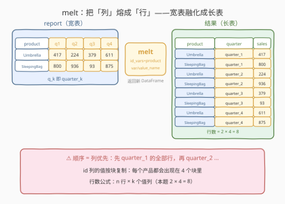
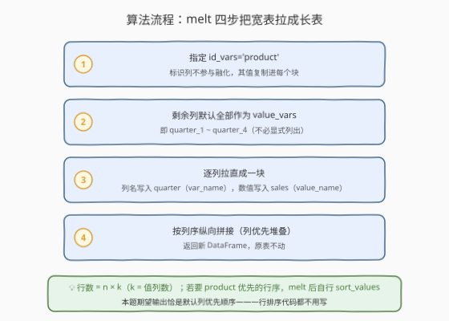
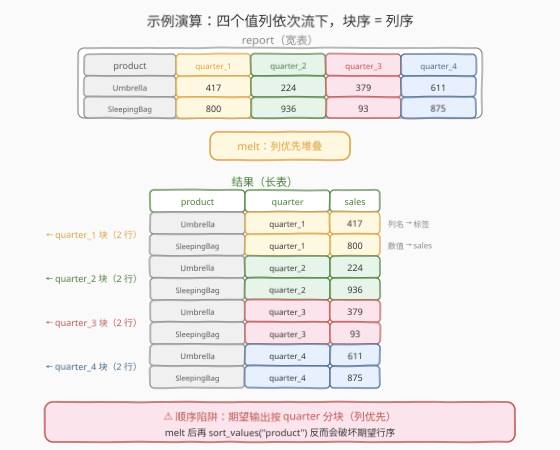

# 重塑数据：融合

- **题目名称**：重塑数据：融合
- **链接**：[2890. 重塑数据：融合](https://leetcode.cn/problems/reshape-data-melt/)
- **难度**：简单
- **标签**：Pandas、DataFrame 重塑、melt、宽表转长表

## 1. 题目概述

DataFrame `report`：

```text
+-------------+--------+
| Column Name | Type   |
+-------------+--------+
| product     | object |
| quarter_1   | int    |
| quarter_2   | int    |
| quarter_3   | int    |
| quarter_4   | int    |
+-------------+--------+
```

编写一个解决方案，将数据**重塑**成每一行表示特定季度产品销售数据的形式——即把「一个产品占一行、四个季度摊成四列」的**宽表**，变成「一行一个 (产品， 季度， 销量)」的**长表**。

**示例 1**：

```text
输入：
+-------------+-----------+-----------+-----------+-----------+
| product     | quarter_1 | quarter_2 | quarter_3 | quarter_4 |
+-------------+-----------+-----------+-----------+-----------+
| Umbrella    | 417       | 224       | 379       | 611       |
| SleepingBag | 800       | 936       | 93        | 875       |
+-------------+-----------+-----------+-----------+-----------+
输出：
+-------------+-----------+-------+
| product     | quarter   | sales |
+-------------+-----------+-------+
| Umbrella    | quarter_1 | 417   |
| SleepingBag | quarter_1 | 800   |
| Umbrella    | quarter_2 | 224   |
| SleepingBag | quarter_2 | 936   |
| Umbrella    | quarter_3 | 379   |
| SleepingBag | quarter_3 | 93    |
| Umbrella    | quarter_4 | 611   |
| SleepingBag | quarter_4 | 875   |
+-------------+-----------+-------+
解释：
DataFrame 已从宽格式重塑为长格式。每一行表示一个季度内产品的销售情况。
```

**约束条件**：

- 表结构固定：`product`（object）+ `quarter_1` ~ `quarter_4`（int）共 5 列
- 输出为 `product` / `quarter` / `sales` 三列，行数 = 原行数 × 4
- Pandas 系列题：仅提供 Python（Pandas）提交入口，无 C++ 等语言
- 数据规模不构成瓶颈（考察 API 语义而非算法）

> 💡 本题是 LeetCode「Pandas 入门」系列 reshape 三部曲的**宽转长**一课（2888 连结 → 2889 透视 → 2890 融合）。官方 hint 直接点名"用 pandas 内置函数做数据变换"——它考察的就是 `melt` 的**宽表融化**语义：把列名变成行里的标签，把列值竖着堆下来。仔细看示例输出的行序：**先 quarter_1 的全部产品，再 quarter_2……** 这个顺序细节正是本题的判定关键。

---

## 2. 解题思路

### 2.1 暴力思路：逐列切片 + concat 手工堆叠

不看 `melt`，用已学过的原语也能拼出来：对每个季度列，切出 `(product, quarter_k)` 两列、改名为 `(product, sales)`、插一个常数列 `quarter` 写上标签，最后 `pd.concat` 纵向拼接。

```python
def meltTable(report: pd.DataFrame) -> pd.DataFrame:
    parts = []
    for col in ['quarter_1', 'quarter_2', 'quarter_3', 'quarter_4']:
        part = report[['product', col]].copy()
        part.columns = ['product', 'sales']        # quarter_k 列改名为 sales
        part.insert(1, 'quarter', col)             # 插入标签列
        parts.append(part)
    return pd.concat(parts, ignore_index=True)     # 按循环次序纵向拼接
```

- **正确性**没问题（循环次序即列序，行序天然是列优先），也能通过评测；
- 但每个值列要**四步手工操作**（切片 → 改名 → 插标签 → 拼接），列一多就是体力活；列名在代码里硬编码了两遍；
- `pd.concat` 反复拼接的写法在真实数据量下也比一次 `melt` 慢。

> ⚠️ 瓶颈不在性能而在**语义**："宽转长"是数据 reshaping 的一等公民操作，pandas 有专门 API 一步到位——`melt`。它把"哪些列保持、哪些列融化、融化后的两个新列叫什么名"用三个参数一次性声明清楚。

### 2.2 核心观察：`melt` —— 把「列」熔成「行」



`df.melt(...)` 的语义一句话概括：**指定若干列做"标识"（`id_vars`）保持不化，其余每个值列各自"拉直"成一块——列名变成标签列（`var_name`）里的取值，列值堆进数值列（`value_name`），块按列序纵向拼接**。

四个关键行为：

1. **`id_vars='product'`：标识列不融化**。它的值不参与堆叠，而是**复制到每一块**——所以 `Umbrella` 会在输出里出现 4 次（每个季度块里一次）。
2. **`value_vars` 省略 = 剩余全部列**。不传时自动取 `id_vars` 之外的所有列（本题即 `quarter_1` ~ `quarter_4`），列序即堆叠次序，无需手工枚举。
3. **堆叠顺序 = 列优先**：外层循环走列（`quarter_1` → `quarter_4`），内层循环走行（保持原行序）。示例输出"先 quarter_1 的两个产品、再 quarter_2……"正是 melt 的**默认输出顺序**——一行排序代码都不用写。
4. **`var_name='quarter'` / `value_name='sales'`：顺路改名**。融化产物默认叫 `variable` / `value`，本题要求 `quarter` / `sales`，在 melt 参数里直接指定，不用事后 rename。

> ⚠️ **最大的坑是行序**：如果 melt 完顺手加一句 `sort_values('product')`（想按产品分组），输出会变成 Umbrella 的 4 个季度在前、SleepingBag 在后——**product 优先**，与期望的**列（quarter）优先**相反，评测直接失败。默认顺序就是正确顺序，别画蛇添足。次一级的坑是 `var_name` / `value_name` 写反：`quarter` 列装上了 417、`sales` 列装上了 `quarter_1`，不报错但全错。

### 2.3 算法流程图



| 步骤 | 操作 | 说明 |
|------|------|------|
| ① 指定标识 | `id_vars='product'` | 标识列不融化，值复制进每个块 |
| ② 圈定值列 | `value_vars` 省略 | 自动取剩余全部列 `quarter_1` ~ `quarter_4` |
| ③ 逐列拉直 | `var_name='quarter'`, `value_name='sales'` | 列名 → 标签列取值；列值 → 数值列 |
| ④ 纵向拼接 | 按列序堆叠（列优先） | 返回新 DataFrame，原表不动 |

### 2.4 示例演算



以示例 1 逐块走查（原表 2 行 × 4 个值列 = 输出 8 行）：

| 块 | 来源列 | 标签列取值 | 数值列取值 | 块内行序 |
|----|--------|------------|------------|----------|
| 第 1 块 | `quarter_1` | `quarter_1` | 417, 800 | Umbrella 在前，SleepingBag 在后（原行序） |
| 第 2 块 | `quarter_2` | `quarter_2` | 224, 936 | 同上 |
| 第 3 块 | `quarter_3` | `quarter_3` | 379, 93 | 同上 |
| 第 4 块 | `quarter_4` | `quarter_4` | 611, 875 | 同上 |

每一块都是"先取该列全部行、贴上列名标签、配上 product 值"，四块首尾相接就是期望输出。对照失败形态：melt 后多写一句 `sort_values('product')` → 输出变成 `Umbrella q1 / q2 / q3 / q4 / SleepingBag q1 / ...`——**product 优先**，与期望顺序相反。

> 💡 一句话：**列名下地狱（变标签），列值进队列（竖着堆），id 列值复制随行**。宽表 5 列 2 行 → 长表 3 列 8 行，信息一字不丢。

---

## 3. 参考代码

### Python（melt 一行版，推荐）

```python
import pandas as pd


def meltTable(report: pd.DataFrame) -> pd.DataFrame:
    return report.melt(
        id_vars='product',      # 标识列：不融化，值复制进每个块
        var_name='quarter',     # 值列的列名 → 这个新列里的标签
        value_name='sales',     # 值列的数值 → 这个新列里的数据
    )
```

> 💡 **写法要点**：
> - `id_vars` 单列可直接传字符串（多列传列表）；`value_vars` 省略即"剩余全部列"，不用写 `['quarter_1', ..., 'quarter_4']`；
> - `var_name` 装的是**原来的列名**（`quarter_1` 等），`value_name` 装的是**原来的数值**（417 等），方向别记反；
> - 直接 `return`：`melt` 返回新 DataFrame，原 `report` 不动；
> - **不要** melt 后再按 `product` 排序——默认列优先顺序就是期望顺序。

### Python（逐列 concat 手工版，对照）

```python
import pandas as pd


def meltTable(report: pd.DataFrame) -> pd.DataFrame:
    parts = []
    for col in ['quarter_1', 'quarter_2', 'quarter_3', 'quarter_4']:
        part = report[['product', col]].copy()
        part.columns = ['product', 'sales']
        part.insert(1, 'quarter', col)
        parts.append(part)
    return pd.concat(parts, ignore_index=True)
```

> ⚠️ **对照说明**：手工复刻 melt 的内部逻辑（切片 → 改名 → 插标签 → 拼接），能加深对"列优先堆叠"的理解，也能过评测；但列名硬编码两遍、四个步骤全是手工，实战一律优先 `melt`。

---

## 4. 复杂度分析

| 维度 | 复杂度 | 说明 |
|------|--------|------|
| **时间复杂度** | $O(n \times k)$ | $n$ 行、$k$ 个值列（本题 $k=4$）：每个格子恰好搬一次到长表 |
| **空间复杂度** | $O(n \times k)$ | 长表物化：$(n \times k)$ 行 × 3 列；原表不释放（melt 返回新表） |

> - 本题固定 4 个值列、行数 $10^3$ 量级，任何写法都瞬时完成，区分度在 **API 语义与输出行序**而非性能。
> - 手工 concat 版要做 $k$ 次局部拷贝 + 一次总拼接，常数因子大于一次成型的 `melt`，量级相同。

---

## 5. 扩展：宽表 ↔ 长表互转的工具箱

`melt` 不是孤例，pandas 有一整个 reshape 家族，方向、适用场景各不相同：

| API | 方向 | 一句话语义 |
|-----|------|------------|
| `df.melt` / `pd.melt` | 宽 → 长 | 值列拉直成块，列名变标签（**本题**） |
| `df.pivot` / `pivot_table` | 长 → 宽 | 标签列的取值摊开成新列（2889，melt 的逆操作） |
| `pd.wide_to_long` | 宽 → 长 | 列名带数字后缀（`quarter_1`）时按 `stub + sep + 后缀` 匹配，后缀收进 `j` 列 |
| `df.stack` / `df.unstack` | 列 ↔ 行索引层级 | 把列索引压进行索引（MultiIndex 场景） |

两个值得知道的细节：

- **`pd.melt(df, ...)` 与 `df.melt(...)` 完全等价**——一个是模块级函数、一个是方法，参数一致，哪个顺手用哪个。
- **`wide_to_long` 对本题是"绕路"**：它按前缀 `quarter` + 分隔符 `_` 匹配列名，把后缀数字收进 `j` 列：

  ```python
  long = pd.wide_to_long(report, stubnames='quarter', i='product', j='num', sep='_').reset_index()
  long['label'] = 'quarter_' + long['num'].astype(str)      # 后缀拼回 'quarter_1' 字符串
  out = long.rename(columns={'quarter': 'sales', 'label': 'quarter'})[['product', 'quarter', 'sales']]
  ```

  ⚠️ 两个坑：`sep` 默认是空串，列名 `quarter_1` 必须**显式传 `sep='_'`** 才匹配得上（漏传不报错、返回空表）；融化后的值列名（stubname `quarter`）恰好与目标标签列**撞名**，必须二次 rename。绕两道弯才能达到 melt 一行的效果——本题用它纯属自找，但列名后缀本身有语义时（如 `sales_2020`、`sales_2021` 想要数字型的年份做运算）它比 melt 更合适。

> 💡 **Tidy Data 视角**：`melt` 产出的正是 Hadley Wickham 定义的整洁数据——"每行一个观测、每列一个变量"。宽表把 4 个季度当 4 个变量是**给人看的报表**；长表把 (产品, 季度) 当联合键、销量当唯一度量，才是**给 groupby / merge / 画图吃的标准口粮**。真实工作流里，ggplot/seaborn 的长格式绘图、数据库的 EAV 表，底层全是 melt 的形状。

---

## 6. 面试要点

**Q1：`melt` 的四个核心参数各是什么角色？**

> `id_vars`：保持不化的标识列，值复制进每个块；`value_vars`：要融化的值列，省略 = 除 `id_vars` 外全部；`var_name`：融化后存放**原列名**的新列名（默认 `variable`）；`value_name`：存放**原数值**的新列名（默认 `value`）。对应本题：`id_vars='product'`、`var_name='quarter'`、`value_name='sales'`。

**Q2：melt 输出的行序是怎样的？怎么控制？**

> **列优先**：外层按 `value_vars` 的列序、内层按原行序堆叠。想改成 product 优先，melt 后自行 `sort_values(['product', 'quarter'], ignore_index=True)`——但要注意 `quarter_1` ~ `quarter_4` 是字符串，跨年数据（`quarter_10`）字典序会乱，需按后缀数字排。本题期望输出恰是默认列优先顺序，什么排序都不要加。

**Q3：melt 会修改原 DataFrame 吗？输出和输入的信息量有什么关系？**

> 不会，返回新 DataFrame。信息量上 melt 是**无损重塑**：宽表 $n \times (1+k)$ 个格子 ↔ 长表 $n \times k$ 行 × 3 列，格子总数守恒（id 列值按块复制不算新信息，标签列可由列名还原）。配合 2889 的 `pivot` 可以完全还原回宽表。

**Q4：melt 和 pivot 是什么关系？和 SQL 的什么操作对应？**

> 二者互逆：melt 宽转长（"列转行"），pivot 长转宽（"行转列"）。对应 SQL 里 `UNION ALL` 拼四个 `(product, 'quarter_k', quarter_k)` select 实现 unpivot，以及 `CASE WHEN` / `PIVOT` 实现 pivot。面试常追问"用 melt 复刻 UNION ALL"——就是 2.1 的手工 concat 版。

**Q5：忘记 melt 这个 API，还能怎么宽转长？**

> 至少两条路：① 逐列切片 + `pd.concat`（2.1 手工版，最直观）；② `df.set_index('product').stack()`——把 product 设为索引后 stack 把剩余列压成一个 MultiIndex Series，`reset_index` 后改名即是长表。还有 `pd.wide_to_long`（见第 5 节，注意 `sep` 与撞名两个坑）。

> 💡 **一句话总结**：2890 是 **Pandas 宽转长一课**——`report.melt(id_vars='product', var_name='quarter', value_name='sales')`：**列名变标签、列值竖着堆、id 值随块复制**。最大的坑不是不会 melt，而是 melt 完手痒加的 `sort_values`。

---

## 7. 同类练习题

- [2889. 数据重塑：透视](https://leetcode.cn/problems/reshape-data-pivot/)：melt 的**逆操作**——把长表按标签列摊回宽表，reshape 三部曲收官，做完这对操作互逆感直接拉满
- [2888. 重塑数据：连结](https://leetcode.cn/problems/reshape-data-concatenate/)：reshape 三部曲的另一员——`concat` 纵向拼接，正是手工复刻 melt 的最后一步
- [2885. 重命名列](https://leetcode.cn/problems/rename-columns/)：melt 的 `var_name` / `value_name` 本质就是"顺路改名"，可对照 `rename` 的字典映射语义
- [2877. 从表中创建 DataFrame](https://leetcode.cn/problems/create-a-dataframe-from-list/)：从构造到重塑，DataFrame 结构操作主线的起点
- [2880. 数据选取](https://leetcode.cn/problems/select-data/)：按列名取子表——手工 melt 版逐列切片的第一步就是它
