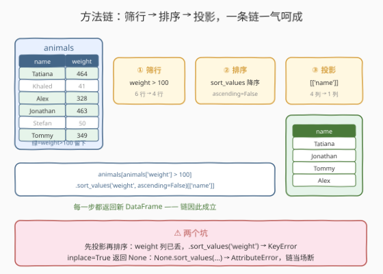
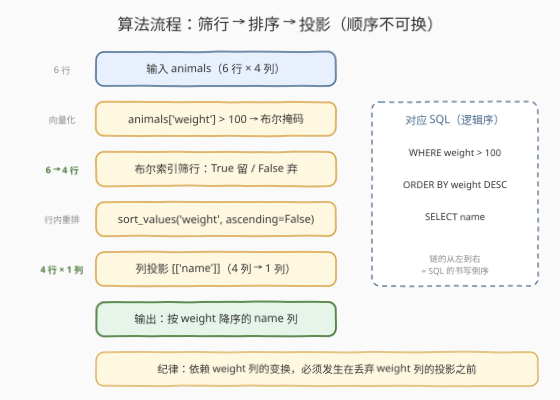
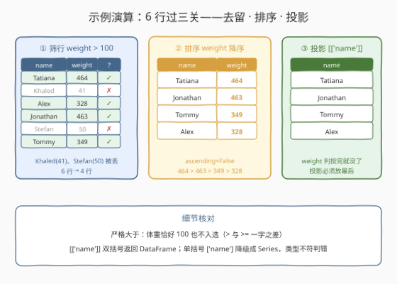

# LeetCode 方法链 题解

## 1. 题目概述

- **标题 / 题号**：方法链（#2891，easy）
- **链接**：https://leetcode.cn/problems/method-chaining/
- **难度**：简单
- **标签**：Pandas、方法链、布尔索引、排序

**题意**：编写一个解决方案，列出体重**严格超过** `100` 千克的动物的**名称**。

按体重**降序**返回动物。

DataFrame `animals`：

```text
+-------------+--------+
| Column Name | Type   |
+-------------+--------+
| name        | object |
| species     | object |
| age         | int    |
| weight      | int    |
+-------------+--------+
```

**示例 1**：

```text
输入：
+----------+---------+-----+--------+
| name     | species | age | weight |
+----------+---------+-----+--------+
| Tatiana  | Snake   | 98  | 464    |
| Khaled   | Giraffe | 50  | 41     |
| Alex     | Leopard | 6   | 328    |
| Jonathan | Monkey  | 45  | 463    |
| Stefan   | Bear    | 100 | 50     |
| Tommy    | Panda   | 26  | 349    |
+----------+---------+-----+--------+
输出：
+----------+
| name     |
+----------+
| Tatiana  |
| Jonathan |
| Tommy    |
| Alex     |
+----------+
解释：
所有体重超过 100 的动物都应包含在结果表中。
Tatiana 的体重为 464，Jonathan 的体重为 463，Tommy 的体重为 349，Alex 的体重为 328。
结果应按体重降序排序。
```

**约束**：

- 输出表**只含 `name` 一列**，行按 `weight` **降序**排列
- 体重**严格大于** 100 才入选（`> 100`，等于 100 不算——示例里 Stefan 体重 50 被排除，但若恰好 100 也不入选）
- 题面未给出显式规模约束（Pandas 入门系列惯例，数据量很小，不构成瓶颈）
- 题面额外挑战：**能用一行代码的方法链完成这个任务吗？**

> 💡 本题是 LeetCode「Pandas 入门」系列（2877–2891）的**收官题**。前 14 题分别练了建表、取头、筛行、投影、增列、去重、删缺、改列、改名、转型、填缺……这一题把它们串起来：**筛行（`weight > 100`）→ 排序（`weight` 降序）→ 投影（只留 `name`）**，并要求用**一行方法链**写完。它考察的不是新 API，而是「每个操作都返回一张新表」这一 fluent interface（流式接口）设计——这正是链式调用能成立的根基。

## 2. 解题思路

### 2.1 暴力思路：三步走，起两个临时变量

最朴素的写法：把三件事拆成三条语句，用中间变量接力：

```python
import pandas as pd

def findHeavyAnimals(animals: pd.DataFrame) -> pd.DataFrame:
    heavy = animals[animals['weight'] > 100]          # 筛行
    ordered = heavy.sort_values('weight', ascending=False)  # 排序
    return ordered[['name']]                          # 投影
```

- **正确性**：完全没问题，结果与方法链版一模一样；
- **啰嗦**：`heavy`、`ordered` 这类「只活一行」的中间变量纯属命名负担——读者要在脑子里给两个临时快照起名字、记生命周期；
- **丢了语义**：数据处理本质是一条**管道**（pipeline）：数据从左流到右，每步变换一次。临时变量把一条管道拍碎成了三段快照。

> ⚠️ 瓶颈不在性能（两种写法复杂度相同）而在**表达力**：既然每一步的输出恰好是下一步的输入，为什么不让代码长得就像管道本身？这就是方法链存在的意义。

### 2.2 核心观察：每个操作都返回新 DataFrame，链因此成立



pandas 的绝大多数转换方法（布尔筛行、`sort_values`、列投影……）都遵守同一契约：**不动原表，返回一张新表**。于是上一步的返回值可以直接 `.下一步()` 接着调：

| 链上环节 | 代码片段 | 语义 | 对应 SQL |
|----------|----------|------|----------|
| ① 筛行 | `animals[animals['weight'] > 100]` | 布尔掩码，`True` 留 `False` 弃（6 行 → 4 行） | `WHERE weight > 100` |
| ② 排序 | `.sort_values('weight', ascending=False)` | 按 `weight` 降序重排行 | `ORDER BY weight DESC` |
| ③ 投影 | `[['name']]` | 只留 `name` 列（4 行 4 列 → 4 行 1 列） | `SELECT name` |

串起来就是一行：

```python
return animals[animals['weight'] > 100].sort_values('weight', ascending=False)[['name']]
```

整条链**从左往右读就是数据流向**：全表进，筛完排，排完投，`name` 列出——与 SQL 的 `WHERE → ORDER BY → SELECT` 逻辑顺序一一对应。

> ⚠️ **两个高频坑**：
> 1. **顺序不能换**：投影必须放**最后**。一旦先写 `[['name']]`，`weight` 列就被丢掉了，紧接着 `.sort_values('weight')` 直接 `KeyError`——排序依据列在投影那一刻就没了；
> 2. **`inplace=True` 会断链**：链式成立的前提是「每步返回新表」，而 `inplace=True` 的方法返回 `None`——`None.sort_values(...)` 当场 `AttributeError`。方法链里永远不要碰 `inplace`。

### 2.3 算法流程图



| 步骤 | 操作 | 说明 |
|------|------|------|
| ① 输入 | `animals: pd.DataFrame` | 6 行 × 4 列（`name` / `species` / `age` / `weight`） |
| ② 筛行 | `animals['weight'] > 100` 产掩码 → 布尔索引 | 整列向量化比较，`True` 行保留：Tatiana、Jonathan、Tommy、Alex |
| ③ 排序 | `.sort_values('weight', ascending=False)` | 对筛后 4 行按 `weight` 降序：464 → 463 → 349 → 328 |
| ④ 投影 | `[['name']]` | 丢掉 `species` / `age` / `weight` 三列，只剩 `name` |
| ⑤ 输出 | 返回 DataFrame | 4 行 × 1 列；行索引沿用原表标签，评测不要求重排 |

### 2.4 示例演算



以示例 1 的 6 行数据逐步走查：

**第 ① 关：`weight > 100` 筛行**

| 行 | name | weight | 掩码 | 去留 |
|----|------|--------|------|------|
| 0 | Tatiana | 464 | `True` | ✅ 保留 |
| 1 | Khaled | 41 | `False` | ❌ 丢弃 |
| 2 | Alex | 328 | `True` | ✅ 保留 |
| 3 | Jonathan | 463 | `True` | ✅ 保留 |
| 4 | Stefan | 50 | `False` | ❌ 丢弃 |
| 5 | Tommy | 349 | `True` | ✅ 保留 |

**第 ② 关：`weight` 降序排序**（只对留下的 4 行）

| 顺序 | name | weight |
|------|------|--------|
| 1 | Tatiana | 464 |
| 2 | Jonathan | 463 |
| 3 | Tommy | 349 |
| 4 | Alex | 328 |

**第 ③ 关：投影 `[['name']]`** → 输出 `Tatiana / Jonathan / Tommy / Alex`，与预期完全一致。

两个容易忽视的细节：

- **`> 100` 是严格大于**：写成 `>= 100` 会把恰好 100 千克的动物也放进来（本题数据里 Stefan 是 50，恰好 100 的边界陷阱靠 `>` 与 `>=` 的一字之差区分）；
- **`[['name']]` 是双括号**：外层括号是「取列列表」，内层是只有一个元素的列表——返回 **DataFrame**；写成单括号 `['name']` 返回的是 `Series`，类型不符判错。

> 💡 一句话：**筛行、排序、投影各返回一张新表，从左往右串成一条管道**——顺序是「先筛、再排、最后投」，排序依据列投完就没了。

## 3. 参考代码

### Python（一行方法链，推荐）

```python
import pandas as pd


def findHeavyAnimals(animals: pd.DataFrame) -> pd.DataFrame:
    return animals[animals['weight'] > 100].sort_values('weight', ascending=False)[['name']]
```

> 💡 **写法要点**：
> - 从左往右读即数据流向：全表 → 筛行 → 降序 → 投影；
> - `ascending=False` 指定降序（默认 `True` 升序，忘写就反了）；
> - `[['name']]` 双括号保住 DataFrame 类型。

### Python（多行链式排版，工程风格）

```python
import pandas as pd


def findHeavyAnimals(animals: pd.DataFrame) -> pd.DataFrame:
    return (
        animals[animals['weight'] > 100]
        .sort_values('weight', ascending=False)
        .loc[:, ['name']]
    )
```

> 💡 **对照说明**：链一长，一行放不下时用**一对圆括号包住 + 每步一行**（PEP 8 认可的隐式续行）。注意列投影在这里改写成 `.loc[:, ['name']]`——让链上每一环都是「方法」形态，排版整齐；语义与 `[['name']]` 完全等价。

### Python（`query` 版，扩展）

```python
import pandas as pd


def findHeavyAnimals(animals: pd.DataFrame) -> pd.DataFrame:
    return animals.query('weight > 100').sort_values('weight', ascending=False)[['name']]
```

> 💡 **对照说明**：`query` 用字符串表达式描述行条件（列名不加引号直接用），大数据量下可走 `numexpr` 引擎省中间内存；本系列规模下与布尔索引无差别。它同样是「返回新表」的方法，可以无缝进链。

## 4. 复杂度分析

| 维度 | 复杂度 | 说明 |
|------|--------|------|
| **时间复杂度** | $O(n \log n)$ | $n$ 为行数：筛行是单趟 $O(n)$ 向量化比较，**排序** $O(n \log n)$ 占主导，投影是 $O(n)$ 拷贝 |
| **空间复杂度** | $O(n)$ | 链上每个环节都物化一张新表（筛后表、排序表、投影表），均为 $O(n)$ 量级 |

> - 分步临时变量版与链式版做的事完全相同——同一批中间表，只是没有为它们起名字；
> - 链式并非零开销：中间表仍会全部物化，真正流式（惰性求值）的处理要靠 polars / DuckDB 等库，pandas 的「链」是**书写层面**的管道，不是执行层面的。

## 5. 扩展：管道思维与链式生态

方法链的本质是 **fluent interface**：把「数据 → 变换 → 变换 → 结果」写成从左向右的一条管道。pandas 里能进链的常用积木远不止本题这三个：

| 积木 | 写法 | 作用 |
|------|------|------|
| 条件筛行 | `.query('weight > 100')` | 字符串表达式筛行 |
| 新建列 | `.assign(bmi=lambda df: df['weight'] / df['age'])` | 返回**带新列的新表**，可连续 `.assign()` 多次 |
| 去重 / 删缺 | `.drop_duplicates()` / `.dropna()` | 对照 2882 / 2883 |
| 改名 | `.rename(columns={'name': 'animal'})` | 对照 2885 |
| 取前 K | `.head(k)` / `.nlargest(k, 'weight')` | `nlargest(k, col)` = 按列取最大的 K 行，等价于「降序 + head」二合一 |
| 自定义函数 | `.pipe(my_func, arg)` | 把任意「吃表吐表」的函数接进链里 |

两个值得展开的点：

1. **`.pipe()` 是链式生态的逃生门**：凡是签名形如 `def f(df, ...) -> df` 的自定义函数，都能用 `df.pipe(f, ...)` 嵌进链中。甚至调试时可以写一个「打印中间状态再原样返回」的函数插进链里观察每一步的输出——管道不必断；
2. **`nlargest` 视角看本题**：`.sort_values('weight', ascending=False)[['name']]` 若不需要先筛也可以写成 `.nlargest(len(df), 'weight')`——但本题必须先 `> 100` 过滤，且 `nlargest` 的 `n` 需要提前知道行数，反而绕远。**降序排序取前 K** 的场景才是 `nlargest` 的甜区。

> ⚠️ **链的纪律**：链上每一环必须「返回新表」。赋值语句（`df['new'] = ...`）与 `inplace=True` 的方法都返回 `None`，它们属于「语句」而不是「表达式」，天生不能进链——需要改原表的操作，要么换 `assign`，要么把链断开写。

## 6. 面试要点

**Q1：为什么投影 `[['name']]` 必须放在链的最后？**

> 排序依据是 `weight` 列，而投影会把 `weight` 列丢掉。先投影再 `.sort_values('weight')` 会因找不到列直接 `KeyError`。一般化的纪律：**所有依赖某列的变换，都必须发生在丢弃该列的投影之前**。

**Q2：方法链为什么能成立？`inplace=True` 为什么会毁掉链？**

> pandas 转换方法遵守「不动原表、返回新表」的契约，前一步的返回值（新表）自然可以接着调下一步的方法。而 `inplace=True` 把结果写回原对象、**返回 `None`**——`None.xxx()` 立即 `AttributeError`。链式代码里永远使用默认的函数式写法。

**Q3：`sort_values` 的常用参数有哪些？排序稳定吗？**

> `by`（单列或多列列表）、`ascending`（布尔或与 `by` 等长的列表，如多列「一降一升」`ascending=[False, True]`）、`kind`（默认快排**不稳定**，需要稳定排序时传 `kind='stable'` 或 `'mergesort'`）、`ignore_index`（排序后重排行索引）。另外 `NaN` 默认排在**末尾**（`na_position='last'`）。

**Q4：`df[['name']]` 和 `df['name']` 有什么区别？**

> 双括号传的是**列名列表**，返回 `DataFrame`（二维表，哪怕只有一列）；单括号传单个列名，返回 `Series`（一维带索引的数组）。本题函数签名要求返回 `DataFrame`，且判题按表比较，必须双括号。记忆法：**方括号里是列表 → 出来是表**。

**Q5：一行超长的方法链怎么排版？中间状态怎么调试？**

> 用一对圆括号包住整个表达式、每步缩进一行（Python 隐式续行，不需要反斜杠），并把取列改写成 `.loc[:, cols]` 保持「每行一个方法」的节奏。调试中间状态：临时插一个 `.pipe(lambda df: (print(df.shape), df)[1])` 之类的「观测点」函数，或者干脆断链拆成几行赋值——**可读性优先于炫技**，链的长度以「一眼能读懂管道」为限。

> 💡 **一句话总结**：2891 是 Pandas 入门系列的收官——**布尔筛行、降序排序、列投影三块积木串成一条返回新表的管道**。坑全在顺序与姿势：先投后排 `KeyError`，`inplace` 断链，单括号降级 `Series`，`>` 写成 `>=` 边界错。

## 同类练习题

| # | 题目 | 与本题的关联 |
|---|------|-------------|
| 2880 | [数据选取](https://leetcode.cn/problems/select-data/) | 本题两块积木（布尔掩码筛行 + `.loc` 列投影）的单独练习 |
| 2882 | [删除重复的行](https://leetcode.cn/problems/drop-duplicate-rows/) | `drop_duplicates` 同为「返回新表」的方法，可直接嵌进链里 |
| 2884 | [修改列](https://leetcode.cn/problems/modify-columns/) | `df['col'] = ...` 列赋值是**语句**不能进链——与本题方法链形态正好互为对照 |
| 2888 | [重塑数据：连结](https://leetcode.cn/problems/reshape-data-concatenate/) | Pandas 入门系列的下一站，两张表垂直连结 |
