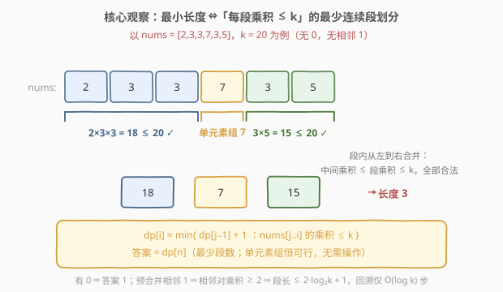
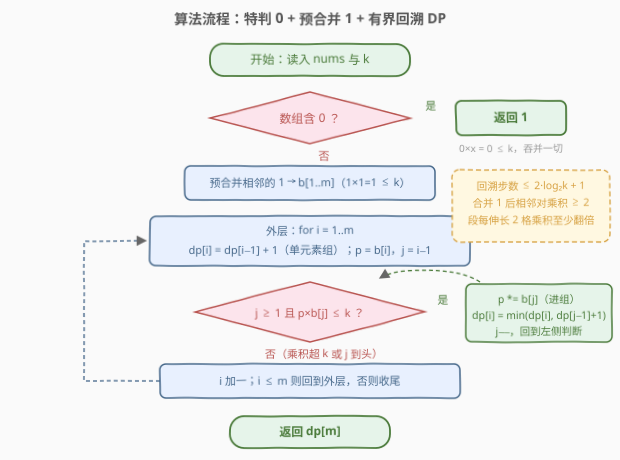
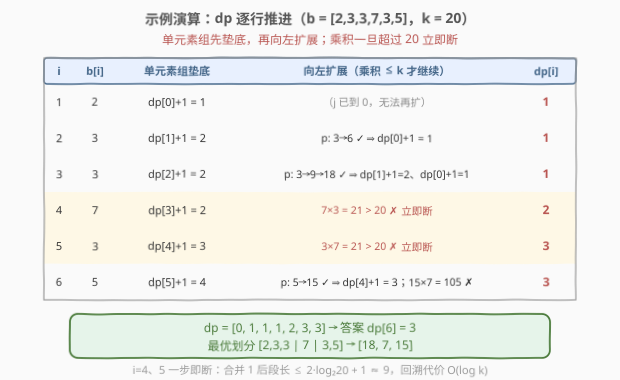

# 将相邻元素相乘后得到最小化数组

- **题目名称**：将相邻元素相乘后得到最小化数组
- **链接**：[2892. 将相邻元素相乘后得到最小化数组](https://leetcode.cn/problems/minimizing-array-after-replacing-pairs-with-their-product/)
- **难度**：中等
- **标签**：贪心、数组、动态规划

## 1. 题目概述

> ⚠️ 本题为 LeetCode 付费题，题意描述根据官方示例用例与 hints 重建，可能与官方题面有出入。

给你一个数组 `nums` 和一个整数 `k`。

一次操作中，你可以选择两个**相邻**的元素，如果它们的**乘积至多** $k$，就把这两个元素替换成它们的乘积（数组长度减 1）。你可以执行任意次操作（也可以不执行）。

返回最终数组可能的**最小长度**。

**示例 1**：

```text
输入：nums = [2,3,3,7,3,5], k = 20
输出：3
解释：[2,3,3] 从左到右依次合并（2×3=6 ≤ 20，6×3=18 ≤ 20）得到 18；[7] 保留；[3,5] 合并成 15。
最终数组 [18,7,15]，长度 3。任何两段划分都有一段乘积超过 20（如 [2,3,3|7,3,5] 后段 105），故 3 最小。
```

**示例 2**：

```text
输入：nums = [3,3,3,3], k = 6
输出：4
解释：任意相邻对的乘积 3×3 = 9 > 6，一次操作都无法执行，长度保持 4。
```

**约束条件**（付费题，按官方 hints 推断，供参考）：

- $1 \le \text{nums.length} \le 10^5$
- $0 \le \text{nums}[i] \le 10^9$
- $1 \le k \le 10^9$

> 💡 本题核心是「**操作序列 ⇔ 连续段划分**」。关键词「相邻相乘替换」「乘积至多 $k$」「最小长度」——每次操作长度减 1，最小长度 $= n - $ 最大合并次数；而操作只作用于相邻对、**不打乱顺序**，所以最终数组恰好对应原数组的一个顺序划分：每段被乘成段乘积。于是问题变成「**把数组切成最少的连续段，使每段乘积 $\le k$（单元素段恒可行）**」。三个加速点：有 0 直接返回 1；相邻的 1 预合并；合并 1 后相邻对乘积 $\ge 2$ ⇒ 段长被 $2\log_2 k + 1$ 封顶 ⇒ DP 向左回溯只需 $O(\log k)$ 步。

---

## 2. 解题思路

### 2.1 暴力思路：枚举划分

最直接的做法：把数组按所有可能的位置切成若干段，检查每段是否「长度为 1（恒可行）」或「段乘积 $\le k$」，取合法划分的最少段数。这是指数级的枚举；改成 DP 也一样朴素——

定义 $dp[i]$ 为**前 $i$ 个元素**能得到的最小长度，则

$$dp[i] = \min_{j \le i,\ \text{prod}(j..i) \le k} \big(dp[j-1] + 1\big)$$

其中单元素组（$j = i$）无需操作、恒可行。

> ⚠️ 问题在于内层要枚举所有 $j$，$O(n^2)$ 在 $n = 10^5$ 时超时。更糟的是数组含 0 或大量 1 时（乘积一直是 0 或 1，永远 $\le k$），回溯根本停不下来，退化最严重。

### 2.2 核心观察：划分等价 + 三个剪枝

**观察 1（划分等价）**：操作序列与「连续段划分」一一对应。

- 操作只合并相邻元素，**顺序不变** ⇒ 最终数组的每个元素 = 原数组中某段连续元素的乘积，段与段依次拼接；
- 反过来，给定一个划分，每段**从左到右**逐对合并即可：由于元素全 $\ge 1$（0 在观察 2 中单独处理），任意部分乘积 $\le$ 段总乘积 $\le k$，每一步操作都合法；
- 单元素段不需要任何操作，**恒可行**（哪怕它自己 $> k$——不动它就行）。

所以「最小长度」$=$「每段乘积 $\le k$（或单元素段）的最少连续段数」。



**观察 2（含 0 特判）**：若数组中有 0，答案就是 **1**。因为 $0 \times x = 0 \le k$，0 可以把左右两侧全部吞并进来，最终只剩一个 0。（顺带一提：不做特判 DP 也是对的——整段乘积为 0 $\le k$，$dp[n] = dp[0] + 1 = 1$——但回溯会一路扫到头，性能退化，所以干脆短路。）

**观察 3（预合并 1 + 回溯有界）**：先把相邻的 1 合并成一个（$1 \times 1 = 1 \le k$，k ≥ 1 恒可行，不影响答案）。此后**任意两个相邻元素的乘积 $\ge 2$**（不可能都是 1），于是长度为 $L$ 的段里有 $\lfloor L/2 \rfloor$ 个互不相邻的相邻对，每对贡献 $\ge 2$：

$$\text{prod}(j..i) \ge 2^{\lfloor L/2 \rfloor} \le k \ \Longrightarrow\ L \le 2\log_2 k + 1$$

$k \le 10^9 < 2^{30}$ 时段长至多约 61——内层回溯**乘积一旦超过 $k$ 立即break**，每组只扫 $O(\log k)$ 步。

### 2.3 算法流程图



**完整步骤**：

1. **特判**：数组含 0 → 返回 1
2. **预合并**：把相邻的 1 压缩成一个，得到 `b[1..m]`
3. **DP**：$dp[0] = 0$；对每个 $i = 1..m$：
   - 先取单元素组：$dp[i] = dp[i-1] + 1$；
   - 再从 $j = i-1$ 向左回溯，累积乘积 $p$；只要 $p \times b[j] \le k$ 就把 $b[j]$ 收进组，用 $dp[j-1] + 1$ 更新 $dp[i]$；一旦 $p \times b[j] > k$ 立即 break；
4. **返回** $dp[m]$

### 2.4 示例演算

以示例 1 `nums = [2,3,3,7,3,5]`，`k = 20` 为例（无 0 无 1，`b` 即 `nums`）：

| $i$ | $b[i]$ | 单元素组垫底 | 向左扩展（乘积 $\le 20$ 才继续） | $dp[i]$ |
|-----|--------|--------------|----------------------------------|---------|
| 1 | 2 | $dp[0]+1 = 1$ | （$j$ 已到 0，无法再扩） | 1 |
| 2 | 3 | $dp[1]+1 = 2$ | $p: 3 \to 6$ ✓ ⇒ $dp[0]+1 = 1$ | 1 |
| 3 | 3 | $dp[2]+1 = 2$ | $p: 3 \to 9 \to 18$ ✓ ⇒ $dp[1]+1=2$、$dp[0]+1=1$ | 1 |
| 4 | 7 | $dp[3]+1 = 2$ | $7 \times 3 = 21 > 20$ ✗ 立即断 | 2 |
| 5 | 3 | $dp[4]+1 = 3$ | $3 \times 7 = 21 > 20$ ✗ 立即断 | 3 |
| 6 | 5 | $dp[5]+1 = 4$ | $p: 5 \to 15$ ✓ ⇒ $dp[4]+1 = 3$；$15 \times 7 = 105$ ✗ | 3 |



最终 $dp[6] = 3$，对应最优划分 $[2,3,3 \mid 7 \mid 3,5] \to [18, 7, 15]$。

再用示例 2 复核：`nums = [3,3,3,3]`，`k = 6`：每个 $i$ 回溯第一步就遇 $3 \times 3 = 9 > 6$ 断掉，$dp = [0,1,2,3,4]$，答案 4 ✓——一次操作都做不了的情形被 DP 自然覆盖。

---

## 3. 参考代码

### C++

```cpp
class Solution {
public:
    int minArrayLength(vector<int>& nums, int k) {
        // 有 0 ⇒ 0 吞并一切，答案 1
        if (find(nums.begin(), nums.end(), 0) != nums.end()) return 1;

        vector<long long> b;                    // 预合并相邻的 1
        for (int x : nums) {
            if (x == 1 && !b.empty() && b.back() == 1) continue;
            b.push_back(x);
        }

        int m = b.size();
        vector<int> dp(m + 1, INT_MAX);
        dp[0] = 0;
        for (int i = 1; i <= m; i++) {
            dp[i] = dp[i - 1] + 1;              // 单元素组：恒可行
            long long p = b[i - 1];
            for (int j = i - 1; j >= 1; j--) {
                if (p * b[j - 1] > k) break;    // 乘之前判断，防溢出；一旦超 k 不可能再缩回来
                p *= b[j - 1];
                dp[i] = min(dp[i], dp[j - 1] + 1);
            }
        }
        return dp[m];
    }
};
```

### Python

```python
class Solution:
    def minArrayLength(self, nums: List[int], k: int) -> int:
        if 0 in nums:                          # 有 0 ⇒ 0 吞并一切，答案 1
            return 1

        b = []                                 # 预合并相邻的 1
        for x in nums:
            if x == 1 and b and b[-1] == 1:
                continue
            b.append(x)

        m = len(b)
        dp = [0] + [inf] * m
        for i in range(1, m + 1):
            dp[i] = dp[i - 1] + 1              # 单元素组：恒可行
            p = b[i - 1]
            for j in range(i - 1, 0, -1):
                if p * b[j - 1] > k:
                    break                      # 一旦超 k 立即断
                p *= b[j - 1]
                dp[i] = min(dp[i], dp[j - 1] + 1)
        return dp[m]
```

> 💡 方法名 `minArrayLength` 与签名按题意重建。两个实现细节：① **break 要放在乘法之前**——$p \le k \le 10^9$、$b[j] \le 10^9$，先比后乘则乘积至多 $10^{18}$，C++ 用 `long long` 即可安全容纳，不会溢出；② 单元素组**不看乘积**——$b[i] > k$ 的元素无法参与任何合并（乘谁都会更大），但单独留在原地永远合法。

---

## 4. 复杂度分析

| 维度 | 复杂度 | 说明 |
|------|--------|------|
| **时间复杂度** | $O(n \log k)$ | 特判与预合并 $O(n)$；主 DP 每个 $i$ 向左回溯至多 $2\log_2 k + 1$ 步（合并 1 后相邻对乘积 $\ge 2$，段每伸长 2 格乘积至少翻倍），$k \le 10^9$ 时约 61 步 |
| **空间复杂度** | $O(n)$ | 压缩数组 `b` 与 `dp` 数组 |

> ⚠️ 对比 2.1 的朴素 DP：不合并 1、不特判 0 时，全 1 数组或含 0 数组会让回溯一路扫到头，退化成 $O(n^2)$；三个剪枝把内层循环从「可能 $O(n)$」压到「严格 $O(\log k)$」。

---

## 5. 扩展：贪心 + 双指针的 O(n) 版

去掉 0 之后元素全 $\ge 1$，组乘积关于「向右扩展」**单调不减**——这正是[跳跃游戏 II](../0001-0100/45_跳跃游戏%20II.md)式「划分最少段数」的标准贪心场景：**每一组都在不超过 $k$ 的前提下尽量伸长**，组数即最少。

**正确性（交换论证归纳）**：设最优解第 $i$ 段右端点为 $e_i$、贪心第 $i$ 段右端点为 $g_i$，归纳可证 $e_i \le g_i$：若 $e_i > g_i$，则由 $e_{i-1} \le g_{i-1}$ 知 $\text{prod}(g_{i-1}+1..e_i) \le \text{prod}(e_{i-1}+1..e_i) \le k$，贪心第 $i$ 段还能再伸长，与 $g_i$ 的极大性矛盾。故贪心段数 $\le$ 最优段数。

```python
class Solution:
    def minArrayLength(self, nums: List[int], k: int) -> int:
        if 0 in nums:              # ⚠️ 必须特判：0 会破坏「乘积随扩展单调不减」
            return 1
        groups, p = 0, 0           # p == 0 表示当前组为空
        for x in nums:
            if p == 0:             # 开新组（哪怕 x > k，单元素组也合法）
                p, groups = x, groups + 1
            elif p * x <= k:
                p *= x             # 尽量伸长
            else:
                p, groups = x, groups + 1   # 超 k，切割开新组
        return groups
```

时间 $O(n)$、额外空间 $O(1)$（连 1 的预合并都不需要——1 不破坏单调性，只是让组「白伸长」，贪心照样正确）。

> ⚠️ 注意 0 的特判对贪心是**正确性**问题而非仅性能问题：如 `nums = [5,6,0]`，`k = 10`，贪心先把 `[5]`、`[6]` 切开（$5 \times 6 = 30 > 10$），0 到来时只能并进后一组得 2；而最优解是先 $5 \times 0 = 0$、再 $0 \times 6 = 0$，答案 1。DP 枚举所有切法没有这个坑——这就是官方 hints 选 DP 的稳妥之处。

---

## 6. 面试要点

1. **为什么「任意次操作后的最小长度」等价于「最少连续段划分」？**

   - 操作只作用于相邻对、不打乱顺序 ⇒ 最终每个元素对应原数组一段连续元素的乘积，段依次拼接。反过来，任给划分，每段从左到右逐对合并：元素全 $\ge 1$ 时部分乘积 $\le$ 段总乘积 $\le k$，每步合法。两方向合起来即一一对应，最小长度 $=$ 最少合法段数（单元素段恒可行）。

2. **含 0 为什么直接返回 1？不做特判会怎样？**

   - $0 \times x = 0 \le k$，0 逐步吞并两侧最终只剩一个 0。不做特判 DP 结果仍正确（整段乘积为 0，$dp[n] = 1$），但回溯条件「乘积 $> k$」永远不触发，内层扫满 $O(n)$，整体退化 $O(n^2)$——特判是性能保底。对贪心版则是**正确性**必需（见第 5 节 `[5,6,0]` 反例）。

3. **内层回溯为什么是 $O(\log k)$ 而不是 $O(n)$？**

   - 预合并相邻 1 后，任意相邻两元素乘积 $\ge 2$；长度 $L$ 的段含 $\lfloor L/2 \rfloor$ 个互不相邻的相邻对，乘积 $\ge 2^{\lfloor L/2 \rfloor}$。要 $\le k < 2^{31}$ 就有 $L \le 2\log_2 k + 1 \approx 61$。乘积一旦超过 $k$，再往左乘只可能更大（元素 $\ge 1$），立即 break 不损失解。

4. **单元素组为什么不受 $k$ 约束？溢出怎么防？**

   - 「不操作」永远合法，所以 $b[i] > k$ 的元素自成一组即可；它也无法与任何邻居合并（乘积只会更大）。溢出方面：break 写在乘法**之前**，参与比较的 $p \cdot b[j]$ 至多 $k \cdot \max(\text{nums}) \le 10^{18}$，C++ 用 `long long` 安全。

5. **贪心（每段尽量伸长）为什么正确？什么时候会失效？**

   - 元素全 $\ge 1$ ⇒ 组乘积对右端点单调不减 ⇒ 可行右端点是一段连续区间；用 $e_i \le g_i$ 归纳 + 交换论证得贪心段数最优。失效条件正是单调性被破坏：出现 0（乘积瞬间归零，「伸得长」不再蕴含「包含更优切割」）或负数/小数（本题约束外）——此时必须回到 DP 枚举所有切割点。

> 💡 **一句话总结**：最小长度 $=$ 「每段乘积 $\le k$（单元素恒可）」的最少连续段数；有 0 答 1、相邻 1 预合并后段长 $\le 2\log_2 k + 1$，DP 向左有界回溯 $O(n \log k)$ 解决；元素全 $\ge 1$ 时还可贪心 $O(n)$。

---

## 7. 同类练习题

- [713. 乘积小于K的子数组](https://leetcode.cn/problems/subarray-product-less-than-k/)：同款「乘积 $\le k$」窗口，正数单调性是两题共同的命根子
- [132. 分割回文串II](../0101-0200/132_分割回文串II.md)：同款 $dp[i] = \min(dp[j-1] + 1)$ 的「最少切割段数」转移，段可行性检查从回文换成乘积
- [139. 单词拆分](../0101-0200/139_单词拆分.md)：同款「前缀 DP + 段可行性」结构（$dp[j]$ 成立且 $s[j..i]$ 合法则 $dp[i]$ 成立）
- [410. 分割数组的最大值](../0401-0500/410_分割数组的最大值.md)：连续段划分最优化，用二分答案替代 DP，与本题的贪心版互为映照
- [1567. 乘积为正的最长子数组长度](../1501-1600/1567_乘积为正的最长子数组长度.md)：乘积类 DP 的另一形态，体会「乘积做状态」与「乘积做约束」的差异
