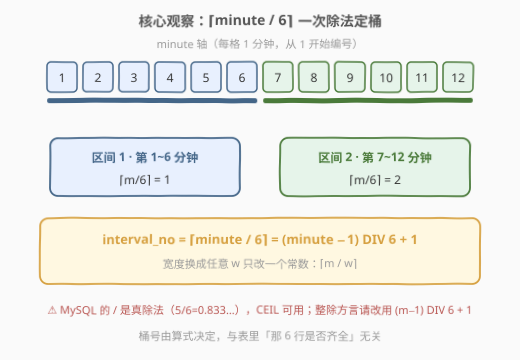
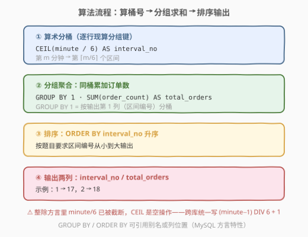
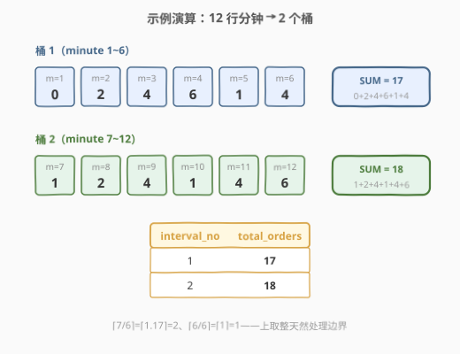

# 计算每个区间内的订单

- **题目名称**：计算每个区间内的订单
- **链接**：[2893. 计算每个区间内的订单](https://leetcode.cn/problems/calculate-orders-within-each-interval/)
- **难度**：中等
- **标签**：数据库、SQL、GROUP BY、算术分桶、`CEIL`、`DIV`

## 1. 题目概述

> ⚠️ 本题为 LeetCode 付费题（Plus 会员专享），题意描述根据官方示例用例与外部资料重建，可能与官方题面有出入。

**表结构**：`Orders`

| 列名 | 类型 |
|------|------|
| minute | int |
| order_count | int |

- `minute` 是该表的主键。
- 每行表示商店开张后第 `minute` 分钟内收到的订单数量为 `order_count`（分钟从 1 开始编号）。

**目标**：把时间轴按**每 6 分钟一个区间**划分——区间 1 覆盖第 $1 \sim 6$ 分钟，区间 2 覆盖第 $7 \sim 12$ 分钟，依此类推。编写解决方案，统计**每个区间内的订单总数**，输出 `interval_no`（区间编号）与 `total_orders`（订单总数），按 `interval_no` **升序**排列。

**示例 1**：

```text
输入：
Orders 表:
+--------+-------------+
| minute | order_count |
+--------+-------------+
| 1      | 0           |
| 2      | 2           |
| 3      | 4           |
| 4      | 6           |
| 5      | 1           |
| 6      | 4           |
| 7      | 1           |
| 8      | 2           |
| 9      | 4           |
| 10     | 1           |
| 11     | 4           |
| 12     | 6           |
+--------+-------------+

输出：
+--------------+--------------+
| interval_no  | total_orders |
+--------------+--------------+
| 1            | 17           |
| 2            | 18           |
+--------------+--------------+
```

**解释**：

- 区间 1（第 $1 \sim 6$ 分钟）：$0 + 2 + 4 + 6 + 1 + 4 = 17$。
- 区间 2（第 $7 \sim 12$ 分钟）：$1 + 2 + 4 + 1 + 4 + 6 = 18$。

> 💡 **审题关键**：① 区间从第 1 分钟起算、宽度固定为 6，与表中**是否恰好凑齐 6 行**无关——某分钟没数据只是缺行，不改变区间边界；② 输出只有**编号 + 总数**两列；③ 分组键不是表里现成的列，而是要**从 `minute` 现算**出来——这正是本题的考点。

---

## 2. 解题思路

### 2.1 暴力思路：CASE WHEN 硬编码每个区间

最直白的写法：既然知道宽度是 6，就把每个区间用 `WHEN minute BETWEEN ... AND ...` 手写出来：

```sql
SELECT
    CASE
        WHEN minute BETWEEN 1  AND 6  THEN 1
        WHEN minute BETWEEN 7  AND 12 THEN 2
        WHEN minute BETWEEN 13 AND 18 THEN 3
        -- ...分支随时间轴无限膨胀
    END AS interval_no,
    SUM(order_count) AS total_orders
FROM Orders
GROUP BY interval_no
ORDER BY interval_no;
```

- **正确性**：对前几个区间没问题，但分支数随时间轴长度线性膨胀——100 万分钟要写约 16.7 万个 `WHEN`。
- **参数焊死**：宽度 6 被复制进每一个分支的边界里，改成 5 分钟一个区间就要全量重写。
- **漏数据**：`CASE` 没写到的区间要么被 `ELSE NULL` 吞掉，要么整组丢失，边界维护全靠人肉。

> ⚠️ 瓶颈在于把「第 $m$ 分钟属于哪个区间」当成一个个**离散区间去枚举比对**。突破口是注意到：区间编号是 `minute` 的**纯算术函数**——一次除法就能算出来。

### 2.2 核心观察：$\lceil \text{minute} / 6 \rceil$ 一步分桶



把分钟按 6 个一组排进桶里，第 $i$ 个区间覆盖第 $6(i-1)+1 \sim 6i$ 分钟。反过来问：第 $m$ 分钟落在哪个区间？这就是经典的**上取整除法**：

$$\text{interval\_no} = \left\lceil \frac{m}{6} \right\rceil = \left\lfloor \frac{m-1}{6} \right\rfloor + 1$$

- $m = 1 \sim 6 \Rightarrow \lceil m/6 \rceil = 1$；$m = 7 \sim 12 \Rightarrow 2$；$m = 13 \sim 18 \Rightarrow 3$……
- 两个等价形态：**CEIL 版**直接由定义而来；**减 1 取整再加 1 版**是「平移到 0 起点再向下取整」的经典改写，只依赖整数运算。

于是整题塌缩成一句 `GROUP BY`：

```sql
SELECT CEIL(minute / 6) AS interval_no, SUM(order_count) AS total_orders
FROM Orders
GROUP BY 1
ORDER BY 1;
```

> ⚠️ **方言坑（本题最大的坑）**：MySQL 的 `/` 是**真除法**（`5/6 = 0.8333`），`CEIL` 拿到小数再上取整，正确。但在整除语义的方言里（如 SQL Server 的 `int/int`、PostgreSQL 的 `int/int`），`minute/6` **先被截断成整数**，`CEIL(整数)` 是空操作——除边界分钟（6、12……）以外的所有分钟**全部算错桶**。跨库安全的写法是整数版 $(m-1) \,\texttt{DIV}\, 6 + 1$，见参考代码解法 B。

### 2.3 算法流程图



**逻辑执行步骤**：

| 步骤 | 表达式 | 作用 |
|------|--------|------|
| ① 算术分桶 | `CEIL(minute / 6)` | 逐行现算所属区间编号，分组键来自表达式而非现成列 |
| ② 分组聚合 | `GROUP BY 1` + `SUM(order_count)` | 同桶订单数累加 |
| ③ 排序 | `ORDER BY 1` | 按区间编号升序输出 |

> 💡 `GROUP BY 1` 里的 `1` 是**列位置**（输出第 1 列）而非常数字面量——MySQL 方言允许 `GROUP BY`/`ORDER BY` 引用别名或位置，比把长表达式抄两遍更耐改。

### 2.4 示例演算



对示例的 12 行逐分钟计算 $\lceil \text{minute}/6 \rceil$：

| minute | order_count | $\lceil m/6 \rceil$ | 落桶 |
|--------|-------------|--------------------|------|
| 1 | 0 | $\lceil 0.17 \rceil = 1$ | 桶 1 |
| 2 | 2 | $\lceil 0.33 \rceil = 1$ | 桶 1 |
| 3 | 4 | $\lceil 0.50 \rceil = 1$ | 桶 1 |
| 4 | 6 | $\lceil 0.67 \rceil = 1$ | 桶 1 |
| 5 | 1 | $\lceil 0.83 \rceil = 1$ | 桶 1 |
| 6 | 4 | $\lceil 1.00 \rceil = 1$ | 桶 1（边界恰整除，仍属上一桶） |
| 7 | 1 | $\lceil 1.17 \rceil = 2$ | 桶 2 |
| 8 | 2 | $\lceil 1.33 \rceil = 2$ | 桶 2 |
| 9 | 4 | $\lceil 1.50 \rceil = 2$ | 桶 2 |
| 10 | 1 | $\lceil 1.67 \rceil = 2$ | 桶 2 |
| 11 | 4 | $\lceil 1.83 \rceil = 2$ | 桶 2 |
| 12 | 6 | $\lceil 2.00 \rceil = 2$ | 桶 2（边界恰整除，仍属上一桶） |

- 桶 1：$0+2+4+6+1+4 = \mathbf{17}$
- 桶 2：$1+2+4+1+4+6 = \mathbf{18}$

与示例输出一致。注意 $m=6$ 与 $m=12$：除法**恰好整除**时上取整不变，天然留在前一个桶——这正是 `CEIL` 语义的正确边界行为。

---

## 3. 参考代码

### SQL（解法 A：`CEIL` 上取整，LeetCode MySQL 推荐）

```sql
# Write your MySQL query statement below
SELECT
    CEIL(minute / 6) AS interval_no,
    SUM(order_count) AS total_orders
FROM Orders
GROUP BY 1
ORDER BY 1;
```

> 💡 **写法要点**：
> - MySQL 的 `/` 对整数也返回精确小数（`7/6 = 1.1666`），`CEIL` 上取整一步到位。
> - `CEILING` 是 `CEIL` 的同义全称，两者等价。
> - `GROUP BY 1` / `ORDER BY 1` 引用输出列位置，等价于重复 `CEIL(minute/6)` 表达式。

### SQL（解法 B：整数除法，跨方言稳）

```sql
SELECT
    (minute - 1) DIV 6 + 1 AS interval_no,
    SUM(order_count) AS total_orders
FROM Orders
GROUP BY 1
ORDER BY 1;
```

> 💡 **写法要点**：
> - 三步走：**减 1 平移到 0 起点 → 整除 6 分桶 → 加回 1**。全程整数运算，不依赖除法的小数语义。
> - 在整除方言（SQL Server / PostgreSQL）里把 `DIV` 换成 `/` 即可：`(minute - 1) / 6 + 1`——不存在「先截断再 CEIL」的空操作陷阱。
> - 该形态还天然兼容「分钟从 0 开始编号」的变体题（去掉减 1 即是 0 起点桶号）。

### Python（pandas）

```python
import pandas as pd


def calculate_orders_within_each_interval(orders: pd.DataFrame) -> pd.DataFrame:
    orders = orders.copy()
    orders["interval_no"] = (orders["minute"] - 1) // 6 + 1
    return (
        orders.groupby("interval_no", as_index=False)
        .agg(total_orders=("order_count", "sum"))
        .sort_values("interval_no")
        .reset_index(drop=True)
    )
```

> 💡 **pandas 对照**：
> - `(minute - 1) // 6 + 1` 就是整数版分桶；Python 的 `//` 对非负整数即向下取整，与 SQL 的 `DIV` 行为一致。
> - `agg(total_orders=...)` 是**命名聚合**，一步完成「求和 + 改列名」，对应 SQL 的 `SUM(...) AS total_orders`。
> - `as_index=False` 让分组键回到普通列，输出即题目要求的 `interval_no / total_orders` 两列 DataFrame。

---

## 4. 复杂度分析

| 维度 | 复杂度 | 说明 |
|------|--------|------|
| **时间复杂度** | $O(n)$ | 哈希分组：每行 $O(1)$ 算桶号 + $O(1)$ 累加；若优化器走排序分组则为 $O(n \log n)$ |
| **空间复杂度** | $O(k)$ | $k$ = 出现过的区间数（$k \le n$），分组哈希表 / 排序缓冲 |
| **pandas 版** | $O(n)$ | 向量化分桶 + `groupby.sum()` 均为线性扫描 |

> - $n$ = `Orders` 行数。
> - 算桶号是每行 $O(1)$ 的纯算术，聚合才是主项；本题没有窗口排序，比「排序 + 窗口」类问题少一个 $\log$ 因子。

---

## 5. 扩展：宽度泛化、补全空区间与首末分钟

### 5.1 任意宽度 $w$ 与首末分钟

$$\text{interval\_no} = \left\lceil \frac{m}{w} \right\rceil,\qquad \text{first\_minute} = w(i-1)+1,\quad \text{last\_minute} = wi$$

只改一个常数。若题目额外要求输出区间首尾分钟：

```sql
SELECT
    CEIL(minute / 6)                        AS interval_no,
    6 * (CEIL(minute / 6) - 1) + 1          AS first_minute,
    6 * CEIL(minute / 6)                    AS last_minute,
    SUM(order_count)                        AS total_orders
FROM Orders
GROUP BY 1
ORDER BY 1;
```

### 5.2 补全「没有订单的区间」

`GROUP BY` 是**数据驱动**的：某 6 分钟内一行都没有，该区间就不会出现在结果里。若要求列出截至最大分钟的所有区间（无订单补 0），需要反客为主——先造区间序列，再 `LEFT JOIN` 聚合：

```sql
WITH RECURSIVE
    MaxT AS (SELECT CEIL(MAX(minute) / 6) AS k FROM Orders),
    Seq AS (
        SELECT 1 AS interval_no
        UNION ALL
        SELECT interval_no + 1 FROM Seq, MaxT WHERE interval_no < k
    )
SELECT s.interval_no, IFNULL(SUM(o.order_count), 0) AS total_orders
FROM Seq s
LEFT JOIN Orders o ON CEIL(o.minute / 6) = s.interval_no
GROUP BY s.interval_no
ORDER BY s.interval_no;
```

> 💡 「分组键是算出来的」+「组可能缺席」是分桶题的两面：前者考算术，后者考造序列（递归 CTE / 数字表 / `generate_series`）。

---

## 6. 面试要点

**Q1：为什么 $\lceil m/6 \rceil$ 与 $\lfloor (m-1)/6 \rfloor + 1$ 等价？**

> 对正整数 $m$ 有恒等式 $\lceil m/w \rceil = \lfloor (m-1)/w \rfloor + 1$。直观理解：桶内 6 个编号减 1 后正好铺满 $0 \sim 5$、$6 \sim 11$ 两组「整除段」——减 1 把 1 起点平移到 0 起点，下取整分桶后再把编号加回来。

**Q2：`CEIL(minute/6)` 在 MySQL 里为什么对，换数据库为什么可能错？**

> MySQL 的 `/` 恒为真除法（结果是 decimal），`CEIL` 拿到小数再上取整，正确。而 SQL Server / PostgreSQL 的 `int / int` 是整数除法（直接截断小数），`CEIL(已截断的整数)` 是空操作，除恰整除的边界分钟外**全部算错桶**。跨方言统一写 $(m-1)$ 整除 $w$ 再 $+1$。

**Q3：`GROUP BY 1` 是什么语义？和 `GROUP BY 常量` 一样吗？**

> `GROUP BY 1` 引用的是 SELECT 输出的**第 1 列**（位置引用，MySQL 方言特性），等价于 `GROUP BY interval_no` 或重复整个表达式；它绝不是「按常量 1 分组」。追求标准兼容时可写 `GROUP BY CEIL(minute / 6)`，语义在哪个库都一致。

**Q4：若某个区间内一行数据都没有，它会出现在输出里吗？要补 0 怎么办？**

> 不会——`GROUP BY` 只对**存在的行**分组，桶是「有数据才出现」。补 0 要反客为主：先递归 CTE / 数字表生成区间序列，再 `LEFT JOIN Orders` 后 `IFNULL(SUM(...), 0)`（见 5.2）。这是「分桶聚合」与「对齐缺失分组」的标准组合拳。

**Q5：区间定义改成「从第 0 分钟开始、左闭右开 $[0,6), [6,12)\cdots$」怎么改？**

> 0 起点下桶号直接是 $\lfloor m/6 \rfloor$（$m = 0 \sim 5 \Rightarrow 0$），无需平移；若输出编号习惯从 1 起，再整体 $+1$。核心不变：**先看编号起点，再定「减 1」这个平移量**——起点平移错一格，所有桶都会被边界分钟污染。

> 💡 **一句话总结**：2893 是**「算术分桶 + 分组聚合」的模板题**——分组键不是现成列而是 $\lceil \text{minute}/6 \rceil$ 一次除法算出来，宽度换 $w$ 只改常数。最大坑点：**整除方言里 `CEIL(m/6)` 是空操作**，跨库请用 $(m-1)\ \texttt{DIV}\ 6 + 1$。进阶姿势：递归 CTE 造序列补全空区间。

---

## 7. 同类练习题

- [511. 游戏玩法分析 I](https://leetcode.cn/problems/game-play-analysis-i/)：最简 `GROUP BY` + 聚合入门，本题去掉分桶运算后的骨架版
- [626. 换座位](https://leetcode.cn/problems/exchange-seats/)：对主键 id 做模运算重排，与 $\lceil m/6 \rceil$ 同属「对键做算术映射」家族
- [1327. 列出指定时间段内所有的下单产品](https://leetcode.cn/problems/list-the-products-ordered-in-a-period/)：日期范围过滤 + 分组聚合，时间维度上的兄弟题
- [1225. 报告系统状态的连续日期](https://leetcode.cn/problems/report-contiguous-dates/)：把连续时间合并成区间的 Gaps and Islands 母题，「区间从哪来」的进阶形态
