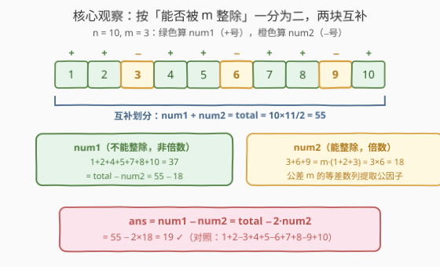
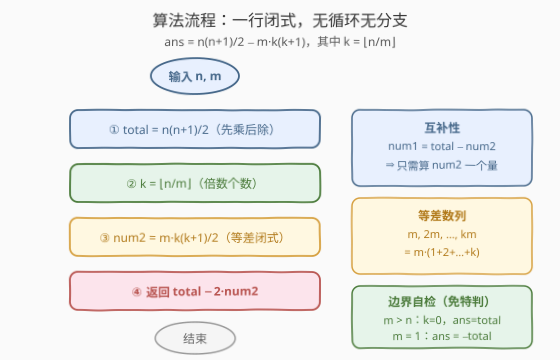
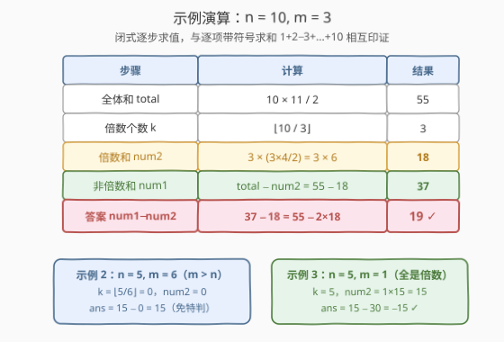

# LeetCode 分类求和并作差 题解

## 1. 题目概述

- **标题 / 题号**：分类求和并作差（#2894，easy）
- **链接**：https://leetcode.cn/problems/divisible-and-non-divisible-sums-difference/
- **难度**：简单
- **标签**：数学

**题意**：给你两个**正整数** `n` 和 `m`。

现定义两个整数 `num1` 和 `num2`：

- `num1`：范围 $[1, n]$ 内所有**无法被** `m` **整除**的整数之和。
- `num2`：范围 $[1, n]$ 内所有**能够被** `m` **整除**的整数之和。

返回整数 $num1 - num2$。

**示例 1**：

```text
输入：n = 10, m = 3
输出：19
解释：范围 [1, 10] 内无法被 3 整除的整数为 [1,2,4,5,7,8,10]，num1 = 37。
     范围 [1, 10] 内能够被 3 整除的整数为 [3,6,9]，num2 = 18。
     返回 37 - 18 = 19。
```

**示例 2**：

```text
输入：n = 5, m = 6
输出：15
解释：范围 [1, 5] 内无法被 6 整除的整数为 [1,2,3,4,5]，num1 = 15。
     范围 [1, 5] 内能够被 6 整除的整数为 []，num2 = 0。
     返回 15 - 0 = 15。
```

**示例 3**：

```text
输入：n = 5, m = 1
输出：-15
解释：范围 [1, 5] 内无法被 1 整除的整数为 []，num1 = 0。
     范围 [1, 5] 内能够被 1 整除的整数为 [1,2,3,4,5]，num2 = 15。
     返回 0 - 15 = -15。
```

**约束**：

- $1 \le n, m \le 1000$

> 💡 读题关键：这是按「能否被 $m$ 整除」把 $[1, n]$ **一分为二**的分类求和。注意两块是**互补**的——$num1 + num2$ 恒等于 $[1,n]$ 的总和。看到「互补划分 + 等差数列」，就该意识到答案有 $O(1)$ 闭式，根本不用循环。

## 2. 解题思路

### 2.1 暴力思路

最直接的模拟：一趟循环 $i = 1 \dots n$，按 $i \bmod m$ 是否为 $0$ 决定加**正号**还是**负号**：

$$ans = \sum_{i=1}^{n} s(i) \cdot i, \qquad s(i) = \begin{cases} +1, & m \nmid i \\ -1, & m \mid i \end{cases}$$

时间 $O(n)$、空间 $O(1)$，在 $n \le 1000$ 的规模下当然秒过。也可以开两个累加器分别算出 $num1$、$num2$ 再相减，本质相同。

但本题的分类结构完全是**初等数论**式的：两堆数各自都是**等差数列的片段**，求和有闭式，循环是多余功。

### 2.2 核心观察：整体减局部——等差数列闭式 $O(1)$



**观察 1（互补划分）**：$[1, n]$ 中每个整数恰好属于一侧，所以

$$num1 + num2 = \text{total} = \frac{n(n+1)}{2}$$

只要求出其中一块，另一块免费。

**观察 2（倍数集是公差为 $m$ 的等差数列）**：能被 $m$ 整除的数依次是 $m, 2m, 3m, \dots, km$，其中 $k = \left\lfloor n/m \right\rfloor$ 是 $[1, n]$ 内 $m$ 的倍数个数。提取公因子 $m$：

$$num2 = m + 2m + \cdots + km = m \cdot (1 + 2 + \cdots + k) = m \cdot \frac{k(k+1)}{2}$$

**观察 3（差 = 总和 − 2 倍局部）**：由互补性 $num1 = \text{total} - num2$，于是

$$ans = num1 - num2 = \text{total} - 2 \cdot num2 = \frac{n(n+1)}{2} - m \cdot k(k+1), \qquad k = \left\lfloor \frac{n}{m} \right\rfloor$$

> 💡 本质：这就是**容斥**的最简形态——「全体 − 掏走的部分」得到剩余，再做差又把掏走的部分反号计入。三个观察环环相扣：互补性消掉 $num1$ 的独立计算，等差数列闭式消掉循环，最后只剩一行算术。

### 2.3 算法流程图



流程只有一条直线，没有任何分支：

1. 计算 $\text{total} = \dfrac{n(n+1)}{2}$；
2. 计算 $k = \lfloor n/m \rfloor$，$\quad num2 = m \cdot \dfrac{k(k+1)}{2}$；
3. 返回 $\text{total} - 2 \cdot num2$。

两个边界无需特判、天然正确：$m > n$ 时 $k = 0$，$num2 = 0$（一个倍数都没有，对应示例 2）；$m = 1$ 时 $k = n$，所有数都是倍数，$ans = -\text{total}$（对应示例 3）。

### 2.4 示例演算



以示例 1（$n = 10$，$m = 3$）为例，闭式逐步求值：

| 步骤 | 计算 | 结果 |
|------|------|------|
| 全体和 total | $10 \times 11 / 2$ | $55$ |
| 倍数个数 $k$ | $\lfloor 10/3 \rfloor$ | $3$ |
| 倍数和 num2 | $3 \times (3 \times 4 / 2) = 3 \times 6$ | $18$ |
| 非倍数和 num1 | $55 - 18$ | $37$ |
| 答案 num1 − num2 | $37 - 18$ | $\mathbf{19}$ |

与逐项带符号求和 $1+2-3+4+5-6+7+8-9+10 = 19$ 完全一致。

- **示例 2**（$n=5, m=6$）：$m > n \Rightarrow k = 0$，$num2 = 0$，$ans = 15 - 0 = 15$；
- **示例 3**（$n=5, m=1$）：$k = 5$，$num2 = 1 \times 15 = 15$，$ans = 15 - 2 \times 15 = -15$。

## 3. 参考代码

### C++

```cpp
class Solution {
public:
    int differenceOfSums(int n, int m) {
        int k = n / m;                              // [1, n] 中 m 的倍数个数
        return n * (n + 1) / 2 - m * k * (k + 1);   // total − 2·num2
    }
};
```

### Python

```python
class Solution:
    def differenceOfSums(self, n: int, m: int) -> int:
        k = n // m                            # [1, n] 中 m 的倍数个数
        return n * (n + 1) // 2 - m * k * (k + 1)   # total − 2·num2
```

> ⚠️ 顺序坑：$\frac{n(n+1)}{2}$ 必须先乘后除——$n(n+1)$ 恒为偶数，整除无损；若先除，$\frac{n}{2} \cdot (n+1)$ 在 $n$ 为奇数时会丢精度。本题 $n, m \le 1000$，中间量不超过 $10^6$，`int` 绰绰有余；若 $n$ 升到 $10^9$ 量级，C++ 需换 `long long`，Python 天然大整数无虞。

## 4. 复杂度分析

| 维度 | 复杂度 | 说明 |
|------|--------|------|
| 时间复杂度 | $O(1)$ | 闭式公式，常数次算术运算，与 $n$、$m$ 无关 |
| 空间复杂度 | $O(1)$ | 仅常数个变量（暴力版为 $O(n)$ 时间 / $O(1)$ 空间） |

## 5. 扩展：带符号累加兜底与按余数类一般化

**O(n) 带符号累加**（数据是流式到达、或 $m$ 动态变化时公式的通用兜底）：

```python
class Solution:
    def differenceOfSums(self, n: int, m: int) -> int:
        return sum(i if i % m else -i for i in range(1, n + 1))
```

注意 Python 中 `i % m` 为 $0$ 时为假、非零为真，正好充当符号开关；`i % m` 恰在倍数处取 $0$。

**按余数类一般化**：本题只用了「余 $0$」与「非余 $0$」两类。事实上对**任意**余数 $r \in [1, m-1]$，同余类 $\{i \le n : i \equiv r \pmod m\} = r,\ m{+}r,\ 2m{+}r, \dots$ 同样是公差为 $m$ 的等差数列，项数 $c = \lfloor (n-r)/m \rfloor + 1$，和为 $\frac{(首项+末项) \cdot c}{2}$。「整除性分类求和」的一般工具箱就是**按余数分桶 + 每桶等差闭式**，本题是它退化到两桶的特例。

## 6. 面试要点

1. **为什么不用分别算 $num1$ 和 $num2$？**

   > 两个集合按整除性互补划分，$num1 = \text{total} - num2$，于是 $num1 - num2 = \text{total} - 2 \cdot num2$。「整体减局部」把两个未知数压成一个，少算一项也少一次遍历。

2. **$num2$ 的闭式是怎么退出来的？**

   > $[1,n]$ 内 $m$ 的倍数是 $m, 2m, \dots, km$（$k = \lfloor n/m \rfloor$），提取公因子 $m$ 后剩 $1 + 2 + \cdots + k = \frac{k(k+1)}{2}$，故 $num2 = m \cdot \frac{k(k+1)}{2}$。核心是看出「倍数集 = 公差 $m$ 的等差数列」。

3. **$m > n$ 或 $m = 1$ 需要特判吗？**

   > 不需要。$m > n$ 时 $k = 0$，公式给出 $num2 = 0$、$ans = \text{total}$；$m = 1$ 时 $k = n$，所有数都是倍数，$ans = -\text{total}$。闭式天然覆盖全部边界，这正是公式解优于分支模拟的地方。

4. **实现上有什么精度 / 溢出坑？**

   > 一是先乘后除：$\frac{n(n+1)}{2}$ 中 $n(n+1)$ 恒偶，先除后乘会在 $n$ 为奇数时截断；二是量级：本题 $n,m \le 1000$ 时 `int` 足够，$n$ 到 $10^9$ 级别需 64 位整数。

5. **这题本质在考什么？**

   > 「识别结构」的签到题：看到**按整除性分类求和**，应条件反射出 (a) 互补划分 → 容斥消项；(b) 倍数集 → 等差数列闭式。把 $O(n)$ 循环压成 $O(1)$ 公式的意识，是数学标签简单题的共同考点。

## 同类练习题

| # | 题目 | 与本题的关联 |
|---|------|-------------|
| 258 | [各位相加](https://leetcode.cn/problems/add-digits/) | 数字根公式 $1 + (n-1) \bmod 9$ 把反复数位求和降到 $O(1)$，同款「公式干掉循环」 |
| 292 | [Nim 游戏](https://leetcode.cn/problems/nim-game/) | 经典 $O(1)$ 数学结论题（$4$ 的倍数必败），体会从规律归纳到闭式 |
| 172 | [阶乘后的零](https://leetcode.cn/problems/factorial-trailing-zeroes/) | 勒让德公式 $\sum \lfloor n/5^i \rfloor$ 计数因子，「闭式降复杂度」的进阶版 |
| 1342 | [将数字变成 0 的操作次数](https://leetcode.cn/problems/number-of-steps-to-reduce-a-number-to-zero/) | 纯模拟签到题，对照体会什么时候有闭式可用、什么时候必须逐步模拟 |
