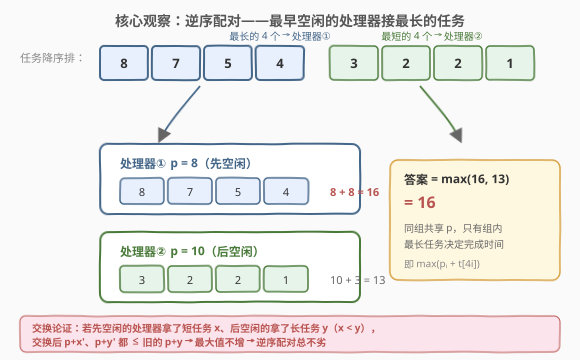
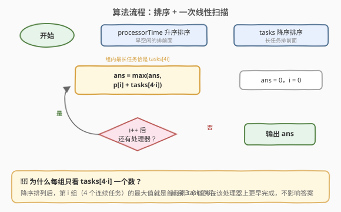
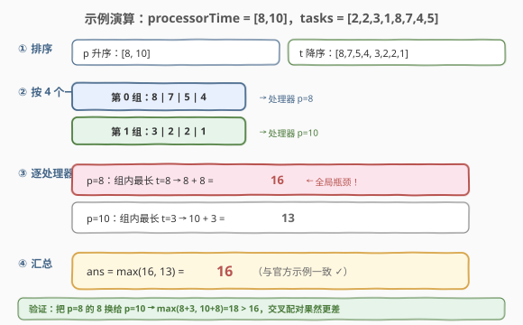

# 最小处理时间

- **题目名称**：最小处理时间
- **链接**：[2895. 最小处理时间](https://leetcode.cn/problems/minimum-processing-time/)
- **难度**：中等
- **标签**：贪心、数组、排序

## 1. 题目概述

你有 $n$ 颗处理器，每颗处理器都有 $4$ 个核心。现有 $n \times 4$ 个待执行任务，每个核心只执行**一次**任务。

给你一个下标从 **0** 开始的整数数组 `processorTime`，表示每颗处理器**最早空闲时间**。另给你一个下标从 **0** 开始的整数数组 `tasks`，表示执行每个任务所需的时间。返回所有任务都执行完毕需要的**最小时间**。

注意：每个核心独立执行任务。

**示例 1**：

```text
输入：processorTime = [8,10], tasks = [2,2,3,1,8,7,4,5]
输出：16
解释：把最长的 4 个任务 [8,7,4,5] 分给第 1 颗处理器（p = 8），
     最短的 4 个任务 [2,2,3,1] 分给第 2 颗处理器（p = 10）。
     第 1 颗完成时间 = max(8+8, 8+7, 8+4, 8+5) = 16；
     第 2 颗完成时间 = max(10+2, 10+2, 10+3, 10+1) = 13。
     答案 = max(16, 13) = 16。
```

**示例 2**：

```text
输入：processorTime = [10,20], tasks = [2,3,1,2,5,8,4,3]
输出：23
解释：第 1 颗处理器（p = 10）接 [3,5,8,4]，完成时间 18；
     第 2 颗处理器（p = 20）接 [2,1,2,3]，完成时间 23。
```

**约束条件**：

- $1 \le n = \text{processorTime.length} \le 25000$
- $\text{tasks.length} = 4n \le 10^5$
- $0 \le \text{processorTime}[i] \le 10^9$
- $1 \le \text{tasks}[i] \le 10^9$

> ⚠️ 两个关键线索：其一，同一处理器的 4 个核心共享同一个「最早空闲时间」$p_i$，且各核互不干扰——每颗处理器的完成时间只由**组内最长任务**决定；其二，总完成时间是所有「$p_i + $ 组内最长任务」的**最大值**。于是问题退化为：把 $4n$ 个任务切成 $n$ 组、每组 4 个，最小化 $\max_i\bigl(p_i + \max(\text{组}_i)\bigr)$——典型的 **min-max 配对**问题，套路是「一边升序、一边降序」。

---

## 2. 解题思路

### 2.1 暴力思路：枚举分组与分配

把 $4n$ 个任务任意切成 $n$ 组、每组 4 个，再把组任意分配给处理器，枚举所有方案取最小 max。方案数是多重组合 $\binom{4n}{4}\binom{4n-4}{4}\cdots\binom{4}{4} \times n!$，$n = 25000$ 时是天文数字；即便 DFS + 剪枝也毫无希望。

退一步观察：分配方案里**真正起作用的自由度极小**——同组共享 $p_i$，组内只有最大任务影响完成时间；组间只是「哪 4 个任务捆绑、哪颗处理器接哪捆」。抓住这两点可以直接**构造**最优解，完全不需要搜索。

### 2.2 核心观察：逆序配对——最早空闲的处理器接最长的任务



**观察一：每颗处理器的完成时间 $= p_i + $ 组内最长任务**。4 个核心并行、同时从 $p_i$ 起跑，最后一个跑完的必然是耗时最长的任务。组内其余 3 个任务无论怎么排都不影响结果——**每组只有一个「关键任务」**。

**观察二：交换不增（交换论证）**。设两颗处理器 $p_a \le p_b$，若 $a$ 组里有较短任务 $x$、$b$ 组里有较长任务 $y$（$x < y$），把二者交换：

- 交换后 $a$ 的关键候选变为 $p_a + y \le p_b + y$——这是旧解中**本来就存在**的和，不超过旧答案；
- 交换后 $b$ 的候选变为 $p_b + x \le p_b + y$，同样不超过旧答案。

于是任何「先空闲的处理器反而拿了更短任务」的方案，都可以通过交换变成「先空闲的拿更长任务」且最大值**不增**。不断交换，最终收敛到**阶梯形态**：$p$ 升序排列后，第 $i$ 早空闲的处理器恰好拿到第 $i$ 长的 4 个任务。

**结论**：把 `processorTime` 升序、`tasks` 降序，则

$$\text{answer} = \max_{0 \le i < n}\ \bigl(\text{processorTime}[i] + \text{tasks}[4i]\bigr)$$

> 💡 这就是「田忌赛马」的 min-max 版：经典田忌（870 题）用下等马消耗对方上等马来**最大化胜场**，本题反过来——让最差资源（最早空闲的处理器）去扛最重负担（最长任务），**最小化最坏情况和**。统一口诀：**要 max 最小，就逆序配对**。

### 2.3 算法流程图



**完整步骤**：

1. `processorTime` 升序排序；
2. `tasks` 降序排序；
3. $i$ 从 $0$ 到 $n-1$，取 $\text{ans} = \max(\text{ans},\ p_i + \text{tasks}[4i])$（$4i$ 恰是第 $i$ 组在降序数组中的首元素，即组内最长任务）；
4. 返回 `ans`。

### 2.4 示例演算

以示例 1 为例（完整过程见下图）：

| 处理器 | $p_i$（升序） | 分到的任务（降序第 $i$ 捆） | 组内最长 | 完成时间 $p_i + t[4i]$ |
|--------|--------------|------------------------------|----------|------------------------|
| ① | 8 | $[8, 7, 5, 4]$ | 8 | $8 + 8 = \mathbf{16}$ |
| ② | 10 | $[3, 2, 2, 1]$ | 3 | $10 + 3 = 13$ |

$\text{ans} = \max(16, 13) = 16$。反向验证：若把任务 8 换给 $p = 10$（交叉配对），则 $\max(8 + 3,\ 10 + 8) = 18 > 16$，确实更差。



---

## 3. 参考代码

### C++

```cpp
class Solution {
  public:
    int minProcessingTime(vector<int>& processorTime, vector<int>& tasks) {
        sort(processorTime.begin(), processorTime.end());          // p 升序
        sort(tasks.begin(), tasks.end(), greater<int>());          // t 降序
        int ans = 0;
        for (int i = 0; i < processorTime.size(); ++i) {
            ans = max(ans, processorTime[i] + tasks[4 * i]);       // 组内最长即 tasks[4i]
        }
        return ans;
    }
};
```

### Python

```python
class Solution:
    def minProcessingTime(self, processorTime: List[int], tasks: List[int]) -> int:
        processorTime.sort()                     # p 升序
        tasks.sort(reverse=True)                 # t 降序
        # tasks[::4] 取 0,4,8,… 恰为每组首元素（组内最长任务）
        return max(p + t for p, t in zip(processorTime, tasks[::4]))
```

> 💡 溢出说明：$p_i + t_j \le 10^9 + 10^9 = 2 \times 10^9$，恰好未超过 `int` 上限 $2147483647$，C++ 用 `int` 安全；但余量已不足 $8\%$，若约束再放宽一档就必须换 `long long`——面试时应主动指出这一边界。

---

## 4. 复杂度分析

| 维度 | 复杂度 | 说明 |
|------|--------|------|
| **时间复杂度** | $O(m \log m)$ | $m = 4n$；两次排序 $O(n \log n + m \log m)$ 占主导，扫描 $O(n)$ |
| **空间复杂度** | $O(1)$ | 原地排序（忽略排序递归栈 $O(\log m)$），仅常数额外变量 |

---

## 5. 扩展：min-max 配对家族

把本题的两个维度一般化，能得到一族经典题：

- **一对一配对**（1877 题）：两个等长数组两两配对，最小化 $\max(p_i + t_{\sigma(i)})$。同样的交换论证给出「一升一降」配对，是本题「每组 4 个」退化为「每组 1 个」的版本，证明完全平行。
- **限重配对**（881 题）：每条船最多载 2 人且质量和不超过限重，最小化船数。排序后**双指针**首尾配对——配对约束从「恰好 4 个」变成「容量型」，贪心从「逆序捆绑」变成「能塞就塞」。
- **二分答案视角**：min-max 目标也常可二分答案 $T$——对固定 $T$，$p_i$ 越大的处理器能接的任务上界 $T - p_i$ 越小，把 $T - p_i$ 从大到小与任务降序比对即可判定可行性。本题贪心有闭式解，二分是「配对约束更怪」时的兜底武器。

> 💡 共同骨架：**最大值最小 → 想到逆序配对 / 二分答案；配对约束变化 → 交换论证检验贪心是否仍成立**。

---

## 6. 面试要点

1. **为什么逆序配对是最优的？**

   - 交换论证：若先空闲的处理器 $p_a$ 拿短任务 $x$、后空闲的 $p_b$ 拿长任务 $y$（$x < y$），交换后两个新候选 $p_a + y \le p_b + y$、$p_b + x \le p_b + y$，均不超过旧解中已有的 $p_b + y$，故最大值不增。反复交换收敛到逆序形态。

2. **为什么每组只看 `tasks[4i]` 一个元素？**

   - 同组 4 个核心共享 $p_i$ 且并行，完成时间 $= p_i + $ 组内最长任务；降序排列后第 $i$ 组的首元素 `tasks[4i]` 恰是该组最长任务，其余 3 个任务天然被「淹没」。

3. **总时间复杂度是多少？瓶颈在哪？**

   - $O(m \log m)$，$m = 4n \le 10^5$，瓶颈是排序；扫描只有 $O(n)$。无法做到严格线性——基于比较的排序下界 $O(m \log m)$；若值域可桶排可再压，但无必要。

4. **`p + t` 最大 $2 \times 10^9$，`int` 会溢出吗？**

   - 不会：`INT_MAX` $= 2147483647 > 2 \times 10^9$，恰好安全；但已逼近上限，约束稍变即需 `long long`/`int64`。主动说明边界是加分项。

5. **与 870 优势洗牌（田忌赛马）有何异同？**

   - 同：都靠「排序 + 一升一降配对」的交换论证。异：870 最大化胜场数（字典序贪心，用最差资源去换对方最好资源），本题最小化最大配对和（让最好资源去接最重负担）。目标函数不同，「谁配谁」的方向也随之不同，但不变式都是「交换不使目标变差」。

> 💡 **一句话总结**：组内只有最长任务算数 → 每组一个关键任务；max 最小 → 逆序配对；答案 $= \max_i\bigl(p_i + t_{\text{升序}[i] \text{ 对应组的首元素}}\bigr) = \max_i\bigl(p_i[升] + t[降][4i]\bigr)$。

---

## 7. 同类练习题

- [1877. 数组中最大数对和的最小值](https://leetcode.cn/problems/minimize-maximum-pair-sum-in-array/)：一对一版 min-max 配对，同样的「一升一降」交换论证，本题去掉「每组 4 个」后的基础形态
- [870. 优势洗牌](https://leetcode.cn/problems/advantage-shuffle/)：田忌赛马本尊，目标从「最小化最大和」换成「最大化胜场数」，对照体会交换论证方向的变化
- [881. 救生艇](https://leetcode.cn/problems/boats-to-save-people/)：容量型配对约束（每船最多 2 人），排序 + 双指针首尾配对，配对家族的另一种贪心形态
- [2410. 运动员和训练师的最大匹配数](https://leetcode.cn/problems/maximum-matching-of-players-with-trainers/)：能力 $\le$ 限制才能配对的可行性匹配，排序 + 双指针/二分，体会「配对可行性」与「配对最优化」的差异
