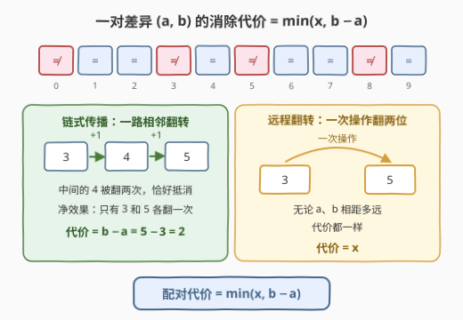
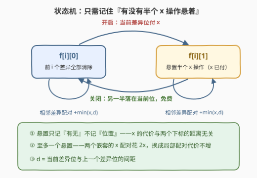
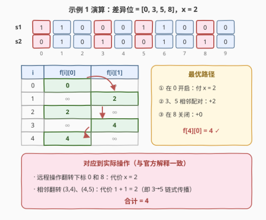

# 执行操作使两个字符串相等

- **题目名称**：执行操作使两个字符串相等
- **链接**：[2896. 执行操作使两个字符串相等](https://leetcode.cn/problems/apply-operations-to-make-two-strings-equal/)
- **难度**：中等
- **标签**：字符串、动态规划

## 1. 题目概述

给你两个下标从 **0** 开始的二进制字符串 `s1` 和 `s2`，两个字符串的长度都是 $n$，再给你一个正整数 $x$。

你可以对字符串 `s1` 执行以下操作**任意次**：

- 选择两个下标 $i$ 和 $j$，将 $s_1[i]$ 和 $s_1[j]$ 都反转，操作的代价为 $x$；
- 选择满足 $i < n - 1$ 的下标 $i$，反转 $s_1[i]$ 和 $s_1[i + 1]$，操作的代价为 $1$。

请你返回使字符串 `s1` 和 `s2` 相等的**最小**操作代价之和，如果无法让二者相等，返回 $-1$。

**示例 1**：

```text
输入：s1 = "1100011000", s2 = "0101001010", x = 2
输出：4
解释：我们可以执行以下操作：
- 选择 i = 3 执行第二个操作，s1 = "1101111000"；
- 选择 i = 4 执行第二个操作，s1 = "1101001000"；
- 选择 i = 0 和 j = 8 执行第一个操作，s1 = "0101001010" = s2。
总代价是 1 + 1 + 2 = 4，这是最小代价和。
```

**示例 2**：

```text
输入：s1 = "10110", s2 = "00011", x = 4
输出：-1
解释：无法使两个字符串相等。
```

**约束条件**：

- $n = \text{s1.length} = \text{s2.length}$
- $1 \le n, x \le 500$
- `s1` 和 `s2` 只包含字符 `'0'` 和 `'1'`。

> ⚠️ 两个关键线索：其一，**两种操作都恰好翻转 2 个字符**——差异位个数的奇偶性是不变量，这直接决定 $-1$ 的判定；其二，只有 $s_1[i] \ne s_2[i]$ 的位置需要被净翻转奇数次，其余位置翻偶数次即可，因此真正起作用的只有「差异位」。

---

## 2. 解题思路

### 2.1 暴力思路：状态图最短路

把 `s1` 的每一种可能状态（$2^n$ 个）看作节点，两种操作看作边权为 $x$ 和 $1$ 的边，在状态图上跑 Dijkstra / 01-BFS 求 $s_1 \to s_2$ 的最短路。$n \le 500$ 时 $2^{500}$ 个状态直接爆炸。

观察可以发现，状态的「绝对面貌」并不重要——把 `s1` 变成 `s2`，等价于把所有**差异位**各自净翻转一次。真正需要决策的只有：**差异位之间如何两两配对、每个配对花多少钱**。

### 2.2 核心观察：差异位两两配对，配对代价 $\min(x,\ b-a)$



**观察一（奇偶不变量）**：每次操作恰好翻转 2 个字符，差异位个数的奇偶性在整个过程中保持不变。目标状态的差异数是 0（偶数），所以**初始差异数为奇数时无解，返回 $-1$**。

**观察二（一对差异的消除代价）**：设两个差异位 $a < b$。

- **链式传播**：执行相邻翻转 $(a, a+1), (a+1, a+2), \ldots, (b-1, b)$，代价 $b - a$。中间每个字符被翻两次恰好抵消，净效果只有 $a$、$b$ 各翻一次；
- **远程翻转**：一次操作一翻俩，代价 $x$，与距离无关。

两者取较小，即消除一对差异的代价为 $\min(x,\ b - a)$。

**观察三（归约成最小代价完美匹配）**：答案 = 在差异位集合上做**最小代价完美匹配**（两两配对，每对代价 $\min(x, |a-b|)$）。

- *可达性（≤）：任意配对方案都能实现*——每对按链式或远程翻转择优执行即可，多对之间叠加后每个差异位恰好被净翻一次、其余位置偶数次；
- *最优性（≥）：任意操作序列不亏*——把每次操作看作以位置为点、以操作为边的多重图，差异位的度数为奇数、其余为偶数。奇度点必然被图中的路径两两连接，而一条连接 $a$、$b$ 的路径，代价至少为 $\min(x,\ b-a)$（含远程边则 $\ge x$；全是相邻边则 $\ge b - a$）。

**为什么不能简单「相邻差异两两配对」贪心？** 代价函数 $\min(x, d)$ 关于距离「先涨后平」，是**凹**的——最优解可能出现**嵌套**结构。例如差异位 $[0, 2, 3, 100]$、$x = 50$：

- 相邻配对 $(0,2) + (3,100)$：$\min(50,2) + \min(50,97) = 2 + 50 = 52$；
- 嵌套配对 $(0,100) + (2,3)$：$\min(50,100) + \min(50,1) = 50 + 1 = \mathbf{51}$，更优。

所以需要 DP 来决策配对结构。

### 2.3 算法流程：带「悬置」状态的一维 DP



记差异位从小到大为 $p_1, p_2, \ldots, p_m$。按顺序扫描，定义：

- $f[i][0]$：前 $i$ 个差异位**全部**配对消除完毕的最小代价；
- $f[i][1]$：前 $i$ 个差异位中有一个「悬置」——它被一次 $x$ 操作翻了一半（**$x$ 已支付**），操作的另一半将落在未来某个差异位上。

记 $d = \min(x,\ p_i - p_{i-1})$（相邻两个差异位的配对代价），转移有四条：

| 转移 | 含义 | 代价 |
|------|------|------|
| $f[i][1] \leftarrow f[i-1][0] + x$ | **开启**：当前差异位消耗半个 $x$ 操作 | $+x$ |
| $f[i][0] \leftarrow f[i-1][1]$ | **关闭**：$x$ 操作的另一半落在当前差异位 | $+0$ |
| $f[i][1] \leftarrow f[i-2][1] + d$ | **相邻配对**：$p_{i-1}, p_i$ 互相配对，悬置保留 | $+d$ |
| $f[i][0] \leftarrow f[i-2][0] + d$ | **相邻配对**：$p_{i-1}, p_i$ 互相配对 | $+d$ |

答案为 $f[m][0]$（$m$ 为奇数时直接返回 $-1$）。

这个 DP 能正确覆盖嵌套结构，依赖两个关键性质：

1. **悬置只记「有无」、不记「位置」**：$x$ 操作的代价与两个下标的距离无关。开启时就把 $x$ 付掉，之后另一半落在哪个未来差异位上都一样免费——「关闭」转移因此无需记录悬置位置。例 2.2 中的嵌套方案对应：在 0 开启（付 $x=50$），中间 2、3 相邻配对（付 1），最后在 100 关闭（免费），总代价 51。
2. **至多一个悬置**：若最优解里出现两个嵌套的 $x$ 配对（花费 $2x$），利用不等式 $\min(x, u+v) + \min(x, v+w) \ge \min(x, u) + \min(x, w)$（$u, v, w \ge 0$，按 $x$ 是否封顶分类讨论即证）可把它们换成两组**更局部**的配对，代价不增。于是「一个比特」的悬置状态就足够了。

### 2.4 示例演算

以示例 1 为例：差异位 $= [0, 3, 5, 8]$，$x = 2$。



| $i$ | 当前差异位 | $f[i][0]$ | $f[i][1]$ | 说明 |
|-----|-----------|-----------|-----------|------|
| 0 | — | $\mathbf{0}$ | $+\infty$ | 初始 |
| 1 | 0 | $+\infty$ | $\mathbf{2}$ | 开启：$+x = 2$ |
| 2 | 3 | $\mathbf{2}$ | $+\infty$ | 相邻配对 $(0,3)$：$+\min(2,3)=2$ |
| 3 | 5 | $+\infty$ | $\mathbf{4}$ | 相邻配对 $(3,5)$：$+\min(2,2)=2$ |
| 4 | 8 | $\mathbf{4}$ | $+\infty$ | 关闭：$+0$ |

最优路径 $f[0][0] \xrightarrow{\text{开启}} f[1][1] \xrightarrow{\text{配对}(3,5)} f[3][1] \xrightarrow{\text{关闭}} f[4][0] = 4$，与官方解释的三次操作一一对应：远程操作翻转 $(0, 8)$ 代价 2；相邻翻转 $(3,4), (4,5)$ 代价 $1+1=2$（正是 $3 \to 5$ 的链式传播）。

---

## 3. 参考代码

### C++

```cpp
class Solution {
  public:
    int minOperations(string s1, string s2, int x) {
        vector<int> p;
        for (int i = 0; i < (int)s1.size(); ++i)
            if (s1[i] != s2[i]) p.push_back(i);   // 只保留差异位
        int m = p.size();
        if (m % 2) return -1;                     // 奇偶不变量：无解

        const long long INF = 1e18;
        vector<long long> f0(m + 1, INF), f1(m + 1, INF);
        f0[0] = 0;
        for (int i = 1; i <= m; ++i) {
            long long d = i >= 2 ? min((long long)x, (long long)p[i - 1] - p[i - 2]) : INF;
            f1[i] = f0[i - 1] + x;                // 开启：付 x，悬置半个操作
            f0[i] = f1[i - 1];                    // 关闭：免费
            if (i >= 2) {
                f1[i] = min(f1[i], f1[i - 2] + d);  // 相邻配对，悬置保留
                f0[i] = min(f0[i], f0[i - 2] + d);  // 相邻配对
            }
        }
        return (int)f0[m];
    }
};
```

### Python

```python
class Solution:
    def minOperations(self, s1: str, s2: str, x: int) -> int:
        p = [i for i, (a, b) in enumerate(zip(s1, s2)) if a != b]   # 只保留差异位
        m = len(p)
        if m % 2:
            return -1                                              # 奇偶不变量：无解
        INF = float('inf')
        f0 = [INF] * (m + 1)   # 前 i 个差异全部消除
        f1 = [INF] * (m + 1)   # 悬置着半个 x 操作（x 已付）
        f0[0] = 0
        for i in range(1, m + 1):
            d = min(x, p[i - 1] - p[i - 2]) if i >= 2 else 0
            f1[i] = f0[i - 1] + x              # 开启：付 x
            f0[i] = f1[i - 1]                  # 关闭：免费
            if i >= 2:
                f1[i] = min(f1[i], f1[i - 2] + d)   # 相邻配对，悬置保留
                f0[i] = min(f0[i], f0[i - 2] + d)   # 相邻配对
        return f0[m]
```

> 💡 溢出说明：答案上界为 $\frac{m}{2} \cdot \min(x, n) \le 250 \times 500 = 125000$，`int` 绰绰有余；但 DP 中 $+\infty$ 会参与加法（$\infty + x$），C++ 用 `long long` 哨兵（$10^{18} + 500$ 不溢出）比 `INT_MAX` 安全。

---

## 4. 复杂度分析

| 维度 | 复杂度 | 说明 |
|------|--------|------|
| **时间复杂度** | $O(n)$ | 一次扫描提取差异位 $O(n)$ + DP 递推 $O(m)$，$m \le n$ |
| **空间复杂度** | $O(m)$ | 两个 DP 数组；$f[i]$ 只依赖 $f[i-1]$ 与 $f[i-2]$，可滚动至 $O(1)$ |

---

## 5. 扩展：从配对结构看两类变体

- **$O(1)$ 空间滚动**：保留 $(f_0, f_1)$ 的最近两对值即可，面试可作follow-up现场手推。
- **极端参数的退化形态**：
  - $x = 1$ 时 $\min(1, d) \equiv 1$（相异位置距离 $\ge 1$），答案退化为 $m / 2$；
  - $x \ge n$ 时 $\min(x, d) = d$，代价变成纯距离。此时「相邻差异两两配对」的贪心恰好最优（每个单位间隙的跨越次数下界是「左侧点数的奇偶性」，相邻配对恰好取到下界），不再需要悬置状态。
- **与区间 DP 的关系**：嵌套结构本可用 $O(m^2)$ / $O(m^3)$ 的区间 DP 求任意非交叉匹配；「悬置」状态之所以能把复杂度压到 $O(m)$，本质是利用了 **$x$ 与距离无关**这一性质，把整个嵌套维度压缩成了一个比特。若配对代价改成一般凹函数 $g(|a-b|)$ 且无「与距离无关的上限」，就必须回到区间 DP。

---

## 6. 面试要点

1. **为什么差异位个数是奇数就返回 $-1$？**

   - 每次操作恰好翻转 2 个字符，差异位个数的奇偶性是不变量；目标是 0 个差异（偶数），初始为奇数则永远不可达。

2. **为什么一对差异的消除代价是 $\min(x, b-a)$？**

   - 链式：相邻翻转从 $a$ 一路传到 $b$，中间字符每个被翻两次恰好抵消，净效果只有两端各翻一次，代价 $b - a$；远程：一次操作翻任意两位，代价 $x$ 与距离无关。取二者较小。

3. **悬置状态为什么不需要记录「悬置在哪个位置」？**

   - $x$ 操作的代价与两个下标距离无关。开启时就把 $x$ 付掉，另一半之后落在哪个未来差异位上都免费——这正是能把嵌套配对结构压成 1 个比特状态的原因。

4. **会不会需要同时悬置两个 $x$ 操作？**

   - 不会。两个嵌套的 $x$ 配对花费 $2x$；由 $\min(x, u+v) + \min(x, v+w) \ge \min(x, u) + \min(x, w)$ 的交换论证，可换成两组更局部的配对，代价不增。

5. **复杂度和边界如何？**

   - 时间 $O(n)$、空间 $O(m)$（可滚动到 $O(1)$）；答案上界 $125000$，`int` 足够，但 C++ 中 $+\infty$ 参与加法要用 `long long` 哨兵防溢出。

> 💡 **一句话总结**：差异位两两配对、每对花 $\min(x, \text{距离})$；$x$ 与距离无关的性质把「嵌套配对」压成「有无悬置」一个比特——$f[i][0/1]$ 各四条转移，$O(n)$ 收工。

---

## 7. 同类练习题

- [2839. 判断通过操作能否让字符串相等 I](https://leetcode.cn/problems/check-if-strings-can-be-made-equal-with-operations-i/)：同族「操作下的字符串可达性」——本题找操作的不变量判可行性，2896 则在不变量之上求最小代价
- [2840. 判断通过操作能否让字符串相等 II](https://leetcode.cn/problems/check-if-strings-can-be-made-equal-with-operations-ii/)：2839 的加强版，同样只关心操作保持的置换结构，对照体会「可行性 vs 最优性」
- [2193. 得到回文串的最少操作次数](https://leetcode.cn/problems/minimum-number-of-moves-to-make-palindrome/)：失配位置两两配对 + 相邻交换代价，配对结构同样决定最小代价
- [921. 使括号有效的最少添加](https://leetcode.cn/problems/minimum-add-to-make-parentheses-valid/)：「悬置/待配对」计数思想的入门版，配对消除家族的基石
