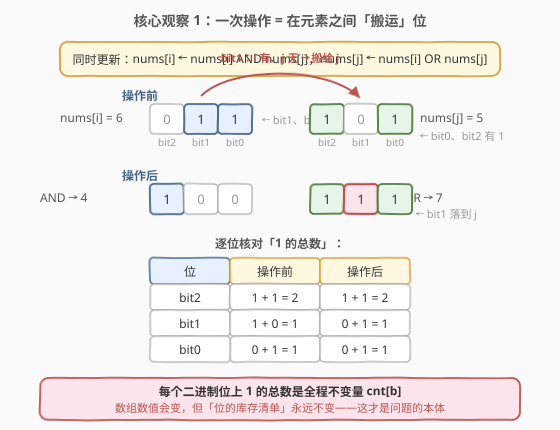
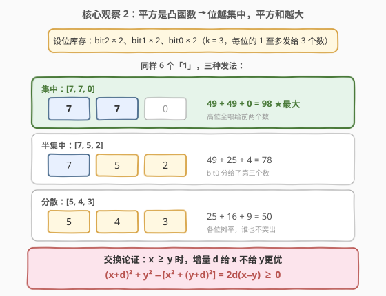
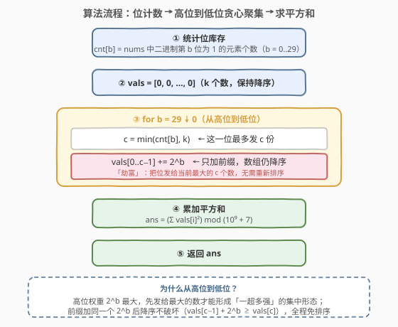
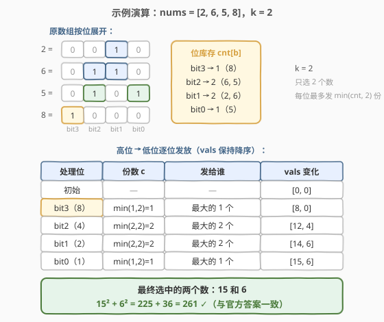

# 对数组执行操作使平方和最大

- **题目名称**：对数组执行操作使平方和最大
- **链接**：[2897. 对数组执行操作使平方和最大](https://leetcode.cn/problems/apply-operations-on-array-to-maximize-sum-of-squares/)
- **难度**：困难
- **标签**：贪心、位运算、数组

## 1. 题目概述

给你一个下标从 **0** 开始的整数数组 `nums` 和一个**正**整数 `k`。

你可以对数组执行以下操作**任意次**：

- 选择两个互不相同的下标 `i` 和 `j`，**同时**将 `nums[i]` 更新为 `(nums[i] AND nums[j])`，且将 `nums[j]` 更新为 `(nums[i] OR nums[j])`（`OR` 表示按位**或**，`AND` 表示按位**与**）。

你需要从最终的数组里选择 `k` 个元素，并计算它们的**平方**之和。请你返回你可以得到的**最大**平方和。由于答案可能会很大，将答案对 $10^9 + 7$ **取余**后返回。

**示例 1**：

```text
输入：nums = [2,6,5,8], k = 2
输出：261
解释：
- 选 i=0, j=3：nums 变为 [0,6,5,10]（2 AND 8 = 0，2 OR 8 = 10）
- 选 i=2, j=3：nums 变为 [0,6,0,15]（5 AND 10 = 0，5 OR 10 = 15）
选择元素 15 和 6，平方和 = 15² + 6² = 261，是可以得到的最大结果。
```

**示例 2**：

```text
输入：nums = [4,5,4,7], k = 3
输出：90
解释：不需要执行任何操作。选择 7、5、4，平方和 = 49 + 25 + 16 = 90。
```

**约束条件**：

- $1 \le k \le \text{nums.length} \le 10^5$
- $1 \le \text{nums}[i] \le 10^9$

> 💡 本题核心是「**位计数不变量 + 凸性贪心聚集**」。关键词「AND / OR 同时更新」「操作任意次」「选 k 个平方和最大」——操作的实质是**在元素之间搬运二进制位**，每个位上 1 的总数全程不变；而平方是凸函数，同样的位库存，**越集中平方和越大**。于是问题从「怎么操作」退化为「怎么按位计数、怎么把位发给最大的数」。

---

## 2. 解题思路

### 2.1 暴力思路：枚举操作序列？

操作可以执行**任意次**，数组的可能状态是天文数字，直接 BFS/DFS 搜索或枚举操作序列完全不可行。即使观察到「操作只动二进制位」，试图枚举「每个位的 1 分给谁」也是组合爆炸：位有 30 个、元素有 $10^5$ 个，分配方案数不可枚举。

正确的打开方式是找**不变量**：操作到底改变了什么、守恒了什么？把问题从「数值层面」降到「位层面」——数值会变，但每个二进制位上 1 的总数**永远不变**，这才是问题的本体。

### 2.2 核心观察：位计数不变量 + 贪心聚集

**观察 1（不变量）：一次操作 = 在两个元素之间「搬运」位。**

对任意一个二进制位 $b$，枚举 `(nums[i] 的第 b 位, nums[j] 的第 b 位)` 的全部组合：

| $i$ 的第 $b$ 位 | $j$ 的第 $b$ 位 | AND（新 $i$） | OR（新 $j$） | 该位上 1 的个数 |
|:---:|:---:|:---:|:---:|:---:|
| 1 | 1 | 1 | 1 | 2 → 2（两位都保留） |
| 1 | 0 | 0 | 1 | 1 → 1（**从 $i$ 搬到 $j$**） |
| 0 | 1 | 0 | 1 | 1 → 1（留在 $j$） |
| 0 | 0 | 0 | 0 | 0 → 0 |

无论怎么操作，第 $b$ 位上 1 的总数 $\text{cnt}[b]$ **全程不变**。换言之，操作把「$i$ 有、$j$ 无」的那些位整体搬给了 $j$——位像货物一样在元素间自由流动，但**库存清单**（每位有多少个 1）是守恒的。



于是初始数组的**具体数值不重要**，重要的只有每位的计数 $\text{cnt}[b]$：最终数组可以是任何满足「第 $b$ 位恰有 $\text{cnt}[b]$ 个 1」的配置（可达性证明见第 5 节，直观上「位可以搬来搬去」即可）。

**观察 2（选 k 个 ⇒ 每位最多用 $\min(\text{cnt}[b], k)$ 份）。**

不被选中的 $n-k$ 个元素里的位纯属浪费。所以第 $b$ 位最多把 $\min(\text{cnt}[b], k)$ 个 1 发给被选中的 $k$ 个数。又因为数值非负、加位只会让平方更大，**每位都应发满** $\min(\text{cnt}[b], k)$ 份——少发一份必然不优。

**观察 3（凸性 ⇒ 贪心聚集，发给当前最大的数）。**

问题变成：从「位仓库」取位拼成 $k$ 个非负整数，最大化平方和。平方是凸函数——**同样的总量，越集中平方和越大**（马太效应：劫贫济富）。严格说是交换论证：设当前 $x \ge y \ge 0$，增量 $d = 2^b$ 给 $x$ 而不是给 $y$，则

$$(x+d)^2 + y^2 - \left[x^2 + (y+d)^2\right] = 2d(x-y) \ge 0$$

所以每一位的 1 都应该发给**当前值最大**的那些数，让大数更大。



**观察 4（实现技巧：前缀加法保持降序，全程免排序）。**

维护降序数组 `vals[0..k-1]`，**从高位到低位**逐位处理：第 $b$ 位把 $2^b$ 加到前 $c = \min(\text{cnt}[b], k)$ 个元素（降序前缀）上。关键在于**给前缀加同一个值不破坏降序**：

$$\text{vals}[c-1] + 2^b > \text{vals}[c-1] \ge \text{vals}[c]$$

于是 $k$ 个数始终有序，不需要每轮重新排序，总复杂度 $O((n+k) \cdot 30)$。

> 💡 一句话：**操作守恒的是「每位的 1 的个数」，答案只取决于怎么把这些 1 分给 $k$ 个数；凸性说「发给最大的」，从高位到低位加前缀即可免排序。**

### 2.3 算法流程图



**完整步骤**：

1. **统计位库存**：`cnt[b]` = `nums` 中第 $b$ 位为 1 的元素个数（$b \in [0, 30)$，因为 $\text{nums}[i] \le 10^9 < 2^{30}$）
2. **初始化** `vals = [0] * k`（$k$ 个候选数，保持降序）
3. **从高位到低位**遍历 $b = 29 \downarrow 0$：令 $c = \min(\text{cnt}[b], k)$，将 $2^b$ 加到 `vals[0..c-1]`
4. **累加**：$\text{ans} = \sum \text{vals}[i]^2 \bmod (10^9+7)$

### 2.4 示例演算

以示例 1 `nums = [2, 6, 5, 8]`，`k = 2` 为例。二进制展开：$2 = 0010$、$6 = 0110$、$5 = 0101$、$8 = 1000$，位库存 $\text{cnt}[3] = 1$（8）、$\text{cnt}[2] = 2$（6, 5）、$\text{cnt}[1] = 2$（2, 6）、$\text{cnt}[0] = 1$（5）：

| 处理位 | 份数 $c = \min(\text{cnt}[b], 2)$ | 发给谁 | vals 变化 |
|--------|-----------------------------------|--------|-----------|
| 初始 | — | — | $[0, 0]$ |
| bit3（值 8） | $\min(1, 2) = 1$ | 最大的 1 个 | $[8, 0]$ |
| bit2（值 4） | $\min(2, 2) = 2$ | 最大的 2 个 | $[12, 4]$ |
| bit1（值 2） | $\min(2, 2) = 2$ | 最大的 2 个 | $[14, 6]$ |
| bit0（值 1） | $\min(1, 2) = 1$ | 最大的 1 个 | $[15, 6]$ |

最终 $15^2 + 6^2 = 225 + 36 = 261$ ✓。这正是官方示例中两步操作得到 `[0, 6, 0, 15]` 的结果——贪心直接「跳过」了操作过程，从位库存一步拼出目标。



再用示例 2 复核：`nums = [4, 5, 4, 7]`，`k = 3`。$\text{cnt}[2] = 4$（全员）、$\text{cnt}[1] = 1$（7）、$\text{cnt}[0] = 2$（5, 7）。发放：bit2 给 3 个 → $[4,4,4]$；bit1 给 1 个 → $[6,4,4]$；bit0 给 2 个 → $[7,5,4]$。$49 + 25 + 16 = 90$ ✓。

---

## 3. 参考代码

### C++

```cpp
class Solution {
public:
    int maxSum(vector<int>& nums, int k) {
        const int MOD = 1'000'000'007;
        const int B = 30;                       // nums[i] ≤ 1e9 < 2^30

        int cnt[B] = {0};
        for (int x : nums)
            for (int b = 0; b < B; b++)
                cnt[b] += (x >> b) & 1;         // 统计每位 1 的个数（不变量）

        vector<long long> vals(k, 0);           // k 个候选数，保持降序
        for (int b = B - 1; b >= 0; b--) {      // 高位 → 低位
            int c = min(cnt[b], k);             // 这一位最多发 c 份
            for (int i = 0; i < c; i++)
                vals[i] += 1LL << b;            // 只加前缀，降序不破坏
        }

        long long ans = 0;
        for (long long v : vals)
            ans = (ans + v * v % MOD) % MOD;    // v < 2^30，v² < 2^60 不溢出
        return (int)ans;
    }
};
```

### Python

```python
class Solution:
    def maxSum(self, nums: List[int], k: int) -> int:
        MOD = 10**9 + 7
        B = 30                                # nums[i] ≤ 1e9 < 2^30

        cnt = [0] * B
        for x in nums:
            for b in range(B):
                cnt[b] += (x >> b) & 1        # 统计每位 1 的个数（不变量）

        vals = [0] * k                        # k 个候选数，保持降序
        for b in range(B - 1, -1, -1):        # 高位 → 低位
            c = min(cnt[b], k)                # 这一位最多发 c 份
            for i in range(c):
                vals[i] += 1 << b             # 只加前缀，降序不破坏

        return sum(v * v for v in vals) % MOD
```

> 💡 两版逻辑完全一致。实现细节：① `v < 2^30`，`v * v < 2^60 < 2^63`，C++ 用 `long long` 存 `vals` 并在累加时逐步取模即可；② Python 统计位计数也可以写成 `for b in range(B): cnt[b] = sum((x >> b) & 1 for x in nums)`，或用 `x.bit_length()` 缩短内层循环，复杂度同级。

---

## 4. 复杂度分析

| 维度 | 复杂度 | 说明 |
|------|--------|------|
| **时间复杂度** | $O((n + k) \cdot 30)$ | 统计位库存扫 $n$ 个数各 30 位；发放阶段每位最多加 $k$ 个前缀元素（$k \le n$），总计 $O(n \cdot 30) \approx 3 \times 10^6$ |
| **空间复杂度** | $O(k)$ | 位计数数组 $O(30)$、候选数数组 $O(k)$（$k \le n$） |

> ⚠️ 对比 2.1 的暴力思路：操作序列无限长、状态空间无穷；抓住「位计数不变量」后，整个「操作任意次」的过程被压缩成一次 $O((n+k) \cdot 30)$ 的计数与发放——这就是**不变量降维**的价值：动态过程不可枚举，但守恒量可以直接计算。

---

## 5. 扩展：贪心目标为什么「可达」——依序吸收构造

前文默认「任何满足位计数的配置都能通过操作达到」，这里补一个构造性证明，也解释了贪心目标的特殊结构。

**贪心目标是一条嵌套链。** 第 $j$ 个（0 开始）候选数拿到的位集是

$$G_j = \{\, b : \text{cnt}[b] > j \,\},\qquad j = 0, 1, \dots, k-1$$

（位 $b$ 发给前 $\min(\text{cnt}[b], k)$ 个数）。由定义，$j$ 越小拿到的位越多：$G_0 \supseteq G_1 \supseteq \cdots \supseteq G_{k-1}$，即**位集嵌套、数值递减**。

**嵌套链恰好可以用「依序吸收」构造出来。** 对下标 $j = 0, 1, \dots, k-1$ 依次执行：把 `nums[j]` 当作累积器，对每个 $i = j+1, \dots, n-1$ 做一次操作（AND 写入 $i$、OR 写入 $j$）：

- 操作后 `nums[i]` 变为 `nums[i] AND nums[j]`——它**交出自己有而累积器没有的位**；
- `nums[j]` 变为 `nums[j] OR nums[i]`（用操作前的值同时更新）——累积器**吸收**这些位。

**归纳论证**：第 $j$ 轮开始时，下标 $\ge j$ 的元素中位 $b$ 的剩余个数恰为 $\max(\text{cnt}[b] - j, 0)$（前 $j$ 轮每轮至多被一个累积器拿走一个，且拿走后其余元素该位计数减一）。第 $j$ 轮把后面所有元素的位全部 OR 进 `nums[j]`，于是

$$\text{nums}[j] = \{\, b : \text{cnt}[b] - j \ge 1 \,\} = G_j$$

且此后 `nums[j]` 不再被触碰。执行完 $k$ 轮，前 $k$ 个元素恰好是贪心链 $G_0 \supseteq \cdots \supseteq G_{k-1}$，剩余 $n - k$ 个元素里是没用完的位（反正不被选中，浪费无妨）。

这个构造共需 $\sum_{j=0}^{k-1}(n-1-j) = O(nk)$ 次操作——只是**存在性证明**，说明贪心上界确实取得到；代码里当然不执行操作，直接按位计数「一步到位」。

> 💡 另一个视角（次序统计/控制不等式）：按前文发放规则得到的 $k$ 个数，其任意前 $m$ 项和都达到上界 $\sum_b 2^b \cdot \min(\text{cnt}[b], m)$，即贪心解**弱超劣于**（weakly majorizes）一切可行解；平方和作为非负轴上的凸函数，在弱超劣序下单调不减，故贪心解最优。面试里讲清交换论证即可，majorization 作为加分项。

---

## 6. 面试要点

1. **为什么每个二进制位上 1 的总数是不变量？**

   - 逐位枚举 `(i 的位, j 的位)` 四种组合：`1,1 → 1,1`（两个都保留）；`1,0 → 0,1`（从 AND 侧搬到 OR 侧）；`0,1 → 0,1`；`0,0 → 0,0`。每种情况该位 1 的个数都不变。所以操作只是**搬运位**，库存清单 $\text{cnt}[b]$ 全程守恒。

2. **为什么贪心「把位发给当前最大的数」是最优的？**

   - 交换论证 + 凸性：$x \ge y \ge 0$ 时 $(x+d)^2 + y^2 - x^2 - (y+d)^2 = 2d(x-y) \ge 0$，增量给大数不劣于给小数。反复交换可以把任何方案调整成「每位都给最大」的形态而不减平方和。也可以用 majorization 语言：贪心解的前 $m$ 项和达到上界 $\sum_b 2^b \min(\text{cnt}[b], m)$，弱超劣于一切可行解，凸函数下最优。

3. **为什么从高位到低位处理就不需要每轮排序？**

   - 每位把 $2^b$ 加到降序数组的**前缀**上。前缀同值加法保持降序：$\text{vals}[c-1] + 2^b > \text{vals}[c-1] \ge \text{vals}[c]$。若反过来从低位到高位，低位的聚集会打乱大小关系，就需要反复排序了。

4. **溢出与取模有哪些坑？**

   - 贪心拼出的数 $v < 2^{30}$（每位至多一个 1，共 30 位），$v^2 < 2^{60}$ 在 `long long` 内；但 $k$ 个平方直接累加会溢出，必须边加边模：`ans = (ans + v * v % MOD) % MOD`。C++ 里 `vals` 用 `long long` 存（或加完后转），`1LL << b` 别写成 `1 << b`。Python 大整数无此问题，最后取一次模即可。

5. **怎么证明贪心目标配置真的可以通过操作达到？**

   - 贪心目标的位集是嵌套链 $G_0 \supseteq \cdots \supseteq G_{k-1}$。构造「依序吸收」：第 $j$ 轮把 `nums[j]` 当累积器，对后面每个元素做一次操作，让它交出「累积器没有的位」。归纳可证第 $j$ 轮结束后 `nums[j] = {b : cnt[b] > j}` 恰为目标链（详见第 5 节）。这同时说明：任何「嵌套链」形态的目标都可达，操作次数 $O(nk)$ 只是存在性证明。

> 💡 **一句话总结**：AND/OR 同时更新 = 位在元素间搬运，每位 1 的个数是不变量；凸性说平方和偏爱集中——把每一位的 $\min(\text{cnt}[b], k)$ 个 1 从高位到低位发给当前最大的数，前缀加法天然保序，$O((n+k) \cdot 30)$ 一步拼出最优解。

---

## 7. 同类练习题

- [477. 总汉明距离](https://leetcode.cn/problems/total-hamming-distance/)（[题解](../0401-0500/477_总汉明距离.md)）：同为「逐位拆开数 1 的个数」，用位计数把 $O(n^2)$ 数对问题降到 $O(n \cdot 30)$，与本题观察 1 一脉相承
- [1835. 所有数对按位与结果的异或和](https://leetcode.cn/problems/find-xor-sum-of-all-pairs-bitwise-and/)（[题解](../1801-1900/1835_所有数对按位与结果的异或和.md)）：AND 的位视角 + 逐位计数推组合公式，本题操作 (AND, OR) 的两个方向各占一半
- [421. 数组中两个数的最大异或值](https://leetcode.cn/problems/maximum-xor-of-two-numbers-in-an-array/)（[题解](../0401-0500/421_数组中两个数的最大异或值.md)）：从高位到低位贪心试填，与本题「高位优先、让大数更大」的贪心方向同款
- [201. 数字范围按位与](https://leetcode.cn/problems/bitwise-and-of-numbers-range/)（[题解](../0201-0300/201_数字范围按位与.md)）：AND 只会消位不会生位的经典刻画，对照本题「AND 侧交出位、OR 侧收下位」的搬运语义
- [260. 只出现一次的数字 III](https://leetcode.cn/problems/single-number-iii/)（[题解](../0201-0300/260_只出现一次的数字III.md)）：按位分组拆解混合问题，位视角入门题
