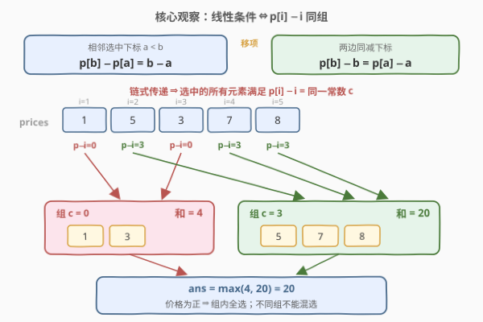
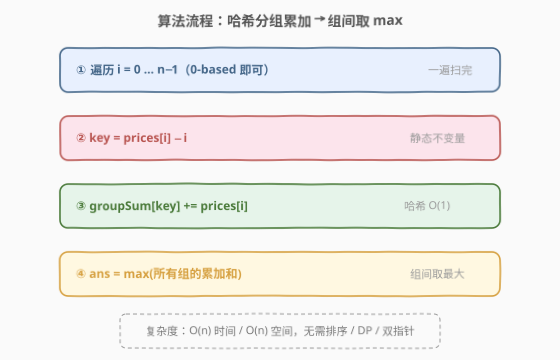
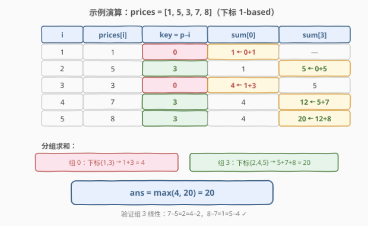

# 最大线性股票得分

- **题目名称**：最大线性股票得分
- **链接**：[2898. Maximum Linear Stock Score](https://leetcode.cn/problems/maximum-linear-stock-score/)
- **难度**：中等
- **标签**：数组、哈希表

## 1. 题目概述

> ⚠️ 本题为 LeetCode 付费题，题意描述根据官方示例用例与 hints 重建，可能与官方题面有出入。

给你一个下标从 **1** 开始、长度为 $n$ 的整数数组 `prices`，其中 `prices[i]` 表示第 $i$ 天的股票价格。

从 $[1, n]$ 中选出一个严格递增的下标序列 $\text{indexes}[0] < \text{indexes}[1] < \cdots < \text{indexes}[k-1]$。若序列中**每一对相邻的选中下标**都满足

$$\text{prices}[\text{indexes}[j]] - \text{prices}[\text{indexes}[j-1]] = \text{indexes}[j] - \text{indexes}[j-1]$$

则称这次选择是**线性的**（linear）。它的**得分**是所有选中价格之和 $\sum_j \text{prices}[\text{indexes}[j]]$。

返回线性选择能取得的**最大得分**。（只选一个下标也合法，得分为该天的价格。）

**示例 1**：

```text
输入：prices = [1,5,3,7,8]
输出：20
解释：选下标 2、4、5（1-based），对应价格 [5,7,8]：
      7 − 5 = 2 = 4 − 2，8 − 7 = 1 = 5 − 4，条件满足；
      得分 5 + 7 + 8 = 20。可以证明不存在得分更高的线性选择。
```

**示例 2**：

```text
输入：prices = [5,6,7,8,9]
输出：35
解释：每一天的「价格 − 下标」都相同，可以全部选中，得分 5+6+7+8+9 = 35。
```

**约束条件**（依据官方 hints「所有元素为正」与 `long` 返回签名重建）：

- $1 \le n \le 10^5$
- $1 \le \text{prices[i]} \le 10^9$

> 💡 条件的直觉是「**选中相邻两天，价格涨多少、下标就差多少**」——价格随天数**同步线性增长**。把等式移项后，「相邻差相等」会坍缩成一个**静态不变量** $\text{prices}[i] - i$，问题从「挑子序列」直接退化为「哈希分组求和」。

---

## 2. 解题思路

### 2.1 暴力思路：枚举子序列 / $O(n^2)$ DP

**暴力一**：枚举 $2^n$ 个下标子集，逐个检查线性条件并求和——指数级，$n = 10^5$ 直接爆炸。

**暴力二（DP 视角）**：设 $dp[i]$ 为**必选下标 $i$ 作结尾**的线性选择的最大得分，转移需枚举满足条件的前驱 $j$：

$$dp[i] = \text{prices}[i] + \max\bigl(0,\ \max\{\,dp[j] : j < i,\ \text{prices}[j] - j = \text{prices}[i] - i\,\}\bigr)$$

两重循环 $O(n^2)$，$n = 10^5$ 时约 $10^{10}$ 次比较，仍会超时。

> ⚠️ 两种暴力共同的盲区：都没意识到线性条件其实把元素划成了**互不相交的组**——组内随便选、组间不能混。看清这一点，DP 的转移结构会整体坍缩（见 2.2）。

### 2.2 核心观察：移项变形 → 按 prices[i] − i 分组

记 $p_i = \text{prices}[i]$。对选中的相邻下标 $a < b$，线性条件是 $p_b - p_a = b - a$，**移项**：

$$p_b - b = p_a - a$$

即相邻两个选中元素的「价格 − 下标」相等。沿选中的序列**链式传递**下去：

$$p_{i_0} - i_0 = p_{i_1} - i_1 = \cdots = p_{i_{k-1}} - i_{k-1} = c$$

**反过来也成立**：凡是 $p_i - i$ 相同的一批下标，按升序取出后，任意相邻对都自动满足 $p_b - p_a = (b + c) - (a + c) = b - a$——整批一起选都合法。

于是得到完整刻画：

$$\text{合法线性选择} \iff \text{某个组（key} = p_i - i\text{）的任意子集}$$

接下来只剩「组内选多少」。由约束 $p_i \ge 1$ 恒为正，且同组元素**全选依然合法**：

> 💡 **多选一个正数，得分只增不减** ⇒ 每组的最优得分 = 组内价格总和，答案 = 所有组和的最大值。

回头看 2.1 的 DP：同 key 前驱的 $dp[j]$ 因全正会被一路「全收」，$dp[i]$ 恰好等于组内前缀和——整个 DP 坍缩成一行哈希累加。



### 2.3 算法流程图



**完整步骤**：

1. **建表**：`groupSum = map<int, long long>`（key = `prices[i] - i`）
2. **遍历**：对每个下标 `i`：`groupSum[prices[i] - i] += prices[i]`
3. **取极值**：`ans = max(groupSum 的所有值)`
4. **返回** `ans`

> ⚠️ 实现细节：代码里用 0-based 下标即可。0-based 的 key 比 1-based 统一小 1，但**所有 key 平移同一常数，分组结果不变**，不影响答案。

### 2.4 示例演算

以 `prices = [1,5,3,7,8]` 为例（下标 1-based）：



| $i$ | $p_i$ | key $= p_i - i$ | 操作 | sum[0] | sum[3] |
|-----|-------|-----------------|------|--------|--------|
| 1 | 1 | 0 | sum[0] += 1 | **1** | — |
| 2 | 5 | 3 | sum[3] += 5 | 1 | **5** |
| 3 | 3 | 0 | sum[0] += 3 | **4** | 5 |
| 4 | 7 | 3 | sum[3] += 7 | 4 | **12** |
| 5 | 8 | 3 | sum[3] += 8 | 4 | **20** |

- 组 0（下标 $\{1, 3\}$，价格 $[1, 3]$）：得分 $1 + 3 = 4$
- 组 3（下标 $\{2, 4, 5\}$，价格 $[5, 7, 8]$）：得分 $5 + 7 + 8 = 20$

$\max(4, 20) = 20$，与示例 1 一致。验证组 3 确实线性：$7 - 5 = 2 = 4 - 2$，$8 - 7 = 1 = 5 - 4$ ✓

示例 2 `[5,6,7,8,9]` 中 $p_i - i \equiv 4$，全体同组，全选得 $35$。

---

## 3. 参考代码

### C++

```cpp
class Solution {
public:
    long long maxScore(vector<int>& prices) {
        unordered_map<int, long long> groupSum;          // key = prices[i] - i
        for (int i = 0; i < (int)prices.size(); ++i)
            groupSum[prices[i] - i] += prices[i];        // 0-based：全体 key 平移 -1，分组不变
        long long ans = 0;
        for (auto& [key, sum] : groupSum)
            ans = max(ans, sum);
        return ans;
    }
};
```

### Python

```python
class Solution:
    def maxScore(self, prices: List[int]) -> int:
        group_sum = defaultdict(int)          # key = prices[i] - i
        for i, p in enumerate(prices):
            group_sum[p - i] += p
        return max(group_sum.values())
```

> 💡 两版都是「一次遍历 + 哈希累加 + 组间取 max」。C++ 必须用 `long long` 累加（总和最高约 $10^{14}$，超 32 位 `int`）；Python 原生大整数无溢出问题。也可以在遍历时顺手 `ans = max(ans, group_sum[key])` 省去第二趟，但两趟写法更清晰。

---

## 4. 复杂度分析

| 维度 | 复杂度 | 说明 |
|------|--------|------|
| **时间复杂度** | $O(n)$ | 单趟遍历，每次哈希操作均摊 $O(1)$；最后对至多 $n$ 个组取 max |
| **空间复杂度** | $O(n)$ | 哈希表最多存 $n$ 个不同 key（所有元素 key 互异时） |

---

## 5. 扩展：若价格可以为 0 或负数？

「同组任意子集合法」与价格**正负无关**——线性条件只看下标差与价格差。变的只是「组内选多少」：

- 价格可负时，组内**全选不再最优**。由于同组任意子集都合法（不要求连续），最优策略是**只选组内所有正数**；若组内没有正数，则退而选组内最大（最不负）的单个元素（至少选一个）：

```cpp
unordered_map<int, long long> posSum;   // 组内正数之和
unordered_map<int, int> mx;             // 组内最大单元素（可能为负）
for (int i = 0; i < n; ++i) {
    int key = prices[i] - i;
    if (prices[i] > 0) posSum[key] += prices[i];
    if (!mx.count(key) || prices[i] > mx[key]) mx[key] = prices[i];
}
// 每组得分 = posSum[g] > 0 ? posSum[g] : mx[g]，再全局取 max
```

- 对照 [53. 最大子数组和](../0001-0100/53_最大子数组和.md)：那题要求**子数组（连续）**，负数会「断链」，必须 Kadane；本题是**子序列（可不连续）**，负数直接不选即可，连 Kadane 都不需要。**「连续 / 可不连续」决定是否需要处理衔接约束**，这是审题时最值得先确认的一点。

---

## 6. 面试要点

1. **线性条件如何转化为分组键？**

   移项 $p_b - p_a = b - a \Rightarrow p_b - b = p_a - a$，再沿选中序列链式传递 ⇒ 所选元素的 $p_i - i$ 全等于同一常数；反向同键任意子集亦合法。「相邻差约束」⇔「静态键相等」，是本题唯一的一步洞察。

2. **为什么每组「全选」就是该组最优？**

   约束保证 $\text{prices}[i] \ge 1$ 恒正，且同组全选依然合法（同键），多选一个只增不减 ⇒ 组得分 = 组内总和。若价格可负则退化为「组内正数求和」（见第 5 节）。

3. **代码用 0-based 下标会不会算错？**

   不会。0-based 的键比 1-based 统一少 1，全体键平移同一常数，**分组结果不变**；判分只依赖「是否同组」，与键的具体数值无关。不要画蛇添足地写 `prices[i] - (i + 1)`。

4. **为什么不用 DP？（对比 1218 / 1027）**

   [1218. 最长定差子序列](../1201-1300/1218_最长定差子序列.md)的不变量「相邻值差 = d」把值 $v - d$ 与 $v$ 串成**跨键链**，状态需沿链转移，所以是哈希 DP；本题不变量 $p_i - i$ 对每个元素是**静态**的，条件只在同键内部成立，无跨键转移 ⇒ 一次分组聚合即可。判断口诀：**不变量能否归一化为单一静态键**。

5. **数据范围上要注意什么？**

   总和最高约 $10^5 \times 10^9 = 10^{14}$，超 32 位 int：C++/Java 必须 `long long` / `long` 累加与返回；键 $p_i - i$ 可为负（最小约 $1 - (n-1)$），哈希表天然支持负键。

> 💡 **一句话总结**：移项把「相邻差相等」坍缩成静态不变量 $p_i - i$，正数条件让组内全选最优——一次哈希分组求和，$O(n)$ 收工。

---

## 7. 同类练习题

- [1218. 最长定差子序列](../1201-1300/1218_最长定差子序列.md)：同为「选子序列使相邻差恒定」，但不变量跨键转移需哈希 DP，体会与本题「不变量静态归键」的分野
- [1027. 最长等差数列](../1001-1100/1027_最长等差数列.md)：公差不固定需按 d 二维 DP，差值约束类子序列问题的进阶亲戚
- [2001. 可互换矩形的数对](../2001-2100/2001_可互换矩形的数对.md)：宽高比用 GCD 归一化做键 + 组内计数，同属「归一化键 + 哈希分组聚合」家族
- [149. 直线上最多的点数](../0101-0200/149_直线上最多的点数.md)：斜率 GCD 化简做键判定共线，「同组才能同时选中」与本题同构
- [2815. 数组中的最大数对和](2815_数组中的最大数对和.md)：同目录姊妹题，同为「分组 → 组内聚合 → 全局取 max」，聚合从求和换成桶内 Top-2
