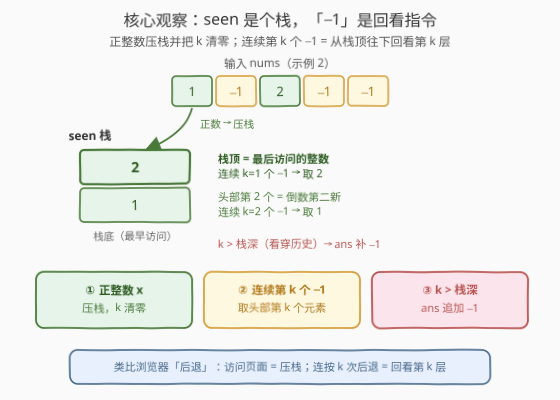
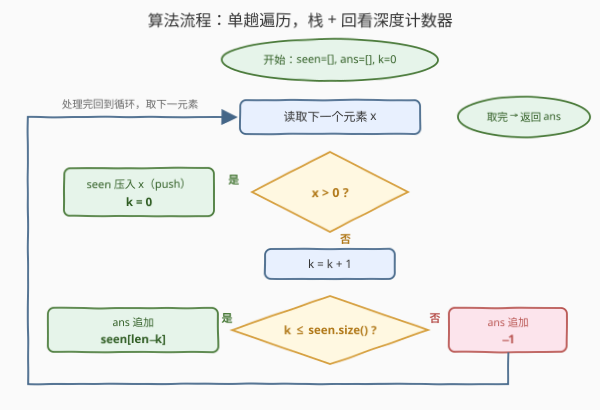

# 上一个遍历的整数

- **题目名称**：上一个遍历的整数
- **链接**：[2899. 上一个遍历的整数](https://leetcode.cn/problems/last-visited-integers/)
- **难度**：简单
- **标签**：数组，栈，模拟

## 1. 题目概述

给你一个整数数组 `nums`，其中 `nums[i]` 要么是一个**正整数**，要么是 `-1`。我们需要为每个 `-1` 找到相应的正整数，称之为**最后访问的整数**。

为此定义两个空数组：`seen` 和 `ans`，从 `nums` 头部开始遍历：

- 遇到**正整数**：把它添加到 `seen` 的**头部**；
- 遇到 `-1`：设 $k$ 为到目前为止**连续** `-1` 的数目（含当前这个）：
  - 若 $k \le |\text{seen}|$：把 `seen` 的第 $k$ 个元素加入 `ans`；
  - 若 $k > |\text{seen}|$：把 `-1` 加入 `ans`。

返回数组 `ans`。

**示例 1**：

```text
输入：nums = [1,2,-1,-1,-1]
输出：[2,1,-1]
解释：1、2 依次头插，seen == [2, 1]。三个连续 -1 的 k 分别为 1、2、3：
     k=1 取 seen 第 1 个元素 2；k=2 取第 2 个元素 1；k=3 > 长度 2，补 -1。
```

**示例 2**：

```text
输入：nums = [1,-1,2,-1,-1]
输出：[1,2,1]
解释：seen == [1] 时 k=1 取 1；随后 2 头插使 seen == [2, 1] 且 k 清零；
     之后两个 -1 的 k 为 1、2，依次取到 2、1。
```

**约束条件**：

- $1 \le \text{nums.length} \le 100$
- $\text{nums}[i] == -1$ 或 $1 \le \text{nums}[i] \le 100$

> 💡 读题关键：题面规则绕，但实际只有两条——**正数头插**、**-1 按「连续段长度 $k$」回查**。「插入头部」直接暴露了 `seen` 的**栈**本质；「连续 `-1` 的个数 $k$」其实是**回看深度**：连续第 $k$ 个 `-1` 就是往历史里回看第 $k$ 层，像浏览器连按「后退」。

---

## 2. 解题思路

### 2.1 暴力思路

按题面逐字直译：正数就往 `seen` **开头** `insert`（`vector` 头插 $O(n)$）；遇到 `-1` 就从当前位置往前数出连续 `-1` 的个数 $k$，再取 `seen[k-1]`。整体 $O(n^2)$，在 $n \le 100$ 下轻松通过——本题本就是模拟签到题，直译即正确解；剩下的功夫只是把模拟写得**干净**：把「头插 + 第 $k$ 个」翻译成栈的语言。

### 2.2 核心观察：seen 是栈，-1 是「回看」指令



**观察 1（头插 = 压栈）**：正整数插入 `seen` 头部，等价于 `push` 入栈——**栈顶（头部）永远是「最后访问的整数」**，正呼应题名。

**观察 2（第 k 个元素 = 栈顶往下第 k 层）**：连续第 $k$ 个 `-1` 表示回看深度为 $k$，取头部起的第 $k$ 个元素。改用 `push_back` 存储（尾部 = 栈顶）后，它就是 $\text{seen}[len-k]$，一步下标搞定。

**观察 3（正数把回看深度清零）**：$k$ 的语义是「**当前这段**连续 `-1` 的长度」。任何正数都开启新历史、打断回看链，$k$ 归零——示例 2 中 `2` 把 $k$ 从 1 重置为 0，所以下一个 `-1` 又从栈顶取。

**观察 4（回看穿底 = -1）**：$k > len$ 说明要回看的历史比存在过的还多，`ans` 里放 `-1`。

> 💡 三个状态量——`seen`（栈）、$k$（连续 `-1` 计数器）、`ans`（输出）——就把题面完全翻译成了机器可执行的规则，一趟遍历、无任何回溯。

### 2.3 算法流程图



流程只有一条主循环 + 两个分支：

1. $x > 0$：压栈，$k$ 清零；
2. $x = -1$：$k$ 加一；$k \le$ 栈深则回取第 $k$ 层（$\text{seen}[len-k]$），否则补 `-1`。

### 2.4 示例演算

![示例演算：nums = [1, -1, 2, -1, -1] 的逐步执行](../images/p2899_example_walkthrough.svg)

以示例 2 `nums = [1,-1,2,-1,-1]` 为例逐步演算（见上图）：第 ② 步 $k=1$ 取栈中唯一的 `1`；第 ③ 步 `2` 压栈并清零 $k$；第 ④⑤ 步 $k=1,2$ 依次取到 `2`、`1`，最终 `ans = [1,2,1]`。

对照示例 1 `nums = [1,2,-1,-1,-1]`：`seen = [2,1]` 只有 2 层，第三个 `-1` 时 $k=3 > 2$ **穿底**，补 `-1`，得 `[2,1,-1]`。

---

## 3. 参考代码

### C++

```cpp
class Solution {
public:
    vector<int> lastVisitedIntegers(vector<int>& nums) {
        vector<int> seen, ans;
        int k = 0;                                      // 连续 -1 计数 = 回看深度
        for (int x : nums) {
            if (x != -1) {                              // 正整数：压栈，回看深度清零
                seen.push_back(x);
                k = 0;
            } else {
                ++k;                                    // 回看深度 +1
                ans.push_back(k <= (int)seen.size()
                              ? seen[seen.size() - k]   // 头部第 k 个 = 尾插视角的 len-k
                              : -1);                    // 穿底：历史不够看
            }
        }
        return ans;
    }
};
```

### Python

```python
class Solution:
    def lastVisitedIntegers(self, nums: List[int]) -> List[int]:
        seen, ans = [], []
        k = 0                                           # 连续 -1 计数 = 回看深度
        for x in nums:
            if x != -1:                                 # 正整数：压栈，回看深度清零
                seen.append(x)
                k = 0
            else:
                k += 1                                  # 回看深度 +1
                ans.append(seen[-k] if k <= len(seen) else -1)  # ⚠️ 先判长度再取负下标
        return ans
```

> ⚠️ 下标坑：Python 的 `seen[-k]` 在越界时**不报错**而是负索引回绕，取到栈底方向的错误元素；必须先判 `k <= len(seen)` 再取。C++ 同理，`seen.size() - k` 若先相减存在无符号下溢风险，本写法**先比较后取下标**，天然安全。

---

## 4. 复杂度分析

| 维度 | 复杂度 | 说明 |
|------|--------|------|
| 时间复杂度 | $O(n)$ | 单趟遍历，每个元素 $O(1)$ 处理（直译头插版为 $O(n^2)$，$n \le 100$ 亦可过） |
| 空间复杂度 | $O(n)$ | `seen` 最坏压入全部 $n$ 个正整数；`ans` 为返回值不计入 |

---

## 5. 扩展：直译头插版与「回看指令」的推广

更贴题面的直译版（`insert` 头插、取 `seen[k-1]`，与上版逐输出等价）：

```python
class Solution:
    def lastVisitedIntegers(self, nums: List[int]) -> List[int]:
        seen, ans = [], []
        k = 0
        for x in nums:
            if x != -1:
                seen.insert(0, x)              # 直译「添加到头部」
                k = 0
            else:
                k += 1
                ans.append(seen[k - 1] if k <= len(seen) else -1)
        return ans
```

**推广**：把「`-1` = 回看 1 层」换成「`-k` = 回看 $k$ 层」（浏览器一次后退 $k$ 步、编辑器一次 undo 多步），只需让回看深度按指令值累加，栈与越界判断完全不变——[1472. 设计浏览器历史记录](https://leetcode.cn/problems/design-browser-history/) 就是这类「指令流 + 栈」的工程化版本。

---

## 6. 面试要点

1. **为什么说 seen 是个栈？**

   > 「正整数插入头部」+「取头部起第 $k$ 个」合起来就是后进先出：头部即栈顶（最后访问），第 $k$ 个元素即从栈顶往下数第 $k$ 层。用 `push_back` 存储时其下标为 $len - k$。

2. **计数器 k 什么时候清零？为什么？**

   > 遇到任何正整数就清零。$k$ 统计的是**当前这段**连续 `-1` 的长度（回看深度）；正数开启新历史，回看链被打断，深度从栈顶重新数起。示例 2 中 `2` 正是靠清零让下一个 `-1` 取到新的栈顶。

3. **越界分支要注意什么？**

   > $k$ **严格大于** `seen` 长度时输出 `-1`。实现上 Python 的 `seen[-k]` 越界时会负索引回绕而非报错，C++ 的 `size() - k` 先相减会无符号下溢——都要**先比较再取下标**。

4. **头插版和尾插版等价吗？**

   > 逐输出完全等价。头插直译题面、取 `seen[k-1]`；尾插把「头部」翻译成「栈顶」、取 `seen[len-k]`，免去 $O(n)$ 的头插移动。前者好想，后者好写且快，$n \le 100$ 时随意。

5. **这题在考什么？**

   > 「指令流 + 栈」的建模能力：把题面的数组头插操作翻译成栈语义，再配一个连续段计数器。同族题如 682 棒球比赛（数字压栈 / 符号弹栈）、844 退格字符串（退格 = 弹栈），都是把操作序列映射为栈动作。

---

## 7. 同类练习题

- [682. 棒球比赛](https://leetcode.cn/problems/baseball-game/)：指令流栈模拟的最经典签到题（整数压栈、特殊符号运算），与本题同族
- [844. 比较含退格的字符串](https://leetcode.cn/problems/backspace-string-compare/)：退格键 = 弹栈，与「-1 = 回看」同为把操作序列映射成栈动作
- [1047. 删除字符串中的所有相邻重复项](https://leetcode.cn/problems/remove-all-adjacent-duplicates-in-string/)：栈顶判定消相邻重复，练栈模拟基本功
- [1472. 设计浏览器历史记录](https://leetcode.cn/problems/design-browser-history/)：visit 压栈 / back 回看，本题「回看历史」的工程化完整版
