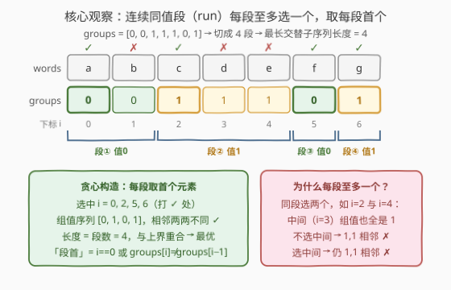
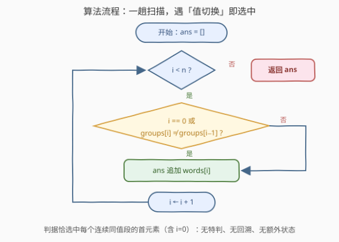
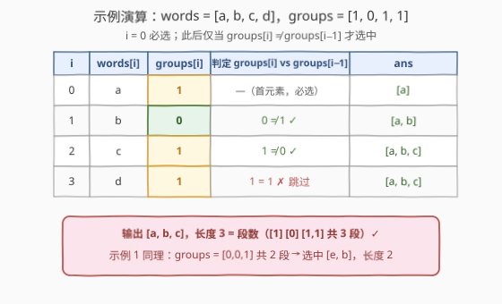

# LeetCode 最长相邻不相等子序列I 题解

## 1. 题目概述

- **标题 / 题号**：最长相邻不相等子序列 I（#2900，easy）
- **链接**：https://leetcode.cn/problems/longest-unequal-adjacent-groups-subsequence-i/
- **难度**：简单
- **标签**：贪心，数组，字符串，动态规划

**题意**：给定字符串数组 `words` 和一个**二进制**数组 `groups`，两个数组长度都是 $n$。

如果 `words` 的一个**子序列**是**交替的**，那么对于该序列中**任意两个连续字符串**，它们在 `groups` 中相同索引处的对应元素是**不同**的（也就是说，选出的组值序列中不能出现连续的 0 或连续的 1）。

你需要从 `words` 中选出**最长交替子序列**并返回。如果有多个答案，返回**任意**一个。

**注意**：`words` 中的元素互不相同。

**示例 1**：

```text
输入：words = ["e","a","b"], groups = [0,0,1]
输出：["e","b"]
解释：一个可行的子序列是 [0,2]，因为 groups[0] != groups[2]，
     答案为 [words[0],words[2]] = ["e","b"]。
     另一个可行的子序列是 [1,2]，答案为 ["a","b"]。
     符合题意的最长子序列长度为 2。
```

**示例 2**：

```text
输入：words = ["a","b","c","d"], groups = [1,0,1,1]
输出：["a","b","c"]
解释：一个可行的子序列为 [0,1,2]，因为 groups[0] != groups[1] 且 groups[1] != groups[2]。
     另一个可行的子序列为 [0,1,3]，答案为 ["a","b","d"]。
     符合题意的最长子序列长度为 3。
```

**约束**：

- $1 \le n = \text{words.length} = \text{groups.length} \le 100$
- $1 \le \text{words}[i].\text{length} \le 10$
- `groups[i]` 是 `0` 或 `1`
- `words` 中的字符串互不相同，且只包含小写英文字母

> 💡 读题关键：题面里的 `words` 其实是个「幌子」——合法性**只由 `groups` 决定**，`words` 只负责给选中的下标配上字符串。问题本质是：**在 0/1 数组中选最长的下标子序列，使相邻组值不同**。看到「相邻不同 + 二值」，应立刻想到「连续同值段」结构。

## 2. 解题思路

### 2.1 暴力思路

最朴素的做法是枚举 `words` 的全部 $2^n$ 个子序列，对每个子序列逐一检查相邻组值是否两两不同，取合法的最长者，时间 $O(2^n \cdot n)$，$n = 100$ 时完全不可行。

标准改进是**动态规划**：设 $dp[i]$ 为**以下标 $i$ 结尾**的最长交替子序列长度，则

$$dp[i] = \max_{j < i,\ \text{groups}[j] \ne \text{groups}[i]} \big(dp[j] + 1\big)$$

双重循环 $O(n^2)$，记录前驱即可还原方案。这对**任意**「相邻约束」都成立，是本题的通用兜底；但它没有用到本题的两个特殊条件——组值**只有 0/1**、约束**只看组值**——存在更快的 $O(n)$ 贪心。

### 2.2 核心观察：连续同值段（run）——每段取一个



**观察 1（上界：每段至多选一个）**：把 `groups` 切分成若干**极大连续同值段**（run），例如 $[0,0,1,1,1,0,1]$ 切成 $[0,0]\;[1,1,1]\;[0]\;[1]$ 共 4 段。若子序列选中了**同一段内的两个下标** $p < q$：由于 $p$ 到 $q$ 之间的所有组值都相同，中间无论选不选别的下标，最终都会出现两个**相邻且组值相等**的元素——非法。因此**每段至多贡献一个元素**，答案长度 $\le$ 段数。

**观察 2（可达：每段取一个必合法）**：由「极大」的定义，**相邻两段的值必然不同**。于是每段各取一个元素（比如每段的**首个**元素），选出的组值序列两两相邻不同，必然合法——答案长度 $=$ 段数。

两个观察一夹，结论水到渠成：**最长长度 $=$ 连续同值段数，「每段取首个元素」就是一组最优解**。

**再化简一步**：「每段首个元素」恰好就是满足「$i = 0$ 或 $\text{groups}[i] \ne \text{groups}[i-1]$」的下标——段首必然与前一个元素不同，非段首必然与前一元素相同。于是连「上一个选中的组值」都不用维护，一趟扫描直接收答案。

> 💡 本质：这就是**转折点计数**——`groups` 每发生一次「值切换」（含首元素）就选一个。与 376 摆动序列「每遇到新方向取一个」同属一族：当约束只涉及相邻关系时，先压缩相邻同值，看剩下的结构是什么。

### 2.3 算法流程图



流程是一条「单循环 + 两分支」的直线：

1. 初始化答案数组 `ans` 为空；
2. 从 $i = 0$ 扫到 $n-1$：若 $i = 0$ 或 $\text{groups}[i] \ne \text{groups}[i-1]$，把 $\text{words}[i]$ 追加进 `ans`；
3. 返回 `ans`。

没有特判、没有回溯、没有额外状态——首元素必选，之后只在「值切换」处出手。

### 2.4 示例演算



以示例 2（`words = ["a","b","c","d"]`，`groups = [1,0,1,1]`）为例：

| $i$ | words[i] | groups[i] | 判定 groups[i] vs groups[i−1] | 动作 | ans |
|-----|----------|-----------|-------------------------------|------|-----|
| 0 | a | 1 | —（首元素） | 选中 | [a] |
| 1 | b | 0 | $0 \ne 1$ ✓ | 选中 | [a, b] |
| 2 | c | 1 | $1 \ne 0$ ✓ | 选中 | [a, b, c] |
| 3 | d | 1 | $1 = 1$ ✗ | 跳过 | [a, b, c] |

输出 `["a","b","c"]`，长度 $3$，恰等于 `groups` $[1]\,[0]\,[1,1]$ 的段数。示例 1 同理：`groups = [0,0,1]` 有 $[0,0]\,[1]$ 共 2 段，选中 $i=0,2$ 得 `["e","b"]`。

## 3. 参考代码

### C++

```cpp
class Solution {
public:
    vector<string> getLongestSubsequence(vector<string>& words, vector<int>& groups) {
        vector<string> ans;
        for (int i = 0; i < (int)words.size(); i++) {
            if (i == 0 || groups[i] != groups[i - 1]) {   // 段首 = 值切换处
                ans.push_back(words[i]);
            }
        }
        return ans;
    }
};
```

### Python

```python
class Solution:
    def getLongestSubsequence(self, words: List[str], groups: List[int]) -> List[str]:
        return [w for i, w in enumerate(words) if i == 0 or groups[i] != groups[i - 1]]
```

> ⚠️ 判据是与 **groups[i−1]**（紧邻的前一个元素）比较，而不是与「上一个**选中**的元素」比较——两者在本题中恰好等价（归纳可证：考虑 $i$ 时，上一个选中的下标必与 $i-1$ 同段同值）。照抄「与上一个选中的组值比较」当然也对，但要多维护一个变量；直接比较前一项最简洁。

## 4. 复杂度分析

| 维度 | 复杂度 | 说明 |
|------|--------|------|
| 时间复杂度 | $O(n)$ | 一趟扫描，每个下标 $O(1)$ 判定 |
| 空间复杂度 | $O(1)$ | 除输出数组外仅常数个变量（DP 版为 $O(n^2)$ 时间 / $O(n)$ 空间） |

## 5. 扩展：DP 通用视角与进阶版 2901

**通用 DP 写法**（约束任意、需还原方案时的兜底）：

```python
class Solution:
    def getLongestSubsequence(self, words: List[str], groups: List[int]) -> List[str]:
        n = len(words)
        dp = [1] * n          # dp[i]: 以 i 结尾的最长交替子序列长度
        prev = [-1] * n       # 前驱下标，用于回溯还原方案
        for i in range(n):
            for j in range(i):
                if groups[j] != groups[i] and dp[j] + 1 > dp[i]:
                    dp[i], prev[i] = dp[j] + 1, j
        k = max(range(n), key=lambda i: dp[i])
        ans = []
        while k != -1:
            ans.append(words[k])
            k = prev[k]
        return ans[::-1]
```

由于组值只有 0/1，「上一个选中元素」按**组值**分两类记录即可把 DP 压成 $O(n)$：`best[g]` 表示目前以组值 `g` 结尾的最长长度，转移 $O(1)$——这正是贪心结论的 DP 语言重述。

**进阶版 [2901. 最长相邻不相等子序列 II](https://leetcode.cn/problems/longest-unequal-adjacent-groups-subsequence-ii/)**：在「相邻组值不同」之外，还要求相邻两个字符串**长度相等**且**汉明距离为 1**（且 `groups` 不再是二值）。此时贪心立刻失效：段首元素可能不满足字符串约束，但**段内其他元素**可能满足——不能无脑取转折点，必须回到上面的 $O(n^2)$ DP，把转移条件从 `groups[j] != groups[i]` 扩充为 `groups[j] != groups[i] and len(words[j]) == len(words[i]) and hamming(words[j], words[i]) == 1`。两题对照恰好说明：**贪心的可用性取决于约束是否只依赖「相邻组值」这一局部结构**。

## 6. 面试要点

1. **为什么每个连续同值段至多贡献一个元素？**

   > 段内任意两个下标 $p < q$ 之间的组值全部相同。若两者都入选：中间不选任何元素，则它们在子序列中相邻且组值相等，非法；中间选了元素，那些元素也与它们同值，同样在某个相邻位置撞车。所以每段至多一个，答案长度 $\le$ 段数。

2. **为什么取每段首个元素就一定最优？**

   > 极大同值段的定义保证相邻两段值不同，因此「每段取一个」构造出的子序列必然合法，长度恰为段数，与观察 1 的上界重合，故最优。上界与构造夹逼出唯一的答案长度。

3. **判据为什么可以是 groups[i] ≠ groups[i−1]，而不是与上一个选中元素比较？**

   > 归纳不变式：扫描到 $i$ 时，上一个被选中的下标正是 $i-1$ 所在段的首元素（被跳过的下标都与段首同值），故「上一个选中组值 $= \text{groups}[i-1]$」恒成立，两种判据等价，后者省去状态维护。

4. **本题与 376 摆动序列、978 湍流子数组是什么关系？**

   > 三者都在数「方向切换」：376 数值升降切换（取峰谷），978 要求**连续子数组**内符号交替，本题是二值切换且允许**跳选**（子序列）。子序列比子数组更自由，约束反而更松，直接压缩同值段即可。

5. **什么情况下贪心失效、必须回到 DP？**

   > 当约束不再「只看相邻组值」时。如 2901 追加「相邻字符串等长 + 汉明距离为 1」：段首可能不满足约束，需要回看段内其他元素，局部贪心失去最优子结构，退回 $O(n^2)$ DP 转移。

## 同类练习题

| # | 题目 | 与本题的关联 |
|---|------|-------------|
| 2901 | [最长相邻不相等子序列 II](https://leetcode.cn/problems/longest-unequal-adjacent-groups-subsequence-ii/) | 本题进阶版，追加「等长 + 汉明距离 1」约束，贪心失效转 $O(n^2)$ DP |
| 376 | [摆动序列](https://leetcode.cn/problems/wiggle-subsequence/) | 数值版「取转折点」贪心，方向切换计数与本题同源 |
| 978 | [最长湍流子数组](https://leetcode.cn/problems/longest-turbulent-subarray/) | 符号交替但要求连续子数组，对比体会「子序列可跳选」的自由度 |
| 942 | [增减字符串匹配](https://leetcode.cn/problems/di-string-match/) | 按 I/D 交替模式构造排列，另一方向的「交替模式」构造题 |
