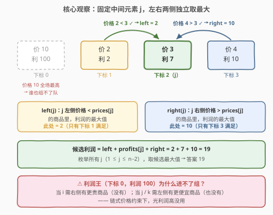
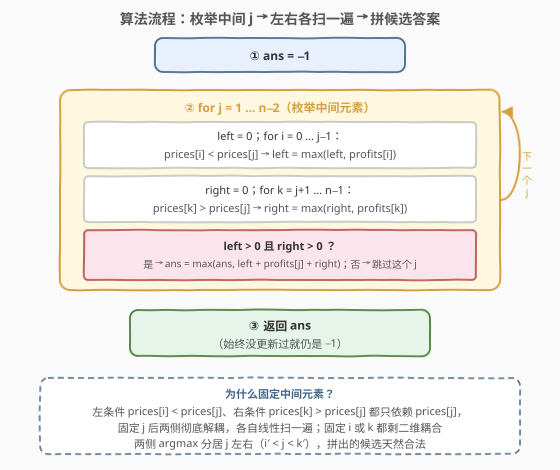
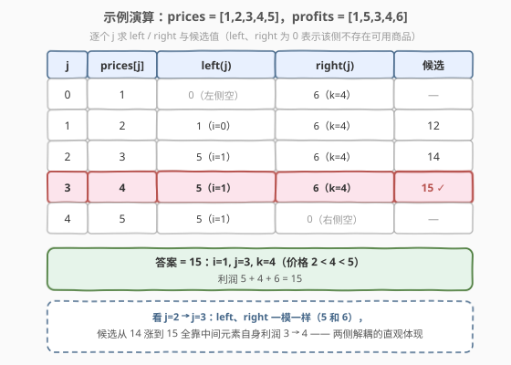
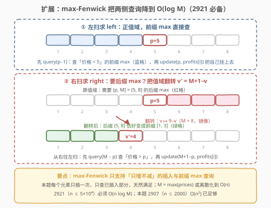

# LeetCode 价格递增的最大利润三元组 I 题解

## 1. 题目概述

- **标题 / 题号**：价格递增的最大利润三元组 I（#2907，medium）
- **链接**：https://leetcode.cn/problems/maximum-profitable-triplets-with-increasing-prices-i/
- **难度**：中等
- **标签**：数组、树状数组、线段树

> ⚠️ 本题为 LeetCode 付费题，题意描述根据官方示例用例与 hints 重建，可能与官方题面有出入。

**题意**：给定两个长度为 $n$ 的**下标从 0 开始**的数组 `prices` 和 `profits`。商店里有 $n$ 件商品，第 $i$ 件商品的价格为 `prices[i]`，利润为 `profits[i]`。

我们必须按以下条件选择**三件**商品：

- `prices[i] < prices[j] < prices[k]`，其中 `i < j < k`。

若选择的下标 $i, j, k$ 满足上述条件，则利润为 `profits[i] + profits[j] + profits[k]`。返回我们能得到的**最大利润**；若无法选出满足条件的三件商品，返回 `-1`。

**示例 1**：

```text
输入：prices = [10,2,3,4], profits = [100,2,7,10]
输出：19
解释：不能选下标 0 的商品（价格 10 全场最高，找不到满足条件的位置）。
唯一合法的三元组是下标 (1, 2, 3)：prices[1] < prices[2] < prices[3]，
利润为 2 + 7 + 10 = 19。
```

**示例 2**：

```text
输入：prices = [1,2,3,4,5], profits = [1,5,3,4,6]
输出：15
解释：价格严格递增，任何 i < j < k 都合法，挑利润最大的三个：
下标 (1, 3, 4)，利润 5 + 4 + 6 = 15。
```

**示例 3**：

```text
输入：prices = [4,3,2,1], profits = [33,20,19,87]
输出：-1
解释：价格严格递减，不存在满足条件的三元组。
```

**约束**：

- $3 \le \text{prices.length} = \text{profits.length} \le 2000$
- $1 \le \text{prices}[i] \le 10^6$
- $1 \le \text{profits}[i] \le 10^6$

> 💡 本题核心是「**固定中间元素，解耦两侧约束**」。约束 `i < j < k` 与 `prices[i] < prices[j] < prices[k]` 是一条**链式约束**——把 $j$ 固定后，左侧只剩「价格比 `prices[j]` 小者的最大利润」，右侧只剩「价格比 `prices[j]` 大者的最大利润」，两个子问题**互相独立**，各自取最优再拼起来。注意 $n \le 2000$ 的规模暗示 $O(n^2)$ 可过；进阶版 [2921. 价格递增的最大利润三元组 II](https://leetcode.cn/problems/maximum-profitable-triplets-with-increasing-prices-ii/) 把 $n$ 放大到 $5 \times 10^4$，就必须上树状数组了（见第 5 节）。

## 2. 解题思路

### 2.1 暴力思路：三重循环枚举

最直接的做法是枚举所有 $i < j < k$，检查 `prices[i] < prices[j] < prices[k]`，在合法三元组里取最大利润和，时间复杂度 $O(n^3)$。$n = 2000$ 时组合数 $\binom{2000}{3} \approx 1.3 \times 10^9$——C++ 贴着时限挣扎，Python 必然超时。

但暴力里藏着大量**重复计算**：固定 $i, j$ 之后，最内层对 $k$ 的循环只是在求「右侧价格大于 `prices[j]` 的最大 `profits[k]`」，而这个值与 $i$ **完全无关**——换一个 $i$，它还是它。把「与谁无关」的部分提出来只算一次，就是优化方向。

### 2.2 核心观察：固定中间元素 j，两侧独立取最大

链式约束 `prices[i] < prices[j] < prices[k]` 有个漂亮的性质：**所有条件都以 $j$ 为锚点**。

固定中间元素 $j$（$1 \le j \le n-2$），定义：

$$\text{left}(j) = \max\{\, \text{profits}[i] : i < j,\ \text{prices}[i] < \text{prices}[j] \,\}$$

$$\text{right}(j) = \max\{\, \text{profits}[k] : k > j,\ \text{prices}[k] > \text{prices}[j] \,\}$$

若两者都存在（用 $0$ 作哨兵，因 `profits[i] ≥ 1`），$j$ 作为中间元素能拼出的最好利润是：

$$\text{cand}(j) = \text{left}(j) + \text{profits}[j] + \text{right}(j)$$

答案即为 $\max_j \text{cand}(j)$；没有任何 $j$ 可行时返回 $-1$。



**为什么固定中间而不是两端？** 固定 $i$ 后，剩下的子问题是「找 $j < k$ 且 `prices[j] < prices[k]`」——$j$ 与 $k$ 之间仍有耦合，还是个二维问题；而固定 $j$ 后，左条件只含 `prices[j]`、右条件也只含 `prices[j]`，**两侧彻底解耦**成两个独立的一维「条件最大值」查询。

**正确性**：设最优三元组为 $(i^*, j^*, k^*)$。枚举到 $j = j^*$ 时，$i^*$ 在其左侧且价格更小，故 $\text{left}(j^*) \ge \text{profits}[i^*]$；同理 $\text{right}(j^*) \ge \text{profits}[k^*]$。而 $\text{left}(j^*)$ 与 $\text{right}(j^*)$ 各自取到的元素**分居 $j^*$ 两侧**（下标天然满足 $i' < j^* < k'$，不可能撞车），拼出来的一定是合法三元组——所以 $\text{cand}(j^*)$ 可达且不小于最优值，逐 $j$ 取 max 恰好命中最优。

每个 $j$ 求 left、right 各需一次 $O(n)$ 线性扫描，总计 $O(n^2) \approx 4 \times 10^6$，轻松通过。

### 2.3 算法流程图



**完整步骤**：

1. `ans = -1`
2. 枚举中间下标 $j = 1, \dots, n-2$（$j$ 两侧至少各留一个元素）
3. 左扫 $i \in [0, j)$：`prices[i] < prices[j]` 则 `left = max(left, profits[i])`
4. 右扫 $k \in (j, n)$：`prices[k] > prices[j]` 则 `right = max(right, profits[k])`
5. `left > 0` 且 `right > 0` 时更新 `ans = max(ans, left + profits[j] + right)`
6. 返回 `ans`

**实现细节**：

- **哨兵用 0**：约束保证 `profits[i] ≥ 1`，任何真实利润都大于 0，因此 `left/right` 初始化为 0 即可表示「不存在」，判 `> 0` 就够了。
- **无溢出风险**：`profits[i] ≤ 10^6`，三项之和最大 $3 \times 10^6$，`int` 装得下。

### 2.4 示例演算

以示例 2 `prices = [1,2,3,4,5]`，`profits = [1,5,3,4,6]` 为例，逐个 $j$ 演算：

| $j$ | prices[j] | left(j)（左侧更便宜的最大利润） | right(j)（右侧更贵的最大利润） | 候选 |
|:---:|:---:|:---|:---|:---:|
| 0 | 1 | —（左侧无元素） | 6（k=4） | — |
| 1 | 2 | 1（i=0） | 6（k=4） | 12 |
| 2 | 3 | 5（i=1） | 6（k=4） | 14 |
| 3 | 4 | 5（i=1） | 6（k=4） | **15** ✓ |
| 4 | 5 | 5（i=1） | —（右侧无元素） | — |

答案 $= 15$，对应 $i=1, j=3, k=4$（价格 $2 < 4 < 5$）。



注意 $j=2$ 与 $j=3$：两侧的 `left/right` 完全相同（5 和 6），候选从 14 涨到 15 全靠中间元素自身利润（3 → 4）——这正是「两侧解耦」的直观体现。再用示例 1 快速复核：只有 $j=2$ 可行（左侧 $i=1$ 价格 $2<3$、右侧 $k=3$ 价格 $4>3$），候选 $2+7+10=19$ ✓；$j=1$ 时左侧唯一元素价格 10 比 2 大、$j=3$ 时右侧没元素，均不可行。

## 3. 参考代码

### C++

```cpp
class Solution {
public:
    int maxProfit(vector<int>& prices, vector<int>& profits) {
        int n = prices.size(), ans = -1;
        for (int j = 1; j < n - 1; j++) {          // 枚举中间元素
            int left = 0, right = 0;               // 0 = 不存在（profits[i] ≥ 1）
            for (int i = 0; i < j; i++)            // 左侧：价格更小者的最大利润
                if (prices[i] < prices[j])
                    left = max(left, profits[i]);
            for (int k = j + 1; k < n; k++)        // 右侧：价格更大者的最大利润
                if (prices[k] > prices[j])
                    right = max(right, profits[k]);
            if (left > 0 && right > 0)             // 两侧都有人，才拼得出三元组
                ans = max(ans, left + profits[j] + right);
        }
        return ans;
    }
};
```

### Python

```python
class Solution:
    def maxProfit(self, prices: List[int], profits: List[int]) -> int:
        n, ans = len(prices), -1
        for j in range(1, n - 1):                  # 枚举中间元素
            left = max((profits[i] for i in range(j) if prices[i] < prices[j]),
                       default=0)                  # 0 = 不存在
            right = max((profits[k] for k in range(j + 1, n) if prices[k] > prices[j]),
                        default=0)
            if left and right:
                ans = max(ans, left + profits[j] + right)
        return ans
```

> 💡 两版逻辑一致：外层枚举中间 $j$，内层两次独立线性扫描。Python 用生成器 + `default=0` 把「条件最大值」写成一行，`default` 参数正是哨兵思维的直接体现。

## 4. 复杂度分析

| 维度 | 复杂度 | 说明 |
|------|--------|------|
| **时间复杂度** | $O(n^2)$ | $n-2$ 个中间元素，每个左右各扫一遍 $O(n)$；$n = 2000$ 时约 $4 \times 10^6$ 次比较 |
| **空间复杂度** | $O(1)$ | 只用常数个变量（left / right / ans），原地计算 |

> ⚠️ 对比 2.1 的暴力：$O(n^3) \to O(n^2)$ 的收益来自「把与 $i$ 无关的右侧最大值提出循环」。还想更快，就得把「条件最大值查询」本身做进数据结构——见第 5 节。

## 5. 扩展：版本 II（2921 题）的 O(n log M) 树状数组解法

进阶版 [2921. 价格递增的最大利润三元组 II](https://leetcode.cn/problems/maximum-profitable-triplets-with-increasing-prices-ii/) 把 $n$ 放大到 $5 \times 10^4$（价格 $\le 5000$），$O(n^2)$ 约 $2.5 \times 10^9$ 次运算直接超时。算法骨架不变——仍是「固定 $j$，左右各查一个条件最大值」——只是把两侧查询交给**维护前缀最大值的树状数组（max-Fenwick）**。

**左扫求 left**：从左往右扫，对每个 $i$ 先查再插——

- $\text{left}[i] = \text{query}(\text{prices}[i] - 1)$：值域 $[1, \text{prices}[i])$ 上已插入利润的最大值，恰好是「左侧且价格更小」；
- 再 $\text{update}(\text{prices}[i], \text{profits}[i])$ 把自己挂上值域。

**右扫求 right 的翻转技巧**：Fenwick 天生只会**前缀** max，而右侧要的是「价格**大于** `prices[j]`」——值域上的**后缀** max。做法是插入与查询前把值翻转 $v \mapsto M + 1 - v$（$M$ 为最大价格），后缀 $(p, M]$ 恰好变成前缀 $[1, M - p]$，因为

$$v > p \iff M + 1 - v < M + 1 - p$$

从右往左扫，对每个 $k$ 先查（$\text{query}(M - \text{prices}[k])$）再插（$\text{update}(M + 1 - \text{prices}[k], \text{profits}[k])$），得到 $\text{right}[k]$。



最后取 $\text{ans} = \max\{\, \text{left}[j] + \text{profits}[j] + \text{right}[j] : \text{两侧都非 } 0 \,\}$。

```cpp
class BIT {                                        // 维护前缀最大值的树状数组
    int n;
    vector<int> c;
public:
    BIT(int n) : n(n), c(n + 1, 0) {}
    void update(int x, int v) {                    // 点更新：c[x] = max(c[x], v)
        for (; x <= n; x += x & -x) c[x] = max(c[x], v);
    }
    int query(int x) const {                       // 前缀 [1, x] 的最大值
        int mx = 0;
        for (; x > 0; x -= x & -x) mx = max(mx, c[x]);
        return mx;
    }
};

class Solution {
public:
    int maxProfit(vector<int>& prices, vector<int>& profits) {
        int n = prices.size(), m = *max_element(prices.begin(), prices.end());
        vector<int> left(n), right(n);
        BIT t1(m + 1), t2(m + 1);
        for (int i = 0; i < n; i++) {              // 左扫：查 [1, prices[i]-1] 再插入
            left[i] = t1.query(prices[i] - 1);
            t1.update(prices[i], profits[i]);
        }
        for (int i = n - 1; i >= 0; i--) {         // 右扫：翻转值域，后缀 max 变前缀 max
            right[i] = t2.query(m - prices[i]);
            t2.update(m + 1 - prices[i], profits[i]);
        }
        int ans = -1;
        for (int j = 0; j < n; j++)
            if (left[j] && right[j])
                ans = max(ans, left[j] + profits[j] + right[j]);
        return ans;
    }
};
```

> 💡 两个细节：① **只插不删**是 max-Fenwick 可用的前提——本题每个元素只插入一次、查询只关心已插入部分，天然满足（max 不满足「减法可逆」，所以 max-Fenwick 不支持撤销）。② 本题（2907）价格上界 $10^6$、$n$ 仅 2000，若真用值域树状数组可以先**离散化**把空间压到 $O(n)$；2921 价格上界只有 5000，直接开值域数组即可。线段树同样能做，只是代码更重。

## 6. 面试要点

1. **为什么要固定中间元素 j，而不是固定第一个或最后一个？**

   链式约束 `prices[i] < prices[j] < prices[k]` 的所有比较都以 $j$ 为参照：左条件只依赖 `prices[j]`，右条件也只依赖 `prices[j]`。固定 $j$ 后两侧解耦成两个独立的一维「条件最大值」；固定 $i$ 则剩下 $j, k$ 之间的二维耦合，化不掉。

2. **用 0 当「不存在」的哨兵为什么安全？**

   约束保证 `profits[i] ≥ 1`，任何真实利润都大于 0，0 不会被误当成合法利润；判断 `left > 0 && right > 0` 即「两侧都存在」。若题目允许利润为 0 或负数，就要换成 $-1$ 或 $-\infty$ 并改判定——哨兵必须取自值域之外。

3. **两侧各自取的 argmax 会不会撞车（取到同一个下标）？**

   不会。`left` 只在 $[0, j)$ 里扫、`right` 只在 $(j, n)$ 里扫，两个区间不相交，取到的下标必然满足 $i' < j < k'$——拼出的候选天然合法，不需要额外校验。

4. **这套「枚举中间 + 两侧预处理」的套路还能用在哪？**

   约束形如「以中间元素为锚」的三元组问题都可以：2908 元素和最小的山形三元组（`nums[i] < nums[j] > nums[k]` 求最小和，把 max 换成 min）；1930 长度为 3 的不同回文子序列（枚举中间字符，两侧各维护 26 个字母的出现信息）。两侧查询要支持大规模/在线，就升级成树状数组或线段树——即 2921 的做法。

5. **max-Fenwick 与普通树状数组有何不同？**

   普通 Fenwick 维护**可减**的求和信息，支持单点改、前缀和；max-Fenwick 把合并操作换成 `max`，支持单点更新（只增不减）与前缀最大值查询，但**不支持删除/撤销**——`max` 不可逆。所以它只适合「只插不删」的离线扫描场景，本题两侧各扫一遍正是这种场景。另外它只会查前缀（$x$ 沿 lowbit 递减到 1），后缀 max 要靠值域翻转 $v \mapsto M+1-v$ 转成前缀。

> 💡 **一句话总结**：链式价格约束以中间元素为锚——固定 $j$，左扫「更便宜的最大利润」、右扫「更贵的最大利润」，拼起来取 max，$O(n^2)$ 解决战斗；数据规模一大就把两侧查询换成 max-Fenwick（后缀靠值域翻转），$O(n \log M)$ 收工。

## 同类练习题

| # | 题目 | 与本题的关联 |
|---|------|-------------|
| 2921 | [价格递增的最大利润三元组 II](https://leetcode.cn/problems/maximum-profitable-triplets-with-increasing-prices-ii/) | 同题放大版（$n \le 5 \times 10^4$），考察把两侧线性扫描升级为 max-Fenwick / 线段树，即本文第 5 节 |
| 2908 | [元素和最小的山形三元组 I](https://leetcode.cn/problems/minimum-sum-of-mountain-triplets-i/) | 同一双周赛的姊妹题，「左小右大」换成「左小右也小」的山形约束求最小和，同款枚举中间元素骨架 |
| 456 | [132 模式](https://leetcode.cn/problems/132-pattern/)（[题解](../0401-0500/456_132模式.md)） | 另一种三下标链式约束 `nums[i] < nums[k] < nums[j]`，同样靠「固定一端 + 两侧信息」降维，对照体会约束方向对解法的影响 |
| 941 | [有效的山脉数组](https://leetcode.cn/problems/valid-mountain-array/)（[题解](../0901-1000/941_有效的山脉数组.md)） | 单序列的「先升后降」约束判定，山形三元组的一维基础版 |
| 1930 | [长度为 3 的不同回文子序列](https://leetcode.cn/problems/unique-length-3-palindromic-subsequences/) | 枚举中间字符、两侧各查 26 个字母的出现情况，同款「固定中间元素」套路 |
