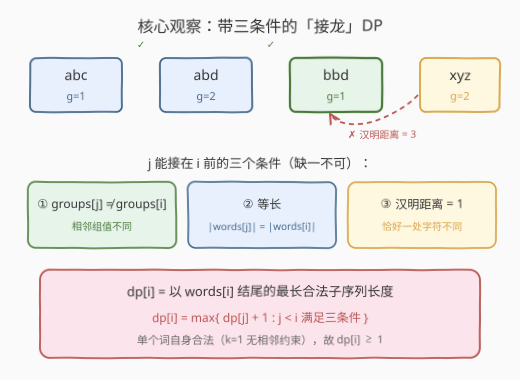
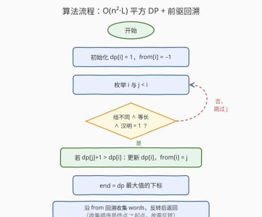
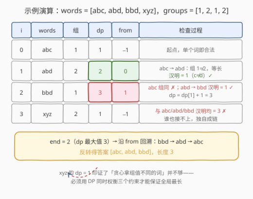

# 最长相邻不相等子序列II

- **题目名称**：最长相邻不相等子序列II
- **链接**：[2901. 最长相邻不相等子序列 II](https://leetcode.cn/problems/longest-unequal-adjacent-groups-subsequence-ii/)
- **难度**：中等
- **标签**：数组、字符串、动态规划

## 1. 题目概述

给定字符串数组 `words` 和整数数组 `groups`，两者长度均为 `n`。两个**长度相等**字符串的**汉明距离**定义为对应位置字符**不同**的数目。

需要从下标 `[0, 1, ..., n-1]` 中选出一个**最长子序列** `[i_0, i_1, ..., i_{k-1}]`，满足：

1. **相邻**下标对应的 `groups` 值**不同**，即对所有 `j` 都有 `groups[i_j] != groups[i_{j+1}]`；
2. 对所有 `j`，`words[i_j]` 和 `words[i_{j+1}]` **长度相等**，且两串之间的**汉明距离恰为 1**。

返回该子序列依次对应 `words` 中的字符串构成的数组。如有多个答案，返回任意一个。

**示例 1**：

```text
输入：words = ["bab","dab","cab"], groups = [1,2,2]
输出：["bab","cab"]
解释：子序列 [0,2] 满足 groups[0] != groups[2]，两词等长且汉明距离为 1（b↔c）。
     [0,1] 同样合法（["bab","dab"]），最长长度为 2，任一均可。
```

**示例 2**：

```text
输入：words = ["a","b","c","d"], groups = [1,2,3,4]
输出：["a","b","c","d"]
解释：单字符词两两汉明距离均为 1，groups 全不同，整串可选，答案唯一。
```

**约束条件**：

- $1 \le n = \text{words.length} = \text{groups.length} \le 1000$
- $1 \le \text{words[i].length} \le 10$
- $1 \le \text{groups[i]} \le n$
- `words` 中的字符串**互不相同**，只含小写字母。

> 💡 关键定性：这是 [300. 最长递增子序列](../0201-0300/300_最长递增子序列.md) 的「带条件接龙」变体——把「`nums[j] < nums[i]`」这一条转移条件换成「组不同 ∧ 等长 ∧ 汉明距离 1」三条，骨架仍是**以 i 结尾的最长子序列 DP + 前驱数组回溯**。前置题 [2900](https://leetcode.cn/problems/longest-unequal-adjacent-groups-subsequence-i/) 只保留条件 1（贪心可过），本题加上汉明约束后贪心失效，必须回到平方 DP。

---

## 2. 解题思路

### 2.1 暴力思路

枚举下标集合的全部 $2^n$ 个子序列，逐个检查相邻三条件并取最长。$n \le 1000$ 时完全不可行。瓶颈在于「整体枚举」没有利用约束的**局部性**——合法性只约束**相邻两个**选中的词，这正是子序列 DP 的标志性信号：一旦前一步的状态确定，后续选择与更早的历史无关。

### 2.2 核心观察：LIS 式「条件接龙」DP



三个关键观察：

1. **单个词天然合法**：$k=1$ 的子序列没有「相邻对」，无约束可违反，故每个 `words[i]` 自身就是合法答案，DP 基底为 1。

2. **状态定义**：设 $dp[i]$ = **以 `words[i]` 结尾**的最长合法子序列长度。只关心「链尾是谁」，前链内部如何选取不影响后续能否接龙——最优子结构成立。

3. **转移条件**：$j$ 能接在 $i$ 前（$j$ 是 $i$ 的直接前驱）当且仅当：

   $$\text{groups}[j] \ne \text{groups}[i] \;\wedge\; \text{len}(w_j) = \text{len}(w_i) \;\wedge\; \text{hamming}(w_j, w_i) = 1$$

   于是：

   $$dp[i] = \max\bigl(\{dp[j] + 1 : j < i \text{ 满足三条件}\} \cup \{1\}\bigr)$$

   汉明检查在**等长前提下**逐位比较、数不同字符即可，单个 $O(L)$，$L \le 10$。总转移代价 $O(n^2 L) = 1000^2 \times 10 = 10^7$，轻松通过。

**还原方案**：转移时用 $from[i]$ 记录取得最大值的 $j$；全部算完后取 $end = \arg\max dp$，沿 $from$ 一路回溯到 $-1$，收集到的词序是**终点→起点**，反转即为答案。

> ⚠️ 长度不等直接判不兼容（汉明距离只对等长串有定义），先比长度再逐位比较，可提前剪掉大部分候选；逐位比较时一旦差异数超过 1 也可立即返回 false。

### 2.3 算法流程图



流程四步：

1. **初始化**：$dp[i] = 1$，$from[i] = -1$；
2. **双重循环**：对每个 $i$ 枚举 $j < i$，三条件通过且 $dp[j]+1 > dp[i]$ 时更新 $dp[i]$ 与 $from[i]$；
3. **定位终点**：$end$ 取 $dp$ 最大值所在下标（并列时任取）；
4. **回溯输出**：沿 $from$ 收集、反转、返回。

### 2.4 示例演算



用一个信息量更大的例子 `words = ["abc","abd","bbd","xyz"]`，`groups = [1,2,1,2]` 逐步演算：

| $i$ | $w_i$ | 组 | $dp[i]$ | $from[i]$ | 检查过程 |
|-----|-------|----|---------|-----------|----------|
| 0 | abc | 1 | 1 | −1 | 起点 |
| 1 | abd | 2 | **2** | 0 | $abc \to abd$：组 $1 \ne 2$，等长，汉明 $=1$（c↔d）✓ |
| 2 | bbd | 1 | **3** | 1 | $abc$ 组同 ✗；$abd \to bbd$：组 $2 \ne 1$，汉明 $=1$（a↔b）✓ |
| 3 | xyz | 2 | 1 | −1 | 与前三词汉明均为 3 ✗，独自成链 |

$end = 2$，回溯 $bbd \to abd \to abc$，反转得答案 $[\text{abc}, \text{abd}, \text{bbd}]$，长度 3。

注意 `xyz` 的遭遇：它与 `abc`、`abd` 组值都不同（只看 2900 题的条件似乎「可接」），但汉明距离都是 3，接不上任何链——这正说明**贪心策略失效**，三个约束必须放在 DP 里统一权衡。

用官方示例 1 快速复核：`dp = [1, 2, 2]`，`end = 1`，回溯得 `["bab","dab"]` ✓（示例接受任一长度 2 的答案）。

---

## 3. 参考代码

### C++（平方 DP + 回溯，$O(n^2 L)$）

```cpp
class Solution {
public:
    vector<string> getWordsInLongestSubsequence(vector<string>& words, vector<int>& groups) {
        int n = words.size();
        vector<int> dp(n, 1), from(n, -1);

        // j 能否作为 i 的直接前驱：组不同 ∧ 等长 ∧ 汉明距离恰为 1
        auto canFollow = [&](int j, int i) -> bool {
            if (groups[j] == groups[i]) return false;
            const string &a = words[j], &b = words[i];
            if (a.size() != b.size()) return false;
            int diff = 0;
            for (int k = 0; k < (int)a.size() && diff <= 1; k++) {
                diff += (a[k] != b[k]);
            }
            return diff == 1;
        };

        for (int i = 0; i < n; i++) {
            for (int j = 0; j < i; j++) {
                if (canFollow(j, i) && dp[j] + 1 > dp[i]) {
                    dp[i] = dp[j] + 1;
                    from[i] = j;
                }
            }
        }

        int end = max_element(dp.begin(), dp.end()) - dp.begin();
        vector<string> ans;
        for (int i = end; i != -1; i = from[i]) {
            ans.push_back(words[i]);
        }
        reverse(ans.begin(), ans.end());
        return ans;
    }
};
```

### Python（同思路）

```python
class Solution:
    def getWordsInLongestSubsequence(self, words: List[str], groups: List[int]) -> List[str]:
        n = len(words)

        def can_follow(j: int, i: int) -> bool:
            if groups[j] == groups[i]:
                return False
            a, b = words[j], words[i]
            if len(a) != len(b):
                return False
            return sum(x != y for x, y in zip(a, b)) == 1

        dp = [1] * n
        from_ = [-1] * n
        for i in range(n):
            for j in range(i):
                if can_follow(j, i) and dp[j] + 1 > dp[i]:
                    dp[i] = dp[j] + 1
                    from_[i] = j

        end = max(range(n), key=dp.__getitem__)
        ans = []
        while end != -1:
            ans.append(words[end])
            end = from_[end]
        return ans[::-1]
```

> 💡 两处工程细节：① 汉明比较在差异数超过 1 时提前终止（C++ 循环条件 `diff <= 1`），把绝大多数不兼容对压缩到常数次字符比较；② 回溯链的长度恰为 $\max dp$，也可用它自检答案长度。

---

## 4. 复杂度分析

| 维度 | 复杂度 | 说明 |
|------|--------|------|
| 时间 | $O(n^2 L)$ | 双重循环 $O(n^2)$，每次转移汉明检查 $O(L)$；$n \le 1000, L \le 10$ ⇒ 约 $10^7$ 次字符比较 |
| 空间 | $O(n)$ | `dp`、`from` 两个一维数组（不计输出） |
| 输出 | $O(k)$ | 回溯收集 $k = \max dp$ 个词后反转 |

> 💡 对比：LIS 母题可用贪心 + 二分做到 $O(n \log n)$，但那依赖「数值大小」的全序性；本题转移条件是「汉明距离恰为 1」这种**稀疏的配对关系**，不构成可比结构，平方 DP 是该约束下的标准复杂度（见下节可再优化到 $O(nL)$）。

---

## 5. 扩展：为什么贪心失效 & 如何优化到 $O(nL)$

**为什么不能沿用 2900 的贪心**：2900 只要组值相邻不同，扫描时「组值一变就收」即可。本题的接龙关系是**词与词之间的配对约束**（每一对都要等长且汉明恰为 1）：一个组值「新鲜」的词未必能接上当前链尾（如演算中 `xyz` 组值不同却汉明全为 3），而组值「撞车」的词更可能通过跳过链中其它词接到更前面。局部最优选择不保证全局可扩展——贪心选择性质被破坏，只能交给 DP 穷举所有前驱。

**通配模式分桶，$O(nL)$ 优化**：汉明距离为 1 有个经典刻画——两词等长且恰差一位 ⇔ **存在某个位置 $p$，把两词第 $p$ 位各自抹掉后剩余串相等**。据此：

1. 对每个词 $w_i$（长 $L_i$）生成 $L_i$ 个「通配模式」：位置 $p$ 换成 `?`，如 `abd` → `?bd`、`a?d`、`ab?`；
2. 同一模式的词两两汉明距离为 1（`words` 互异排除距离 0，模式相同 ⇒ 等长）；
3. 桶内维护「按组值分开的最大 $dp$」——每个桶只存两个值：最大 $dp$ 的（值, 组）与**组值不同的次大 $dp$**。查询 $w_i$ 时，若桶内最大值组值与 `groups[i]` 相异直接用，否则用次大值（同组不能相邻）；
4. 用 $L_i$ 个桶查询结果的 max + 1 更新 $dp[i]$，随后把 $w_i$ 的 $L_i$ 个模式插入对应桶。

每词生成/查询/插入各 $O(L)$，整体 $O(nL) \approx 10^4$，较平方 DP 快三个数量级。$n \le 1000$ 下平方版已绰绰有余，此优化只在 $n$ 上探 $10^5$ 级别时才值得写——**面试先给平方版，再口头给出此优化**即可。

> ⚠️ 桶方案有个隐蔽正确性点：一对汉明为 1 的词**恰好**匹配一个模式（抹掉差异位），不会重复转移；而「模式相同」天然蕴含「原词等长」，无需额外的长度检查。

---

## 6. 面试要点

1. **为什么这题是 LIS 变体而不是区间 DP / 图论？**

   > 合法性只约束子序列中**相邻两个**元素，且「能接在后面」只取决于链尾——满足最优子结构与无后效性，套 $dp[i]$ = 以 $i$ 结尾的最长链模板；约束从「数值递增」换成「组异 + 等长 + 汉明 1」三条件，转移仍是 $\max(dp[j]) + 1$。

2. **答案要求返回具体方案而非长度，怎么改？**

   > 转移取 max 时同步记录 $from[i] = j$；结尾取 $\arg\max dp$，沿 $from$ 回溯到 $-1$。回溯顺序是终点→起点，**务必反转**。这也是所有「输出具体方案」DP 的通用手法。

3. **汉明距离的检查有哪些坑？**

   > ① 只对**等长**串有定义，长度不等直接判否，别急着逐位比；② 要求**恰好为 1**——距离为 0（相同词，本题被互异约束排除）和 ≥2 都不合法，判 `diff == 1` 而非 `diff <= 1`；③ 比较中差异数一旦超过 1 可提前退出，均摊远快于理论 $O(L)$。

4. **dp 全 1 起步的依据是什么？最差答案是什么？**

   > $k = 1$ 的子序列没有相邻对，任何单词单独都合法，故 $dp[i] \ge 1$。最差情况所有词两两不兼容（汉明全 ≥2 或长度独一份），最长链长度为 1，返回任意单词。

5. **如果把「汉明距离为 1」改成「编辑距离为 1」，算法骨架变吗？**

   > 不变，仍是平方 DP + 回溯；只是 `canFollow` 的检查换成允许「等长差一位」或「长度差一且是插入/删除」，单次检查仍 $O(L)$。这也体现了模板的通用性：**转移条件可插拔，DP 骨架复用**。

---

## 7. 同类练习题

- [2900. 最长相邻不相等子序列 I](https://leetcode.cn/problems/longest-unequal-adjacent-groups-subsequence-i/)：本题去掉长度/汉明约束的前置题，贪心可过；对照体会「加上配对约束后贪心为何失效」
- [300. 最长递增子序列](https://leetcode.cn/problems/longest-increasing-subsequence/)（[题解](../0201-0300/300_最长递增子序列.md)）：$dp[i]$ = 以 $i$ 结尾的母题模板，本题转移条件的来源
- [1218. 最长定差子序列](https://leetcode.cn/problems/longest-arithmetic-subsequence-of-given-difference/)（[题解](../1201-1300/1218_最长定差子序列.md)）：把转移条件哈希化（$v - d$ 查表）做到 $O(n)$，与本文扩展节的分桶思想同源
- [2826. 将三个组排序](../2801-2900/2826_将三个组排序.md)：LIS 变体 + 「最多保留」转化，同样是平方/线性两档解法的取舍练习
- [376. 摆动序列](https://leetcode.cn/problems/wiggle-subsequence/)：相邻约束（升降交替）子序列的 DP/贪心双解，巩固「约束只看相邻」的建模直觉
