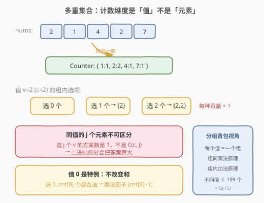
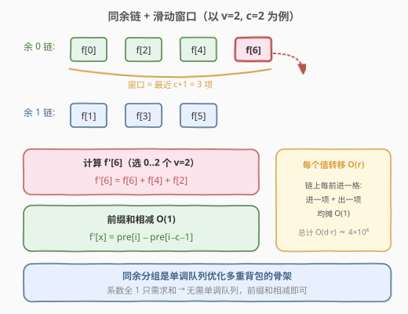
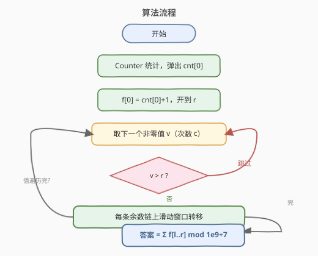
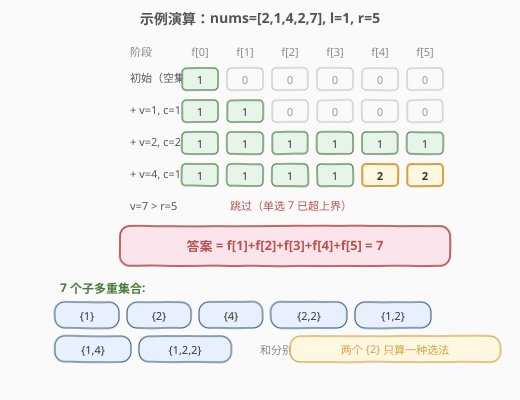

# LeetCode 和带限制的子多重集合的数目 题解

## 1. 题目概述

- **标题 / 题号**：和带限制的子多重集合的数目（#2902，hard）
- **链接**：https://leetcode.cn/problems/count-of-sub-multisets-with-bounded-sum/
- **难度**：困难
- **标签**：动态规划、多重背包、哈希表、前缀和

**题意**：给定下标从 0 开始的非负整数数组 `nums` 和两个整数 `l`、`r`，返回 `nums` 中**子多重集合**的和在闭区间 $[l, r]$ 内的数目，答案对 $10^9 + 7$ 取模。

**子多重集合**指从数组中选出一些元素构成的**无序**集合：每个元素 `x` 出现的次数可以是 $0, 1, \ldots, occ[x]$ 次（$occ[x]$ 为 `x` 在数组中的出现次数）。两个子多重集合中的元素排序后完全一样，才算相同。空集合的和是 0。

**示例 1**：

```text
输入：nums = [1,2,2,3], l = 6, r = 6
输出：1
解释：唯一和为 6 的子多重集合是 {1, 2, 3}。
```

**示例 2**：

```text
输入：nums = [2,1,4,2,7], l = 1, r = 5
输出：7
解释：{1}，{2}，{4}，{2,2}，{1,2}，{1,4}，{1,2,2}。
```

**示例 3**：

```text
输入：nums = [1,2,1,3,5,2], l = 3, r = 5
输出：9
解释：{3}，{5}，{1,2}，{1,3}，{2,2}，{2,3}，{1,1,2}，{1,1,3}，{1,2,2}。
```

**约束**：

- $1 \le nums.length \le 2 \times 10^4$
- $0 \le nums[i] \le 2 \times 10^4$
- `nums` 的和不超过 $2 \times 10^4$
- $0 \le l \le r \le 2 \times 10^4$

## 2. 解题思路

### 2.1 暴力思路：朴素多重背包

定义 $f(x)$ = 和恰好为 $x$ 的子多重集合数目，最终答案即 $\sum_{x=l}^{r} f(x)$。

按「值」做多重背包：设值 $v$ 出现 $c$ 次，则转移为（选 $j$ 个 $v$，系数恒为 1）：

$$f'(x) = \sum_{j=0}^{\min\left(c,\ \lfloor x/v \rfloor\right)} f(x - j \cdot v)$$

朴素实现对每个值枚举 $j$，单值转移 $O(c \cdot r)$，总时间 $O(n \cdot r) \approx 2 \times 10^4 \times 2 \times 10^4 = 4 \times 10^8$，**超时**。

> ⚠️ **二进制拆分在这里失效**：二进制拆分把「选 $j$ 个 $v$」拆成若干子物品的不同组合，适合**最值**问题（`max` 不会重复计数）；但计数问题里同值的 $j$ 个元素**不可区分**，选 $j$ 个 $v$ 的方案数是 1 而不是组合数——拆分后不同碎片组合会产生大量「伪方案」，把答案算大。

### 2.2 核心观察一：计数维度是「值」不是「元素」



子多重集合只关心**每个值选了几个**。先用哈希表把 `nums` 压成 `值 → 出现次数`，问题变成**分组背包**：每个值 $v$ 是一个组，组内选项是「选 $0, 1, \ldots, c$ 个」，每种选法对方案数的贡献都是 1。

两个关键推论：

- **不同非零值至多约 200 个**：$k$ 个互不相同的正整数之和至少是 $1 + 2 + \cdots + k = \frac{k(k+1)}{2}$，而总和 $\le S = 2 \times 10^4$，解得 $k \le 199$，即不同值个数是 $O(\sqrt S)$。这是本题复杂度的支柱。
- **值 0 是特例**：选任意多个 0 都不改变和，但 $\{0\} \ne \{0,0\}$ 是不同集合，所以 0 的贡献是**乘法因子** $cnt[0] + 1$（选 $0 \sim cnt[0]$ 个 0）。等价写法是初始化 $f(0) = cnt[0] + 1$。

### 2.3 核心观察二：同余链上的滑动窗口



转移 $f'(x) = f(x) + f(x-v) + \cdots + f(x-cv)$ 只会把**下标模 $v$ 同余**的状态串起来。按 $x \bmod v$ 把 $[0, r]$ 分成 $v$ 条链，每条链内部是一维的「最近 $c+1$ 项之和」——典型的**滑动窗口求和**，用前缀和相减 $O(1)$ 得到：

$$f'(x_i) = pre[i] - pre[i-c-1]$$

链上每前进一格，窗口「进一项、出一项」，均摊 $O(1)$，于是**每个值的转移从 $O(c \cdot r)$ 降到 $O(r)$**。总时间 $O(d \cdot r) \approx 200 \times 2 \times 10^4 = 4 \times 10^6$，顺利通过。

> 💡 这正是**单调队列优化多重背包**的骨架（同余分组 + 滑动窗口）；本题转移系数全为 1，窗口只需求和，连单调队列都不用，直接前缀和相减即可。

### 2.4 算法流程



1. `Counter` 统计 `nums`，取出 `cnt[0]`（0 不参与背包转移）；
2. 初始化 `f[0] = cnt[0] + 1`，其余为 0，数组只需开到 `r`；
3. 对每个非零值 `v`（出现 `c` 次）：
   - 若 `v > r` 直接跳过（单独一个 v 已超上界）；
   - 快照旧数组 `g = f`；
   - 对每条余数链 `rem = 0 .. v-1`，沿链滑动窗口转移：`s += g[x]`，越窗则 `s -= g[x-(c+1)*v]`，`f[x] = s`；
4. 答案为 $\left(\sum_{x=l}^{r} f(x)\right) \bmod (10^9+7)$。

> 💡 **容量截断技巧**：转移只依赖更小的下标，`x ≤ r` 时所有依赖 `x - j*v ≤ r`，所以 dp 开到 `r` 即可、不必开到总和 `S`（类比 416 分割等和子集只开到 `sum/2`）。

### 2.5 示例演算



以示例 2 `nums = [2,1,4,2,7], l = 1, r = 5` 为例（无 0，`f[0]=1`）：

| 阶段 | f[0] | f[1] | f[2] | f[3] | f[4] | f[5] |
|------|------|------|------|------|------|------|
| 初始（空集） | 1 | 0 | 0 | 0 | 0 | 0 |
| 加入 v=1, c=1 | 1 | 1 | 0 | 0 | 0 | 0 |
| 加入 v=2, c=2 | 1 | 1 | 1 | 1 | 1 | 1 |
| 加入 v=4, c=1 | 1 | 1 | 1 | 1 | 2 | 2 |
| v=7 > r=5，跳过 | 1 | 1 | 1 | 1 | 2 | 2 |

答案 $= f(1)+f(2)+f(3)+f(4)+f(5) = 1+1+1+2+2 = 7$ ✓，对应 $\{1\}, \{2\}, \{4\}, \{2,2\}, \{1,2\}, \{1,4\}, \{1,2,2\}$。

## 3. 参考代码

### C++

```cpp
class Solution {
  public:
    int countSubMultisets(vector<int>& nums, int l, int r) {
        const int MOD = 1e9 + 7;
        unordered_map<int, int> cnt;
        for (int x : nums) cnt[x]++;
        int zero = cnt.count(0) ? cnt[0] : 0;
        cnt.erase(0);

        vector<int> f(r + 1, 0);
        f[0] = zero + 1;  // 选 0..zero 个 0，和均为 0
        for (auto& [v, c] : cnt) {
            if (v > r) continue;  // 单选一个 v 已超上界，无法参与
            vector<int> g = f;    // 旧值快照
            for (int rem = 0; rem < v; rem++) {
                long long s = 0;  // 链上长度 c+1 的滑动窗口和
                for (int x = rem; x <= r; x += v) {
                    s += g[x];
                    if (x >= (c + 1) * v) s -= g[x - (c + 1) * v];
                    s = (s % MOD + MOD) % MOD;
                    f[x] = (int)s;
                }
            }
        }
        long long ans = 0;
        for (int x = l; x <= r; x++) ans += f[x];
        return ans % MOD;
    }
};
```

### Python

```python
class Solution:
    def countSubMultisets(self, nums: List[int], l: int, r: int) -> int:
        MOD = 10 ** 9 + 7
        cnt = Counter(nums)
        f = [0] * (r + 1)
        f[0] = cnt.pop(0, 0) + 1  # 选 0..cnt[0] 个 0，和都不变
        for v, c in cnt.items():
            if v > r:
                continue
            g = f[:]  # 旧值快照
            for rem in range(v):
                s = 0  # 链上长度 c+1 的滑动窗口和
                for x in range(rem, r + 1, v):
                    s += g[x]
                    if x >= (c + 1) * v:
                        s -= g[x - (c + 1) * v]
                    f[x] = s % MOD
        return sum(f[l:]) % MOD
```

> 💡 滑动窗口和中 `s` 始终等于「窗口内旧值之和」对 MOD 取模（减去的项恰是先前加进来的同一项），Python 的 `%` 对负数也返回非负结果，无需额外处理。

## 4. 复杂度分析

| 维度 | 复杂度 | 说明 |
|------|--------|------|
| 时间复杂度 | $O(n + d \cdot r)$ | $d$ = 不同非零值个数；由总和 $\le 2 \times 10^4$ 得 $d \le 199 = O(\sqrt S)$，故约 $4 \times 10^6$ |
| 空间复杂度 | $O(r)$ | dp 数组开到 $r$ 即可（容量截断），另有快照 $g$ 同阶 |

## 5. 扩展：与经典多重背包优化的联系

- **单调队列优化多重背包**：本题的同余分组 + 滑动窗口正是单调队列优化的骨架。若物品带价值、转移是 $f'(x) = \max_j \{f(x - jv) + j \cdot w\}$，窗口内求 **max** 时滑出的是任意旧状态，才真正需要单调队列维护候选最值；本题系数全 1、只求**和**，前缀和相减即可，是该优化「最温和的特例」。
- **生成函数视角**：转移相当于卷上多项式 $1 + x^v + x^{2v} + \cdots + x^{cv} = \frac{1 - x^{(c+1)v}}{1 - x^v}$；若每种值个数无限（$c \to \infty$），$f$ 就是自由拆分数的生成函数 $\prod_v \frac{1}{1-x^v}$，退化为 518 零钱兑换 II 的完全背包计数。
- **从最值到计数**：322（完全背包最值）/ 518（完全背包计数）/ 本题（多重背包计数）构成一条完整难度链——遍历顺序、物品拆分方式、初始化三处的差异正是背包家族的核心考点。

## 6. 面试要点

1. **为什么二进制拆分不能用于计数型多重背包？**

   - 二进制拆分适合**最值**问题：`max` 只关心最优值，不同碎片组合到达同一选择数不会重复统计
   - 计数问题中同值元素不可区分：选 $j$ 个 $v$ 的方案数是 **1**；拆分成碎片后，「用碎片 A+碎片 B 凑出 3 个」与「用碎片 C 凑出 3 个」会被算成两个方案
   - 正确姿势：按值**分组**（组内枚举选 $0..c$ 个），再用同余前缀和把组内枚举加速到 $O(r)$

2. **不同值为什么至多约 200 个？**

   - $k$ 个互不相同的正整数之和 $\ge 1 + 2 + \cdots + k = \frac{k(k+1)}{2}$
   - 总和 $\le 2 \times 10^4$，解得 $k \le 199$（$200 \times 201 / 2 = 20100 > 20000$）
   - 一般化：值域总和限制 $S$ 下，不同值个数 $O(\sqrt S)$——「多重背包计数」题的通用复杂度支柱

3. **值 0 怎么处理？为什么不能当普通值跑转移？**

   - 选任意个 0 不改变和，但产生不同的多重集合，贡献是乘法因子 $cnt[0]+1$
   - 实现上：初始化 `f[0] = cnt[0] + 1`（或最后答案乘），并把 0 从 Counter 中弹出
   - 若按普通值转移，$x \bmod v$ 除零、链步长为 0，直接死循环

4. **dp 数组为什么开到 r 就够，不用开到总和 S？**

   - 转移 $f'(x)$ 只依赖**下标更小**的旧值，$x \le r$ 时一切依赖 $\le r$
   - 只查询 $[l, r]$，超出部分永远用不到——「容量截断」是背包降复杂度的常用技巧（对照 416 只开到 `sum/2`）

5. **滑动窗口转移为什么是 O(r) 而不是 O(r·c)？**

   - 链上每前进一格，窗口滑一格：进一项加一项、出一项减一项，均摊 $O(1)$
   - 等价于前缀和相减 $pre[i] - pre[i-c-1]$，与单调队列优化多重背包同骨架
   - 系数全 1 时窗口只需求和，无需维护单调性，是该优化的最简形态

## 同类练习题

| # | 题目 | 与本题的关联 |
|---|------|-------------|
| 518 | [零钱兑换 II](https://leetcode.cn/problems/coin-change-ii/)（[题解](../0501-0600/518_零钱兑换II.md)） | 完全背包计数，本题「每种值个数无限」的简化版 |
| 2585 | [获得分数的方法数](https://leetcode.cn/problems/number-of-ways-to-earn-points/)（[题解](../2501-2600/2585_获得分数的方法数.md)） | 分组背包计数（每种类型选 $0..count$ 道），与本题的组内枚举结构一致 |
| 1155 | [掷骰子等于目标和的方法数](https://leetcode.cn/problems/number-of-dice-rolls-with-target-sum/)（[题解](../1101-1200/1155_掷骰子之和等于给定方法数.md)） | 分组背包计数入门（每枚骰子选一个面值） |
| 322 | [零钱兑换](https://leetcode.cn/problems/coin-change/)（[题解](../0301-0400/322_零钱兑换.md)） | 完全背包最值，对照「最值 vs 计数」的写法差异 |
| 377 | [组合总和 IV](https://leetcode.cn/problems/combination-sum-iv/)（[题解](../0301-0400/377_组合总和IV.md)） | 完全背包求排列数，对比「组合 vs 排列」的遍历顺序 |
