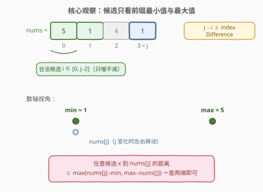
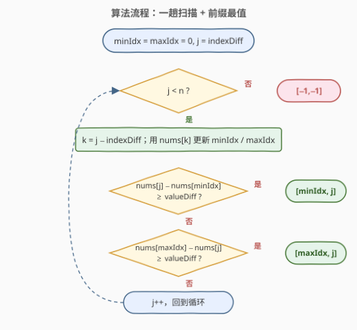
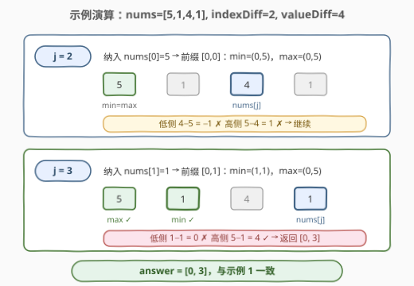

# 找出满足差值条件的下标 I

- **题目名称**：找出满足差值条件的下标 I
- **链接**：[2903. 找出满足差值条件的下标 I](https://leetcode.cn/problems/find-indices-with-index-and-value-difference-i/)
- **难度**：简单
- **标签**：数组、双指针、一次遍历

## 1. 题目概述

给你一个下标从 **0** 开始、长度为 $n$ 的整数数组 `nums`，以及整数 `indexDifference` 和 `valueDifference`。

你的任务是从范围 $[0, n - 1]$ 内找出 **2** 个满足下列所有条件的下标 $i$ 和 $j$：

- $\text{abs}(i - j) \ge \text{indexDifference}$，且
- $\text{abs}(\text{nums}[i] - \text{nums}[j]) \ge \text{valueDifference}$。

返回整数数组 `answer`。如果存在满足题目要求的两个下标，则 `answer = [i, j]`；否则，`answer = [-1, -1]`。如果存在多组可供选择的下标对，只需要返回其中任意一组即可。

**注意**：$i$ 和 $j$ 可能**相等**。

**示例 1**：

```text
输入：nums = [5,1,4,1], indexDifference = 2, valueDifference = 4
输出：[0,3]
解释：可以选择 i = 0 和 j = 3。
abs(0 - 3) >= 2 且 abs(nums[0] - nums[3]) >= 4。
因此，[0,3] 是一个符合题目要求的答案（[3,0] 同样正确）。
```

**示例 2**：

```text
输入：nums = [2,1], indexDifference = 0, valueDifference = 0
输出：[0,0]
解释：可以选择 i = 0 和 j = 0。
abs(0 - 0) >= 0 且 abs(nums[0] - nums[0]) >= 0。
因此，[0,0] 是一个符合题目要求的答案（[0,1]、[1,0]、[1,1] 同样正确）。
```

**示例 3**：

```text
输入：nums = [1,2,3], indexDifference = 2, valueDifference = 4
输出：[-1,-1]
解释：可以证明无法找出 2 个满足所有条件的下标，因此返回 [-1,-1]。
```

**约束条件**：

- $1 \le n = \text{nums.length} \le 100$
- $0 \le \text{nums}[i] \le 50$
- $0 \le \text{indexDifference} \le 100$
- $0 \le \text{valueDifference} \le 50$

> 💡 本题核心是「**一次遍历 + 前缀最小/最大值**」。下标约束 $\text{abs}(i - j) \ge \text{indexDifference}$ 意味着对每个 $j$，合法的 $i$ 落在 $[0, j - \text{indexDifference}]$ 中——这是一个随 $j$ 右移而**单调扩张**的候选集。想让值差 $\ge \text{valueDifference}$，候选集中只有**前缀最小值**和**前缀最大值**值得检查，其余元素必然不更优。边扫边维护这两个量，$O(n)$ 一趟出解。

---

## 2. 解题思路

### 2.1 暴力思路：枚举所有下标对

双重循环枚举所有 $(i, j)$ 对，逐对检查两个条件，命中即返回：

```text
for i in 0..n-1:
    for j in i..n-1:            # i = j 也合法
        if j - i >= indexDifference and abs(nums[i] - nums[j]) >= valueDifference:
            return [i, j]
return [-1, -1]
```

时间 $O(n^2)$。本题 $n \le 100$，最多 $10^4$ 对比较，**完全可以通过**——这也是本题官方提示（hint）给出的预期解法。

> ⚠️ 暴力法的硬伤：对每个 $j$ 都从零开始重扫候选区间，没有利用「合法下标集 $[0, j - \text{indexDifference}]$ 只增不减」的单调结构。数据放大到 $n = 10^5$（即 [2905. 找出满足差值条件的下标 II](https://leetcode.cn/problems/find-indices-with-index-and-value-difference-ii/)）时 $O(n^2)$ 必然超时。

### 2.2 核心观察：前缀最值——只有两个候选值得看

关键观察来自**对称化简 + 候选集单调扩张 + 最值代表性**：

1. **对称化简**：$\text{abs}(i - j) \ge \text{indexDifference}$ 关于 $i, j$ 对称，不妨只考虑 $i \le j$，即约束化为 $i \le j - \text{indexDifference}$。
2. **候选集扩张**：对每个 $j \ge \text{indexDifference}$，合法的 $i$ 范围是 $[0, j - \text{indexDifference}]$。$j$ 每右移一步，**恰好只有一个新元素** $\text{nums}[j - \text{indexDifference}]$ 加入候选集——只增不减。
3. **最值代表性**：固定 $j$ 时，$\text{abs}(\text{nums}[i] - \text{nums}[j])$ 想大到 $\ge \text{valueDifference}$，最优候选只有两个：
   - 前缀**最小值** $\min_i$：从低侧拉开距离，贡献 $\text{nums}[j] - \min_i$；
   - 前缀**最大值** $\max_i$：从高侧拉开距离，贡献 $\max_i - \text{nums}[j]$。

   其余任何候选元素的值差都不超过 $\max(\text{nums}[j] - \min_i,\ \max_i - \text{nums}[j])$——**判定存在性时看端点即可**。

4. **O(1) 增量维护**：前缀最小值 / 最大值（连同下标）随新元素加入各做一次比较即可更新，无需任何数据结构。



> 💡 **为什么只查 min / max 两个就够？** 把候选集中的值放到数轴上，$\text{nums}[j]$ 与任意点的距离都不超过它到**两端点**的距离中较大者。这是「**单调函数在端点取极值**」的直观体现——和 [121. 买卖股票的最佳时机](../0101-0200/121_买卖股票的最佳时机.md) 中「维护历史最低价」是同款前缀最值套路，只是本题同时维护 min 和 max 两端。对比 [2817. 限制条件下元素之间的最小绝对差](../2801-2900/2817_限制条件下元素之间的最小绝对差.md)：那题求**最近值**需要有序集合 + 二分；本题求**最远值**，端点即可代表，连二分都省了。

### 2.3 算法流程图



**完整步骤**：

1. **初始化**：`minIdx = maxIdx = 0`（空前缀的哨兵，首个元素加入时自动接管）。
2. **遍历** $j$ **从** $\text{indexDifference}$ **到** $n - 1$：
   - **纳入新候选**：$k = j - \text{indexDifference}$。若 $\text{nums}[k] < \text{nums}[\text{minIdx}]$ 更新 `minIdx`；若 $\text{nums}[k] > \text{nums}[\text{maxIdx}]$ 更新 `maxIdx`（此时前缀恰为 $[0, k]$）。
   - **低侧检查**：若 $\text{nums}[j] - \text{nums}[\text{minIdx}] \ge \text{valueDifference}$，返回 $[\text{minIdx},\ j]$。
   - **高侧检查**：若 $\text{nums}[\text{maxIdx}] - \text{nums}[j] \ge \text{valueDifference}$，返回 $[\text{maxIdx},\ j]$。
3. **遍历结束未命中**：返回 $[-1, -1]$。

> 💡 由于 $j \ge \text{indexDifference}$ 且纳入的是 $\text{nums}[j - \text{indexDifference}]$，返回时天然满足 $j - \text{minIdx} \ge \text{indexDifference}$（`maxIdx` 同理），下标条件无需再判。当 $\text{indexDifference} = 0$ 时 $j$ 从 0 起步，先纳入 $\text{nums}[j]$ 自身再检查——正确覆盖了 $i = j$ 的合法情形。

### 2.4 示例演算

以 `nums = [5, 1, 4, 1]`, `indexDifference = 2`, `valueDifference = 4` 为例：



| $j$ | 纳入 $\text{nums}[j-2]$ | 前缀范围 | (minIdx, 值) | (maxIdx, 值) | $\text{nums}[j]$ | 低侧差 | 高侧差 | 结果 |
|-----|--------------------------|----------|---------------|---------------|-------------------|--------|--------|------|
| 2 | $\text{nums}[0] = 5$ | $[0,0]$ | $(0, 5)$ | $(0, 5)$ | 4 | $4-5=-1$ ✗ | $5-4=1$ ✗ | 继续 |
| 3 | $\text{nums}[1] = 1$ | $[0,1]$ | $(1, 1)$ | $(0, 5)$ | 1 | $1-1=0$ ✗ | $5-1=\mathbf{4}$ ✓ | 返回 $[0, 3]$ |

最终返回 $[0, 3]$，与示例 1 一致。

> 💡 $j = 3$ 时前缀 $\{5, 1\}$ 中，低侧候选取到新最小值 1（差 0 不够），高侧候选仍是 5（差 4 恰好达标）——两端一比，答案立刻浮出水面。

---

## 3. 参考代码

### C++

```cpp
class Solution {
public:
    vector<int> findIndices(vector<int>& nums, int indexDifference, int valueDifference) {
        int n = nums.size();
        int minIdx = 0, maxIdx = 0;                 // 前缀 [0, j-indexDifference] 的最值下标
        for (int j = indexDifference; j < n; j++) {
            int k = j - indexDifference;            // 延迟 indexDifference 步纳入新候选
            if (nums[k] < nums[minIdx]) minIdx = k;
            if (nums[k] > nums[maxIdx]) maxIdx = k;
            if (nums[j] - nums[minIdx] >= valueDifference) return {minIdx, j};
            if (nums[maxIdx] - nums[j] >= valueDifference) return {maxIdx, j};
        }
        return {-1, -1};
    }
};
```

### Python

```python
class Solution:
    def findIndices(self, nums: List[int], indexDifference: int, valueDifference: int) -> List[int]:
        min_idx = max_idx = 0                     # 前缀 [0, j-indexDifference] 的最值下标
        for j in range(indexDifference, len(nums)):
            k = j - indexDifference               # 延迟 indexDifference 步纳入新候选
            if nums[k] < nums[min_idx]: min_idx = k
            if nums[k] > nums[max_idx]: max_idx = k
            if nums[j] - nums[min_idx] >= valueDifference: return [min_idx, j]
            if nums[max_idx] - nums[j] >= valueDifference: return [max_idx, j]
        return [-1, -1]
```

> 💡 两版逻辑完全一致：**延迟 $\text{indexDifference}$ 步纳入候选 → O(1) 更新前缀 min/max → 两端各查一次**。注意代码里用减法代替 `abs`：低侧检查 $\text{nums}[j] - \min$、高侧检查 $\max - \text{nums}[j]$，语义比「枚举 + abs」更直白，也天然避免了符号判断。

---

## 4. 复杂度分析

| 维度 | 复杂度 | 说明 |
|------|--------|------|
| **时间复杂度** | $O(n)$ | 单趟遍历，每步 O(1)（两次比较更新最值 + 两次比较判定） |
| **空间复杂度** | $O(1)$ | 仅维护 minIdx / maxIdx 两个下标，返回数组不计入 |

> ⚠️ 对比暴力 $O(n^2)$：本题 $n \le 100$ 两者都能过；但在 $n = 10^5$ 的 [2905. 找出满足差值条件的下标 II](https://leetcode.cn/problems/find-indices-with-index-and-value-difference-ii/) 中，$O(n^2)$ 约 $10^{10}$ 次比较必然超时，$O(n)$ 前缀最值是唯一正解——**写题时直接按 $O(n)$ 写，一份代码通吃两题**。

---

## 5. 扩展：从「存在性判定」到「最优化」

本题只要求判定**存在**一对满足条件的下标，因此前缀 min/max 的**端点代表性**就够用了。若题目变形为：

- **最大化** $\text{abs}(\text{nums}[i] - \text{nums}[j])$（带下标距离约束）：同样一趟扫描，改为维护 $\text{nums}[j] - \min_i$ 与 $\max_i - \text{nums}[j]$ 的最大值即可，仍是 $O(n)$ / $O(1)$。
- **最小化** $\text{abs}(\text{nums}[i] - \text{nums}[j])$（带下标距离约束）：这正是 [2817. 限制条件下元素之间的最小绝对差](../2801-2900/2817_限制条件下元素之间的最小绝对差.md)——**最近值无法由端点代表**，必须升级为有序集合 + `lower_bound` 二分夹击，$O(n \log n)$。
- **固定窗口内**的最值：候选集变成只增不减的滑动窗口，端点代表性失效，需用单调队列（见 [239. 滑动窗口最大值](../0201-0300/239_滑动窗口最大值.md)）或桶（值域 $[0, 50]$ 时可开 51 个桶）维护。

> 💡 一条主线贯穿：「候选集形态（只增 / 滑窗）× 查询目标（最远 / 最近）」决定数据结构选型——最远看端点、最近用二分、滑窗上单调队列。面试中能主动展开这条对比线，是加分项。

---

## 6. 面试要点

1. **为什么只需检查前缀最小值和最大值两个候选？**

   - 固定 $j$ 时，对候选集内任意 $x$，有 $\text{abs}(x - \text{nums}[j]) \le \max(\max_i - \text{nums}[j],\ \text{nums}[j] - \min_i)$（数轴上任意点到定点的距离不超过到两端点距离的较大者）。所以若存在满足值差的候选，则取到前缀 min 或 max 的那个一定也满足——**存在性判定被端点完全代表**。

2. **`indexDifference = 0` 时算法为什么正确覆盖了 $i = j$？**

   - 此时 $j$ 从 0 开始，每步先纳入 $\text{nums}[j - 0] = \text{nums}[j]$ 自身再检查。当 $\text{valueDifference} = 0$ 时，$j = 0$ 处低侧差 $0 \ge 0$ 立即返回 $[0, 0]$，与示例 2 一致。

3. **本题 $n \le 100$，为什么还要写 $O(n)$ 解法？**

   - 同题面的 [2905](https://leetcode.cn/problems/find-indices-with-index-and-value-difference-ii/) 把 $n$ 放大到 $10^5$，$O(n^2)$ 必然超时；而 $O(n)$ 版代码量与暴力几乎相同，直接写线性版可以一份代码通吃两题，也更能体现对「候选集单调扩张」结构的理解。

4. **为什么不用 `abs` 而是拆成低侧 / 高侧两次检查？**

   - 拆开后每次检查只涉及一个已知的候选（min 或 max），语义清晰且省去符号判断；返回时能直接知道该配 `minIdx` 还是 `maxIdx`，不用回头二次确认。

5. **如果要求返回所有满足条件的下标对怎么办？**

   - 存在性判定可以只看端点，但**枚举全部解**没有可压缩的结构，只能回到 $O(n^2)$ 双重循环（或按值域 $[0, 50]$ 分桶做值差配对统计），输出规模本身可能达到 $O(n^2)$。

> 💡 **一句话总结**：2903 是「一次遍历 + 前缀最值」的入门招牌题——下标距离约束把候选 $i$ 圈进只增不减的前缀，值差存在性由前缀 min/max 两个端点完全代表，$O(n)$ / $O(1)$ 一趟出解。

---

## 7. 同类练习题

- [2905. 找出满足差值条件的下标 II](https://leetcode.cn/problems/find-indices-with-index-and-value-difference-ii/)：同题面大 $n$ 版（$n \le 10^5$），暴力超时，本题 $O(n)$ 解法原样平移
- [2817. 限制条件下元素之间的最小绝对差](https://leetcode.cn/problems/minimum-absolute-difference-between-elements-with-constraint/)：同款「下标距离约束 + 单调扩张候选集」，但求**最近值**需有序集合 + 二分，与本题求**最远值**只看端点形成对照
- [121. 买卖股票的最佳时机](https://leetcode.cn/problems/best-time-to-buy-and-sell-stock/)：前缀最小值套路的母题，一次遍历维护历史最低价
- [239. 滑动窗口最大值](https://leetcode.cn/problems/sliding-window-maximum/)：候选集从「只增」升级为「滑动窗口」后的区间最值维护（单调队列）
- [719. 找出第 K 小的数对距离](https://leetcode.cn/problems/find-k-th-smallest-pair-distance/)：同为「数对差值」主题，二分答案 + 双指针计数的另一条路线
