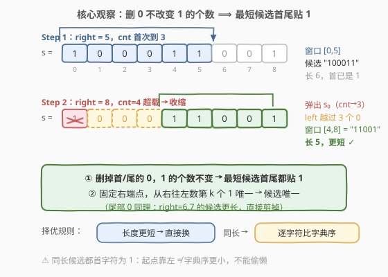
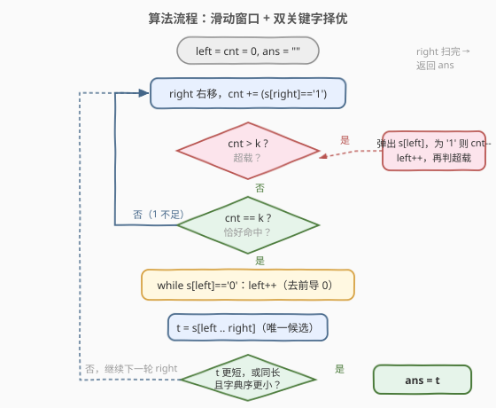
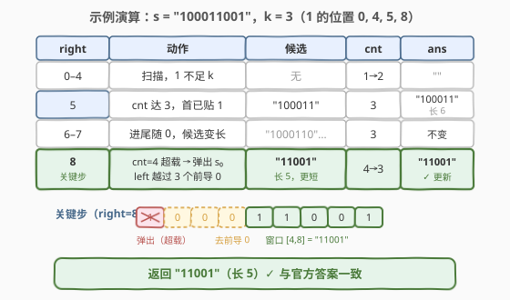

# LeetCode 最短且字典序最小的美丽子字符串 题解

## 1. 题目概述

- **标题 / 题号**：最短且字典序最小的美丽子字符串（#2904，medium）
- **链接**：https://leetcode.cn/problems/shortest-and-lexicographically-smallest-beautiful-string/
- **难度**：中等
- **标签**：字符串、滑动窗口

**题意**：给你一个二进制字符串 `s` 和一个正整数 `k`。

如果 `s` 的某个子字符串中 `1` 的个数恰好等于 `k`，则称这个子字符串是一个**美丽子字符串**。

令 `len` 等于**最短**美丽子字符串的长度。

返回长度等于 `len` 且字典序**最小**的美丽子字符串。如果 `s` 中不含美丽子字符串，则返回一个**空**字符串。

对于相同长度的两个字符串 `a` 和 `b`，如果在 `a` 和 `b` 出现不同的第一个位置上，`a` 中该位置上的字符严格大于 `b` 中的对应字符，则认为字符串 `a` 字典序**大于**字符串 `b`。

**示例 1**：

```text
输入：s = "100011001", k = 3
输出："11001"
解释：示例中共有 7 个美丽子字符串，最短长度为 5，
长度为 5 且字典序最小的是 "11001"。
```

**示例 2**：

```text
输入：s = "1011", k = 2
输出："11"
解释：美丽子字符串有 "101"、"011"、"11"，最短长度为 2，答案 "11"。
```

**示例 3**：

```text
输入：s = "000", k = 1
输出：""
解释：不存在美丽子字符串。
```

**约束**：

- $1 \le \text{s.length} \le 100$
- $1 \le k \le \text{s.length}$

> 💡 本题核心是「**滑动窗口 + 双层择优（先长度、后字典序）**」。两个关键观察让窗口动作完全确定：**删掉子串首/尾的 `0` 不改变 `1` 的个数**——所以最短美丽子串必然**首尾都是 `1`**；对每个固定的右端点（或左端点），满足「恰好 $k$ 个 1 且最短」的窗口**唯一**。于是只需对每个右端点生成一个候选，在 $(\text{长度}, \text{字典序})$ 的字典序下取最小。

## 2. 解题思路

### 2.1 暴力思路：枚举所有子串

$n \le 100$，子串共 $O(n^2) \approx 5000$ 个。用前缀和 $O(1)$ 判断每个子串的 `1` 个数是否等于 $k$，把所有美丽子串收集起来，再按「长度、字典序」双关键字取最小（比较与切片各 $O(n)$）。

总体 $O(n^2)$ 个子串 × $O(n)$ 切片比较 = $O(n^3) \approx 10^6$，本题完全能过。但如果 $n$ 放大到 $10^5$，三次方不可接受，且大部分子串根本不可能是「最短」——一个窗口里塞着前导 `0` 或多余字符时，它必然不是最短候选。我们希望**每个右端点只生成一个必要候选**。

### 2.2 核心观察：首尾必须贴着 1，候选唯一

**观察 1（最短 ⟹ 首尾都是 `1`）：删掉首/尾的 `0`，`1` 的个数不变。**

设美丽子串 $t$ 以 `'0'` 开头，则 $t$ 去掉首字符后 `1` 的个数仍为 $k$、长度减一，仍美丽且更短——矛盾。尾字符同理。所以**最短美丽子串必然以 `'1'` 开头、以 `'1'` 结尾**。

**观察 2（候选唯一，对应官方 hint 1）：固定一端，另一端唯一。**

固定右端点 `right` 且窗口内 `1` 的个数恰为 $k$：从 `right` 往左数第 $k$ 个 `1` 的位置唯一，它就是窗口左端的最右可行位置；再把左端越过前导 `0` 推到第一个 `1` 处，就得到**以 `right` 结尾的最短美丽子串**——这是该右端点唯一需要考虑的候选。

**观察 3（滑动窗口实现）：扩张 `right`，超载收缩 `left`，命中 $k$ 再去前导 `0`。**

- `right` 每右移一格，若进来的是 `'1'` 则 `cnt++`；
- 当 `cnt > k` 时从左端弹出字符（弹出 `'1'` 时 `cnt--`），直到 `cnt ≤ k`；
- 当 `cnt == k` 时，**继续把 `left` 推过左端的连续 `'0'`**（不改变 `cnt`），得到候选 $t = s[\text{left}..\text{right}]$。

去前导 `0` 的收缩是安全的：它只删 `0`，窗口不变式「`cnt ≤ k`」与窗口内容都保持，后续迭代完全不受影响（`left` 单调不回退，均摊 $O(n)$）。



最后在所有候选中按双关键字取最小：长度更短者优先；同长则按字符串字典序。注意同长候选都以 `'1'` 开头，字典序大小取决于内部 `0` 的排布，**不能只看起点位置**，需逐字符比较（例如 `"1101" < "1011"`，起点更靠左反而更大）。

> 💡 一句话：**首尾贴 `1` 保证候选唯一**——每个 `right` 只产生一个「最短且恰好 $k$ 个 1」的窗口，滑动窗口 $O(n)$ 次移动生成全部候选，双关键字比较取最优。

### 2.3 算法流程图



**完整步骤**：

1. 初始化 `left = cnt = 0`，答案 `ans = ""`
2. `right` 从左到右主循环：`cnt += (s[right] == '1')`
3. **超载收缩**：`while cnt > k`：弹出 `s[left]`（若为 `'1'` 则 `cnt--`），`left++`
4. **命中去零**：若 `cnt == k`：`while s[left] == '0'` 则 `left++`；取候选 `t = s[left..right]`
5. **择优更新**：`t` 比 `ans` 更短，或等长且字典序更小，则 `ans = t`
6. 循环结束返回 `ans`（无候选时保持空串）

### 2.4 示例演算

以示例 1 `s = "100011001"`，`k = 3` 为例（`1` 的位置：$0, 4, 5, 8$）：

| right | 动作 | 窗口 $[\text{left}, \text{right}]$ | cnt | 候选 | ans |
|-------|------|-----------------------------------|-----|------|-----|
| 0–4 | 扫描，`1` 的个数不足 | — | 1→2 | 无 | `""` |
| 5 | cnt 达 3，首字符已是 `1`（无前导零） | $[0, 5]$ = `"100011"` | 3 | `"100011"`（长 6） | `"100011"` |
| 6–7 | 进来的是 `0`，候选变长，不更新 | $[0, 6]$、$[0, 7]$ | 3 | `"1000110"` 等，更长 | `"100011"` |
| 8 | 进 `1` 后 cnt=4 超载 → 弹出 $s_0$；left 再越过 $s_1, s_2, s_3$ 三个 `0` | $[4, 8]$ = `"11001"` | 3 | `"11001"`（长 5）✓ | `"11001"` |

返回 `"11001"`，与官方答案一致 ✓。



## 3. 参考代码

### C++

```cpp
class Solution {
public:
    string shortestBeautifulSubstring(string s, int k) {
        string ans;
        int cnt = 0;
        for (int left = 0, right = 0; right < (int)s.size(); right++) {
            cnt += s[right] == '1';
            while (cnt > k)                       // 超载：左端弹出，直到 1 的个数 ≤ k
                cnt -= s[left++] == '1';
            if (cnt == k) {
                while (s[left] == '0')            // 去前导 0：以 right 结尾的最短候选
                    left++;
                string t = s.substr(left, right - left + 1);
                if (ans.empty() || t.size() < ans.size() ||
                    (t.size() == ans.size() && t < ans))
                    ans = t;
            }
        }
        return ans;
    }
};
```

### Python

```python
class Solution:
    def shortestBeautifulSubstring(self, s: str, k: int) -> str:
        ans = ""
        cnt = left = 0
        for right, ch in enumerate(s):
            cnt += ch == '1'
            while cnt > k:                        # 超载：左端弹出，直到 1 的个数 ≤ k
                cnt -= s[left] == '1'
                left += 1
            if cnt == k:
                while s[left] == '0':             # 去前导 0：以 right 结尾的最短候选
                    left += 1
                t = s[left:right + 1]
                if not ans or len(t) < len(ans) or (len(t) == len(ans) and t < ans):
                    ans = t
        return ans
```

> 💡 两版逻辑完全一致。细节提醒：① 去前导 `0` 的 `left++` 不需要回退，`left` 全程单调右移，两处收缩总共最多 $n$ 次；② `cnt == k` 的判断必须在收缩之后（先保证不超载，再看是否恰好命中）；③ C++ 中 `t < ans` 即 `std::string` 的字典序比较，与题意一致。

## 4. 复杂度分析

| 维度 | 复杂度 | 说明 |
|------|--------|------|
| **时间复杂度** | $O(n^2)$ | `right` 与两处 `left` 收缩合计 $O(n)$ 次窗口移动；每次命中 $k$ 时切片与字典序比较最坏 $O(n)$，命中至多 $n$ 次，总计 $O(n^2)$。$n \le 100$ 时约 $10^4$ |
| **空间复杂度** | $O(n)$ | 候选切片与答案串的存储 |

> ⚠️ 对比 2.1 的暴力：$O(n^3)$ 枚举了大量「带前导 `0`、带多余字符」的无效子串；滑动窗口让**每个右端点只生成一个必要候选**，窗口移动本身摊还 $O(n)$——性能瓶颈只剩同长候选的字典序比较。若 $n$ 放大到 $10^5$，可用「二分 + 字符串哈希求 LCP」把每次比较降到 $O(\log n)$，总体 $O(n \log n)$（见第 5 节）。

## 5. 扩展：pos 数组视角与大数据量下的字典序比较

**另一种等价实现：`pos` 数组 + 枚举 `1` 起点。**

记录所有 `1` 的位置 `pos[0..m-1]`。由观察 1，最短候选必以 `1` 开头：枚举起点为 `pos[i]` 的候选，其右端点唯一——从该点起的第 $k$ 个 `1`，即 `pos[i + k - 1]`。候选即 $s[\text{pos}[i]..\text{pos}[i+k-1]]$，共 $m - k + 1$ 个，逐一双关键字比较即可：

```python
class Solution:
    def shortestBeautifulSubstring(self, s: str, k: int) -> str:
        pos = [i for i, c in enumerate(s) if c == '1']
        if len(pos) < k:
            return ""
        return min((s[pos[i]:pos[i + k - 1] + 1] for i in range(len(pos) - k + 1)),
                   key=lambda t: (len(t), t))
```

这与滑动窗口是同一枚举的两种写法（hint 2 正是此思路），复杂度同为 $O(n^2)$。

**字典序比较为何不能偷懒？** 同长候选都以 `'1'` 开头、以 `'1'` 结尾、内部含 $k-2$ 或 $k-1$ 个 `1`，字典序由 `0` 的排布决定。反例：`s = "110110", k = 3` 时候选 `"1101"`（起点 0）与 `"1011"`（起点 1）同长，前者第二位是 `1` 更大——**起点更靠左 ≠ 字典序更小**，必须逐字符比较。若数据量大，预处理后缀哈希后，两个同长子串的字典序比较可用「二分 LCP 长度 + 比较首个不同字符」做到 $O(\log n)$；或直接借助后缀数组将所有后缀排序后 $O(1)$ 比较。本题 $n \le 100$，朴素比较足矣。

> 💡 顺带一提「恰好 $k$」型条件的另一种通用武器是 **atMost 差分**：$\text{exactly}(k) = \text{atMost}(k) - \text{atMost}(k-1)$，1248 题有完整展开。它适合**计数**场景；本题要的是**具体子串**且带字典序择优，直接维护「恰好等于 $k$」的窗口更顺手。

## 6. 面试要点

1. **为什么最短美丽子串一定首尾都是 `1`？**

   - 反证：若以 `'0'` 开头，删掉首字符后 `1` 的个数不变（仍为 $k$）、长度更短，与「最短」矛盾；尾部 `'0'` 同理。等价表述：**删 `0` 不改变美丽性**，所以最短候选必须两端都贴着 `1`。

2. **去前导 `0` 的收缩为什么是安全的？会不会破坏后续窗口？**

   - 收缩只发生在 `s[left] == '0'` 时，`cnt` 不减，窗口不变式 `cnt ≤ k` 与窗口内容均保持；`left` 单调右移、永不回退，两处收缩（超载弹出 + 去前导零）合计最多 $n$ 次，均摊 $O(1)$。

3. **为什么每个 `right` 只需考虑一个候选？**

   - 以 `right` 结尾、`1` 个数恰为 $k$ 的子串中，左端最靠右的可行位置是「从 `right` 往左数第 $k$ 个 `1`」，唯一确定；再贴上首尾必须是 `1` 的约束，去前导 `0` 后窗口唯一。更长（含前导 `0` 或多余字符）的同右端子串不可能成为全局最短，直接剪掉。

4. **同长候选的字典序比较能用起点位置代替吗？**

   - 不能。反例 `"1101"`（起点 0）vs `"1011"`（起点 1）：同长 4，前者起点更小但第二位是 `1`，字典序反而**更大**。同长候选都以 `'1'` 开头，胜负在内部字符，必须逐位比较（或哈希/后缀结构加速）。

5. **空串返回的时机与初值怎么处理？**

   - 全程没有任何 `cnt == k`（`s` 中 `1` 的总数不足 $k$）时 `ans` 保持初始空串，直接返回即可。比较时用 `ans.empty()`（C++）/ `not ans`（Python）作首候选兜底；注意不要把 `""` 与候选 `t` 混入同一比较——空串比任何串都小，直接特判。

> 💡 **一句话总结**：删 `0` 不改变 `1` 的个数 ⟹ 最短美丽子串首尾贴 `1` ⟹ 每个右端点候选唯一；滑动窗口 $O(n)$ 生成候选，$(\text{长度}, \text{字典序})$ 双关键字择优，$O(n^2)$ 收工。

## 同类练习题

| # | 题目 | 与本题的关联 |
|---|------|-------------|
| 209 | [长度最小的子数组](https://leetcode.cn/problems/minimum-size-subarray-sum/)（[题解](../0201-0300/209_长度最小的子数组.md)） | 同为「正数单调性滑窗求最短窗口」，本题是其「恰好 $k$ 个 1 + 字典序择优」版本 |
| 1248 | [统计「优美子数组」](https://leetcode.cn/problems/count-number-of-nice-subarrays/)（[题解](../1201-1300/1248_统计优美子数组.md)） | 同为「恰好 $k$」型条件，计数场景用 atMost 差分，与本题「维护恰好窗口」互为对照 |
| 76 | [最小覆盖子串](https://leetcode.cn/problems/minimum-window-substring/)（[题解](../0001-0100/76_最小覆盖子串.md)） | 滑窗求最短覆盖窗口的母题，收缩条件从「个数超载」换成「字符计数超载」 |
| 713 | [乘积小于 K 的子数组](https://leetcode.cn/problems/subarray-product-less-than-k/)（[题解](../0701-0800/713_乘积小于K的子数组.md)） | 正数乘积单调收缩入门，体会「窗口指标单调」是滑窗可用的前提 |
