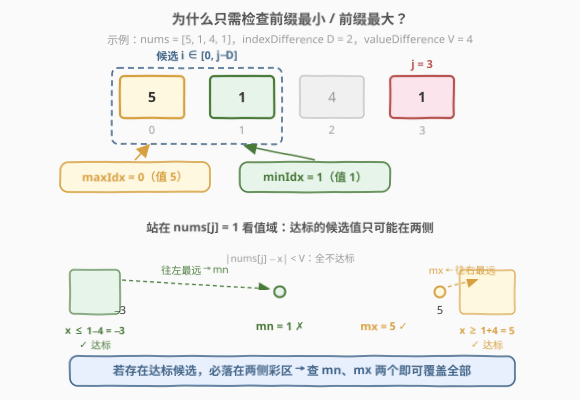
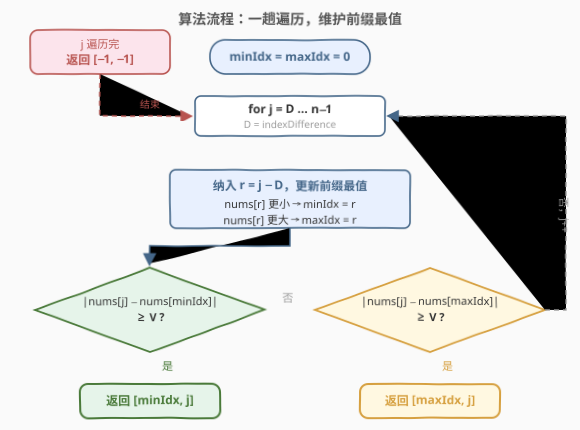
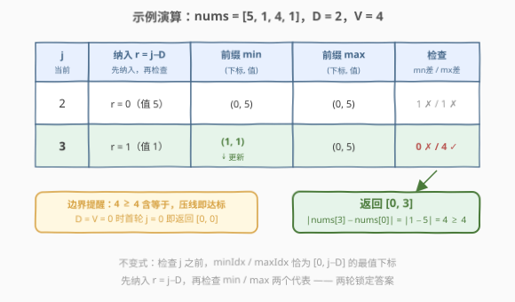

# LeetCode 找出满足差值条件的下标 II 题解

## 1. 题目概述

- **标题 / 题号**：找出满足差值条件的下标 II（#2905，medium）
- **链接**：https://leetcode.cn/problems/find-indices-with-index-and-value-difference-ii/
- **难度**：中等
- **标签**：数组、前缀最值、一次遍历

**题意**：给你一个下标从 **0** 开始、长度为 $n$ 的整数数组 `nums`，以及整数 `indexDifference` 和整数 `valueDifference`。

你的任务是从范围 $[0, n - 1]$ 内找出 **2** 个满足下述所有条件的下标 $i$ 和 $j$：

- $\text{abs}(i - j) \ge \text{indexDifference}$，且
- $\text{abs}(\text{nums}[i] - \text{nums}[j]) \ge \text{valueDifference}$。

返回整数数组 `answer`。如果存在满足题目要求的两个下标，则 `answer = [i, j]`；否则，`answer = [-1, -1]`。如果存在多组可供选择的下标对，只需要返回其中任意一组即可。

**注意**：$i$ 和 $j$ 可能**相等**。

**示例 1**：

```text
输入：nums = [5,1,4,1], indexDifference = 2, valueDifference = 4
输出：[0,3]
解释：可以选择 i = 0 和 j = 3。
abs(0 - 3) >= 2 且 abs(nums[0] - nums[3]) >= 4。
因此，[0,3] 是一个符合题目要求的答案。[3,0] 也是符合题目要求的答案。
```

**示例 2**：

```text
输入：nums = [2,1], indexDifference = 0, valueDifference = 0
输出：[0,0]
解释：可以选择 i = 0 和 j = 0。
abs(0 - 0) >= 0 且 abs(nums[0] - nums[0]) >= 0。
因此，[0,0] 是一个符合题目要求的答案。[0,1]、[1,0] 和 [1,1] 也是符合题目要求的答案。
```

**示例 3**：

```text
输入：nums = [1,2,3], indexDifference = 2, valueDifference = 4
输出：[-1,-1]
解释：可以证明无法找出 2 个满足所有条件的下标。因此，返回 [-1,-1]。
```

**约束**：

- $1 \le n = \text{nums.length} \le 10^5$
- $0 \le \text{nums}[i] \le 10^9$
- $0 \le \text{indexDifference} \le 10^5$
- $0 \le \text{valueDifference} \le 10^9$

> 💡 本题核心是「**前缀最值 + 一趟遍历**」。下标约束 $\text{abs}(i - j) \ge D$（记 $D = \text{indexDifference}$）意味着对每个 $j$，合法的 $i$ 落在 $[0, j - D]$ 中——一个随 $j$ 右移**单调扩张**的候选集。而判定「候选集中是否存在与 $\text{nums}[j]$ 差值 $\ge V$ 的元素」，只需检查候选集的**最小值**和**最大值**两个代表：达标的值必然落在 $\text{nums}[j] \pm V$ 两侧，两侧最远的代表恰是 min/max。两个变量增量维护前缀最值，$O(n)$ 时间、$O(1)$ 空间一趟搞定。

## 2. 解题思路

### 2.1 暴力思路：枚举所有数对

双重循环枚举所有 $(i, j)$ 对，逐一检查两个约束：

```text
for i in 0..n-1:
    for j in 0..n-1:
        if abs(i-j) >= D and abs(nums[i]-nums[j]) >= V:
            return [i, j]
return [-1, -1]
```

时间 $O(n^2)$。当 $n = 10^5$ 时约 $10^{10}$ 次检查，**必然超时**。

> ⚠️ 本题是 [2903. 找出满足差值条件的下标 I](https://leetcode.cn/problems/find-indices-with-index-and-value-difference-i/) 的强化版：I 版 $n \le 100$，$O(n^2)$ 暴力可过；II 版 $n \le 10^5$，必须优化到 $O(n)$ 或 $O(n \log n)$。这是 LeetCode 常见的「双版本出题」模式——同一题面、不同数据范围，逼你写出可扩展的解法。

### 2.2 核心观察：前缀最值——只需检查两个极端代表

关键观察来自**对称化简 + 候选集单调扩张 + 夹逼判定**：

1. **对称化简**：$\text{abs}(i - j) \ge D$ 是对称的，不妨只考虑 $i \le j - D$（即枚举 $j$，$i$ 落在 $[0, j - D]$）。

2. **候选集单调扩张**：$j$ 从 $D$ 递增到 $n - 1$ 时，每次只有一个新元素 $\text{nums}[j - D]$ 加入候选集——**只增不减**。

3. **夹逼判定（关键定理）**：对候选集中任意值 $x$，

   $$\text{abs}(\text{nums}[j] - x) \ge V \iff x \le \text{nums}[j] - V \ \text{或}\ x \ge \text{nums}[j] + V$$

   设 $mn$、$mx$ 为候选集的最小值、最大值：

   - 若 $mn \le \text{nums}[j] - V$ 或 $mx \ge \text{nums}[j] + V$，则**存在**达标候选（$mn$、$mx$ 自身就是候选集中的真实元素）；
   - 否则 $mn > \text{nums}[j] - V$ 且 $mx < \text{nums}[j] + V$，则所有候选 $x \in [mn, mx]$ 都落在开区间 $(\text{nums}[j] - V,\ \text{nums}[j] + V)$ 内，**全不达标**。

   因此「检查所有候选」$\iff$「只检查 $mn$、$mx$ 两个」，充分必要。



> 💡 **直觉**：达标的候选值只可能出现在数轴两侧的「彩区」，而往左走得最远的是最小值、往右走得最远的是最大值——两个极端代表分别探到了两侧的底线。极端值不达标，中间的值更不可能达标。

4. **增量维护**：候选集只增不减，前缀最小/最大值下标可用两个变量 $O(1)$ 增量更新，无需任何高级数据结构。

> 💡 **与 2817 的有趣对照**：同样「下标距离约束 + 值差」，[2817. 限制条件下元素之间的最小绝对差](../2801-2900/2817_限制条件下元素之间的最小绝对差.md) 要找候选集中与目标**最近**的值，需要有序集合 + 二分 $O(n \log n)$；本题要判定是否存在**足够远**（差值 $\ge V$）的值，只需 min/max 两个变量 $O(n)$。「找最远」的信息需求比「找最近」少得多——极端代表就是答案的充分证人。

### 2.3 算法流程图



**完整步骤**：

1. **初始化**：`minIdx = maxIdx = 0`。
2. **遍历** $j$ **从** $D$ **到** $n - 1$：
   - **纳入候选**：令 $r = j - D$，若 $\text{nums}[r] < \text{nums}[\text{minIdx}]$ 则 `minIdx = r`；若 $\text{nums}[r] > \text{nums}[\text{maxIdx}]$ 则 `maxIdx = r`。
   - **检查 min 代表**：若 $\text{abs}(\text{nums}[j] - \text{nums}[\text{minIdx}]) \ge V$，返回 $[\text{minIdx}, j]$。
   - **检查 max 代表**：若 $\text{abs}(\text{nums}[j] - \text{nums}[\text{maxIdx}]) \ge V$，返回 $[\text{maxIdx}, j]$。
3. **遍历结束**：返回 $[-1, -1]$。

> ⚠️ **循环不变式**：每次检查 $j$ 之前，`minIdx` / `maxIdx` 恰为区间 $[0, j - D]$ 的最值下标。因此必须**先纳入 $r = j - D$，再检查**——顺序反了会漏掉下标 $j - D$ 这个候选（详见面试要点第 2 问的反例）。

### 2.4 示例演算

以 `nums = [5, 1, 4, 1]`，$D = 2$，$V = 4$ 为例：



| $j$ | 纳入 $r = j - D$ | 前缀 min（下标, 值） | 前缀 max（下标, 值） | 检查 min：$\text{abs}(\text{nums}[j] - \text{mn})$ | 检查 max：$\text{abs}(\text{nums}[j] - \text{mx})$ | 动作 |
|-----|-----------------|---------------------|---------------------|--------------------------------------------------|--------------------------------------------------|------|
| 2 | $r = 0$（值 5） | (0, 5) | (0, 5) | $\lvert 4 - 5 \rvert = 1 < 4$ ✗ | $\lvert 4 - 5 \rvert = 1 < 4$ ✗ | 继续 |
| 3 | $r = 1$（值 1） | **(1, 1)** ← 更新 | (0, 5) | $\lvert 1 - 1 \rvert = 0 < 4$ ✗ | $\lvert 1 - 5 \rvert = 4 \ge 4$ ✓ | 返回 $[0, 3]$ |

最终返回 `[0, 3]`，与示例 1 一致。注意 $\lvert 1 - 5 \rvert = 4$ 恰好压线 $V = 4$（$\ge$ 含等于）。

> 💡 边界情况 $D = V = 0$（示例 2）：首轮 $j = 0$、$r = 0$，纳入自身后 $\text{abs}(\text{nums}[0] - \text{nums}[0]) = 0 \ge 0$ 成立，直接返回 $[0, 0]$——这正是「$i$ 可以等于 $j$」的体现。

## 3. 参考代码

### C++

```cpp
class Solution {
public:
    vector<int> findIndices(vector<int>& nums, int indexDifference, int valueDifference) {
        int n = nums.size();
        int minIdx = 0, maxIdx = 0;          // 恰为 [0, j - indexDifference] 的最值下标
        for (int j = indexDifference; j < n; j++) {
            int r = j - indexDifference;      // 先纳入新候选 r = j - D
            if (nums[r] < nums[minIdx]) minIdx = r;
            if (nums[r] > nums[maxIdx]) maxIdx = r;
            // 再检查两个极端代表
            if (abs(nums[j] - nums[minIdx]) >= valueDifference) return {minIdx, j};
            if (abs(nums[j] - nums[maxIdx]) >= valueDifference) return {maxIdx, j};
        }
        return {-1, -1};
    }
};
```

### Python

```python
class Solution:
    def findIndices(self, nums: List[int], indexDifference: int, valueDifference: int) -> List[int]:
        min_idx = max_idx = 0                 # 恰为 [0, j - indexDifference] 的最值下标
        for j in range(indexDifference, len(nums)):
            r = j - indexDifference           # 先纳入新候选 r = j - D
            if nums[r] < nums[min_idx]:
                min_idx = r
            if nums[r] > nums[max_idx]:
                max_idx = r
            # 再检查两个极端代表
            if abs(nums[j] - nums[min_idx]) >= valueDifference:
                return [min_idx, j]
            if abs(nums[j] - nums[max_idx]) >= valueDifference:
                return [max_idx, j]
        return [-1, -1]
```

> 💡 两版逻辑完全一致：**先纳入 $r = j - D$ 维护前缀最值，再检查 min/max 两个代表**。差值绝对值的范围是 $[0, 10^9]$，`int` 不会溢出；无需任何高级数据结构，两个下标变量足矣。

## 4. 复杂度分析

| 维度 | 复杂度 | 说明 |
|------|--------|------|
| **时间复杂度** | $O(n)$ | $j$ 从 $D$ 到 $n - 1$ 单趟遍历，每轮纳入 + 两次比较均为 $O(1)$ |
| **空间复杂度** | $O(1)$ | 仅 `minIdx` / `maxIdx` 两个下标变量 |

> ⚠️ $n = 10^5$ 时 $O(n) \approx 10^5$ 次操作，远低于暴力 $O(n^2) = 10^{10}$。相比「预处理前缀 min/max 数组再扫描」的 $O(n)$ 空间写法，边遍历边维护的 $O(1)$ 空间版本更优——hints 中提到的「pre-compute 前缀最值」只是同一思想的静态版本。

## 5. 扩展：「找最远」与「找最近」的信息量之差

本题与一组「候选集上查询」问题形成漂亮的梯度——**查询目标决定了所需的数据结构**：

| 问题 | 需要的信息 | 数据结构 | 复杂度 |
|------|-----------|----------|--------|
| 候选集中是否存在差 $\ge V$ 的值（**本题**） | 极端代表 min / max | 两个变量 | $O(n)$ / $O(1)$ |
| 候选集中与目标的**最近**值（2817） | 全序位置关系 | 有序集合 + 二分 | $O(n \log n)$ / $O(n)$ |
| **固定大小窗口**内的最值（239） | 支持删除的最值 | 单调队列 | $O(n)$ / $O(n)$ |

> 💡 判定「**存在**足够远的值」只需两个极端代表作证人；求「**最近**」则必须知道每个值两侧的邻居，天然需要排序结构。面试中先问自己：查询目标到底需要多少信息？这决定了优化的下界。

若题目进一步改为「返回**所有**满足条件的数对」，则无法 $O(n)$ 完成——满足条件的数对数量本身可达 $O(n^2)$ 个（如全 0 数组、$D = V = 0$），输出规模决定了复杂度下界。但「判定存在 + 输出一组」始终只需本题的 $O(n)$ 扫描。

## 6. 面试要点

1. **为什么只需检查前缀最小和最大两个下标？**

   - 夹逼论证：候选 $x$ 达标 $\iff x \le \text{nums}[j] - V$ 或 $x \ge \text{nums}[j] + V$。若存在达标的 $x$，则 $mn \le x$（往左更远）或 $mx \ge x$（往右更远），故 $mn$ / $mx$ 必达标；反之 $mn$、$mx$ 都是真实候选，检查它们不会误报。两个方向合起来是充分必要条件。

2. **为什么必须「先纳入 $\text{nums}[j - D]$，再检查」？顺序能反吗？**

   - 循环不变式要求检查 $j$ 时 `minIdx` / `maxIdx` 覆盖 $[0, j - D]$。若先检查后纳入，覆盖的是 $[0, j - D - 1]$，恰好漏掉刚「解锁」的候选 $j - D$。反例：`nums = [5, 10, 0]`，$D = 1$，$V = 10$，唯一解是 $[1, 2]$，先查后纳会误返回 $[-1, -1]$。

3. **$i$ 可以等于 $j$ 吗？什么时候出现？**

   - 可以。当 $D = 0$ 且 $V = 0$ 时任意 $[k, k]$ 都合法。算法首轮 $j = 0$、$r = 0$ 纳入自身后 $\text{abs}(0) \ge 0$ 成立，自然返回 $[0, 0]$，无需特判。

4. **本题与 2903（I 版）的区别是什么？**

   - 题面完全相同，仅数据范围不同：I 版 $n \le 100$ 允许 $O(n^2)$ 暴力；II 版 $n \le 10^5$ 必须 $O(n)$ / $O(n \log n)$。面试中先写对 $O(n)$ 版本，顺手说明它同时覆盖两个版本，是更强的答案。

5. **和 2817 对比，为什么「找最远」比「找最近」便宜？**

   - 「是否存在差 $\ge V$」是**判定问题**，min/max 两个极端代表就是充分证人，$O(1)$ 可查；「找最近值」要求出与目标距离的最小值，必须知道候选集的全序结构，$O(\log n)$ 才能定位（有序集合 + `lower_bound` 前后夹击）。查询目标的性质决定数据结构的下限。

> 💡 **一句话总结**：2905 是前缀最值的招牌题——候选集随 $j$ 单调扩张，判定「存在足够远的值」只需前缀 min/max 两个极端代表，两个变量一趟遍历，$O(n)$ 时间 $O(1)$ 空间。

## 同类练习题

| # | 题目 | 与本题的关联 |
|---|------|-------------|
| 2903 | [找出满足差值条件的下标 I](https://leetcode.cn/problems/find-indices-with-index-and-value-difference-i/) | 同题面的弱数据版（$n \le 100$），可先用暴力理解题意，再用本题的 $O(n)$ 解法一并覆盖 |
| 121 | [买卖股票的最佳时机](https://leetcode.cn/problems/best-time-to-buy-and-sell-stock/) | 前缀最小值思想的招牌题——维护「目前为止最小值」逐点比较，与本题维护 minIdx 同骨架 |
| 2817 | [限制条件下元素之间的最小绝对差](https://leetcode.cn/problems/minimum-absolute-difference-between-elements-with-constraint/)（[题解](../2801-2900/2817_限制条件下元素之间的最小绝对差.md)） | 同「下标距离约束」但找**最近**值，需有序集合 + 二分，与本题「找最远只需 min/max」形成绝佳对照 |
| 239 | [滑动窗口最大值](https://leetcode.cn/problems/sliding-window-maximum/) | 候选集为固定大小窗口时的最值维护，窗口有进有出需单调队列，是「只增不减候选集」的进阶版 |
