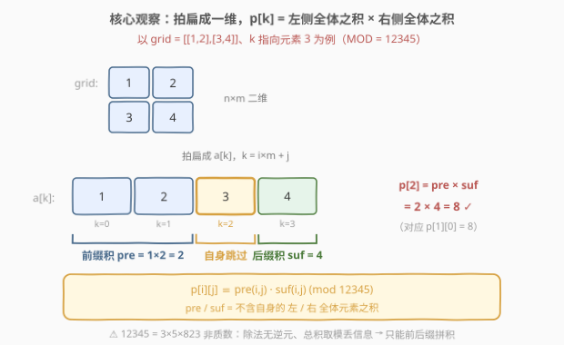
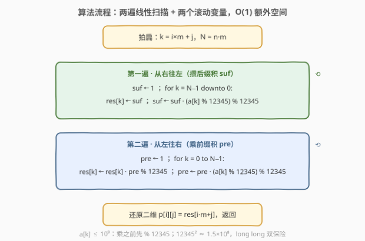
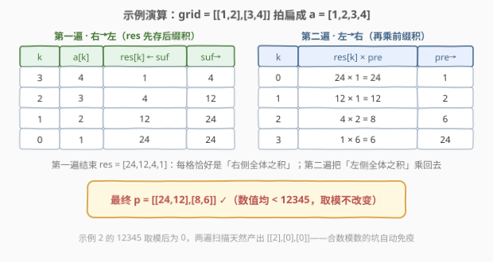

# LeetCode 构造乘积矩阵 题解

## 1. 题目概述

- **标题 / 题号**：构造乘积矩阵（#2906，medium）
- **链接**：https://leetcode.cn/problems/construct-product-matrix/
- **难度**：中等
- **标签**：数组、矩阵、前缀积

**题意**：给你一个下标从 **0** 开始、大小为 $n \times m$ 的二维整数矩阵 `grid`，定义一个下标从 **0** 开始、大小为 $n \times m$ 的二维矩阵 `p`。如果满足以下条件，则称 `p` 为 `grid` 的**乘积矩阵**：

- 对于每个元素 `p[i][j]`，它的值等于**除了 `grid[i][j]` 外所有元素的乘积**，乘积对 $12345$ 取余数。

返回 `grid` 的乘积矩阵。

**示例 1**：

```text
输入：grid = [[1,2],[3,4]]
输出：[[24,12],[8,6]]
解释：
p[0][0] = grid[0][1] * grid[1][0] * grid[1][1] = 2 * 3 * 4 = 24
p[0][1] = grid[0][0] * grid[1][0] * grid[1][1] = 1 * 3 * 4 = 12
p[1][0] = grid[0][0] * grid[0][1] * grid[1][1] = 1 * 2 * 4 = 8
p[1][1] = grid[0][0] * grid[0][1] * grid[1][0] = 1 * 2 * 3 = 6
```

**示例 2**：

```text
输入：grid = [[12345],[2],[1]]
输出：[[2],[0],[0]]
解释：
p[0][0] = 2 * 1 = 2
p[1][0] = 12345 * 1 = 12345，12345 % 12345 = 0
p[2][0] = 12345 * 2 = 24690，24690 % 12345 = 0
```

**约束**：

- $1 \le n = \text{grid.length} \le 10^5$
- $1 \le m = \text{grid}[i].\text{length} \le 10^5$
- $2 \le n \times m \le 10^5$
- $1 \le \text{grid}[i][j] \le 10^9$

> 💡 这就是[除自身以外数组的乘积](../0201-0300/238_除自身以外数组的乘积.md)的**二维 + 取模版**：238 的进阶要求本来就不许用除法，这里模数 $12345$ 还是个**合数**，把除法路线彻底焊死——只剩「前缀积 × 后缀积」一条路。二维只是纸老虎：按行优先拍扁成一维，一切照旧。

## 2. 解题思路

### 2.1 暴力思路：逐格重乘

对每个格子 $(i,j)$，老老实实把其余 $nm-1$ 个数乘一遍再取模，共 $O\big((nm)^2\big)$ 次乘法。$nm = 10^5$ 时约 $10^{10}$ 次，必然超时。

> ⚠️ 想走「先算总乘积，再除以自身」的捷径？在本题**三重**行不通：
>
> 1. **数值爆炸**：$10^5$ 个 $\le 10^9$ 的数相乘约有百万位十进制数字，C++ 存不下；Python 大数能算但代价高昂。
> 2. **模逆元不存在**：模意义下的「除以 $x$」需要 $x$ 的模逆元 $x^{-1} \pmod{12345}$，存在当且仅当 $\gcd(x, 12345) = 1$。而 $12345 = 3 \times 5 \times 823$ 是合数，凡是 $3, 5, 823$ 倍数的元素都没有逆元。
> 3. **信息已丢失**：就算只维护「总积 mod 12345」，示例 2 里总积 $\equiv 0$（含 12345 本身），$0$ 怎么除都还原不回来。更阴险的是零因子还会**分散**：$a_1 = 3,\ a_2 = 5,\ a_3 = 823$ 各自都非 $0 \bmod 12345$，乘起来却 $\equiv 0$——连「数零」都救不了，得按质因子逐个计数，得不偿失。

### 2.2 核心观察：拍扁 + 前缀积 × 后缀积

二维形状对乘积毫无影响——按行优先把 `grid` **拍扁成一维数组** $a[0..N-1]$（$N = nm$，下标 $k = i \times m + j$），问题回归经典形态：

$$p[k] = \underbrace{a[0] \times \cdots \times a[k-1]}_{\text{前缀积 pre}} \times \underbrace{a[k+1] \times \cdots \times a[N-1]}_{\text{后缀积 suf}} \bmod 12345$$

**除自身以外的积 = 左边全体的积 × 右边全体的积**。两个「全体之积」都不包含 $a[k]$ 自己，天然跳过自身——这正是「不用除法」的标准替代方案。



再配上**滚动变量**，连显式的 pre/suf 数组都能省掉：

- 第一遍**从右往左**扫，让 `res[k]` 先装下「右侧全体之积」（后缀积），滚动变量 `suf` 一路乘过去；
- 第二遍**从左往右**扫，把「左侧全体之积」（前缀积）乘进 `res[k]`，滚动变量 `pre` 一路乘过去。

两遍结束，`res` 就是答案；额外空间只有两个变量。

### 2.3 算法流程图



**完整步骤**：

1. **拍扁**：$N = n \times m$，一维下标 $k = i \times m + j$；
2. **第一遍（$k$ 从 $N-1$ 到 $0$）**：`res[k] = suf`，然后 `suf = suf * (a[k] % 12345) % 12345`；
3. **第二遍（$k$ 从 $0$ 到 $N-1$）**：`res[k] = res[k] * pre % 12345`，然后 `pre = pre * (a[k] % 12345) % 12345`；
4. **还原**：$p[i][j] = \text{res}[i \times m + j]$，返回。

### 2.4 示例演算

以示例 1 `grid = [[1,2],[3,4]]` 为例，拍扁后 $a = [1,2,3,4]$。

**第一遍（从右往左，攒后缀积）**：

| $k$ | $a[k]$ | res[k] ← suf | 之后 suf |
|-----|--------|--------------|----------|
| 3 | 4 | 1 | 4 |
| 2 | 3 | 4 | 12 |
| 1 | 2 | 12 | 24 |
| 0 | 1 | 24 | 24 |

**第二遍（从左往右，乘前缀积）**：

| $k$ | res[k] × pre | 之后 pre |
|-----|--------------|----------|
| 0 | 24 × 1 = 24 | 1 |
| 1 | 12 × 1 = 12 | 2 |
| 2 | 4 × 2 = 8 | 6 |
| 3 | 1 × 6 = 6 | 24 |



得到 $[24,12,8,6]$，还原成二维即 `[[24,12],[8,6]]` ✓。示例 2 的 `[[12345],[2],[1]]` 里 $12345$ 取模后变 $0$，两遍扫描自然产出 `[[2],[0],[0]]` ✓——**合数模数的坑被前后缀方案天然免疫**。

## 3. 参考代码

### C++

```cpp
class Solution {
public:
    vector<vector<int>> constructProductMatrix(vector<vector<int>>& grid) {
        const long long MOD = 12345;
        int n = grid.size(), m = grid[0].size(), N = n * m;
        vector<vector<int>> res(n, vector<int>(m));

        long long suf = 1;                          // 右侧全体之积（后缀积）
        for (int k = N - 1; k >= 0; k--) {          // 第一遍：从右往左
            int i = k / m, j = k % m;
            res[i][j] = (int)suf;
            suf = suf * (grid[i][j] % MOD) % MOD;   // a[k] 先取模再乘，防溢出
        }

        long long pre = 1;                          // 左侧全体之积（前缀积）
        for (int k = 0; k < N; k++) {               // 第二遍：从左往右
            int i = k / m, j = k % m;
            res[i][j] = res[i][j] * pre % MOD;      // 乘上前缀积，补全答案
            pre = pre * (grid[i][j] % MOD) % MOD;
        }
        return res;
    }
};
```

### Python

```python
class Solution:
    def constructProductMatrix(self, grid: List[List[int]]) -> List[List[int]]:
        MOD = 12345
        n, m = len(grid), len(grid[0])
        N = n * m
        res = [[0] * m for _ in range(n)]

        suf = 1                                  # 右侧全体之积（后缀积）
        for k in range(N - 1, -1, -1):           # 第一遍：从右往左
            i, j = divmod(k, m)
            res[i][j] = suf
            suf = suf * (grid[i][j] % MOD) % MOD

        pre = 1                                  # 左侧全体之积（前缀积）
        for k in range(N):                       # 第二遍：从左往右
            i, j = divmod(k, m)
            res[i][j] = res[i][j] * pre % MOD
            pre = pre * (grid[i][j] % MOD) % MOD
        return res
```

> 💡 两个实现细节：① $a[k] \le 10^9 > 12345$，**乘之前先 % 12345**——此后参与乘法的两个数都 $< 12345$，乘积 $< 12345^2 \approx 1.5 \times 10^8$，C++ 用 `long long` 双保险；② 输出矩阵直接复用为两遍扫描的载体，**额外空间只有 pre/suf 两个变量**。

## 4. 复杂度分析

| 维度 | 复杂度 | 说明 |
|------|--------|------|
| **时间复杂度** | $O(n \times m)$ | 两遍线性扫描，每格常数次乘法与取模 |
| **空间复杂度** | $O(1)$ | 额外空间仅两个滚动变量 pre/suf（返回的 res 按惯例不计入） |

> ⚠️ 对比 2.1：暴力 $O\big((nm)^2\big)$ 在 $nm = 10^5$ 时约 $10^{10}$ 次乘法；前后缀两遍扫描把它压到 $2 \times 10^5$ 次，且没有引入任何显式辅助数组。

## 5. 扩展：如果模数是质数，能除吗？

模数为质数 $P$ 时，「总积 × 逆元」路线**部分可行**：由费马小定理，与 $P$ 互质的 $x$ 满足 $x^{-1} \equiv x^{P-2} \pmod{P}$，用快速幂 $O(\log P)$ 求出，于是 $p[k] = \text{total} \times a[k]^{P-2} \bmod P$，总复杂度 $O(N \log P)$。

但有两点要注意：① 仍有 $a[k] \equiv 0 \pmod{P}$ 的格子没有逆元，需单独统计零的个数做特判（零 $\ge 2$ 个全零、恰 1 个零则只有非零位非零）；② 本题 $12345 = 3 \times 5 \times 823$ 是合数，且「乘积 $\equiv 0$」可由分散在多个元素中的因子 $3, 5, 823$ 凑出，连零计数都不管用——想救只能对三个质因子分别计数剔除，复杂度和代码量都远超两遍扫描。**结论：前后缀方案对任意模数无差别适用，是本题唯一干净解。**

## 6. 面试要点

1. **为什么「总积 ÷ 自身」在本题彻底不可行？**

   三重障碍：数值上，$10^5$ 个 $\le 10^9$ 的数之积有百万位，存不下；模运算上，除法需要模逆元，而 $12345 = 3 \times 5 \times 823$ 非质数，与模数不互素的元素没有逆元；信息上，总积取模后为 $0$ 时（零因子还可分散在多个元素中）根本无法还原。

2. **前缀积 × 后缀积为什么天然避开自身？**

   $p[k] = a[0..k-1]$ 之积 $\times$ $a[k+1..N-1]$ 之积，两个因子都不含 $a[k]$，乘起来恰好是「除自身以外的全体之积」——把「除法」改写成「前后缀拆解」的标准手法。

3. **两遍扫描分别做什么？为什么 res 可以复用？**

   第一遍从右往左把「右侧全体之积」写进 res；第二遍从左往右把「左侧全体之积」乘上去。第二次只读第一次的结果再乘，互不冲突；配合两个滚动变量，无需显式 pre[]/suf[] 数组，额外空间 $O(1)$。

4. **二维怎么处理？取模细节在哪？**

   按行优先拍扁成一维，$k = i \times m + j$——乘积与二维形状无关。取模细节：$a[k]$ 可达 $10^9$，**乘之前先 % 12345**；此后两操作数均 $< 12345$，乘积 $< 1.5 \times 10^8$，C++ 中 `long long` 安全（`int` 勉强够但别赌）。

5. **与 238 题的区别是什么？**

   238 是一维、结果在整数域（藏着 32 位溢出陷阱）；本题是二维 + 模合数。核心套路完全同源（238 的进阶版本来也禁用除法），本题只是把「禁除法」从题目偏好升级成了**数学上的必然**。

> 💡 **一句话总结**：拍扁成一维，除自身以外的积 = 前缀积 × 后缀积；模数 12345 是合数封死除法，两遍扫描 + 两个滚动变量，$O(nm)$ 时间 / $O(1)$ 额外空间收工。

## 同类练习题

| # | 题目 | 与本题的关联 |
|---|------|-------------|
| 238 | [除自身以外数组的乘积](../0201-0300/238_除自身以外数组的乘积.md) | 本题的一维无模版母题，O(1) 额外空间的两遍扫描写法完全同源 |
| 1652 | [拆炸弹](../1601-1700/1652_拆炸弹.md) | 同款「前后缀拼出除自身区间的聚合值」，聚合运算从乘积换成求和（且带环形偏移） |
| 1310 | [子数组异或查询](../1301-1400/1310_子数组异或查询.md) | 前缀思想的姊妹篇——异或的自逆性让「前缀异或相消」成立，正好对照乘积为何要走前后缀 |
| 713 | [乘积小于K的子数组](../0701-0800/713_乘积小于K的子数组.md) | 乘积类窗口题，体会「乘积单调增长」与「取模后失去单调性」的差异 |
