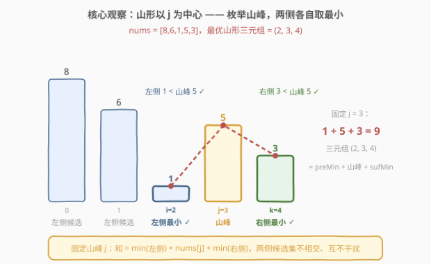
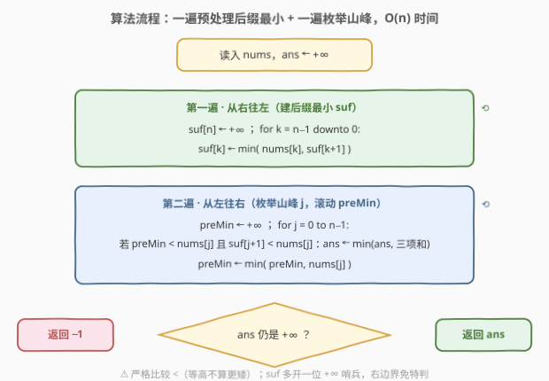
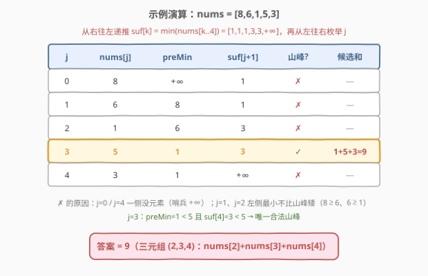

# 元素和最小的山形三元组 I

- **题目名称**：元素和最小的山形三元组 I
- **链接**：[2908. 元素和最小的山形三元组 I](https://leetcode.cn/problems/minimum-sum-of-mountain-triplets-i/)
- **难度**：简单
- **标签**：数组、前后缀最小值、一次遍历

## 1. 题目概述

给你一个下标从 **0** 开始的整数数组 `nums`。

如果下标三元组 `(i, j, k)` 满足下述全部条件，则认为它是一个**山形三元组**：

- `i < j < k`
- `nums[i] < nums[j]` 且 `nums[k] < nums[j]`

请你找出 `nums` 中**元素和最小**的山形三元组，并返回其**元素和**。如果不存在满足条件的三元组，返回 `-1`。

**示例 1**：

```text
输入：nums = [8,6,1,5,3]
输出：9
解释：三元组 (2, 3, 4) 是一个元素和等于 9 的山形三元组，因为：
- 2 < 3 < 4
- nums[2] < nums[3] 且 nums[4] < nums[3]
这个三元组的元素和等于 nums[2] + nums[3] + nums[4] = 9 。可以证明不存在元素和小于 9 的山形三元组。
```

**示例 2**：

```text
输入：nums = [5,4,8,7,10,2]
输出：13
解释：三元组 (1, 3, 5) 是一个元素和等于 13 的山形三元组，因为：
- 1 < 3 < 5
- nums[1] < nums[3] 且 nums[5] < nums[3]
这个三元组的元素和等于 nums[1] + nums[3] + nums[5] = 13 。可以证明不存在元素和小于 13 的山形三元组。
```

**示例 3**：

```text
输入：nums = [6,5,4,3,4,5]
输出：-1
解释：可以证明 nums 中不存在山形三元组。
```

**约束条件**：

- $3 \le \text{nums.length} \le 50$
- $1 \le \text{nums}[i] \le 50$

> 💡 本题与 [2909. 元素和最小的山形三元组 II](https://leetcode.cn/problems/minimum-sum-of-mountain-triplets-ii/) 题面**一字不差**，只有数据范围不同（II 版 $n \le 10^5$、$1 \le \text{nums}[i] \le 10^8$）。I 版是官方留给暴力的活路，II 版逼出线性解。本文直接讲透线性解——它在两题下通用。

---

## 2. 解题思路

### 2.1 暴力思路：三重循环枚举三元组

官方 hint 也明示了：暴力枚举所有三元组。$n \le 50$ 时三元组至多 $\binom{50}{3} \approx 1.96 \times 10^4$ 个，$O(n^3)$ 轻松通过：

```cpp
int minimumSum(vector<int>& nums) {
    int n = nums.size(), ans = INT_MAX;
    for (int i = 0; i < n; i++)
        for (int j = i + 1; j < n; j++)
            for (int k = j + 1; k < n; k++)
                if (nums[i] < nums[j] && nums[k] < nums[j])
                    ans = min(ans, nums[i] + nums[j] + nums[k]);
    return ans == INT_MAX ? -1 : ans;
}
```

但把同一份题面放到 II 版（$n \le 10^5$）下：$O(n^3) \approx 1.7 \times 10^{14}$ 必然超时；退一步的 $O(n^2)$（固定 $j$、左右各扫一遍找最小）也要 $10^{10}$ 次，同样超时。需要一个 $O(n)$ 的解法。

### 2.2 核心观察：枚举山峰 + 左右两侧各自取最小

山形条件 `nums[i] < nums[j] > nums[k]` 的中心是 **$j$——山峰**。换个视角：**枚举 $j$ 当山峰**，而不是枚举三元组。固定 $j$ 之后：

- 最优的 $i$ 一定是 **$j$ 左侧的最小值** $\text{preMin}$（前缀最小）；
- 最优的 $k$ 一定是 **$j$ 右侧的最小值** $\text{sufMin}$（后缀最小）。

两个选择**互不干扰**：$i$ 的候选集 $\{0..j-1\}$ 与 $k$ 的候选集 $\{j+1..n-1\}$ 不相交，`nums[i]` 与 `nums[k]` 之间也没有任何约束，所以「各自取最小」拼起来就是 $j$ 固定时的全局最小：

$$\underbrace{\min_{i<j} \text{nums}[i]}_{\text{preMin}(j)} + \text{nums}[j] + \underbrace{\min_{k>j} \text{nums}[k]}_{\text{sufMin}(j)}$$

而且合法性检查是**免费**的：若 $\text{preMin}(j) \ge \text{nums}[j]$，说明左边全体都不比山峰矮，$j$ 根当不成山峰，直接跳过；右侧同理。



### 2.3 算法流程图

预处理 + 一遍扫描：



**完整步骤**：

1. **从右往左**递推后缀最小数组：$\text{suf}[n] = +\infty$，$\text{suf}[k] = \min(\text{nums}[k], \text{suf}[k+1])$——于是 $\min(\text{nums}[j+1..n-1]) = \text{suf}[j+1]$；
2. **从左往右**枚举山峰 $j$，滚动变量 `preMin` 维护 $\min(\text{nums}[0..j-1])$（初始 $+\infty$）；
3. 若 `preMin < nums[j]` 且 `suf[j+1] < nums[j]`，用 `preMin + nums[j] + suf[j+1]` 更新答案；
4. 处理完 $j$ 后 `preMin = min(preMin, nums[j])`；扫描结束答案仍为 $+\infty$ 则返回 `-1`。

### 2.4 示例演算

以示例 1 `nums = [8,6,1,5,3]` 为例。先从右往左建 `suf`（$\text{suf}[k] = \min(\text{nums}[k..4])$）：$[1,1,1,3,3,+\infty]$，再从左往右枚举山峰：

| $j$ | nums[j] | preMin（左边最小） | suf[j+1]（右边最小） | 山峰成立？ | 候选和 |
|-----|---------|-------------------|---------------------|-----------|--------|
| 0 | 8 | $+\infty$（左边没元素） | 1 | ✗ | — |
| 1 | 6 | 8 | 1 | ✗（$8 \ge 6$） | — |
| 2 | 1 | 6 | 3 | ✗（$6 \ge 1$） | — |
| **3** | **5** | **1** | **3** | **✓（$1 < 5$ 且 $3 < 5$）** | **$1+5+3 = 9$** |
| 4 | 3 | 1 | $+\infty$（右边没元素） | ✗ | — |



答案 $9$ ✓。示例 2 同一流程：`[5,4,8,7,10,2]` 在 $j=2,3,4$ 处分别得候选 $14,13,16$，最小 $13$（即三元组 $(1,3,5)$：$4+7+2$）✓。示例 3 `[6,5,4,3,4,5]` 全程无合法山峰，返回 $-1$ ✓——注意它是「先降后升」的**山谷**，一座山都没有。

---

## 3. 参考代码

### C++

```cpp
class Solution {
public:
    int minimumSum(vector<int>& nums) {
        int n = nums.size();
        vector<int> suf(n + 1, INT_MAX);            // suf[k] = min(nums[k..n-1])，哨兵 suf[n] = +∞
        for (int k = n - 1; k >= 0; k--)
            suf[k] = min(nums[k], suf[k + 1]);

        int ans = INT_MAX, preMin = INT_MAX;        // preMin 滚动维护 = min(nums[0..j-1])
        for (int j = 0; j < n; j++) {
            if (preMin < nums[j] && suf[j + 1] < nums[j])   // 两侧都有更矮的 → j 是合法山峰
                ans = min(ans, preMin + nums[j] + suf[j + 1]);
            preMin = min(preMin, nums[j]);                  // 用完 j 再收编 nums[j]
        }
        return ans == INT_MAX ? -1 : ans;
    }
};
```

### Python

```python
class Solution:
    def minimumSum(self, nums: List[int]) -> int:
        n = len(nums)
        suf = [inf] * (n + 1)                       # suf[k] = min(nums[k:])，哨兵 suf[n] = +∞
        for k in range(n - 1, -1, -1):
            suf[k] = min(nums[k], suf[k + 1])

        ans = pre_min = inf                         # pre_min 滚动维护 = min(nums[:j])
        for j, x in enumerate(nums):
            if pre_min < x and suf[j + 1] < x:      # 两侧都有更矮的 → j 是合法山峰
                ans = min(ans, pre_min + x + suf[j + 1])
            pre_min = min(pre_min, x)               # 用完 j 再收编 nums[j]
        return -1 if ans == inf else ans
```

> 💡 两个细节：① `suf` 多开一位哨兵（$+\infty$），天然覆盖「$j$ 是最后一个元素、右边没元素」的边界，无需特判；② `preMin` 在判定**之后**才用 `nums[j]` 更新，保证它永远只代表 $j$ **严格左侧**的最小值。

---

## 4. 复杂度分析

| 维度 | 复杂度 | 说明 |
|------|--------|------|
| **时间复杂度** | $O(n)$ | 从右往左建 `suf` 一遍 + 从左往右枚举山峰一遍，每步常数次比较 |
| **空间复杂度** | $O(n)$ | 后缀最小数组 `suf`；`preMin` 是滚动变量，只占 $O(1)$ |

> ⚠️ 对比 2.1：本题 $n \le 50$，暴力 $O(n^3)$ 只有约 $2 \times 10^4$ 组三元组，完全够用——线性解的意义在于**原封不动平移到 2909**（$n \le 10^5$）。

---

## 5. 扩展：2909——同一道题，大三个数量级的数据

[2909. 元素和最小的山形三元组 II](https://leetcode.cn/problems/minimum-sum-of-mountain-triplets-ii/) 与本题题面完全相同，约束换成 $3 \le n \le 10^5$、$1 \le \text{nums}[i] \le 10^8$：

| 解法 | 复杂度 | 2909 规模下的运算量 | 结果 |
|------|--------|--------------------|------|
| 三重循环枚举三元组 | $O(n^3)$ | $\approx 1.7 \times 10^{14}$ | 超时 |
| 固定 $j$ 左右各扫一遍 | $O(n^2)$ | $\approx 10^{10}$ | 超时 |
| 前后缀最小值 | $O(n)$ | $\approx 2 \times 10^5$ | 通过 |

上面的参考代码**一字不改**提交 2909 即可通过（元素和上限 $3 \times 10^8 < 2^{31}-1$，`int` 也安全）。这是 LeetCode「I/II 双题」的典型设计：I 版收编暴力选手，II 版检验是否掌握了套路本身。

---

## 6. 面试要点

1. **为什么枚举 $j$（山峰），而不是枚举 $i$ 或 $k$？**

   两个山形条件都以 $j$ 为中心。固定 $j$ 后，$i$ 的约束（左侧更矮）与 $k$ 的约束（右侧更矮）分别只涉及一侧，两侧候选集不相交、互不影响，才能「各自取最小」。若固定 $i$，右侧约束同时耦合 $j$ 和 $k$ 两个自由下标，没有独立子结构。

2. **「两侧各自取最小」为什么不会漏掉最优解？**

   固定 $j$ 时目标是三个独立项之和 $\text{nums}[i] + \text{nums}[j] + \text{nums}[k]$，$i$ 与 $k$ 的取值互不约束，最小化可以拆成两个独立的子问题；且合法条件恰好由「最小值 < 山峰」等价刻画——左侧最小值 $\ge$ 山峰 ⇔ 不存在合法的 $i$，判定零成本。

3. **preMin 用滚动变量、sufMin 却要数组，为什么不对称？**

   枚举 $j$ 是从左往右的：左侧信息「按序到达、用完即弃」，一个滚动变量就够；右侧信息是「未来」，必须先从右往左整体算好存下来（或倒序枚举对称处理）。这与 238 除自身以外数组的乘积的两遍扫描完全同构。

4. **把「严格小于」写成「≤」会错在哪？**

   `preMin < nums[j]` 与 `suf[j+1] < nums[j]` 都必须是**严格**比较。以 `nums = [3,3,3]` 为例：正确答案是 `-1`（不存在严格的山峰）；写成 `<=` 会把等高也当「更矮」，错误地返回 9。

5. **本题暴力就能过，为什么还要讲线性解？**

   面试官真正想考的是数据范围放大后的应对——同一份题面在 2909 放大到 $10^5$ 后连 $O(n^2)$ 都超时。识别「枚举中心 + 前后缀最值」的模式并现场写出 $O(n)$，才是这组双题的考点。

> 💡 **一句话总结**：山形条件以 $j$ 为中心——枚举山峰，左边取前缀最小、右边取后缀最小，合法性由「最小值 < 山峰」免费判定，$O(n)$ 时间收工；暴力只在 I 版的 $n \le 50$ 下够用。

---

## 7. 同类练习题

- [2909. 元素和最小的山形三元组 II](https://leetcode.cn/problems/minimum-sum-of-mountain-triplets-ii/)：同一题面的大数据版（$n \le 10^5$），本文的 $O(n)$ 解法原样平移，暴力全部超时
- [941. 有效的山脉数组](https://leetcode.cn/problems/valid-mountain-array/)：判定整条数组是否为一座山（先严格升后严格降），同款「山峰中心」视角
- [845. 数组中的最长山脉](https://leetcode.cn/problems/longest-mountain-in-array/)：枚举山峰向两侧扩张求最长山脉，山峰中心视角的进阶
- [1671. 得到山形数组的最少删除次数](https://leetcode.cn/problems/minimum-number-of-removals-to-make-mountain-array/)：以每个位置为山峰拼「左 LIS + 右 LDS」求最长山形子序列，山形家族的困难版
