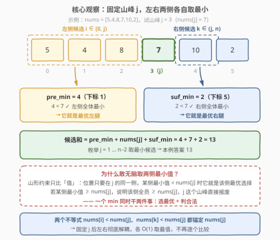
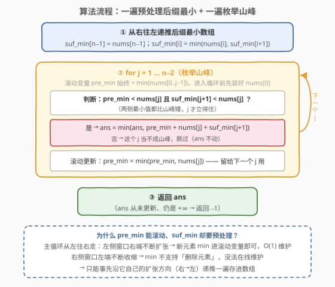
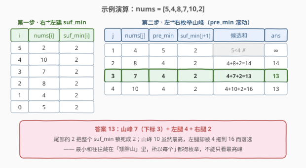

# 元素和最小的山形三元组 II

- **题目名称**：元素和最小的山形三元组 II
- **链接**：[2909. 元素和最小的山形三元组 II](https://leetcode.cn/problems/minimum-sum-of-mountain-triplets-ii/)
- **难度**：中等
- **标签**：数组、前后缀最小值

## 1. 题目概述

给你一个下标从 **0** 开始的整数数组 `nums`。

如果下标三元组 `(i, j, k)` 满足下述全部条件，则认为它是一个**山形三元组**：

- `i < j < k`
- `nums[i] < nums[j]` 且 `nums[k] < nums[j]`

请你找出 `nums` 中**元素和最小**的山形三元组，并返回其**元素和**。如果不存在满足条件的三元组，返回 `-1`。

**示例 1**：

```text
输入：nums = [8,6,1,5,3]
输出：9
解释：三元组 (2, 3, 4) 是一个元素和等于 9 的山形三元组，因为：
- 2 < 3 < 4
- nums[2] < nums[3] 且 nums[4] < nums[3]
这个三元组的元素和等于 nums[2] + nums[3] + nums[4] = 9。可以证明不存在元素和小于 9 的山形三元组。
```

**示例 2**：

```text
输入：nums = [5,4,8,7,10,2]
输出：13
解释：三元组 (1, 3, 5) 是一个元素和等于 13 的山形三元组，因为：
- 1 < 3 < 5
- nums[1] < nums[3] 且 nums[5] < nums[3]
这个三元组的元素和等于 nums[1] + nums[3] + nums[5] = 13。可以证明不存在元素和小于 13 的山形三元组。
```

**示例 3**：

```text
输入：nums = [6,5,4,3,4,5]
输出：-1
解释：可以证明 nums 中不存在山形三元组。
```

**约束条件**：

- $3 \le nums.length \le 10^5$
- $1 \le nums[i] \le 10^8$

> 💡 本题与 [2908. 元素和最小的山形三元组 I](../2901-3000/2908_元素和最小的山形三元组I.md) 题面**一字不差**，差别只在数据范围：I 版 $n \le 50$、$nums[i] \le 50$，$O(n^3)$ 暴力即可；II 版 $n \le 10^5$，把**前后缀分解**从加分项变成生死线。同族套路见 [2874. 有序三元组中的最大值 II](../2801-2900/2874_有序三元组中的最大值II.md)：固定中间的 $j$，两侧约束解耦后各取最值。

---

## 2. 解题思路

### 2.1 暴力思路：枚举三元组 → 枚举山峰，都撞墙

最直接的做法是三重循环枚举 $i \lt j \lt k$，检查两个不等式后更新最小和，$O(n^3)$。$n = 10^5$ 时三元组多达 $\binom{10^5}{3} \approx 1.7 \times 10^{14}$ 个，天文数字。

退一步，**固定山峰 $j$**：左侧扫一遍取满足 $nums[i] \lt nums[j]$ 的最小值，右侧同理，$O(n^2)$。$n = 10^5$ 时约 $10^{10}$ 次比较，依然超时。

> ⚠️ $O(n^2)$ 慢在哪？每个 $j$ 都把左右两侧**重扫一遍**。但注意 $j$ 从左往右移动时：左侧候选集只**扩大**（每右移一格多收一个元素），右侧候选集只**缩小**。**扩张方向的最小值可以滚动维护，收缩方向的最小值必须预处理**——这条分水岭正是 $O(n^2) \to O(n)$ 的全部秘密。

### 2.2 核心观察：固定山峰 j，两侧各自取最小

两个约束 $nums[i] \lt nums[j]$ 与 $nums[k] \lt nums[j]$ 都锚定 $nums[j]$——**固定 $j$ 后，$i$ 与 $k$ 的选择互不干扰**。于是对每个山峰 $j$（$1 \le j \le n-2$）：

$$ans = \min_{1 \le j \le n-2} \Big( \underbrace{\min_{i \lt j} nums[i]}_{\text{pre\_min}} + nums[j] + \underbrace{\min_{k \gt j} nums[k]}_{\text{suf\_min}} \Big)$$

为什么敢直接取两侧的最小值、不管具体下标？

- 山形条件只比较**值**，对位置的唯一要求是「在 $j$ 的同一侧」——某侧的最小值元素天然站在那一侧，谁最小谁就是这条腿的最优选择；
- 合法性判定**顺带完成**：若 $\text{pre\_min} \ge nums[j]$，说明左侧**全体** $\ge nums[j]$，$j$ 这个山峰直接报废，无需逐个检查；右侧同理。

一个 $\min$ 同时干「选最优」和「判合法」两件事，每个 $j$ 的处理从 $O(n)$ 降到 $O(1)$。



### 2.3 算法流程图



**完整步骤**：

1. **预处理**：从右往左递推 $\text{suf\_min}[n-1] = nums[n-1]$，$\text{suf\_min}[i] = \min(nums[i], \text{suf\_min}[i+1])$——沿右侧窗口的**扩张方向**（右→左）一遍算好；
2. **主循环**（$j$ 从 $1$ 到 $n-2$）：滚动变量 $\text{pre\_min}$ 始终等于 $\min(nums[0..j-1])$（进入循环前先装 $nums[0]$）；若 $\text{pre\_min} \lt nums[j]$ 且 $\text{suf\_min}[j+1] \lt nums[j]$，用三元和更新 $ans$；
3. **收尾**：$ans$ 从未更新（仍为 $+\infty$）则返回 $-1$，否则返回 $ans$。

### 2.4 示例演算

以示例 2 `nums = [5,4,8,7,10,2]` 为例。先从右往左建 $\text{suf\_min}$——尾部的 $2$ 一路锁死，整表全是 $2$；再从左往右枚举山峰，$\text{pre\_min}$ 滚动演化：

| $j$ | $nums[j]$ | pre_min（左） | suf_min[j+1]（右） | 山峰成立？ | 候选和 | ans |
|-----|-----------|---------------|--------------------|------------|--------|-----|
| 1 | 4 | 5 | 2 | ✗（$5 \ge 4$） | — | $\infty$ |
| 2 | 8 | 4 | 2 | ✓ | $4+8+2=14$ | 14 |
| **3** | **7** | **4** | **2** | **✓** | **$4+7+2=13$** | **13** |
| 4 | 10 | 4 | 2 | ✓ | $4+10+2=16$ | 13 |



返回 $13$ ✓。注意 $j=4$（山峰 $10$）：山够高，但「左腿」被左侧最小值 $4$ 拖到 $16$ 落选——**最小和往往藏在矮胖的山里**，这正是必须枚举所有 $j$、而不能只看最高峰的原因。示例 3 `[6,5,4,3,4,5]` 是「先降后升」的山谷，任何 $j$ 两侧都凑不齐更矮的腿，全程无更新，返回 $-1$ ✓。

---

## 3. 参考代码

### C++

```cpp
class Solution {
public:
    int minimumSum(vector<int>& nums) {
        int n = nums.size();
        // 后缀最小：sufMin[i] = min(nums[i..n-1])。主循环里右侧窗口只缩不放，必须先算好
        vector<int> sufMin(n);
        sufMin[n - 1] = nums[n - 1];
        for (int i = n - 2; i >= 0; i--) {
            sufMin[i] = min(nums[i], sufMin[i + 1]);
        }

        int ans = INT_MAX;
        int preMin = nums[0];                 // 滚动维护 min(nums[0..j-1])
        for (int j = 1; j < n - 1; j++) {     // 山峰不可能是端点，j ∈ [1, n-2]
            if (preMin < nums[j] && sufMin[j + 1] < nums[j]) {
                ans = min(ans, preMin + nums[j] + sufMin[j + 1]);
            }
            preMin = min(preMin, nums[j]);    // nums[j] 并入左侧，留给下一个 j
        }
        return ans == INT_MAX ? -1 : ans;
    }
};
```

### Python

```python
class Solution:
    def minimumSum(self, nums: List[int]) -> int:
        n = len(nums)
        suf_min = [0] * n                     # suf_min[i] = min(nums[i:])
        suf_min[-1] = nums[-1]
        for i in range(n - 2, -1, -1):
            suf_min[i] = min(nums[i], suf_min[i + 1])

        ans = inf
        pre_min = nums[0]                     # 滚动维护 min(nums[0..j-1])
        for j in range(1, n - 1):             # 山峰 j ∈ [1, n-2]，端点免检
            if pre_min < nums[j] and suf_min[j + 1] < nums[j]:
                ans = min(ans, pre_min + nums[j] + suf_min[j + 1])
            pre_min = min(pre_min, nums[j])
        return -1 if ans == inf else ans
```

> 💡 两个实现细节：① 更新顺序别写反——先用「旧的」pre_min 判 $j$，再把 $nums[j]$ 并进去，并入的是**下一个**山峰的左侧；② 想少操心边界，也可以学[哨兵版](../2901-3000/2908_元素和最小的山形三元组I.md)：$\text{suf\_min}$ 多开一格存 $+\infty$、pre_min 从 $+\infty$ 起步、$j$ 扫满 $[0, n-1]$，端点自动失效，代价是多两个哨兵格子。

---

## 4. 复杂度分析

| 维度 | 复杂度 | 说明 |
|------|--------|------|
| **时间复杂度** | $O(n)$ | 预处理一遍 + 主循环一遍，每个位置常数次比较 |
| **空间复杂度** | $O(n)$ | 一个后缀最小值数组；pre_min 为滚动变量（返回值不计） |

> ⚠️ 对比 2.1：$O(n^3) \approx 1.7 \times 10^{14}$ → $O(n^2) = 10^{10}$ → $O(n) = 2 \times 10^5$ 次比较。数值上三项之和 $\le 3 \times 10^8$，C++ `int`（上限约 $2.1 \times 10^9$）装得下，无需 `long long`。

---

## 5. 扩展：能把 O(n) 空间也省掉吗？

[2874](../2801-2900/2874_有序三元组中的最大值II.md) 的姊妹套路做到了**一次遍历、$O(1)$ 空间**：让每个元素在扫描中依次扮演 $k \to j \to i$，聚合值层层复用（`ans` 用算好的 `max_diff`，`max_diff` 用算好的 `max_prefix`）。它能成立，是因为 $(nums[i] - nums[j]) \times nums[k]$ 中 $k$ 与 $(i, j)$ **没有约束耦合**——任何已聚合的「最优对」都能配任何后来的 $k$。

本题**搬不动这套**。当元素 $x$ 扮演 $k$ 时，可用的只有「$nums[j] \gt x$ 的那些 $(i, j)$ 对」，而「最小二元和」这个聚合值对应的 $j$ 未必满足该条件——约束把 $k$ 和 $j$ **焊在了一起**。一个反例即可看清：假设已聚合出两对候选 $(sum{=}5,\ nums[j]{=}3)$ 与 $(sum{=}6,\ nums[j]{=}100)$，那么 $x=2$ 时最优是 $5$（两对都合法），$x=50$ 时只能是 $6$（第一对的山峰太矮）——单一聚合值无法同时对任意 $x$ 保持正确，两个都留着就不是 $O(1)$ 了。

真想在线回答「$nums[j] \gt x$ 的最小二元和」，需要对值域建树状数组（离散化 + 后缀最小），$O(n \log n)$ 时间换 $O(n)$ 空间——比前后缀分解又慢又难写，得不偿失。**结论：$O(n)$ 时间 / $O(n)$ 空间就是本题的甜点位**；实用小优化只剩「两个数组砍成一个」（前缀改滚动，本文代码已采用）。

---

## 6. 面试要点

1. **为什么固定中间的 j，而不是 i 或 k？**

   两个不等式 $nums[i] \lt nums[j]$、$nums[k] \lt nums[j]$ 都以 $nums[j]$ 为参照物。固定 $j$ 后左右两侧只剩「下标在某一侧」这条天然满足的约束，完全解耦、各取最小；固定 $i$ 或 $k$ 都会留下「另一侧还要和 $j$ 比较」的二维耦合。

2. **为什么两侧直接取最小值就既合法又最优？**

   山形条件只比较值，位置只要同侧。某侧最小值 $m$ 若 $\lt nums[j]$，取它就是该侧最优（和最小）；若 $m \ge nums[j]$，说明该侧全体 $\ge nums[j]$，$j$ 必然无解——一个 $\min$ 同时完成「选最优」与「判合法」。

3. **pre_min 能滚动维护，suf_min 为什么必须预处理？**

   主循环从左往右推进时，左侧窗口右端不断**扩张**，新元素直接 `min` 进滚动变量即可；右侧窗口左端不断**收缩**，而 $\min$ 不支持删除元素，只能事先沿它自己的扩张方向（右→左）递推好存进数组。

4. **和 2908 是什么关系？实现上有什么坑？**

   完全同题，2908 的 $n \le 50$ 容忍 $O(n^3)$，2909 的 $n \le 10^5$ 锁死 $O(n)$。实现坑：① 先判后滚（更新顺序反了会让 $j$ 拿到自己当左腿）；② 和 $\le 3 \times 10^8$，`int` 安全但别再用更窄的类型；③ 全程未更新要返回 `-1` 而非 $+\infty$。

5. **2874 的 O(1) 单遍扫描为什么互通不了？**

   2874 的目标函数中 $k$ 与 $(i,j)$ 无耦合，聚合值可跨阶段复用；本题的 $nums[k] \lt nums[j]$ 把 $k$ 与 $j$ 耦合，「最小二元和」的聚合值无法对任意 $nums[k]$ 保持正确。强行在线化需要值域树状数组，$O(n \log n)$ 反而更差——**能聚合的前提是无耦合**，这是前缀技巧迁移时的分界线。

> 💡 **一句话总结**：固定山峰 $j$，左腿取前缀最小、右腿取后缀最小，一个 $\min$ 同时管「最优」与「合法」；预处理后缀数组 + 滚动前缀变量，$O(n)$ 时间一遍收工。

---

## 7. 同类练习题

- [2908. 元素和最小的山形三元组 I](../2901-3000/2908_元素和最小的山形三元组I.md)：同一道题的小数据版（$n \le 50$），$O(n^3)$ 也能过，可对照体会数据范围如何逼出前后缀分解
- [2874. 有序三元组中的最大值 II](../2801-2900/2874_有序三元组中的最大值II.md)：同款「固定中间 $j$、两侧解耦取最值」，且目标无耦合 → 可压成 $O(1)$ 空间单遍扫描，与本题形成鲜明对照
- [42. 接雨水](../0001-0100/42_接雨水.md)：前后缀最值分解的祖师爷（前缀/后缀最大值定水位），同一套「两侧信息预处理」思想的 max 版
- [941. 有效的山脉数组](../0901-1000/941_有效的山脉数组.md)：山形结构的判定版——整条数组只有一座山，先上山后下山的双指针扫描
- [1671. 得到山形数组的最少删除次数](../1601-1700/1671_得到山形数组的最少删除次数.md)：山形的构造版——左右各跑一遍 LIS，让删除后剩下的山脊尽量高
