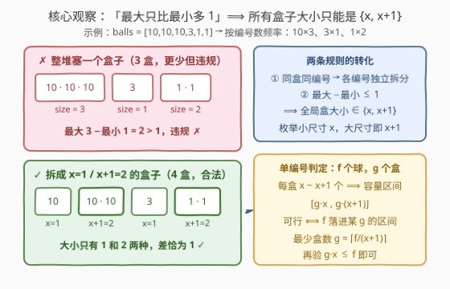
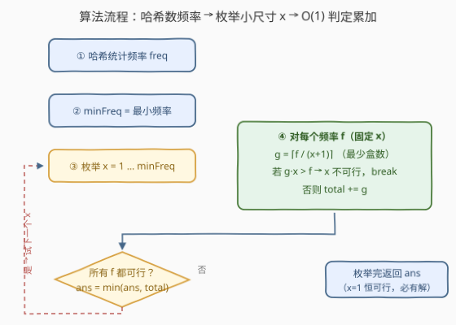
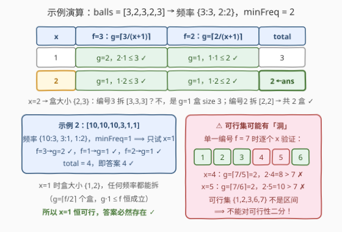

# 合法分组的最少组数

- **题目名称**：合法分组的最少组数
- **链接**：[2910. 合法分组的最少组数](https://leetcode.cn/problems/minimum-number-of-groups-to-create-a-valid-assignment/)
- **难度**：中等
- **标签**：贪心、数组、哈希表

## 1. 题目概述

给你一组带编号的 balls，要求将它们分类到盒子里，以便均衡地分配。必须遵守两条规则：

1. **同一个盒子里的球必须具有相同的编号**。但如果有多个相同编号的球，可以把它们放在不同的盒子里；
2. **最大的盒子只能比最小的盒子多一个球**（即所有盒子的大小至多两档，且两档恰好相差 1）。

返回遵循上述规则排列这些球所需要的**盒子的最小数目**。

**示例 1**：

```text
输入：balls = [3,2,3,2,3]
输出：2
解释：分组方案（中括号内为编号）：
- [3,3,3]
- [2,2]
两个盒子的大小差为 1，没有超过 1。
```

**示例 2**：

```text
输入：balls = [10,10,10,3,1,1]
输出：4
解释：分组方案：
- [10]
- [10,10]
- [3]
- [1,1]
无法用少于 4 个盒子满足规则。例如把三个 10 全放一个盒子，
盒子大小 3 与 1 相差 2，违反规则 2。
```

**约束条件**：

- $1 \le \text{balls.length} \le 10^5$
- $1 \le \text{balls[i]} \le 10^9$

> 💡 本题核心是「**哈希数频率 + 枚举组大小 + O(1) 数学判定**」。两个关键观察：规则 1 使**各编号的拆分互相独立**；规则 2 使**全局盒大小只能是 $\{x, x+1\}$ 两档**。于是枚举小档 $x$，对每个频率 $f$ 用「容量区间 $[gx, g(x+1)]$ 是否包含 $f$」一次判定可行性并求出该编号的最少盒数，全部累加取最小即可。

---

## 2. 解题思路

### 2.1 暴力思路：枚举组大小 + 逐盒贪心装

先用哈希表统计每个编号的出现次数 $f$。由规则 2，所有盒大小 ∈ $\{x, x+1\}$，直觉做法是枚举 $x$（最多到最小频率），对每个编号的 $f$ 个球**模拟装盒**：每次尽量装 $x+1$ 个、不足再装 $x$ 个……逐盒试出一种拆分。单次模拟 $O(f/x)$，整体 $O(n \cdot \text{minFreq})$ 量级，且实现绕、边界多（最后剩下不足 $x$ 个球时要回拆前面的盒子补齐）。

我们希望对每个 $(f, x)$ 用**一次算术**直接回答：能不能拆？最少几个盒子？

### 2.2 核心观察：各编号独立 + 盒大小两档 + 容量区间判定

**观察 1（规则 1 ⟹ 各编号独立拆分）**：盒子不能混编号，所以每个编号的球只在自己的盒子间分配，编号之间互不影响——总盒数 = 各编号盒数之和。全局只要保证**所有编号共用同一组尺寸档位** $\{x, x+1\}$ 即可。

**观察 2（规则 2 ⟹ 尺寸只有两档）**：设最小盒大小为 $x$，则最大盒大小 ≤ $x+1$，即所有盒大小 ∈ $\{x, x+1\}$。反过来，只要全部盒大小都在 $\{x, x+1\}$ 内（且两种都出现时），最大 − 最小 = 1，自动合法。**于是问题变为：枚举 $x$，检查每个频率能否拆成若干个 $x$ 与 $x+1$ 之和，并最小化总盒数。**

**观察 3（容量区间判定，对应官方 hint 4）**：固定 $x$，某编号有 $f$ 个球，设用 $g$ 个盒子、其中 $p$ 个装 $x$ 个、$q$ 个装 $x+1$ 个（$p + q = g$），则

$$
px + q(x+1) = f \iff f = gx + q,\quad 0 \le q \le g
$$

即 $g$ 个盒子能装的球数恰能取遍区间 $[\,gx,\ g(x+1)\,]$ 中的每个整数（$q$ 从 0 到 $g$ 逐一对应）。因此：

- **可行 ⟺ 存在 $g$ 使 $gx \le f \le g(x+1)$**，即 $\lceil f/(x+1) \rceil \le \lfloor f/x \rfloor$；
- **最少盒数 $g_{\min} = \lceil f/(x+1) \rceil$**（盒越少需要的下限越高，直接取下界并验证 $g_{\min} \cdot x \le f$）。

这与官方 hint 的 $a = \lfloor f/(x+1) \rfloor,\ b = f \bmod (x+1)$ 公式完全等价：$b = 0$ 时 $g = a$；$b > 0$ 时 $g = a + 1$，可行性条件 $g \cdot x \le f$ 展开后正是 $x - b \le a$。



**枚举范围**：任何盒子至少装 $x$ 个球，而每个编号至少占一个盒子，故 $x \le f$ 对所有编号成立 ⟹ $x \le \text{minFreq}$（最小频率）。而 $x = 1$（盒大小 $\{1,2\}$）时 $g = \lceil f/2 \rceil \le f$ 恒成立，**任何频率都可拆**——所以答案必然存在，枚举 $x \in [1, \text{minFreq}]$ 完备。

> 💡 一句话：**同盒同编号 ⟹ 各编号独立**；**最大 − 最小 ≤ 1 ⟹ 全局尺寸 $\{x, x+1\}$**；**$g$ 个盒的容量恰是连续区间 $[gx, g(x+1)]$** ⟹ $g_{\min} = \lceil f/(x+1) \rceil$，一次乘法验证可行性。

### 2.3 算法流程图



**完整步骤**：

1. 遍历 `balls`，哈希表统计每个编号的频率 `freq`，同时求出最小频率 `minFreq`
2. 枚举小档尺寸 `x = 1 … minFreq`（大档自动为 `x + 1`）
3. 对每个频率 `f`：计算 `g = (f + x) / (x + 1)`（即 $\lceil f/(x+1) \rceil$ 的整数写法）
4. 若 `g * x > f`：该 `x` 不可行，跳出本轮回合
5. 否则累加 `total += g`；全部频率可行时用 `total` 更新答案
6. 枚举结束返回最小 `total`（`x = 1` 恒可行，答案必有）

### 2.4 示例演算

以示例 1 `balls = [3,2,3,2,3]` 为例：频率 $\{3{:}3,\ 2{:}2\}$，$\text{minFreq} = 2$，只需检查 $x = 1, 2$：

| $x$ | 盒大小 | $f=3$：$g=\lceil 3/(x{+}1)\rceil$，验 $gx \le 3$ | $f=2$：$g=\lceil 2/(x{+}1)\rceil$，验 $gx \le 2$ | total |
|-----|--------|--------------------------------------------------|--------------------------------------------------|-------|
| 1 | {1,2} | $g=2$，$2 \times 1 = 2 \le 3$ ✓ | $g=1$，$1 \le 2$ ✓ | 3 |
| 2 | {2,3} | $g=1$，$1 \times 2 = 2 \le 3$ ✓（盒 `[3,3,3]`） | $g=1$，$1 \times 2 = 2 \le 2$ ✓（盒 `[2,2]`） | **2 ← 答案** |

返回 2，与官方答案一致 ✓。示例 2 频率 $\{10{:}3,\ 3{:}1,\ 1{:}2\}$，$\text{minFreq} = 1$，只能 $x = 1$：$g$ 分别为 $2, 1, 1$，共 4 盒 ✓。



> ⚠️ 注意可行集合关于 $x$ **不是连续区间**：单一编号 $f = 7$ 时可行集为 $\{1,2,3,6,7\}$（$x{=}4$：$g=2, 2 \times 4 = 8 > 7$ ✗；$x{=}5$：$g=2, 10 > 7$ ✗），中间有洞——**不能对可行性二分**，老老实实枚举。

---

## 3. 参考代码

### C++

```cpp
class Solution {
public:
    int minGroupsForValidAssignment(vector<int>& balls) {
        unordered_map<int, int> freq;
        for (int b : balls) freq[b]++;

        int minFreq = INT_MAX;
        for (auto& [num, f] : freq) minFreq = min(minFreq, f);

        int ans = INT_MAX;
        for (int x = 1; x <= minFreq; x++) {          // 小档 x / 大档 x+1
            int total = 0;
            bool ok = true;
            for (auto& [num, f] : freq) {
                int g = (f + x) / (x + 1);            // g = ceil(f/(x+1))，该编号最少盒数
                if (1LL * g * x > f) {                // g 个盒最少装 gx 个，装不下 → x 不可行
                    ok = false;
                    break;
                }
                total += g;
            }
            if (ok) ans = min(ans, total);
        }
        return ans;                                   // x=1 恒可行，ans 必被更新
    }
};
```

### Python

```python
class Solution:
    def minGroupsForValidAssignment(self, balls: List[int]) -> int:
        freq = Counter(balls)
        min_freq = min(freq.values())

        ans = inf
        for x in range(1, min_freq + 1):              # 小档 x / 大档 x+1
            total, ok = 0, True
            for f in freq.values():
                g = (f + x) // (x + 1)                # g = ceil(f/(x+1))，该编号最少盒数
                if g * x > f:                         # g 个盒最少装 gx 个，装不下 → x 不可行
                    ok = False
                    break
                total += g
            if ok:
                ans = min(ans, total)
        return ans                                    # x=1 恒可行，ans 必被更新
```

> 💡 两版逻辑完全一致。细节提醒：① `(f + x) / (x + 1)` 是 $\lceil f/(x+1) \rceil$ 的整数写法（分子加「分母减一」）；② 判定用 `g * x > f` 而非 `g * (x+1) < f`——后者恒不成立（$g$ 本来就是按上界除出来的），真正的约束在下界；③ C++ 中 `g * x` 理论上界约 $f + x \le 2 \times 10^5$ 不溢出，写 `1LL` 仅为防御性习惯。

---

## 4. 复杂度分析

| 维度 | 复杂度 | 说明 |
|------|--------|------|
| **时间复杂度** | $O(n)$ | 统计频率 $O(n)$；设不同编号数 $k$、最小频率 $m$，枚举与检查共 $k \cdot m$ 次。每个频率 $\ge m$，故 $k \cdot m \le \sum f = n$，总计线性 |
| **空间复杂度** | $O(k)$ | 哈希表存 $k$ 个编号的频率，$k \le n$ |

> ⚠️ 复杂度的关键在「**乘积封顶**」：$k \cdot m \le n$ 说明「编号多 ⟹ 最小频率小」「最小频率大 ⟹ 编号少」二者此消彼长，枚举总量恒不超过 $n$，这是本题把双重枚举做到线性的精髓（与计数排序的桶论证同款套路）。

---

## 5. 扩展：从大到小枚举，首个可行即答案

$\text{total}(x) = \sum_f \lceil f/(x+1) \rceil$ 的每一项都随 $x$ 增大**单调不增**，所以 $\text{total}(x)$ 本身关于 $x$ 单调不增。结合 2.4 的结论「可行集可能有洞、但洞不影响单调性」可知：**所有可行 $x$ 中，total 最小的就是最大的那个可行 $x$**。于是可以从 $x = \text{minFreq}$ 向下枚举，**第一个可行的 $x$ 直接返回**：

```cpp
for (int x = minFreq; x >= 1; x--) {
    int total = 0;
    bool ok = true;
    for (auto& [num, f] : freq) {
        int g = (f + x) / (x + 1);
        if (1LL * g * x > f) { ok = false; break; }
        total += g;
    }
    if (ok) return total;          // 最大可行 x，total 已是全局最小
}
```

最坏复杂度不变（一路失败到 $x=1$），但当最小频率远大于最优 $x$ 时能提前终止，实测常数更优。另可加一个下界剪枝：$\text{total} \ge \lceil n/(x+1) \rceil$，一旦不小于当前 `ans` 即可跳出本轮回合。

> 💡 为什么不能二分？因为「可行性」关于 $x$ 不单调（$f{=}7$ 的可行集 $\{1,2,3,6,7\}$ 中间有洞），二分的前提被破坏；而「total 大小」关于 $x$ 单调，所以线性从大到小扫描 + 首个可行即停是安全且更快的替代。

---

## 6. 面试要点

1. **为什么所有盒子大小只能是 $\{x, x+1\}$ 两档？**

   - 设最小盒大小为 $x$，规则「最大只比最小多 1」⟹ 最大盒 ≤ $x + 1$，即全部盒大小 ∈ $\{x, x+1\}$；反之全在 $\{x, x+1\}$ 内的方案自动满足规则。两档取值让「均衡分配」变成可枚举的离散结构。

2. **为什么各编号可以独立拆分？**

   - 规则 1 禁止混编号，每个编号的球只在自家盒子间分配；规则 2 只约束盒子大小的全局两档一致性。所以只要所有编号共用同一个 $x$，各编号内部怎么拆互不干扰，总盒数就是简单求和。

3. **单个频率 $f$ 的最少盒数公式怎么来的？**

   - $g$ 个盒、每盒 $x$ 或 $x+1$ 个，可装球数恰为区间 $[gx, g(x+1)]$ 中的每个整数（设有 $q$ 个 $x{+}1$ 盒，则总数 $= gx + q$，$q \in [0, g]$ 连续取值）。于是 $g_{\min} = \lceil f/(x+1) \rceil$，可行 ⟺ $g_{\min} \cdot x \le f$，等价于官方 hint 的 $x - b \le a$。

4. **枚举范围为什么是 $[1, \text{minFreq}]$？答案为什么一定存在？**

   - 上界：每盒至少 $x$ 个球而每编号至少一盒 ⟹ $x \le \min f$。存在性：$x = 1$（盒大小 $\{1,2\}$）时 $g = \lceil f/2 \rceil \le f$ 恒成立，任何频率都能拆，所以枚举必有命中，不需要无解分支。

5. **能否对 $x$ 二分可行性？**

   - 不能。可行性关于 $x$ 不单调：$f = 7$ 时可行集为 $\{1,2,3,6,7\}$，$x=4,5$ 不可行但 $x=6$ 可行。但 $\text{total}(x)$ 单调不增，因此「最大的可行 $x$」即最优解——从 $\text{minFreq}$ 向下枚举、首个可行即返回是安全的常数优化。

> 💡 **一句话总结**：同盒同编号 ⟹ 按频率独立拆；最大 − 最小 ≤ 1 ⟹ 尺寸两档 $\{x, x+1\}$；$g$ 盒容量是连续区间 $[gx, g(x+1)]$ ⟹ $g_{\min} = \lceil f/(x+1) \rceil$ 一次乘法判定——枚举 $x$ 累加取最小，$k \cdot m \le n$ 撑起线性复杂度。

---

## 7. 同类练习题

- [2244. 完成所有任务需要的最少轮数](https://leetcode.cn/problems/minimum-rounds-to-complete-all-tasks/)（[题解](../2201-2300/2244_完成所有任务需要的最少轮数.md)）：同为「频率拆成 2 与 3」的判定结构，本题是其「拆成 $x$ 与 $x+1$ 且要枚举 $x$」的泛化版
- [2870. 使数组为空的最少操作次数](https://leetcode.cn/problems/minimum-number-of-operations-to-make-array-empty/)（[题解](../2801-2900/2870_使数组为空的最少操作次数.md)）：哈希数频率 + 按余数分类判定可行性，与本题单频率判定同款思维
- [2856. 删除数对后的最小数组长度](https://leetcode.cn/problems/minimum-array-length-after-pair-removals/)（[题解](../2801-2900/2856_删除数对后的最小数组长度.md)）：计数 + 数学结论取代模拟，体会「先数频率再一步判定」的套路
- [1647. 字符频次唯一的最小删除次数](https://leetcode.cn/problems/minimum-deletions-to-make-character-frequencies-unique/)（[题解](../1601-1700/1647_字符频次唯一的最小删除次数.md)）：对频率集合做全局约束的贪心，与本题「全局共用两档尺寸」的约束视角互为对照
