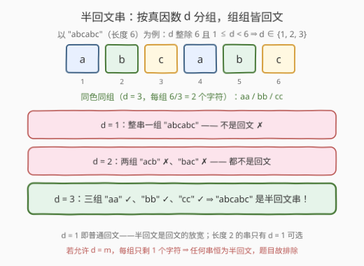
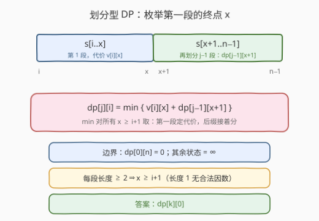
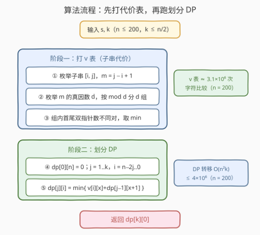
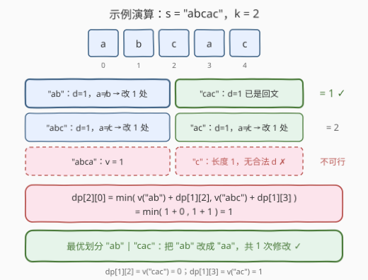

# 得到 K 个半回文串的最少修改次数

- **题目名称**：得到 K 个半回文串的最少修改次数
- **链接**：[2911. 得到 K 个半回文串的最少修改次数](https://leetcode.cn/problems/minimum-changes-to-make-k-semi-palindromes/)
- **难度**：困难
- **标签**：字符串、动态规划、双指针

## 1. 题目概述

给你一个字符串 `s` 和一个整数 `k`，请将 `s` 划分为 `k` 个**非空子串**，使得将每个子串变为**半回文串**所需的字符修改次数之和最小。返回所需的**最少**字符修改次数。

**半回文串**的判定方法：

1. 选择串长 $m$ 的一个正因数 $d$，要求 $1 \le d < m$，即**严格小于**串长。因此长度为 1 的串不存在合法因数——它不是半回文串；
2. 按步长 $d$ 的重复模式分组：第 1 组由位置 $1, 1+d, 1+2d, \dots$ 上的字符组成，第 2 组由位置 $2, 2+d, \dots$ 组成，以此类推（$d$ 整除 $m$ 保证每组恰好 $m/d$ 个字符）；
3. 如果**每一组**各自都是回文串，则原串是半回文串。

以 `"abcabc"`（长度 6）为例：合法因数 $d \in \{1, 2, 3\}$。$d=1$ 时整串一组 `"abcabc"` 不是回文；$d=2$ 时两组 `"acb"`、`"bac"` 都不是回文；$d=3$ 时三组 `"aa"`、`"bb"`、`"cc"` 都是回文——所以 `"abcabc"` 是半回文串。

**示例 1**：

```text
输入：s = "abcac", k = 2
输出：1
解释：划分为 "ab" 和 "cac"。"cac" 已是半回文串；"ab" 改成 "aa" 后，d = 1 时成为半回文串。
```

**示例 2**：

```text
输入：s = "abcdef", k = 2
输出：2
解释：划分为 "abc" 和 "def"，各需修改 1 个字符。
```

**示例 3**：

```text
输入：s = "aabbaa", k = 3
输出：0
解释：划分为 "aa"、"bb"、"aa"，它们都已是半回文串。
```

**约束条件**：

- $2 \le \text{s.length} \le 200$
- $1 \le k \le \text{s.length} / 2$
- `s` 仅由小写英文字母组成

> 💡 本题是两层子问题的叠加：**① 子串级**——某个子串变成半回文串的最少修改次数 $v$（枚举长度真因数 $d$ 分组 + 组内首尾双指针配对）；**② 全局级**——把 $s$ 划分成 $k$ 段、总代价最小的**划分型 DP**。结构上正是 1278「分割回文串 III」的推广：把「回文」放宽成了「半回文」。

---

## 2. 解题思路

### 2.1 暴力思路：枚举所有切法

在 $n-1$ 个缝隙里选 $k-1$ 个切点，共 $\binom{n-1}{k-1}$ 种划分，每种再逐段计算代价。$n = 200, k = 100$ 时组合数是天文数字；更糟的是，不同划分会**反复重算同一段子串的代价**。

关键拆解：无论怎么划分，总代价 $= \sum_{\text{各段}} \text{代价}(\text{段})$，而**每段的代价只取决于这段子串自身的内容，与划分方式无关**。于是原问题拆成两个彼此独立的子问题：

| 子问题 | 输入 | 输出 |
|--------|------|------|
| ① 代价表 | 子串 $s[i..j]$ | $v[i][j]$ = 把 $s[i..j]$ 变成半回文串的最少修改次数 |
| ② 最优划分 | 整串 $s$、段数 $k$ | 各段 $v$ 之和的最小值 |

这正是官方 hint 2 的提示：**先把 $v$ 表独立打出来，再跑划分 DP**。

### 2.2 核心观察：分组配对 + 划分 DP

**观察 1（单串代价：枚举真因数 $d$，组内代价 = 首尾配对的不同对数）**

固定子串 $t = s[i..j]$，长度 $m = j - i + 1 \ge 2$：

- 枚举 $m$ 的每个因数 $d$（$1 \le d < m$）。$d = m$ 被题目排除——否则每组只剩单个字符、**任何串都恒为半回文**，问题退化为答案恒 0；
- 固定 $d$ 后，第 $r$ 组（$0 \le r < d$）由下标 $i+r,\ i+r+d,\ i+r+2d, \dots$ 上的字符组成，共 $m/d \ge 2$ 个；
- 组内变回文的最少修改次数 = **首尾双指针配对中字符不同的对数**：位置 $\ell$ 与 $h$ 配对，若 $t_\ell \ne t_h$，改掉其中一个字符即可让这对相等。组内每个下标至多属于一对（奇数个元素时正中间不配对），各对互不共享字符，可以独立修改——所以代价**精确等于**不同对数；
- $v[i][j] = \min_d \text{cost}(d)$。注意代价关于 $d$ **没有单调性**（如 `"abcabc"`：$d=1,2$ 都要改 2 处，$d=3$ 只要 0 处），必须逐个枚举取最小。



另外注意 $d=1$ 就是「整串为普通回文」——所以**半回文是回文的放宽**：$v[i][j]$ 不会超过把子串改成普通回文的代价。

**观察 2（长度 1 的段不可行 → 每段长度 ≥ 2）**

长度为 1 的串没有合法因数 $d$，**无论怎么改字符都不可能成为半回文串**，故 $v[i][i] = \infty$，DP 转移中自动跳过（官方 hint 3：「半回文串的长度至少为 2」）。这也解释了约束为什么是 $k \le n/2$：$k$ 段、每段至少 2 个字符，恰好保证一定有解。

**观察 3（划分：经典划分型 DP，对应官方 hint 1）**

定义 $dp[j][i]$ = 把后缀 $s[i..n-1]$ 划分成 $j$ 个半回文段的最少总修改次数。枚举**第一段的终点** $x$：

$$dp[j][i] = \min_{x \ge i+1} \Big( v[i][x] + dp[j-1][x+1] \Big)$$

- 第一段 $s[i..x]$ 长度 $\ge 2$，故 $x \ge i+1$；
- 边界：$dp[0][n] = 0$（后缀为空、不再切段），$dp[0][i<n] = \infty$，$dp[j][n] = \infty\ (j > 0)$；
- 答案为 $dp[k][0]$。



### 2.3 算法流程图



**完整步骤**：

1. **打 $v$ 表**：双重循环枚举子串 $[i, j]$；对 $m = j-i+1$ 枚举因数 $d$（$d \mid m$ 且 $1 \le d < m$）；对每个 $d$ 按「下标 $\bmod d$」分成 $d$ 组，组内首尾双指针向中间收拢，统计字符不同的对数；所有 $d$ 取最小
2. **划分 DP**：$dp[0][n] = 0$；$j$ 从 1 到 $k$、$i$ 从 $n-2j$ 到 0（$s[i:]$ 至少要装下 $j$ 个长度 $\ge 2$ 的段），枚举第一段终点 $x$ 做转移
3. 返回 $dp[k][0]$

### 2.4 示例演算

以示例 1 `s = "abcac"`（下标 0–4）、`k = 2` 为例。先看需要的 $v$ 值：

| 子串 | 长度 | 各因数代价 | $v$ |
|------|------|-----------|-----|
| `"ab"` | 2 | $d=1$：a≠b → 1 | 1 |
| `"abc"` | 3 | $d=1$：a≠c → 1 | 1 |
| `"abcac"` | 5 | $d=1$：(a,c)、(b,a) 两对不同 → 2 | 2 |
| `"cac"` | 3 | $d=1$：c=c → 0 | 0 |
| `"ac"` | 2 | $d=1$：a≠c → 1 | 1 |

再跑 DP（只列有效状态）：

- $dp[1][2] = v[\text{"cac"}] = 0$；$dp[1][3] = v[\text{"ac"}] = 1$
- $dp[2][0] = \min\big(v[\text{"ab"}] + dp[1][2],\ v[\text{"abc"}] + dp[1][3]\big) = \min(1+0,\ 1+1) = 1$

即最优划分 `"ab" | "cac"`：`"cac"` 本身已是回文（$d=1$ 即半回文），`"ab"` 改成 `"aa"`，共 1 次修改 ✓。若第一段取到 `"abca"`，后缀只剩 `"c"`（长度 1 不可行），被 $\infty$ 自动排除。



---

## 3. 参考代码

### C++

```cpp
class Solution {
public:
    int minimumChanges(string s, int k) {
        int n = s.size();
        const int INF = 0x3f3f3f3f;
        // v[i][j]：s[i..j] 变成半回文串的最少修改次数（j > i，长度 >= 2）
        vector<vector<int>> v(n, vector<int>(n, INF));
        for (int i = 0; i < n; i++)
            for (int j = i + 1; j < n; j++) {
                int m = j - i + 1, best = INF;
                for (int d = 1; d < m; d++) {          // d 是 m 的因数且 d < m
                    if (m % d) continue;
                    int cost = 0;
                    for (int r = 0; r < d; r++) {      // 第 r 组：i+r, i+r+d, ...
                        int lo = i + r, hi = lo;
                        while (hi + d <= j) hi += d;   // 推进到组内最后一个下标
                        for (; lo < hi; lo += d, hi -= d)
                            cost += s[lo] != s[hi];    // 首尾双指针数不同对
                    }
                    best = min(best, cost);
                }
                v[i][j] = best;
            }

        // dp[j][i]：s[i..n-1] 划分成 j 个半回文段的最少总修改
        vector<vector<int>> dp(k + 1, vector<int>(n + 1, INF));
        dp[0][n] = 0;
        for (int j = 1; j <= k; j++)
            for (int i = n - 2 * j; i >= 0; i--) {     // s[i:] 至少装下 j 个长度 >=2 的段
                int cur = INF;
                for (int x = i + 1; x < n; x++)        // 第一段 s[i..x]，长度 >= 2
                    if (v[i][x] < INF && dp[j - 1][x + 1] < INF)
                        cur = min(cur, v[i][x] + dp[j - 1][x + 1]);
                dp[j][i] = cur;
            }
        return dp[k][0];
    }
};
```

### Python

```python
class Solution:
    def minimumChanges(self, s: str, k: int) -> int:
        n = len(s)
        INF = float('inf')

        # v[i][j]：s[i..j] 变成半回文串的最少修改次数（长度 >= 2）
        v = [[INF] * n for _ in range(n)]
        for i in range(n):
            for j in range(i + 1, n):
                m = j - i + 1
                best = INF
                for d in range(1, m):              # d 是 m 的因数且 d < m
                    if m % d:
                        continue
                    cost = 0
                    for r in range(d):             # 第 r 组：i+r, i+r+d, ...
                        lo = hi = i + r
                        while hi + d <= j:         # 推进到组内最后一个下标
                            hi += d
                        while lo < hi:             # 首尾双指针数不同对
                            cost += s[lo] != s[hi]
                            lo += d
                            hi -= d
                    best = min(best, cost)
                v[i][j] = best

        # dp[j][i]：s[i:] 划分成 j 个半回文段的最少总修改
        dp = [[INF] * (n + 1) for _ in range(k + 1)]
        dp[0][n] = 0
        for j in range(1, k + 1):
            for i in range(n - 2 * j, -1, -1):     # s[i:] 至少装下 j 个长度 >=2 的段
                cur = INF
                for x in range(i + 1, n):          # 第一段 s[i..x]，长度 >= 2
                    if v[i][x] < INF and dp[j - 1][x + 1] < INF:
                        cur = min(cur, v[i][x] + dp[j - 1][x + 1])
                dp[j][i] = cur
        return dp[k][0]
```

> 💡 两版逻辑完全一致。细节提醒：① 组内双指针的 `hi` 从 $i+r$ 出发、每次跨 $d$ 步推进到 $\le j$ 的最后一个下标，再与 `lo` 相向收拢；② $dp$ 外层是段数 $j$（只依赖 $j-1$ 层），内层起点 $i$ 用 $i \le n-2j$ 剪枝——剩下的字符不够拼 $j$ 个长度 $\ge 2$ 的段时直接不算；③ 转移前先判 INF，避免无效候选污染最小值。

---

## 4. 复杂度分析

| 维度 | 复杂度 | 说明 |
|------|--------|------|
| **时间（$v$ 表）** | $O\big(\sum_{m=2}^{n}(n-m+1)\cdot(\tau(m)-1)\cdot m\big)$，宽松上界 $O(n^3 \log n)$ | 子串 $O(n^2)$ 对 × 长度 $m$ 的真因数个数 $\tau(m)-1$ × 每个因数 $O(m)$ 双指针配对（$\sum_{m \le n}\tau(m) = O(n\log n)$）。$n=200$ 实测约 $3.1\times10^6$ 次配对比较 |
| **时间（DP）** | $O(n^2 k)$ | $\le 200^2 \times 100 = 4\times10^6$ 次转移，含 $i \le n-2j$ 剪枝实际更少 |
| **空间** | $O(n^2 + nk)$ | $v$ 表 $O(n^2)$，$dp$ 表 $O(nk)$ |

> ⚠️ 别把 $v$ 表复杂度笼统写成 $O(n^2 \cdot d)$——因数个数随 $m$ 变化（$m \le 200$ 时至多 17 个真因数，如 $m = 180$），且每个 $d$ 还要 $O(m)$ 配对。按上表求和后 $n=200$ 只有约三百万次比较：C++ 毫秒级，Python 本地实测最坏规模约 1.5s，均远低于限制。

---

## 5. 扩展：因数表预处理与本题的「家族定位」

**小优化：按长度预建因数表。** 参考代码里 `for d in range(1, m)` 对每个子串都从头试除一遍，多花约 $1.3\times10^6$ 次取模。可以先用 $O(n\sqrt{n})$ 为每个长度 $m \le 200$ 建好真因数列表 `divs[m]`，子串循环里直接遍历；代价计算本身不变，属于锦上添花。

**本题在「分割回文串」家族里的定位**：

- [132. 分割回文串 II](https://leetcode.cn/problems/palindrome-partitioning-ii/)：每段是回文、段数不限、求最少切割 → 预处理回文表 + 一维 DP；
- [1278. 分割回文串 III](https://leetcode.cn/problems/palindrome-partitioning-iii/)：每段**改成**回文、恰好 $k$ 段、求最少修改 → 相当于本题 $d=1$ 的特例；
- **2911（本题）**：每段**改成半回文**、恰好 $k$ 段 → 只把代价表从「回文代价」换成「半回文代价」，两段式骨架原封不动。

反过来看，半回文允许 $d \ge 2$，代价只会更低——例如 `"abcabc"` 改成普通回文要动 2 个字符，作为半回文（$d=3$）一个都不用改。

---

## 6. 面试要点

1. **为什么 $d$ 必须整除长度、且严格小于长度？**

   - $d \mid m$ 保证每组恰好 $m/d$ 个字符、分组规整（定义的一部分）；$d = m$ 时每组只剩 1 个字符、**任何串都恒为半回文**，答案恒 0，故被排除。推论：长度 1 无合法 $d$；长度 2 只有 $d=1$，即普通回文。

2. **长度为 1 的段怎么处理？为什么约束是 $k \le n/2$？**

   - 无合法 $d$，怎么改都不可能变成半回文，$v = \infty$，DP 自动剪掉；$k$ 段、每段长度 $\ge 2$ 恰需 $2k \le n$，约束正好保证有解。

3. **组内最少修改次数为什么恰好等于「首尾配对不同对数」？**

   - 每对 $(\ell, h)$ 若字符不同，改其中任意一个即可相等（1 次修改）；组内每个下标至多属于一对，各对互不共享字符，可独立修改——下界与上界都是不同对数，代价精确。

4. **为什么先独立打 $v$ 表、再跑 DP？**

   - 同一个 $v[i][x]$ 会被不同 $(j, i)$ 状态反复查询，打表一次、以 $O(n^2)$ 空间换掉重复计算（官方 hint 2）；若边 DP 边算，每次转移都重算代价，白白放大常数。

5. **$dp$ 的枚举顺序与边界是什么？**

   - 外层段数 $j$ 从小到大（状态只依赖 $j-1$ 层），内层起点 $i$ 顺序随意（可加 $i \le n-2j$ 剪枝）；边界 $dp[0][n] = 0$、其余初始化为 $\infty$；转移限制 $x \ge i+1$ 保证段长 $\ge 2$；答案 $dp[k][0]$。

> 💡 **一句话总结**：半回文 = 按长度真因数 $d$ 分组后组组皆回文；子串代价 $v$ 用「枚举 $d$ + 组内双指针配对」打表，划分用 $dp[j][i] = \min_x \big(v[i][x] + dp[j-1][x+1]\big)$ 收尾——一张代价表 + 一层划分 DP，$O(n^2 k)$ 解决。

---

## 7. 同类练习题

- [1278. 分割回文串 III](https://leetcode.cn/problems/palindrome-partitioning-iii/)（[题解](../1201-1300/1278_分割回文串III.md)）：本题 $d=1$ 的特例（每段改成普通回文），「代价表 + 划分 DP」两段式的直接前身
- [132. 分割回文串 II](https://leetcode.cn/problems/palindrome-partitioning-ii/)（[题解](../0101-0200/132_分割回文串II.md)）：两阶段 DP 母题——预处理回文表 + 最小切割
- [1745. 分割回文串 IV](https://leetcode.cn/problems/palindrome-partitioning-iv/)（[题解](../1701-1800/1745_分割回文串IV.md)）：回文表 + 三段划分判定，「表先行」套路的判定版
- [813. 最大平均值和的分组](https://leetcode.cn/problems/largest-sum-of-averages/)（[题解](../0801-0900/813_最大平均值和的分组.md)）：无代价表的纯划分型 DP，练 $dp[j][i]$ 转移骨架
