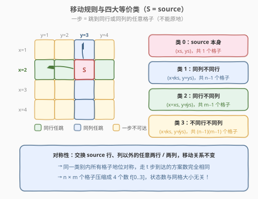
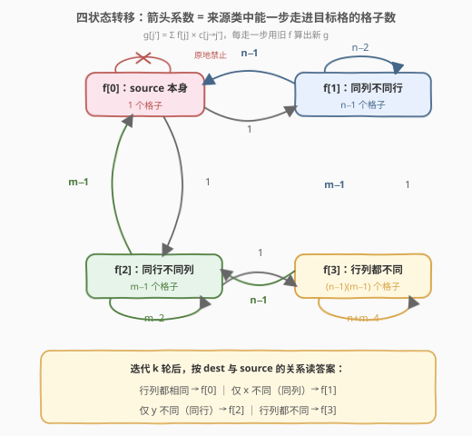
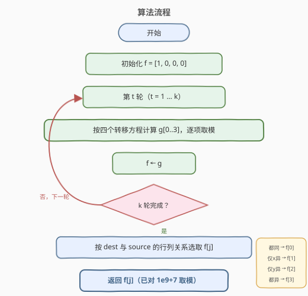
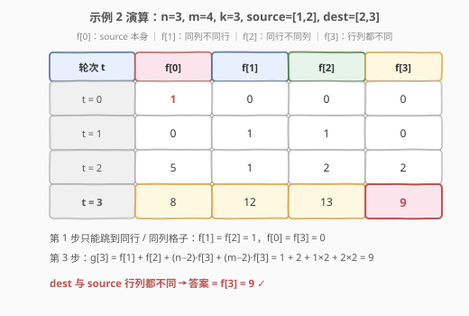

# 在网格上移动到目的地的方法数

- **题目名称**：在网格上移动到目的地的方法数
- **链接**：[2912. 在网格上移动到目的地的方法数](https://leetcode.cn/problems/number-of-ways-to-reach-destination-in-the-grid/)
- **难度**：困难
- **标签**：动态规划、状态机 DP、组合数学

## 1. 题目概述

> ⚠️ 本题为 LeetCode 付费题，题意描述根据官方示例用例与 hints 重建，可能与官方题面有出入。

给定两个整数 `n` 和 `m`，表示一个 **下标从 1 开始** 的网格的大小（第一坐标 $x \in [1, n]$，第二坐标 $y \in [1, m]$）。再给定整数 `k`，以及两个数组 `source` 和 `dest`，形如 `[x, y]`，表示网格上的一个单元格。

你可以按如下规则在网格中移动：

- 从 `[x1, y1]` 移动到 `[x2, y2]`，当且仅当 **`x1 == x2`（同一行）或 `y1 == y2`（同一列）**——即可以跳到同行或同列的**任意**格子；
- **不能原地不动**（即 `x1 == x2` 且 `y1 == y2` 不允许）。

返回从 `source` 出发**恰好移动 `k` 次**到达 `dest` 的方法数。由于答案可能很大，返回其对 $10^9 + 7$ 取模的结果。

**示例 1**：

```text
输入：n = 3, m = 2, k = 2, source = [1,1], dest = [2,2]
输出：2
解释：两条路径：
- [1,1] -> [1,2] -> [2,2]
- [1,1] -> [2,1] -> [2,2]
```

**示例 2**：

```text
输入：n = 3, m = 4, k = 3, source = [1,2], dest = [2,3]
输出：9
解释：共 9 条路径，例如 [1,2] -> [1,3] -> [3,3] -> [2,3]、[1,2] -> [2,2] -> [2,4] -> [2,3] 等。
```

**约束条件**：

- $2 \le n, m \le 10^9$
- $1 \le k \le 10^5$
- `source.length == dest.length == 2`
- $1 \le source[0], dest[0] \le n$，$1 \le source[1], dest[1] \le m$

---

## 2. 解题思路

### 2.1 暴力思路：在网格上做 k 步 DP

最直接的做法是以「格子」为状态：$dp[t][x][y]$ 表示走 $t$ 步到达 $(x, y)$ 的方案数，转移时枚举上一步所在的同行、同列格子求和：

- 时间复杂度 $O(k \cdot nm \cdot (n+m))$，空间 $O(nm)$；
- 本题 $n, m \le 10^9$：格子数达 $10^{18}$ 量级，**彻底不可行**。

> 💡 注意到 $k$ 只有 $10^5$——瓶颈完全在「格子太多」而不是「步数太多」。这提示状态设计必须**与网格大小解耦**。

### 2.2 核心观察：按「与 source 的相对关系」划分等价类



一步移动的规则（同行或同列任跳）只关心**两个格子之间的相对关系**，与绝对坐标无关。于是把所有格子按「与 `source` 的相对关系」分成 4 类：

| 类别 | 含义 | 格子数 |
|------|------|--------|
| 类 0 | `source` 本身 $(x_s, y_s)$ | $1$ |
| 类 1 | 同列不同行 $(x, y_s),\ x \ne x_s$ | $n-1$ |
| 类 2 | 同行不同列 $(x_s, y),\ y \ne y_s$ | $m-1$ |
| 类 3 | 不同行不同列 $(x, y),\ x \ne x_s,\ y \ne y_s$ | $(n-1)(m-1)$ |

**对称性论证**：把 `source` 所在行、列以外的任意两行（或两列）交换，一步移动的可达关系完全不变——这是路径集合到自身的一个双射。因此：

> 走固定步数后，**到达同一类别中任意格子的方案数完全相同**。

既然如此，每个类别只需维护一个数：

$$f[j] = \text{走 } t \text{ 步、到达类 } j \text{ 中某个特定格子的方案数}$$

（类别内任取一个代表格即可。）$n \times m$ 个格子被压缩成 **4 个数**，状态与网格大小彻底无关。

### 2.3 转移方程：系数 = 「能一步走进代表格」的上一步格子数



设目标代表格属于类 $j'$。上一步所在格子必须与它同行或同列，于是枚举上一步格子的类别 $j$：类 $j$ 中与代表格同行/同列的格子有 $c[j \to j']$ 个，而每个这样的格子都恰有 $f[j]$ 条路径到达、且都能一步走进代表格。故：

$$g[j'] = \sum_j f[j] \cdot c[j \to j']$$

以「目标 = `source` 本身」（类 0）为例：上一步必须在同列（类 1，共 $n-1$ 格）或同行（类 2，共 $m-1$ 格）；类 3 与 `source` 不同行不同列走不进来；原地禁止。所以 $g[0] = (n-1)\,f[1] + (m-1)\,f[2]$。其余三个方程同理（详见转移图）：

$$\begin{aligned}
g[0] &= (n-1)\, f[1] + (m-1)\, f[2] \\
g[1] &= f[0] + (n-2)\, f[1] + (m-1)\, f[3] \\
g[2] &= f[0] + (m-2)\, f[2] + (n-1)\, f[3] \\
g[3] &= f[1] + f[2] + (n-2)\, f[3] + (m-2)\, f[3]
\end{aligned}$$

几个系数的直观解释：

- $g[1]$ 中的 $(n-2)$：要走进同列的代表格 $(x_1, y_s)$，上一步在同列但**不能是 $x_1$ 自己**（原地禁止），也不能是 $x_s$（那是类 0，单独一项 $f[0]$），故 $n-2$；
- $g[1]$ 中的 $(m-1)$：类 3 中与代表格**同行**的格子（$x = x_1$，$y \ne y_s$）恰好 $m-1$ 个；
- $g[3]$ 中的 $1 + 1 + (n-2) + (m-2)$：类 1 贡献同行的 1 格、类 2 贡献同列的 1 格、类 3 贡献同行的 $m-2$ 格加同列的 $n-2$ 格。

迭代 $k$ 轮后，按 `dest` 与 `source` 的关系读答案：行列都相同 → $f[0]$；仅 $x$ 不同（同列）→ $f[1]$；仅 $y$ 不同（同行）→ $f[2]$；都不同 → $f[3]$。

### 2.4 算法流程



1. 初始化 `f = [1, 0, 0, 0]`（第 0 步：只在 `source`，方案数为 1）；
2. 循环 `k` 次：按四个转移方程由旧 `f` 计算新 `g`（每项乘系数后取模），再令 `f = g`；
3. 根据 `dest` 与 `source` 的行列关系返回对应的 `f[j]`。

> ⚠️ **溢出提醒**：$(n-1) \cdot f[j]$ 最大约 $10^9 \times 10^9 = 10^{18}$，C++ 必须用 `long long`（单个方程的求和不超过约 $3 \times 10^{18} < 2^{63}$，安全）；每轮算完立即取模。Python 无此顾虑。

### 2.5 示例演算



以示例 2（`n=3, m=4, k=3, source=[1,2], dest=[2,3]`）为例：

| 轮次 | f[0] | f[1] | f[2] | f[3] | 说明 |
|------|------|------|------|------|------|
| t=0 | 1 | 0 | 0 | 0 | 初始在 source |
| t=1 | 0 | 1 | 1 | 0 | 第一步只能到同行/同列格子 |
| t=2 | 5 | 1 | 2 | 2 | g[0] = 2·1 + 3·1 = 5 |
| t=3 | 8 | 12 | 13 | **9** | g[3] = 1 + 2 + 1×2 + 2×2 = 9 |

`dest = [2,3]` 与 `source = [1,2]` 行列都不同，答案 $= f[3] = 9$ ✓。

---

## 3. 参考代码

### C++

```cpp
class Solution {
  public:
    int numberOfWays(int n, int m, int k, vector<int>& source, vector<int>& dest) {
        const int MOD = 1e9 + 7;
        // f[j]：当前步数下，到达「与 source 关系为 j」类别中任一代表格的方案数
        // 0: source 本身; 1: 同列不同行; 2: 同行不同列; 3: 不同行不同列
        vector<long long> f = {1, 0, 0, 0};
        for (int step = 0; step < k; step++) {
            vector<long long> g(4);
            g[0] = ((n - 1) * f[1] + (m - 1) * f[2]) % MOD;
            g[1] = (f[0] + (n - 2) * f[1] + (m - 1) * f[3]) % MOD;
            g[2] = (f[0] + (m - 2) * f[2] + (n - 1) * f[3]) % MOD;
            g[3] = (f[1] + f[2] + (n - 2) * f[3] + (m - 2) * f[3]) % MOD;
            f = move(g);
        }
        bool sameX = source[0] == dest[0], sameY = source[1] == dest[1];
        if (sameX && sameY) return f[0];
        if (sameX) return f[2];  // 同行不同列
        if (sameY) return f[1];  // 同列不同行
        return f[3];
    }
};
```

### Python

```python
class Solution:
    def numberOfWays(self, n: int, m: int, k: int, source: List[int], dest: List[int]) -> int:
        MOD = 10 ** 9 + 7
        # f[j]：当前步数下，到达「与 source 关系为 j」类别中任一代表格的方案数
        # 0: source 本身; 1: 同列不同行; 2: 同行不同列; 3: 不同行不同列
        f = [1, 0, 0, 0]
        for _ in range(k):
            g = [0] * 4
            g[0] = ((n - 1) * f[1] + (m - 1) * f[2]) % MOD
            g[1] = (f[0] + (n - 2) * f[1] + (m - 1) * f[3]) % MOD
            g[2] = (f[0] + (m - 2) * f[2] + (n - 1) * f[3]) % MOD
            g[3] = (f[1] + f[2] + (n - 2) * f[3] + (m - 2) * f[3]) % MOD
            f = g
        same_x, same_y = source[0] == dest[0], source[1] == dest[1]
        if same_x and same_y:
            return f[0]
        if same_x:
            return f[2]  # 同行不同列
        if same_y:
            return f[1]  # 同列不同行
        return f[3]
```

---

## 4. 复杂度分析

| 维度 | 复杂度 | 说明 |
|------|--------|------|
| 时间复杂度 | $O(k)$ | 每轮 4 个转移方程、常数次乘加，共 $k \le 10^5$ 轮 |
| 空间复杂度 | $O(1)$ | 只维护 `f`、`g` 两个长度为 4 的数组 |

---

## 5. 扩展：两轴拆分 + 二项式（官方 hints 思路）与矩阵快速幂

**拆轴视角**：每步恰好改一个坐标——要么改 $x$（同列移动，$n-1$ 种去向），要么改 $y$（同行移动，$m-1$ 种去向）。设 $i$ 步改 $y$、$k-i$ 步改 $x$：

- 先用组合数选出哪些步改 $y$：$\binom{k}{i}$ 种选法；
- $y$ 轴上独立数「长度为 $i$、相邻项不同、从 $y_s$ 到 $y_d$ 的序列数」$f_y(i)$；$x$ 轴同理得 $f_x(k-i)$；
- 两轴序列一经给定便一一确定整条路径，相乘后对所有 $i$ 求和：

$$\text{ans} = \sum_{i=0}^{k} \binom{k}{i}\, f_y(i)\, f_x(k-i)$$

单轴计数只需两状态递推（值域大小为 $N$，$S(t)$ = $t$ 步回到起点的序列数，$D(t)$ = $t$ 步到达某个指定异值的序列数）：

$$S(t+1) = (N-1)\, D(t), \qquad D(t+1) = S(t) + (N-2)\, D(t), \qquad S(0) = 1,\ D(0) = 0$$

（上一步不在起点才能走进起点，共 $(N-1)\,D(t)$ 条；走进指定值 $b$ 的上一步是起点或 $N-2$ 个「第三者」。）总体同样是 $O(k)$。这一「拆两轴 + 二项式」与 2400 题（一维 ±1 步行拆成左右两轴）完全同源。

**矩阵快速幂**：四个转移方程合起来是一个线性变换（$4 \times 4$ 矩阵），若 $k$ 巨大（如 $10^{18}$），可用矩阵快速幂优化到 $O(4^3 \log k)$。本题 $k \le 10^5$，朴素循环足矣。

---

## 6. 面试要点

1. **为什么不能直接在格子上 DP？**

   - $n, m \le 10^9$，格子数 $10^{18}$ 量级，状态爆炸
   - 而 $k \le 10^5$ 很小——矛盾指向「状态必须与网格大小无关」，即只记录相对关系

2. **四个状态是怎么来的？为什么同类格子的方案数相同？**

   - 按「与 source 的相对关系」分类：本身 / 同列不同行 / 同行不同列 / 行列都不同
   - 保持 source 行、列不动的行/列置换是移动图的自同构（双射），把走到一个格子的路径双射到走到其镜像格子的路径，故同类格子方案数相同

3. **转移系数 (n−1)、(n−2)、(m−1)、(m−2) 分别怎么数出来的？**

   - 固定目标代表格，按「上一步格子的类别」枚举：数每类中与代表格同行或同列的格子数
   - 例：走进同列代表格 $(x_1, y_s)$ 时，同列来源有 $n-2$ 个（排除 $x_1$ 自己与 $x_s$），同行的类 3 来源有 $m-1$ 个

4. **为什么最终只需看 dest 相对 source 的类别？**

   - $f[j]$ 对类 $j$ 的所有格子取值相同，dest 落在哪类就读哪个 $f[j]$
   - 四种关系（都同 / 仅 $x$ 异 / 仅 $y$ 异 / 都异）恰好覆盖所有情况

5. **实现上有哪些坑？**

   - 系数含 $n-2$、$m-2$：由约束 $n, m \ge 2$ 保证非负
   - $(n-1) \cdot f[j] \approx 10^{18}$：C++ 用 `long long` 并每轮取模；单条方程求和约 $3 \times 10^{18} < 2^{63}$，不会溢出

---

## 7. 同类练习题

- [2400. 恰好移动 k 步到达某一位置的方法数目](https://leetcode.cn/problems/number-of-ways-to-reach-a-position-after-exactly-k-steps/)（[题解](../2301-2400/2400_恰好移动k步到达某一位置的方法数目.md)）：一维版「拆两轴 + 二项式」计数，本文扩展节思路的来源
- [1269. 停在原地的方案数](https://leetcode.cn/problems/number-of-ways-to-stay-in-the-same-place-after-some-steps/)（[题解](../1201-1300/1269_停在原地的方案数.md)）：一维直线上的步数 DP，对照「位置受限 vs 网格巨大」两种状态设计
- [935. 骑士拨号器](https://leetcode.cn/problems/knight-dialer/)（[题解](../0901-1000/935_骑士拨号器.md)）：把键盘格子按转移关系划分等价类做状态机 DP，与本题「按相对关系压缩状态」同思想
- [1411. 给 N x 3 网格图涂色的方案数](https://leetcode.cn/problems/number-of-ways-to-paint-n-3-grid/)（[题解](../1401-1500/1411_给Nx3网格图涂色的方案数.md)）：状态只分两类的状态机 DP，体会「类别数 = 状态数」的压缩艺术
