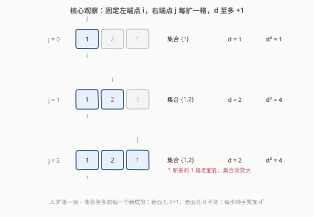
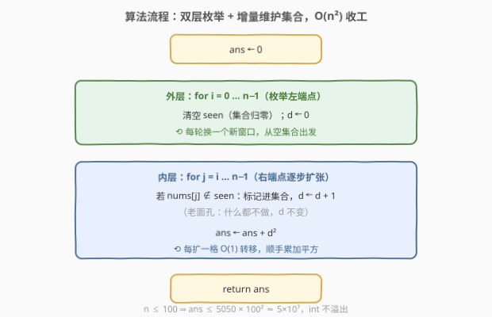
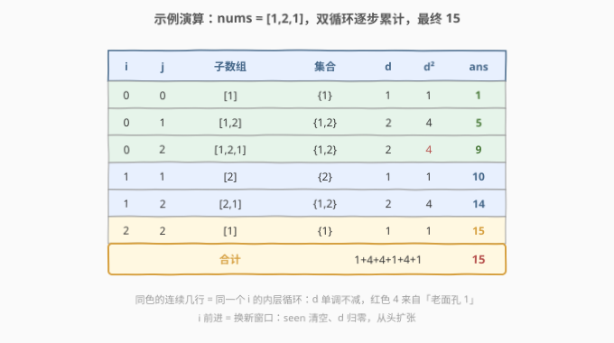

# LeetCode 子数组不同元素数目的平方和 I 题解

## 1. 题目概述

- **标题 / 题号**：子数组不同元素数目的平方和 I（#2913，easy）
- **链接**：https://leetcode.cn/problems/subarrays-distinct-element-sum-of-squares-i/
- **难度**：简单
- **标签**：数组、哈希表、枚举

**题意**：给你一个下标从 **0** 开始的整数数组 `nums`。

定义 `nums` 一个子数组的**不同计数**值如下：

- 令 `nums[i..j]` 表示 `nums` 中所有下标在 `i` 到 `j` 范围内的元素构成的子数组（满足 $0 \le i \le j < n$），那么我们称子数组 `nums[i..j]` 中**不同值的数目**为 `nums[i..j]` 的不同计数。

请你返回 `nums` 中**所有子数组**的不同计数的**平方**和。

子数组指的是一个数组里面一段连续**非空**的元素序列。

**示例 1**：

```text
输入：nums = [1,2,1]
输出：15
解释：六个子数组分别为：
[1]: 1 个互不相同的元素。
[2]: 1 个互不相同的元素。
[1]: 1 个互不相同的元素。
[1,2]: 2 个互不相同的元素。
[2,1]: 2 个互不相同的元素。
[1,2,1]: 2 个互不相同的元素。
所有不同计数的平方和为 1² + 1² + 1² + 2² + 2² + 2² = 15。
```

**示例 2**：

```text
输入：nums = [2,2]
输出：3
解释：三个子数组分别为：
[2]: 1 个互不相同的元素。
[2]: 1 个互不相同的元素。
[2,2]: 1 个互不相同的元素。
所有不同计数的平方和为 1² + 1² + 1² = 3。
```

**约束**：

- $1 \le \text{nums.length} \le 100$
- $1 \le \text{nums}[i] \le 100$

> 💡 这道题是 [2916. 子数组不同元素数目的平方和 II](https://leetcode.cn/problems/subarrays-distinct-element-sum-of-squares-ii/) 的 Easy 前置版：2916 把 $n$ 放大到 $10^5$，逼你上「按右端点分组 + 线段树」的 $O(n \log n)$ 解法；本题 $n \le 100$，把 $O(n^2)$ 的**增量枚举**写扎实就够了——而这正是 2916 思路的最小原型。

## 2. 解题思路

记 $d(i, j)$ 为子数组 $nums[i..j]$ 的不同计数，目标：

$$\text{ans} = \sum_{0 \le i \le j < n} d(i,j)^2$$

### 2.1 暴力思路：逐个子数组重数一遍

最直接的做法：枚举全部 $O(n^2)$ 个子数组 $(i, j)$，对每个子数组开个集合从头到尾扫一遍数出不同值个数，再累加平方。单次统计 $O(n)$，总计 $O(n^3)$。

$n = 100$ 时子数组约 $5050$ 个、平均长度约 $33$，总操作量 $10^5$ 出头，本题数据规模下**能过**——但每次都「推倒重来」明显浪费：相邻两个子数组只差一个元素，凭什么整个集合重算？

### 2.2 核心观察：固定一端、增量扩张，每步 O(1) 转移

把枚举组织成「**固定左端点 $i$，右端点 $j$ 从 $i$ 逐步右扩**」的双层循环。窗口从 $[i..j-1]$ 扩张成 $[i..j]$ 时，**只多收了一个元素 $nums[j]$**，于是：

$$d(i,j) = d(i,j-1) + \begin{cases} 1, & \text{nums}[j] \text{ 是窗口里的新面孔} \\ 0, & \text{nums}[j] \text{ 是老面孔} \end{cases}$$

- **新面孔**：收入集合（打标记），$d \leftarrow d + 1$；
- **老面孔**：集合没变化，$d$ 原地踏步。

也就是说 $d$ 随 $j$ 的扩张**单调不减**，且每一步都能 $O(1)$ 转移。每次扩张后顺手把 $d^2$ 加进答案，内层循环结束就得到了这个 $i$ 的全部贡献。



用「上一步的答案推出这一步」替代「每步从头数」，正是把 $O(n^3)$ 压到 $O(n^2)$ 的关键——和[子数组范围和](../2101-2200/2104_子数组范围和.md)里「固定一端、滚动维护 min/max」是同一个范式，只是这里滚动维护的是**集合**。

> ⚠️ 每换一个新左端点 $i$，集合要**清空重来**——窗口整体平移后，之前收的成员不再作数。值域只有 $1 \sim 100$，用一张 $101$ 大小的布尔表当集合，查询/标记都是 $O(1)$，重置也只需 $O(101)$ 的常数开销。

### 2.3 算法流程图



**完整步骤**：

1. `ans ← 0`；
2. **外层** $i$ 从 $0$ 到 $n-1$：清空 `seen`，$d \leftarrow 0$；
3. **内层** $j$ 从 $i$ 到 $n-1$：若 $nums[j] \notin \text{seen}$，打标记且 $d \leftarrow d+1$；随后 $\text{ans} \leftarrow \text{ans} + d^2$；
4. 返回 `ans`。

### 2.4 示例演算

以示例 1 `nums = [1,2,1]` 为例，按双循环逐步走：

| $i$ | $j$ | 子数组 | 集合 | $d$ | $d^2$ | ans 累计 |
|-----|-----|--------|------|-----|-------|----------|
| 0 | 0 | [1] | {1} | 1 | 1 | 1 |
| 0 | 1 | [1,2] | {1,2} | 2 | 4 | 5 |
| 0 | 2 | [1,2,1] | {1,2} | 2 | 4 | 9 |
| 1 | 1 | [2] | {2} | 1 | 1 | 10 |
| 1 | 2 | [2,1] | {1,2} | 2 | 4 | 14 |
| 2 | 2 | [1] | {1} | 1 | 1 | 15 |



注意第三行：窗口从 $[1,2]$ 扩到 $[1,2,1]$，新来的 $1$ 是**老面孔**，$d$ 停在 $2$，$d^2$ 依旧是 $4$。最终合计 $15$ ✓。示例 2 `[2,2]` 同理：三个窗口的 $d$ 全是 $1$，合计 $3$ ✓。

## 3. 参考代码

### C++

```cpp
class Solution {
public:
    int sumCounts(vector<int>& nums) {
        int n = nums.size(), ans = 0;
        bool seen[101];                        // 值域 1~100，布尔表当集合
        for (int i = 0; i < n; i++) {          // 外层：枚举左端点
            memset(seen, 0, sizeof seen);      // 新窗口，集合清空
            int d = 0;
            for (int j = i; j < n; j++) {      // 内层：右端点逐步扩张
                if (!seen[nums[j]]) {
                    seen[nums[j]] = true;      // 新面孔：收入集合
                    d++;
                }                              // 老面孔：d 原地踏步
                ans += d * d;                  // 每扩一格，顺手累加平方
            }
        }
        return ans;
    }
};
```

### Python

```python
class Solution:
    def sumCounts(self, nums: List[int]) -> int:
        n, ans = len(nums), 0
        for i in range(n):                     # 外层：枚举左端点
            seen, d = set(), 0                 # 新窗口，集合清空
            for j in range(i, n):              # 内层：右端点逐步扩张
                if nums[j] not in seen:
                    seen.add(nums[j])          # 新面孔：收入集合
                    d += 1
                ans += d * d                   # 每扩一格，顺手累加平方
        return ans
```

> 💡 两个实现细节：① C++ 用 $101$ 大小的布尔表而非 `unordered_set`，值域小的时候**数组哈希**又快又省；② `ans` 用 `int` 就够——子数组最多 $\frac{100 \times 101}{2} = 5050$ 个，每个 $d^2 \le 100^2 = 10^4$，上界约 $5 \times 10^7$，远小于 $2^{31}-1 \approx 2.1 \times 10^9$，不会溢出。

## 4. 复杂度分析

| 维度 | 复杂度 | 说明 |
|------|--------|------|
| **时间复杂度** | $O(n^2)$ | 双层枚举所有 $(i, j)$，每步集合操作 $O(1)$；每轮重置布尔表为 $O(101)$ 常数 |
| **空间复杂度** | $O(C)$，$C = 101$ | 值域布尔表（Python `set` 则为 $O(\min(n, C))$） |

> ⚠️ 对比 2.1：暴力 $O(n^3)$ 在 $n = 100$ 时约 $10^5$ 次操作勉强能过；增量维护把它压到 $O(n^2) \approx 10^4$，且把「每次重数」变成「每步转移」——这个姿势在 2916（$n \le 10^5$）里是唯一能继续进化的活路。

## 5. 扩展：进阶版 2916 怎么办（$n \le 10^5$）

$n$ 放大到 $10^5$ 后 $O(n^2)$ 彻底超时，必须换数法方向——**按右端点 $r$ 分组，把「一段左端点的 $d$ 同时 +1」批发处理**：

1. 设 $g_r(l) = d(l, r)$（固定 $r$、关于 $l$ 的函数），$F(r) = \sum_{l=0}^{r} g_r(l)^2$，则 $\text{ans} = \sum_{r} F(r)$；
2. $r \to r+1$ 时记 $x = \text{nums}[r+1]$，$p$ 为 $x$ **上一次出现的下标**（无则 $-1$）：对 $l \in (p, r+1]$，$x$ 在窗口 $[l, r+1]$ 里是新面孔，$g_r(l)$ 整体 $+1$；对 $l \le p$，$x$ 早就在窗口里，$g$ 不变；
3. 平方和的增量可以**用旧区间和直接算出来**：

$$F(r+1) - F(r) = \sum_{l=p+1}^{r+1} \big[(g+1)^2 - g^2\big] = 2S + L$$

其中 $S$ 是更新前该区间的 $g$ 值之和，$L = r+1-p$ 是区间长度；

4. 于是一棵支持**区间加、区间求和**的线段树维护 $g$ 数组即可：每次先 `query(p+1, r)` 拿到 $S$，再 `update` 区间 $+1$，最后 $F \mathrel{+}= 2S + L$。总复杂度 $O(n \log n)$。

本题标签里挂着的「线段树」就是给这个进阶路线铺垫的：Easy 版是「一个一个 $l$ 慢慢加」，Hard 版发现新面孔让**一整段 $l$ 的 $d$ 同时 +1**，交给线段树批发，而平方和增量恰好只需要区间的旧和——$(a+1)^2 - a^2 = 2a+1$ 这个初等恒等式是整个转换的桥梁。

## 6. 面试要点

1. **为什么是 $O(n^2)$ 而不是 $O(n^3)$？关键在哪一步？**

   关键在于相邻子数组只差一个元素：固定左端点让右端点单调右扩，窗口每次只**增收**一个元素，新面孔 $d{+}1$、老面孔不变，集合状态 $O(1)$ 转移。暴力对每个子数组从头重数，浪费的正是这份「增量信息」。

2. **答案会不会溢出 `int`？**

   不会。子数组至多 $\frac{100 \times 101}{2} = 5050$ 个，每个 $d^2 \le 10^4$，总计上界约 $5 \times 10^7 < 2^{31} - 1$。若约束放开（如 2916 的 $n \le 10^5$ 且带取模），则要按题意用 `long long` / 取模。

3. **值域如果不是 $1 \sim 100$ 而是 $10^9$ 怎么办？**

   把布尔表换成哈希集合（`unordered_set` / `set`），查询与插入均摊 $O(1)$，总复杂度仍是 $O(n^2)$，只是常数变大、空间变为 $O(\min(n, \text{值域}))$。「值域小用数组、值域大用哈希」是集合类维护的通用选型。

4. **为什么固定左端点？固定右端点行不行？**

   完全等价——固定右端点 $r$、左端点 $l$ 从 $r$ 向左扩，同样是「一端固定、另一端单调移动」，每个子数组恰好访问一次、每步 $O(1)$ 转移。真正重要的是**端点单调移动**，这保证了集合状态可增量维护。2916 的进阶解法恰好采用「固定右端点」视角，因为它要利用「上次出现位置」切出需要批量 +1 的 $l$ 区间。

5. **如果面试官追问 $n = 10^5$（即 2916）呢？**

   按 2.2 的增量观察升级成「批发版」：固定右端点 $r$，新元素只影响 $l \in (p, r]$（$p$ 为其上次出现位置）这一段的 $g(l)$ 同时 $+1$；用线段树做区间加与区间和，平方和增量 $= 2S + L$，总 $O(n \log n)$。从「逐个加」到「区间批发」是子数组统计类问题的标准进化路径。

> 💡 **一句话总结**：固定一端、另一端单调扩张，用布尔表增量维护集合大小 $d$，每步 $O(1)$ 转移并累加 $d^2$——$O(n^2)$ 时间、$O(\text{值域})$ 空间收工；这套增量姿势就是 Hard 版 2916 线段树解法的最小原型。

## 同类练习题

| # | 题目 | 与本题的关联 |
|---|------|-------------|
| 2916 | [子数组不同元素数目的平方和 II](https://leetcode.cn/problems/subarrays-distinct-element-sum-of-squares-ii/) | 本题的 Hard 版（$n \le 10^5$），按右端点分组 + 线段树区间加，平方和增量 $2S + L$ |
| 828 | [统计子串中的唯一字符](../0801-0900/828_统计子串中的唯一字符.md) | 同为「所有子串的聚合统计」，按字符上次出现位置做贡献拆位，与 2916 的 $p$ 切区间思想同源 |
| 2104 | [子数组范围和](../2101-2200/2104_子数组范围和.md) | 同款「固定一端、增量维护子数组聚合值」的枚举范式，聚合值从集合大小换成 min/max |
| 2444 | [统计定界子数组的数目](../2401-2500/2444_统计定界子数组的数目.md) | 按右端点推进 + 维护「上次出现位置」的姊妹题，体会同一批技巧在计数问题上的变形 |
