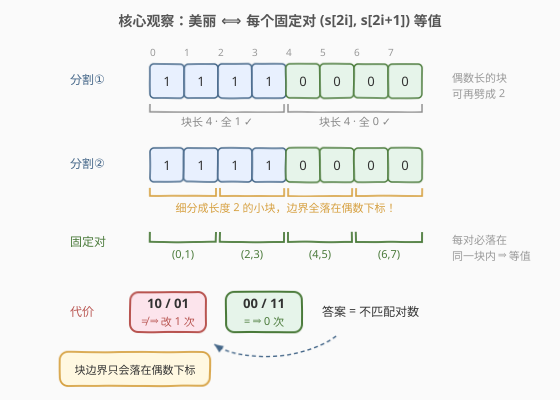
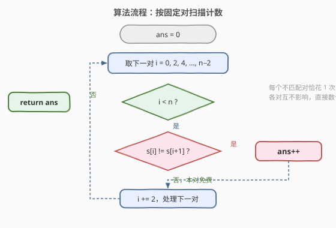
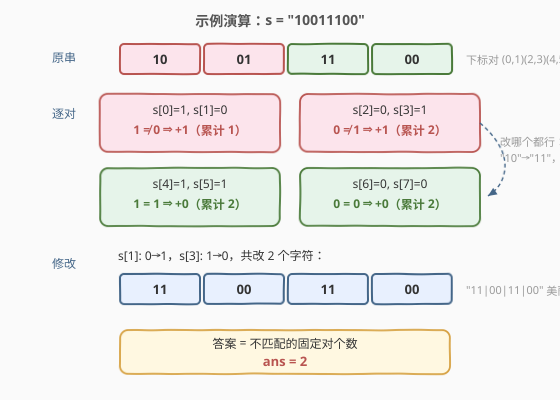

# LeetCode 使二进制字符串变美丽的最少修改次数 题解

## 1. 题目概述

- **标题 / 题号**：使二进制字符串变美丽的最少修改次数（#2914，medium）
- **链接**：https://leetcode.cn/problems/minimum-number-of-changes-to-make-binary-string-beautiful/
- **难度**：中等
- **标签**：字符串、贪心

**题意**：给你一个长度为**偶数**、下标从 0 开始的二进制字符串 `s`。

如果可以将一个字符串分割成一个或者更多满足以下条件的子字符串，那么我们称这个字符串是**美丽的**：

- 每个子字符串的长度都是**偶数**。
- 每个子字符串都**只**包含 `1` 或**只**包含 `0`。

你可以将 `s` 中任一字符改成 `0` 或者 `1`。

请你返回使字符串 `s` 美丽的**最少**字符修改次数。

**示例 1**：

```text
输入：s = "1001"
输出：2
解释：我们将 s[1] 改为 1，且将 s[3] 改为 0，得到字符串 "1100"。
字符串 "1100" 是美丽的，因为我们可以将它分割成 "11|00"。
```

**示例 2**：

```text
输入：s = "10"
输出：1
解释：我们将 s[1] 改为 1，得到字符串 "11"，它本身就是美丽的。
```

**示例 3**：

```text
输入：s = "0000"
输出：0
解释：不需要进行任何修改，"0000" 已经是美丽字符串。
```

**约束**：

- $2 \le \text{s.length} \le 10^5$
- `s` 的长度为偶数。
- `s[i]` 要么是 `'0'`，要么是 `'1'`。

> 💡 本题核心是「**分割结构分析 ⟹ 局部化代价**」。关键观察：合法分割的每块长度都是偶数，块边界只能落在**偶数下标**上；因此每个固定对 $(s[2i], s[2i+1])$ 必然完整落在同一块内，两字符**必须相等**。反过来，只要每个固定对内部等值，取这些对本身当分割就是合法的。于是「美丽」等价于「所有固定对等值」，答案就是**不匹配的固定对个数**——每对一个字符就能改好，各对互不影响。

## 2. 解题思路

### 2.1 暴力思路：DP 枚举分割点

「最少修改次数 + 自由分割」是典型的**划分型 DP**。设 $dp[i]$ 为让前 $i$ 个字符（$i$ 为偶数）变美丽的最少修改次数：

$$dp[0] = 0, \qquad dp[i] = \min_{\substack{j < i \\ j \bmod 2 = 0}} dp[j] + \text{cost}(j, i)$$

其中 $\text{cost}(j, i)$ 是把子串 $s[j..i-1]$ 改成全 0 或全 1 的代价，即 $\min(\#\text{0}, \#\text{1})$，用前缀和 $O(1)$ 可得。总复杂度 $O(n^2)$：$n = 10^5$ 时约 $10^{10}$ 次基本运算，**超时**。

DP 慢在反复权衡「块从哪里切开」。下面证明这些权衡是多余的——切法其实被位置**锁死**了。

### 2.2 核心观察：只看固定对 $(s[2i], s[2i+1])$

**观察 1（块边界只能落在偶数下标）：每块连续且长度为偶数。**

从下标 0 出发，第一块覆盖 $[0, L_1)$，$L_1$ 是偶数；第二块从偶数下标 $L_1$ 出发覆盖偶数个字符，边界 $L_1 + L_2$ 仍是偶数……归纳可知**所有块边界都落在偶数下标上**。

**观察 2（固定对必等值 ⟺ 美丽）：**

- **必要性**：边界全在偶数下标 ⟹ 每个固定对 $(s[2i], s[2i+1])$ 完整落在同一块内 ⟹ 两字符同属全 0 块或全 1 块，**必相等**。
- **充分性**：若每个固定对内部等值，直接取这些长度 2 的小块作为分割，每块偶数长且字符统一，合法。

所以 $$s \text{ 美丽} \iff \forall i:\ s[2i] = s[2i+1]$$

**观察 3（代价局部化）：各对独立，不匹配对恰花 1 次。**

- **下界**：某个固定对 $s[2i] \ne s[2i+1]$ 时，由观察 2 的必要性，改后两字符必须相等——至少要动这对中的一个字符，**至少 1 次**；
- **上界**：把其中一个字符改成另一个（`"10"→"11"`、`"01"→"00"`），1 次足够；等值对 0 次，且改动它只会增加代价；
- 一次修改只影响自己所在的对，**各对互不干扰**，可独立取最优再求和。



> 💡 一句话：**偶数块 ⟹ 边界全在偶数下标 ⟹ 固定对必等值**。答案 = 不匹配的固定对个数 $\sum_i [s[2i] \ne s[2i+1]]$，一行代码收工。

### 2.3 算法流程图



**完整步骤**：

1. 初始化答案 `ans = 0`
2. `i` 从 0 开始、步长 2 扫到 `n − 2`，每次处理固定对 `(s[i], s[i+1])`
3. 若 `s[i] != s[i+1]`，则 `ans++`（把其中一个改成另一个）
4. 扫完所有对，返回 `ans`

### 2.4 示例演算

以一个比官方示例更饱满的串 `s = "10011100"` 为例：

| 固定对 | 字符 | 判定 | 代价 | 累计 |
|--------|------|------|------|------|
| $(s_0, s_1)$ | `10` | $1 \ne 0$ | +1 | 1 |
| $(s_2, s_3)$ | `01` | $0 \ne 1$ | +1 | 2 |
| $(s_4, s_5)$ | `11` | $1 = 1$ | +0 | 2 |
| $(s_6, s_7)$ | `00` | $0 = 0$ | +0 | 2 |

修改 `s[1]: 0→1`、`s[3]: 1→0` 得到 `"11|00|11|00"`，共 2 次 ✓。官方示例 1 `s = "1001"`：对 `10`、`01` 各花 1 次，共 2 ✓；示例 2 `"10"` 花 1 次 ✓；示例 3 `"0000"` 全等值花 0 次 ✓。



## 3. 参考代码

### C++

```cpp
class Solution {
public:
    int minChanges(string s) {
        int ans = 0;
        for (int i = 0; i + 1 < (int)s.size(); i += 2)
            ans += s[i] != s[i + 1];   // 不匹配的固定对，各花 1 次
        return ans;
    }
};
```

### Python

```python
class Solution:
    def minChanges(self, s: str) -> int:
        return sum(s[i] != s[i + 1] for i in range(0, len(s), 2))
        # 等价写法：sum(a != b for a, b in zip(s[::2], s[1::2]))
```

> 💡 两版逻辑一致。细节提醒：① `n` 保证为偶数，循环条件 `i + 1 < n` 天然成对处理、不会越界；② 布尔值参与累加时会转成 0/1（C++ 中 `bool` 即整型，Python 中 `True == 1`）；③ 不需要真的构造修改后的字符串，只计数即可。

## 4. 复杂度分析

| 维度 | 复杂度 | 说明 |
|------|--------|------|
| **时间复杂度** | $O(n)$ | 每个固定对 $O(1)$ 判定，共 $n/2$ 对；单次遍历完成 |
| **空间复杂度** | $O(1)$ | 只用常数个计数变量（Python 的 `zip` 切片写法为 $O(n)$ 空间） |

> ⚠️ 对比 2.1 的划分型 DP：$O(n^2)$ 慢在枚举「块从哪切」；而边界奇偶性分析证明所有合法分割都细化到**位置固定的长度 2 小块**，切分自由度是表象，代价完全可以局部化到每个固定对上。

## 5. 扩展：块长为 k 的倍数时的推广

把「每块长度为偶数」推广为「每块长度是 $k$ 的倍数、且字符统一」，同样的论证成立：块边界只能落在 $k$ 的倍数下标上，每个**固定 k 块** $s[jk .. jk+k-1]$ 必须整体等值，答案为

$$\sum_{j} \min\big(\#0(s[jk..jk+k-1]),\ \#1(s[jk..jk+k-1])\big)$$

本题即 $k = 2$、块内代价退化为「是否相等」的特例（长度 2 时 $\min(\#0,\#1)$ 恰为 0 或 1）。若再问「块长不限、只要字符统一的分割数」这类**计数**问题，则回到经典的连续段思路（如 696 题），与本题的「位置锁定」视角互为对照。

另一个方向的对比是 1758「生成交替二进制字符串」：它同样利用**位置奇偶性**，但目标是全局唯一的两种模式（`0101…`/`1010…`），答案取两种模式代价的较小值；本题每对内部改成 0 改成 1 皆可、位置锁死后互不牵连，连取 min 都省了。

## 6. 面试要点

1. **为什么只需检查固定对 $(s[2i], s[2i+1])$，不用担心别的分割方式？**

   - 任何合法分割的块都连续且长度为偶数，从下标 0 起逐块累加偶数长度，所有块边界都落在偶数下标；因此固定对永远不被边界切开，必整对落在同一块内，两字符必相等。不同分割方式的差别只在「哪些相邻同值块合并」，**细化到长度 2 后位置完全固定**。

2. **为什么答案恰等于不匹配对数？请严格论证。**

   - 下界：美丽字符串每个固定对都必须等值，不匹配对至少要改其中一个字符；上界：逐对把一个字符改成另一个即可，等值对不动。一次修改只影响所在对，各对独立求和即为全局最优。

3. **把不匹配对 `"10"` 改成 `"11"` 还是 `"00"` 有讲究吗？**

   - 没有。块怎么合并是分割环节的自由：改成 `"11"` 后与左边（若是 1 块）合并、改成 `"00"` 后与右边合并都合法，任何一种局部选择都不影响其他对的代价，也不会破坏可分割性——固定对等值本身就是美丽的**充要**条件。

4. **如果 `n` 是奇数会怎样？**

   - 无法美丽：全部块长为偶数意味着总长必须是偶数，任何修改都救不了。题目因此保证 `n` 为偶数；代码里 `i + 1 < n` 的循环条件在奇数长度下会自动忽略落单的末字符，但那只是不报错，并非得到合法答案。

5. **本题和划分型 DP 的关系？什么时候必须上 DP？**

   - 本题是划分型 DP 的「结构可局部化」特例：当代价函数与分割点解耦（每块代价只看块内、且合法分割可细化到固定小块）时，贪心/直接计数取代 DP。若约束改为「至多分成 k 块」或「块长上界 L」等全局耦合条件，局部性被破坏，就需要真正的 $O(nk)$ 或单调队列优化 DP。

> 💡 **一句话总结**：偶数块 ⟹ 边界全在偶数下标 ⟹ 固定对 $(s[2i], s[2i+1])$ 必等值；不匹配对各改 1 次、互不影响，答案 = 不匹配对个数，$O(n)$ / $O(1)$。

## 同类练习题

| # | 题目 | 与本题的关联 |
|---|------|-------------|
| 1758 | [生成交替二进制字符串的最少操作数](https://leetcode.cn/problems/minimum-changes-to-make-alternating-binary-string/)（[题解](../1701-1800/1758_生成交替二进制字符串的最少操作数.md)） | 同为「按位置奇偶性分组数不匹配」的二进制串最少修改题，目标从「对内等值」换成「全局交替」 |
| 696 | [计数二进制子串](https://leetcode.cn/problems/count-binary-substrings/)（[题解](../0601-0700/696_计数二进制子串.md)） | 连续等值段之间的配对计数，与本题的固定对视角互为对照 |
| 2904 | [最短且字典序最小的美丽子字符串](https://leetcode.cn/problems/shortest-and-lexicographically-smallest-beautiful-string/)（[题解](../2901-3000/2904_最短且字典序最小的美丽子字符串.md)） | 同为「美丽字符串」系列定义，滑窗 + 双关键字择优 |
| 2864 | [最大二进制奇数](https://leetcode.cn/problems/maximum-odd-binary-number/)（[题解](../2801-2900/2864_最大二进制奇数.md)） | 二进制串上的位置约束贪心重排，末位锁 1 其余前移 |
